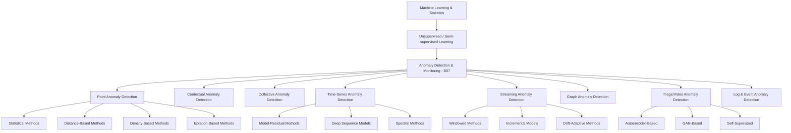

# Research Report: Anomaly Detection & Monitoring (B07)
## By Dr. Archon (R-alpha) — Date: 2026-03-31

---

## 1. Field Taxonomy

### 1.1 Parent Field

Anomaly Detection & Monitoring sits at the intersection of **Statistical Learning**, **Machine Learning**, and **Signal Processing**. It is a sub-discipline of **Unsupervised/Semi-supervised Learning** within the broader landscape of Artificial Intelligence and Data Science.

### 1.2 Sub-fields

| Sub-field | Description |
|---|---|
| **Point Anomaly Detection** | Identifying individual data instances that deviate from the norm |
| **Contextual Anomaly Detection** | Detecting anomalies conditioned on contextual attributes (e.g., time, location) |
| **Collective Anomaly Detection** | Identifying groups of related instances that are collectively anomalous |
| **Time-Series Anomaly Detection** | Detecting anomalies in temporal sequences (changepoints, seasonal deviations) |
| **Streaming Anomaly Detection** | Real-time detection in unbounded data streams with concept drift |
| **Graph Anomaly Detection** | Identifying anomalous nodes, edges, or subgraphs in network structures |
| **Image/Video Anomaly Detection** | Detecting defects, unusual events, or out-of-distribution visual inputs |
| **Log & Event Anomaly Detection** | Parsing and analyzing system logs for abnormal patterns |

### 1.3 Related Fields

- **Outlier Analysis** (Statistics) — classical precursor
- **Fault Detection & Diagnostics (FDD)** — engineering systems
- **Intrusion Detection Systems (IDS)** — cybersecurity
- **Novelty Detection** — identifying previously unseen patterns
- **Out-of-Distribution (OOD) Detection** — deep learning reliability
- **Change Point Detection** — identifying distributional shifts
- **Quality Control / Statistical Process Control (SPC)** — manufacturing

### 1.4 Taxonomy Diagram



```
ASCII Taxonomy:

Machine Learning & Statistics
└── Unsupervised / Semi-supervised Learning
    └── ANOMALY DETECTION & MONITORING (B07)
        ├── By Data Type
        │   ├── Tabular / Point Cloud
        │   ├── Time Series
        │   ├── Graph / Network
        │   ├── Image / Video
        │   └── Text / Log
        ├── By Anomaly Type
        │   ├── Point Anomaly
        │   ├── Contextual Anomaly
        │   └── Collective Anomaly
        ├── By Methodology
        │   ├── Statistical (parametric / nonparametric)
        │   ├── Distance-based
        │   ├── Density-based
        │   ├── Isolation-based
        │   ├── Reconstruction-based (AE, VAE, GAN)
        │   ├── Prediction-based (forecasting residuals)
        │   └── Attention / Transformer-based
        └── By Setting
            ├── Batch / Offline
            ├── Online / Streaming
            ├── Semi-supervised (clean training set)
            └── Supervised (labeled anomalies)
```

---

## 2. Mathematical Foundations

### 2.1 Statistical Hypothesis Testing: Z-Score and Grubbs' Test

**Description:** The earliest and most interpretable anomaly detection methods frame the problem as statistical hypothesis testing. A data point is declared anomalous if its probability under an assumed distribution falls below a threshold.

**Z-Score Method:**

Given a dataset $\{x_1, x_2, \ldots, x_n\}$ with sample mean $\bar{x}$ and standard deviation $s$:

$$z_i = \frac{x_i - \bar{x}}{s}$$

A point $x_i$ is flagged as anomalous if $|z_i| > \tau$, where $\tau$ is typically 2.5--3.0 (corresponding to approximately 99% confidence under normality).

**Grubbs' Test:**

Tests the null hypothesis $H_0$: there are no outliers, against $H_1$: there is exactly one outlier. The test statistic is:

$$G = \frac{\max_{i} |x_i - \bar{x}|}{s}$$

The critical value is derived from the $t$-distribution:

$$G_{crit} = \frac{(n-1)}{\sqrt{n}} \sqrt{\frac{t^2_{\alpha/(2n), n-2}}{n - 2 + t^2_{\alpha/(2n), n-2}}}$$

where $t_{\alpha/(2n), n-2}$ is the critical value of the Student's $t$-distribution with $n-2$ degrees of freedom and significance level $\alpha/(2n)$.

**Assumptions:**
- Data is approximately normally distributed (or at least unimodal and symmetric).
- Observations are independent and identically distributed (i.i.d.).
- The number of anomalies is small relative to the dataset size.

**References:**
- Grubbs, F. E. (1950). "Sample criteria for testing outlying observations." *Annals of Mathematical Statistics*, 21(1), 27--58.
- Barnett, V. & Lewis, T. (1994). *Outliers in Statistical Data*. Wiley.

---

### 2.2 Density Estimation: Kernel Density Estimation (KDE) and Gaussian Mixture Models (GMM)

**Description:** Density-based anomaly detection estimates the probability density function of the data and declares low-density regions as anomalous. This generalizes parametric methods to arbitrary distributions.

**Kernel Density Estimation (KDE):**

Given $n$ data points $\{x_1, \ldots, x_n\}$ in $\mathbb{R}^d$, the KDE estimate at point $x$ is:

$$\hat{f}(x) = \frac{1}{n \cdot h^d} \sum_{i=1}^{n} K\left(\frac{x - x_i}{h}\right)$$

where $K(\cdot)$ is a kernel function (commonly Gaussian: $K(u) = (2\pi)^{-d/2} \exp(-\|u\|^2/2)$) and $h$ is the bandwidth parameter. Anomalies are points where $\hat{f}(x) < \epsilon$.

**Bandwidth Selection** (Silverman's rule of thumb for univariate Gaussian kernel):

$$h = 1.06 \cdot \hat{\sigma} \cdot n^{-1/5}$$

**Gaussian Mixture Model (GMM):**

The density is modeled as a mixture of $K$ Gaussians:

$$p(x) = \sum_{k=1}^{K} \pi_k \cdot \mathcal{N}(x \mid \mu_k, \Sigma_k)$$

where $\pi_k$ are mixing weights ($\sum_k \pi_k = 1$), and parameters $\{\pi_k, \mu_k, \Sigma_k\}$ are learned via Expectation-Maximization (EM). The anomaly score is $-\log p(x)$; points with high negative log-likelihood are anomalous.

**EM Update Equations:**

- E-step: $\gamma_{ik} = \frac{\pi_k \mathcal{N}(x_i | \mu_k, \Sigma_k)}{\sum_{j} \pi_j \mathcal{N}(x_i | \mu_j, \Sigma_j)}$
- M-step: $\mu_k = \frac{\sum_i \gamma_{ik} x_i}{\sum_i \gamma_{ik}}$, $\Sigma_k = \frac{\sum_i \gamma_{ik}(x_i - \mu_k)(x_i - \mu_k)^T}{\sum_i \gamma_{ik}}$, $\pi_k = \frac{\sum_i \gamma_{ik}}{n}$

**Assumptions:**
- KDE: Smoothness of the underlying density; curse of dimensionality limits KDE to moderate dimensions ($d \lesssim 10$).
- GMM: The number of components $K$ is known or selected via BIC/AIC; data is well-described by a mixture of Gaussians.

**References:**
- Silverman, B. W. (1986). *Density Estimation for Statistics and Data Analysis*. Chapman & Hall.
- Dempster, A. P., Laird, N. M., & Rubin, D. B. (1977). "Maximum likelihood from incomplete data via the EM algorithm." *JRSS Series B*, 39(1), 1--38.

---

### 2.3 Information-Theoretic Methods: Entropy-Based Anomaly Detection

**Description:** Information-theoretic approaches quantify the "surprise" or "information content" of an observation. Anomalies are data points that contribute disproportionately to the entropy or divergence of the dataset's distribution.

**Shannon Entropy:**

For a discrete distribution $P = \{p_1, \ldots, p_m\}$:

$$H(P) = -\sum_{i=1}^{m} p_i \log p_i$$

The information content (self-information) of observing event $x_i$ is $I(x_i) = -\log p(x_i)$. High self-information indicates rarity, hence potential anomaly.

**Relative Entropy (KL Divergence):**

The divergence between a reference distribution $P$ and an observed distribution $Q$:

$$D_{KL}(P \| Q) = \sum_{i} p_i \log \frac{p_i}{q_i}$$

Anomaly detection via entropy: partition the dataset into subsets and flag those subsets whose removal causes the largest entropy change.

**Conditional Entropy for Contextual Anomalies:**

$$H(X | C) = -\sum_{c} p(c) \sum_{x} p(x|c) \log p(x|c)$$

A contextual anomaly is an observation $x$ in context $c$ such that $-\log p(x|c)$ is large, even if $-\log p(x)$ (marginally) is not.

**Minimum Description Length (MDL):**

An observation is anomalous if including it in the model increases the total description length:

$$\text{Score}(x_i) = L(D \setminus \{x_i\}) + L(x_i | M) - L(D)$$

where $L(\cdot)$ denotes description length under the optimal code.

**Assumptions:**
- Requires discretization or binning for continuous data (or differential entropy).
- Sensitive to the granularity of the probability model.

**References:**
- Shannon, C. E. (1948). "A mathematical theory of communication." *Bell System Technical Journal*, 27, 379--423.
- Rissanen, J. (1978). "Modeling by shortest data description." *Automatica*, 14(5), 465--471.
- Lee, W. & Xiang, D. (2001). "Information-theoretic measures for anomaly detection." *IEEE S&P*.

---

### 2.4 Distance-Based Methods: Mahalanobis Distance and k-NN Distance

**Description:** Distance-based anomaly detection defines anomalies as points that are far from their neighbors or from the center of the data distribution in an appropriate metric space.

**Mahalanobis Distance:**

Given a distribution with mean $\mu$ and covariance matrix $\Sigma$, the Mahalanobis distance of point $x$ is:

$$D_M(x) = \sqrt{(x - \mu)^T \Sigma^{-1} (x - \mu)}$$

This accounts for correlations and differing scales among features. Under a multivariate Gaussian, $D_M^2(x)$ follows a $\chi^2$ distribution with $d$ degrees of freedom, providing a principled threshold.

**k-Nearest Neighbor (k-NN) Distance:**

The anomaly score of point $x$ is its distance to its $k$-th nearest neighbor:

$$\text{Score}_{kNN}(x) = d(x, x^{(k)})$$

where $x^{(k)}$ is the $k$-th nearest neighbor of $x$ in the dataset and $d(\cdot, \cdot)$ is a distance metric (typically Euclidean).

**Average k-NN Distance:**

$$\text{Score}_{avg\text{-}kNN}(x) = \frac{1}{k} \sum_{j=1}^{k} d(x, x^{(j)})$$

**Properties and Connections:**

- For Gaussian data, the k-NN approach approximates density-based detection as $n \to \infty$.
- The Mahalanobis distance is equivalent to Euclidean distance after whitening: $z = \Sigma^{-1/2}(x - \mu)$, then $D_M(x) = \|z\|_2$.
- Robust variants use the Minimum Covariance Determinant (MCD) estimator for $\mu$ and $\Sigma$ to handle contamination.

**Assumptions:**
- Mahalanobis: The covariance matrix $\Sigma$ is non-singular (requires $n > d$). Sensitive to masking if many outliers corrupt $\mu$ and $\Sigma$.
- k-NN: Computationally $O(n^2)$ in naive form; requires meaningful distance metric (curse of dimensionality for large $d$).

**References:**
- Mahalanobis, P. C. (1936). "On the generalized distance in statistics." *Proceedings of the National Institute of Sciences of India*, 2, 49--55.
- Ramaswamy, S., Rastogi, R., & Shim, K. (2000). "Efficient algorithms for mining outliers from large data sets." *SIGMOD*.
- Rousseeuw, P. J. & Van Driessen, K. (1999). "A fast algorithm for the minimum covariance determinant estimator." *Technometrics*, 41(3), 212--223.

---

### 2.5 Isolation Theory and Random Partitioning

**Description:** The isolation principle provides a fundamentally different perspective: instead of profiling normal data and detecting deviations, it directly isolates anomalies. Anomalies, being few and different, require fewer random partitions to be isolated.

**Isolation Forest Path Length:**

Given a dataset $X$ of size $n$, an isolation tree recursively partitions data by randomly selecting a feature $q$ and a split value $p$ uniformly within the feature's range. The anomaly score of point $x$ is based on its average path length $E[h(x)]$ across $t$ trees:

$$s(x, n) = 2^{-\frac{E[h(x)]}{c(n)}}$$

where $c(n)$ is the average path length of an unsuccessful search in a Binary Search Tree:

$$c(n) = 2H(n-1) - \frac{2(n-1)}{n}$$

and $H(i) = \ln(i) + \gamma$ (Euler-Mascheroni constant $\gamma \approx 0.5772$).

- $s \to 1$: anomaly (short average path)
- $s \to 0.5$: normal (average path length close to $c(n)$)
- $s \to 0$: densely packed point (long average path)

**Assumptions:**
- Anomalies are few and different (separable by axis-aligned cuts).
- Features contribute meaningfully to separation (irrelevant features dilute isolation power).

**References:**
- Liu, F. T., Ting, K. M., & Zhou, Z.-H. (2008). "Isolation Forest." *ICDM*.

---

### 2.6 Reconstruction Error Theory

**Description:** Reconstruction-based methods learn a compressed representation of normal data and measure how well new data can be reconstructed. Anomalies, not conforming to learned patterns, exhibit high reconstruction error.

**Autoencoder Reconstruction Error:**

An autoencoder learns encoder $f_\theta: \mathbb{R}^d \to \mathbb{R}^k$ and decoder $g_\phi: \mathbb{R}^k \to \mathbb{R}^d$ (where $k \ll d$) by minimizing:

$$\mathcal{L}_{AE} = \frac{1}{n} \sum_{i=1}^{n} \|x_i - g_\phi(f_\theta(x_i))\|^2$$

Anomaly score: $\text{Score}(x) = \|x - g_\phi(f_\theta(x))\|^2$

**Variational Autoencoder (VAE) ELBO:**

$$\mathcal{L}_{VAE} = -\mathbb{E}_{q_\phi(z|x)}[\log p_\theta(x|z)] + D_{KL}(q_\phi(z|x) \| p(z))$$

Anomaly score can be the negative ELBO or the reconstruction probability:

$$\text{Score}(x) = -\frac{1}{L} \sum_{l=1}^{L} \log p_\theta(x | z^{(l)}), \quad z^{(l)} \sim q_\phi(z|x)$$

**Assumptions:**
- The bottleneck forces the model to learn only the dominant (normal) patterns.
- Training data is predominantly normal (semi-supervised setting).
- Reconstruction error generalizes: anomalies are not merely novel but structurally different.

**References:**
- Kingma, D. P. & Welling, M. (2014). "Auto-Encoding Variational Bayes." *ICLR*.
- An, J. & Cho, S. (2015). "Variational autoencoder based anomaly detection using reconstruction probability." *SNU Data Mining Center Tech Report*.

---

## 3. Core Concepts

### 3.1 Point Anomaly

**Description:**

A point anomaly (also called a global outlier) is an individual data instance that deviates significantly from the rest of the dataset. This is the simplest and most commonly studied form of anomaly. A credit card transaction of $50,000 when the cardholder's typical transactions are under $200 is a textbook example.

Point anomalies are defined without reference to any contextual or relational structure — the instance is anomalous in and of itself when compared to the overall population. Most classical outlier detection methods (Z-score, Grubbs' test, k-NN distance) are designed to find point anomalies.

The practical challenge with point anomalies is threshold selection: how extreme must a deviation be to warrant a flag? This is fundamentally a trade-off between false positives and false negatives, governed by the choice of anomaly score threshold $\tau$.

**Mathematical Formulation:**

Given a scoring function $s: \mathcal{X} \to \mathbb{R}$, point $x$ is a point anomaly if:

$$s(x) > \tau$$

where $\tau$ is chosen to control the false positive rate $\alpha$: $P(s(X) > \tau \mid X \text{ is normal}) = \alpha$.

**Intuition:** A point anomaly is like a person who is 2.5 meters tall in a room of average-height people — no context is needed to recognize they stand out.

**Difficulty:** Beginner

**Prerequisites:** Basic statistics, probability distributions

---

### 3.2 Contextual Anomaly

**Description:**

A contextual anomaly (also called a conditional anomaly) is a data instance that is anomalous only within a specific context but may be perfectly normal in a different context. The data attributes are divided into contextual attributes (defining the context) and behavioral attributes (evaluated for anomaly).

For example, a temperature of 35 degrees Celsius is normal in summer but anomalous in winter at the same location. The value itself is not globally unusual — it is the combination of value and context that is anomalous. Contextual anomaly detection is particularly important in time-series data, where the temporal position provides the context.

Formally, contexts are often defined by time, spatial location, or categorical groupings. The detection methodology typically involves modeling the conditional distribution of behavioral attributes given contextual attributes, then identifying instances with low conditional probability.

**Mathematical Formulation:**

Let $x = (x_c, x_b)$ where $x_c$ are contextual attributes and $x_b$ are behavioral attributes. Point $x$ is a contextual anomaly if:

$$p(x_b \mid x_c) < \epsilon$$

even though $p(x_b)$ (marginally) may be acceptable.

**Intuition:** Wearing a swimsuit is normal at the beach but anomalous at a corporate meeting — context determines whether behavior is unusual.

**Difficulty:** Intermediate

**Prerequisites:** Conditional probability, time-series basics, point anomaly concept

---

### 3.3 Collective Anomaly

**Description:**

A collective anomaly occurs when a collection of data instances is anomalous as a group, even though each individual instance may not be anomalous on its own. This requires a relationship structure among instances — temporal ordering, spatial proximity, graph connectivity, or sequential patterns.

A classic example is a denial-of-service (DoS) attack: each individual network packet may look normal, but the collective pattern of thousands of similar packets arriving in a short window is anomalous. Similarly, in an ECG signal, a single heartbeat may appear normal, but the absence of expected beats (a flat sequence) constitutes a collective anomaly.

Detecting collective anomalies requires methods that consider subsequences, subgraphs, or groups rather than individual points. Techniques include sequential pattern mining, motif/discord discovery in time series, and subgraph anomaly detection in networks.

**Mathematical Formulation:**

A subset $S \subset X$ is a collective anomaly if:

$$p(S) \ll \prod_{x_i \in S} p(x_i)$$

That is, the joint probability of the subset is much lower than what would be expected from the marginal probabilities (indicating anomalous dependence or structure).

Alternatively, using subsequence distance in time series: a subsequence $T[i:i+m]$ is a discord if:

$$\text{dist}_{NN}(T[i:i+m]) = \max_j \min_{|j-i| > m} d(T[i:i+m], T[j:j+m])$$

is maximized (the subsequence most different from its nearest non-overlapping match).

**Intuition:** A single ant carrying a crumb is normal; a trail of ants carrying food in an organized line through your living room is collectively anomalous.

**Difficulty:** Intermediate-Advanced

**Prerequisites:** Sequence analysis, graph theory basics, joint vs. marginal distributions

---

### 3.4 Isolation Forest Principle

**Description:**

The Isolation Forest principle represents a paradigm shift in anomaly detection philosophy. Rather than building a profile of "normal" and flagging deviations, it directly targets the isolation of anomalies. The key insight is that anomalies, being few and different, are easier to isolate through random partitioning than normal points.

An isolation tree (iTree) recursively splits the data by randomly selecting a feature and a random split value within that feature's range. Anomalous points, which tend to reside in sparse regions or have extreme feature values, require fewer splits to become isolated (land in a leaf node). The average path length from root to leaf across an ensemble of iTrees becomes the anomaly score.

This approach has several elegant properties: it is linear in time complexity $O(t \cdot n \log \psi)$ where $t$ is the number of trees and $\psi$ is the subsample size; it naturally handles high-dimensional data without distance computation; and it does not require density estimation. The subsampling strategy (typically $\psi = 256$) further makes it robust to masking and swamping effects that plague distance-based methods.

**Mathematical Formulation:**

Score function: $s(x, n) = 2^{-E[h(x)]/c(n)}$

where $h(x)$ is the path length for $x$ in an iTree, and $c(n) = 2H(n-1) - 2(n-1)/n$ normalizes by the expected path length in a BST.

**Intuition:** Imagine playing a game of "20 questions" to identify a data point. An anomaly can be identified in just 2--3 questions ("Is the transaction amount over $10,000? Is it from a foreign country?"), while a normal point requires many more questions to distinguish from other normal points.

**Difficulty:** Intermediate

**Prerequisites:** Decision trees, ensemble methods, binary search trees

---

### 3.5 Autoencoder Reconstruction Error

**Description:**

Autoencoders learn a compressed representation of the training data through an encoder-decoder architecture with an information bottleneck. When trained primarily on normal data, the autoencoder learns to reconstruct normal patterns efficiently. Anomalous inputs, not conforming to learned patterns, produce high reconstruction error, serving as a natural anomaly score.

The bottleneck dimension $k$ is critical: too large, and the autoencoder memorizes all data (including anomalies); too small, and it cannot reconstruct even normal data well. The sweet spot forces the network to capture only the dominant structure of normal data. Deep autoencoders with multiple hidden layers can capture nonlinear manifold structure that PCA-based methods miss.

Variants include denoising autoencoders (which add noise to inputs, improving robustness), sparse autoencoders (which add an $L_1$ penalty on activations), and variational autoencoders (which impose a probabilistic structure on the latent space). The VAE variant is particularly powerful because it provides a principled probabilistic anomaly score — the reconstruction probability — rather than just a point estimate of reconstruction error.

**Mathematical Formulation:**

Anomaly score: $a(x) = \|x - \hat{x}\|^2 = \|x - g_\phi(f_\theta(x))\|^2$

For VAE, anomaly score via reconstruction probability:

$$a(x) = -\log p_\theta(x) \approx -\text{ELBO}(x) = -\mathbb{E}_{q_\phi(z|x)}[\log p_\theta(x|z)] + D_{KL}(q_\phi(z|x) \| p(z))$$

**Intuition:** Like a photocopier that has only ever seen cats — when you feed it a picture of a dog, the copy comes out looking like a blurry cat. The more different the input is from what it has learned, the worse the copy.

**Difficulty:** Intermediate-Advanced

**Prerequisites:** Neural networks, dimensionality reduction, variational inference (for VAE)

---

### 3.6 Time-Series Anomaly Detection

**Description:**

Time-series anomaly detection addresses the unique challenges of temporal data: autocorrelation, trends, seasonality, non-stationarity, and the importance of temporal context. Anomalies in time series can manifest as point anomalies (sudden spikes), contextual anomalies (unusual values for a given time period), or collective anomalies (unusual subsequences or shape patterns).

The dominant approach family is model-residual: fit a time-series model (ARIMA, Prophet, neural forecasting model) and flag residuals that exceed a threshold. The residual at time $t$ is $e_t = y_t - \hat{y}_t$, and an anomaly is declared when $|e_t| > k \cdot \hat{\sigma}_e$ for some multiplier $k$. Seasonal decomposition methods (STL) first remove trend and seasonal components, then analyze the remainder for anomalies.

Deep learning approaches include LSTM/GRU-based prediction models, temporal convolutional networks, and most recently Transformer-based architectures (Anomaly Transformer, TimesNet) that can capture both local and global temporal dependencies. A critical challenge is distinguishing true anomalies from changepoints (legitimate distributional shifts) — this often requires domain knowledge or hierarchical detection frameworks.

**Mathematical Formulation:**

Forecast-residual approach: $e_t = y_t - \hat{y}_t$, anomaly if $|e_t| > \tau$

STL decomposition: $Y_t = T_t + S_t + R_t$, anomaly if $|R_t| > k \cdot \text{IQR}(R)$

Spectral residual (Microsoft SR-CNN): $R(\omega) = \log A(\omega) - \overline{\log A(\omega)}$, where $A(\omega)$ is the amplitude spectrum.

**Intuition:** A doctor monitoring a patient's heart rate — they know the normal rhythm, expected daily variation, and can immediately spot when something deviates from the expected pattern for the current context.

**Difficulty:** Intermediate-Advanced

**Prerequisites:** Time-series analysis, ARIMA/ETS models, Fourier analysis basics, RNNs

---

### 3.7 Streaming Anomaly Detection

**Description:**

Streaming anomaly detection operates on continuously arriving, potentially unbounded data streams under strict computational constraints: limited memory, single-pass (or few-pass) processing, and real-time latency requirements. This setting introduces the fundamental challenge of concept drift — the underlying data distribution may change over time, making previously learned models obsolete.

Key algorithms include ADWIN (Adaptive Windowing), which dynamically adjusts its window size to detect distributional changes; Half-Space Trees (HS-Trees), which adapt the Isolation Forest principle to streaming data; and xStream, which uses random projections and count-min sketches for constant-memory multivariate anomaly detection.

The streaming setting also requires careful distinction between three phenomena: (1) anomalies (individual deviations from the current normal), (2) novelties (new patterns that should eventually be incorporated into the model of normal), and (3) concept drift (gradual or sudden shifts in the overall distribution). Conflating these leads to either excessive false alarms during drift or missed anomalies during stable periods.

**Mathematical Formulation:**

ADWIN maintains a window $W$ and tests whether any partition $W = W_0 \cup W_1$ has significantly different means:

$$|\hat{\mu}_{W_0} - \hat{\mu}_{W_1}| \geq \epsilon_{cut} = \sqrt{\frac{1}{2m} \cdot \ln \frac{4}{\delta'}}$$

where $m = \frac{1}{1/|W_0| + 1/|W_1|}$ is the harmonic mean of subset sizes.

Half-Space Trees: score a point by its mass profile across multiple half-space partitions, comparing with a reference window.

**Intuition:** A security guard who must watch a live camera feed indefinitely — they cannot rewind, must adapt to changing environments (day/night, weather), and must raise alerts in real time while remembering what "normal" looks like without reviewing all past footage.

**Difficulty:** Advanced

**Prerequisites:** Online learning, streaming algorithms, concept drift, data structures (sketches)

---

### 3.8 Multivariate Anomaly Detection

**Description:**

Multivariate anomaly detection addresses the challenge of detecting anomalies in data with many features simultaneously, where the anomaly may only be visible through the interaction of multiple variables. A univariate check on each feature independently would miss such anomalies.

Consider a server monitoring system tracking CPU usage, memory, network I/O, and disk I/O. Each metric individually may be within normal bounds, but the combination of high CPU with low network I/O and high disk I/O might indicate a malware encryption process — a multivariate anomaly invisible to univariate monitoring.

The core mathematical challenge is the curse of dimensionality: in high dimensions, distances concentrate, density estimation becomes unreliable, and the notion of "neighborhood" degrades. Approaches include dimensionality reduction (PCA, random projections) followed by detection in the reduced space; direct modeling of feature correlations (Mahalanobis distance, Gaussian copulas); and deep learning methods that naturally operate in high dimensions (autoencoders, graph neural networks for sensor correlation).

**Mathematical Formulation:**

PCA-based: Project data onto the subspace spanned by minor principal components (those with smallest eigenvalues), then measure the residual:

$$a(x) = \|x - \hat{x}\|^2 = \sum_{j=r+1}^{d} (v_j^T x)^2$$

where $v_j$ are the eigenvectors corresponding to the smallest $d - r$ eigenvalues.

Mahalanobis for multivariate: $a(x) = (x - \mu)^T \Sigma^{-1} (x - \mu) \sim \chi^2_d$

Correlation change detection: anomaly if $\|\Sigma_{\text{current}} - \Sigma_{\text{reference}}\|_F > \delta$

**Intuition:** Checking each instrument in an orchestra individually might sound fine, but together they might be playing in the wrong key — multivariate detection listens to the whole ensemble.

**Difficulty:** Advanced

**Prerequisites:** Linear algebra, PCA, covariance estimation, high-dimensional statistics

---

## 4. Algorithms & Methods

### 4.1 Isolation Forest

| Property | Detail |
|---|---|
| **Category** | Isolation-based, Ensemble |
| **Description** | Builds an ensemble of random binary trees (iTrees) by recursively partitioning data on random features and split values. Anomalies are isolated in fewer splits, resulting in shorter average path lengths. |
| **Best For** | General-purpose tabular anomaly detection, high-dimensional data, large datasets |
| **Time Complexity** | Training: $O(t \cdot \psi \log \psi)$; Scoring: $O(t \cdot \log \psi)$ per point ($t$ trees, $\psi$ subsample size) |
| **Space Complexity** | $O(t \cdot \psi)$ |
| **Maturity** | High — widely adopted in industry; available in scikit-learn, PySpark, H2O |

**Pros:**
- Linear time complexity; scales to millions of records
- No distance or density computation — avoids curse of dimensionality
- Subsampling makes it robust to masking and swamping
- Few hyperparameters ($t$, $\psi$, contamination rate)
- Works well as an off-the-shelf detector

**Cons:**
- Axis-aligned splits struggle with anomalies defined by feature interactions (mitigated by Extended Isolation Forest)
- Sensitivity to irrelevant features
- Subsample size $\psi$ affects granularity of anomaly scoring
- Cannot incorporate labeled anomaly examples natively

**Key Papers:**
- Liu, F. T., Ting, K. M., & Zhou, Z.-H. (2008). "Isolation Forest." *ICDM*.
- Hariri, S., Kind, M. C., & Brunner, R. J. (2021). "Extended Isolation Forest." *IEEE TKDE*.

---

### 4.2 One-Class SVM (OC-SVM)

| Property | Detail |
|---|---|
| **Category** | Kernel-based, Boundary method |
| **Description** | Learns a decision boundary in a kernel-induced feature space that separates normal data from the origin with maximum margin. New points falling outside the boundary are anomalies. |
| **Best For** | Small-to-medium datasets, well-defined normal class, moderate dimensions |
| **Time Complexity** | Training: $O(n^2)$ to $O(n^3)$; Scoring: $O(n_{sv} \cdot d)$ per point |
| **Space Complexity** | $O(n_{sv} \cdot d)$ where $n_{sv}$ is the number of support vectors |
| **Maturity** | High — classic method, well-studied theoretically |

**Pros:**
- Strong theoretical foundation (Statistical Learning Theory, margin bounds)
- Flexible through kernel choice (RBF, polynomial)
- Effective in moderate dimensions
- The $\nu$ parameter directly controls the fraction of allowed outliers

**Cons:**
- $O(n^2)$--$O(n^3)$ training does not scale to large datasets
- Sensitive to kernel and hyperparameter choice ($\nu$, $\gamma$)
- No probabilistic output
- Performance degrades in very high dimensions without proper kernel selection

**Key Papers:**
- Scholkopf, B., Platt, J. C., Shawe-Taylor, J., Smola, A. J., & Williamson, R. C. (2001). "Estimating the support of a high-dimensional distribution." *Neural Computation*, 13(7), 1443--1471.
- Tax, D. M. J. & Duin, R. P. W. (2004). "Support vector data description." *Machine Learning*, 54(1), 45--66.

---

### 4.3 Local Outlier Factor (LOF)

| Property | Detail |
|---|---|
| **Category** | Density-based, Neighborhood method |
| **Description** | Computes the local density of each point relative to its neighbors. Points with substantially lower local density than their neighbors receive high LOF scores and are flagged as anomalies. |
| **Best For** | Datasets with clusters of varying density, local anomaly detection |
| **Time Complexity** | $O(n^2)$ naive; $O(n \log n)$ with spatial indexing (k-d tree, ball tree) |
| **Space Complexity** | $O(n \cdot k)$ for neighbor lists |
| **Maturity** | High — foundational method, 3000+ citations |

**Algorithm Detail:**

1. For each point $p$, find $k$-nearest neighbors $N_k(p)$.
2. Compute reachability distance: $\text{reach-dist}_k(p, o) = \max\{k\text{-dist}(o), d(p, o)\}$
3. Local reachability density: $\text{lrd}_k(p) = \left(\frac{\sum_{o \in N_k(p)} \text{reach-dist}_k(p, o)}{|N_k(p)|}\right)^{-1}$
4. LOF score: $\text{LOF}_k(p) = \frac{\sum_{o \in N_k(p)} \text{lrd}_k(o)}{|N_k(p)| \cdot \text{lrd}_k(p)}$

LOF $\approx 1$: normal; LOF $\gg 1$: anomalous (lower density than neighbors).

**Pros:**
- Captures local anomalies that global methods miss
- Handles clusters of varying density
- Intuitive score interpretation (ratio of densities)

**Cons:**
- $O(n^2)$ complexity limits scalability
- Sensitive to choice of $k$
- Struggles in high dimensions (distance concentration)
- Not naturally suited for streaming data

**Key Papers:**
- Breunig, M. M., Kriegel, H.-P., Ng, R. T., & Sander, J. (2000). "LOF: Identifying density-based local outliers." *SIGMOD*.

---

### 4.4 DBSCAN-Based Anomaly Detection

| Property | Detail |
|---|---|
| **Category** | Density-based clustering, By-product method |
| **Description** | DBSCAN clusters data based on density reachability. Points not assigned to any cluster (noise points) are natural anomaly candidates. Extensions like HDBSCAN provide a hierarchical outlier score. |
| **Best For** | Spatial data, datasets with arbitrary cluster shapes, when clustering and anomaly detection are both needed |
| **Time Complexity** | $O(n \log n)$ with spatial indexing; $O(n^2)$ worst case |
| **Space Complexity** | $O(n)$ |
| **Maturity** | High — DBSCAN is a KDD Test of Time Award winner; HDBSCAN actively developed |

**DBSCAN Parameters:**
- $\epsilon$: neighborhood radius
- $\text{MinPts}$: minimum points to form a dense region
- Noise points: not density-reachable from any core point

**HDBSCAN Outlier Score:**

HDBSCAN's Global-Local Outlier Score from Hierarchical clustering (GLOSH) provides a continuous anomaly score by measuring how much each point's density deviates from its cluster's density profile:

$$\text{GLOSH}(x) = 1 - \frac{\lambda_{MST}(x)}{\lambda_{\max}(\text{cluster}(x))}$$

where $\lambda = 1/\text{core-distance}$ is the density measure.

**Pros:**
- No assumption on number of clusters
- Handles arbitrary cluster shapes
- HDBSCAN provides robust, continuous outlier scores
- Noise points are a natural byproduct — no separate anomaly model needed

**Cons:**
- DBSCAN requires careful tuning of $\epsilon$ and MinPts
- Performance degrades in high dimensions
- Binary anomaly assignment in vanilla DBSCAN (noise or not)

**Key Papers:**
- Ester, M., Kriegel, H.-P., Sander, J., & Xu, X. (1996). "A density-based algorithm for discovering clusters in large spatial databases with noise." *KDD*.
- Campello, R. J. G. B., Moulavi, D., & Sander, J. (2013). "Density-based clustering based on hierarchical density estimates." *PAKDD*.

---

### 4.5 Autoencoder-Based Anomaly Detection

| Property | Detail |
|---|---|
| **Category** | Reconstruction-based, Deep Learning |
| **Description** | Trains a neural network with a bottleneck architecture on normal data to minimize reconstruction error. At inference, anomalies produce high reconstruction error because the learned compressed representation cannot faithfully capture their structure. |
| **Best For** | High-dimensional data (images, sensor arrays, time series), semi-supervised settings with clean training data |
| **Time Complexity** | Training: $O(\text{epochs} \cdot n \cdot d \cdot k)$; Inference: $O(d \cdot k)$ per sample |
| **Space Complexity** | $O(\text{parameters})$ — depends on architecture |
| **Maturity** | High — widely used in industry, especially manufacturing and IT operations |

**Architecture Variants:**

| Variant | Key Idea | Advantage |
|---|---|---|
| Vanilla AE | Deterministic bottleneck | Simple, fast |
| Denoising AE | Adds noise to input | More robust features |
| Sparse AE | $L_1$ penalty on activations | Disentangled features |
| Convolutional AE | Conv layers for spatial data | Image/video anomaly detection |
| LSTM-AE | Recurrent encoder-decoder | Temporal anomaly detection |

**Pros:**
- Handles complex, high-dimensional, nonlinear data
- Flexible architecture — can be tailored to data modality
- Scales well with GPU acceleration
- VAE variant provides probabilistic interpretation

**Cons:**
- Requires predominantly normal training data
- Threshold selection for reconstruction error is non-trivial
- Risk of overfitting to anomalies if training data is contaminated
- Bottleneck size is a critical hyperparameter — needs tuning

**Key Papers:**
- Sakurada, M. & Yairi, T. (2014). "Anomaly detection using autoencoders with nonlinear dimensionality reduction." *MLSDA Workshop*.
- An, J. & Cho, S. (2015). "Variational autoencoder based anomaly detection using reconstruction probability."

---

### 4.6 VAE-Based Anomaly Detection

| Property | Detail |
|---|---|
| **Category** | Probabilistic, Deep Generative Model |
| **Description** | Extends autoencoders with a probabilistic latent space. Anomalies are detected via low reconstruction probability or high ELBO loss, providing a principled probabilistic anomaly score. |
| **Best For** | When probabilistic anomaly scores are needed, complex data distributions, generation of synthetic normal data |
| **Time Complexity** | Similar to AE, plus sampling overhead (reparameterization trick) |
| **Space Complexity** | Similar to AE |
| **Maturity** | High — established method with active research (2014--present) |

**Anomaly Score Options:**

1. **Reconstruction probability:** $-\frac{1}{L}\sum_{l=1}^{L} \log p_\theta(x|z^{(l)})$
2. **ELBO:** $-\text{ELBO}(x) = -\mathbb{E}_{q_\phi(z|x)}[\log p_\theta(x|z)] + D_{KL}(q_\phi(z|x)\|p(z))$
3. **Latent space distance:** $D_{KL}(q_\phi(z|x)\|p(z))$ measures how unusual the encoding is

**Pros:**
- Principled probabilistic framework
- Multiple anomaly score types (reconstruction, KL, combined)
- Smooth latent space enables interpolation and interpretation
- Can generate synthetic data for augmentation

**Cons:**
- Training instability (posterior collapse, mode collapse)
- Reconstruction quality may be lower than vanilla AE (blurry outputs)
- More hyperparameters than vanilla AE
- Computational overhead from sampling

**Key Papers:**
- Kingma, D. P. & Welling, M. (2014). "Auto-Encoding Variational Bayes." *ICLR*.
- An, J. & Cho, S. (2015). "Variational autoencoder based anomaly detection."
- Xu, H. et al. (2018). "Unsupervised anomaly detection via variational auto-encoder for seasonal KPIs in web applications." *WWW*.

---

### 4.7 Transformer-Based Anomaly Detection (Anomaly Transformer)

| Property | Detail |
|---|---|
| **Category** | Attention-based, Deep Learning |
| **Description** | Exploits the attention mechanism's ability to model long-range dependencies. The Anomaly Transformer introduces an "association discrepancy" — normal points attend broadly to similar points (forming associations), while anomalies have weaker associations, detectable via the gap between prior-association and series-association. |
| **Best For** | Long time-series anomaly detection, complex temporal patterns, multivariate sensor data |
| **Time Complexity** | $O(n^2 \cdot d)$ per layer (standard attention); $O(n \cdot d \cdot \log n)$ with efficient variants |
| **Space Complexity** | $O(n^2)$ for attention maps (standard); $O(n \log n)$ for efficient variants |
| **Maturity** | Medium — recent (2022--2025), rapidly adopted |

**Association Discrepancy:**

The Anomaly Transformer defines:
- **Prior-association**: a learnable Gaussian kernel modeling expected association patterns
- **Series-association**: the actual self-attention weights from the data

$$\text{AssDis}(x_t) = \text{KL}(\text{Prior}_t \| \text{Series}_t) + \text{KL}(\text{Series}_t \| \text{Prior}_t)$$

Normal points: prior and series associations are consistent (small discrepancy).
Anomalies: series association is diffuse or mismatched (large discrepancy).

**Minimax optimization** forces the model to amplify this discrepancy:
- Phase 1: Minimize reconstruction loss (learn normal patterns)
- Phase 2: Maximize association discrepancy (sharpen anomaly detection)

**Pros:**
- Captures long-range temporal dependencies naturally
- Association discrepancy is an intrinsic, unsupervised anomaly criterion
- State-of-the-art results on multiple time-series benchmarks
- Interpretable via attention maps

**Cons:**
- Quadratic attention complexity for long sequences
- Requires substantial training data
- Complex training procedure (minimax optimization)
- Relatively new — fewer production deployments than classical methods

**Key Papers:**
- Xu, J. et al. (2022). "Anomaly Transformer: Time Series Anomaly Detection with Association Discrepancy." *ICLR 2022*.
- Wu, H. et al. (2023). "TimesNet: Temporal 2D-Variation Modeling for General Time Series Analysis." *ICLR 2023*.

---

### 4.8 Statistical Methods: ARIMA Residuals and Prophet Anomalies

| Property | Detail |
|---|---|
| **Category** | Model-residual, Statistical/Decomposition |
| **Description** | Fit a statistical forecasting model (ARIMA, Prophet, ETS) to time-series data and flag residuals that exceed a threshold as anomalies. Prophet adds trend changepoints, multiple seasonalities, and holiday effects. |
| **Best For** | Univariate time series with clear trend/seasonality, business metrics monitoring, interpretable anomaly detection |
| **Time Complexity** | ARIMA: $O(n \cdot p^2)$ for fitting; Prophet: $O(n)$ for MAP, $O(n \cdot \text{samples})$ for MCMC |
| **Space Complexity** | $O(n)$ |
| **Maturity** | Very High — decades of use; Prophet widely adopted since 2017 |

**ARIMA Residual Method:**

Fit $\text{ARIMA}(p,d,q)$: $\phi(B)(1-B)^d Y_t = \theta(B)\epsilon_t$

Residuals: $e_t = Y_t - \hat{Y}_t$

Anomaly criterion: $|e_t| > k \cdot \hat{\sigma}_e$ (typically $k = 3$)

**Prophet Uncertainty-Based:**

Prophet decomposes: $y(t) = g(t) + s(t) + h(t) + \epsilon_t$

(trend + seasonality + holidays + noise)

Anomaly: $y_t \notin [\hat{y}_t^{lower}, \hat{y}_t^{upper}]$ where bounds come from posterior predictive distribution.

**Pros:**
- Highly interpretable — anomalies are deviations from an understandable model
- Well-suited for business metrics with known seasonality
- Prophet handles missing data, changepoints, and holidays automatically
- Established statistical theory for residual analysis

**Cons:**
- ARIMA assumes stationarity (after differencing) and linear relationships
- Prophet may miss subtle anomalies in high-frequency data
- Univariate by default — multivariate extensions are complex
- Assumes residuals are approximately Gaussian for threshold setting

**Key Papers:**
- Box, G. E. P. & Jenkins, G. M. (1970). *Time Series Analysis: Forecasting and Control*. Holden-Day.
- Taylor, S. J. & Letham, B. (2018). "Forecasting at scale." *The American Statistician*, 72(1), 37--45.

---

### 4.9 Streaming Methods: ADWIN and Half-Space Trees

| Property | Detail |
|---|---|
| **Category** | Online/Streaming, Adaptive |
| **Description** | ADWIN (Adaptive Windowing) maintains a variable-length window that shrinks when distributional change is detected. Half-Space Trees (HS-Trees) adapt the isolation principle to streaming data using mass-based scoring with reference and latest windows. |
| **Best For** | Real-time monitoring, IoT sensor streams, concept-drift environments, resource-constrained systems |
| **Time Complexity** | ADWIN: amortized $O(\log W)$ per element; HS-Trees: $O(t \cdot h)$ per element ($t$ trees, $h$ depth) |
| **Space Complexity** | ADWIN: $O(W)$; HS-Trees: $O(t \cdot 2^h)$ |
| **Maturity** | Medium-High — well-studied in streaming ML literature; available in River, MOA |

**ADWIN Algorithm:**

1. Maintain window $W$ of recent observations.
2. For each new element, test all possible partitions $W_0 | W_1$ for significant mean difference.
3. If change detected: drop oldest elements, shrink window.
4. Anomaly: element arriving when distribution has shifted, or element far from current window statistics.

**Half-Space Trees:**

1. Build $t$ random binary trees of depth $h$ over the feature space using random axis-aligned splits.
2. Maintain two mass profiles: **reference** (from a stable window) and **latest** (from recent data).
3. Anomaly score: $\text{Score}(x) = \sum_{\text{trees}} \frac{\text{mass}_{ref}(\text{leaf}(x))}{\text{mass}_{latest}(\text{leaf}(x))}$

Points in regions with high reference mass but low latest mass (or vice versa) are anomalous.

**xStream (Extension):**

Projects data using random chains of hash functions (feature hashing + chain projections), maintains count-min sketches for density estimation:

$$\text{Score}(x) = -\frac{1}{K} \sum_{k=1}^{K} \log \hat{f}_k(\pi_k(x))$$

Constant memory, constant time per element.

**Pros:**
- Single-pass, bounded memory — suitable for edge deployment
- ADWIN provides theoretical guarantees on change detection
- HS-Trees are fast and parameter-light
- Naturally handle concept drift

**Cons:**
- Simpler models may miss complex anomalies detectable by batch methods
- ADWIN assumes piecewise-stationary distributions
- HS-Trees require pre-defined feature space bounds
- Less accurate than deep methods on complex data

**Key Papers:**
- Bifet, A. & Gavalda, R. (2007). "Learning from time-changing data with adaptive windowing." *SDM*.
- Tan, S. C., Ting, K. M., & Liu, T. F. (2011). "Fast anomaly detection for streaming data." *IJCAI*.
- Manzoor, E., Lamba, H., & Akoglu, L. (2018). "xStream: Outlier detection in feature-evolving data streams." *KDD*.

---

## 5. Key Papers

### 5.1 LOF: Identifying Density-Based Local Outliers (2000)

| Property | Detail |
|---|---|
| **Authors** | Markus M. Breunig, Hans-Peter Kriegel, Raymond T. Ng, Jorg Sander |
| **Year** | 2000 |
| **Venue** | ACM SIGMOD International Conference on Management of Data |
| **Era** | Foundational |
| **Contribution** | Introduced the concept of local outlier factor — the first method to formalize that outlierness is a relative, local property rather than a binary global property. LOF computes a density-based score by comparing each point's local density to that of its neighbors, enabling detection of outliers in datasets with clusters of varying density. |
| **Impact** | 5,500+ citations. Spawned an entire family of local outlier methods (LOCI, LoOP, INFLO, COF). The key insight — that outlierness is local and relative — became a foundational principle of modern anomaly detection. |
| **Link** | https://doi.org/10.1145/342009.335388 |

---

### 5.2 Isolation Forest (2008)

| Property | Detail |
|---|---|
| **Authors** | Fei Tony Liu, Kai Ming Ting, Zhi-Hua Zhou |
| **Year** | 2008 |
| **Venue** | IEEE International Conference on Data Mining (ICDM) |
| **Era** | Foundational |
| **Contribution** | Introduced the isolation principle: anomalies are "few and different," hence easier to isolate via random partitioning. Proposed Isolation Forest (iForest), an ensemble of random trees that scores anomalies by path length. This was a paradigm shift from density/distance-based methods. |
| **Impact** | 5,000+ citations. Became the default general-purpose anomaly detector in many production systems. Included in scikit-learn, Spark MLlib, H2O. Inspired Extended IF, SCiForest, and streaming variants. |
| **Link** | https://doi.org/10.1109/ICDM.2008.17 |

---

### 5.3 Estimating the Support of a High-Dimensional Distribution (2001)

| Property | Detail |
|---|---|
| **Authors** | Bernhard Scholkopf, John C. Platt, John Shawe-Taylor, Alex J. Smola, Robert C. Williamson |
| **Year** | 2001 |
| **Venue** | Neural Computation |
| **Era** | Foundational |
| **Contribution** | Proposed One-Class SVM (OC-SVM), which learns a maximum-margin hyperplane in kernel space to separate data from the origin. Introduced the $\nu$-parameter to control the fraction of outliers. Provided theoretical analysis connecting to support estimation in high-dimensional spaces. |
| **Impact** | 8,000+ citations. Established kernel methods as a major tool for anomaly detection. The one-class learning paradigm influenced subsequent deep one-class methods (Deep SVDD). |
| **Link** | https://doi.org/10.1162/089976601750264965 |

---

### 5.4 Deep One-Class Classification (Deep SVDD) (2018)

| Property | Detail |
|---|---|
| **Authors** | Lukas Ruff, Robert Vandermeulen, Nico Gornitz, Lucas Deecke, Shoaib Ahmed Siddiqui, Alexander Binder, Emmanuel Muller, Marius Kloft |
| **Year** | 2018 |
| **Venue** | ICML |
| **Era** | Deep Learning |
| **Contribution** | Combined one-class classification with deep learning by training a neural network to map normal data into a minimum-volume hypersphere in latent space. The objective minimizes the mean distance of representations to a learned center, effectively creating a deep version of SVDD. |
| **Impact** | 2,500+ citations. Bridged classical one-class learning and deep representation learning. Spawned numerous extensions for image, time-series, and graph anomaly detection. |
| **Link** | https://proceedings.mlr.press/v80/ruff18a.html |

---

### 5.5 Anomaly Transformer: Time Series Anomaly Detection with Association Discrepancy (2022)

| Property | Detail |
|---|---|
| **Authors** | Jiehui Xu, Haixu Wu, Jianmin Wang, Mingsheng Long |
| **Year** | 2022 |
| **Venue** | ICLR 2022 |
| **Era** | Transformer/Foundation Model |
| **Contribution** | Introduced the concept of association discrepancy for unsupervised time-series anomaly detection. Normal points form strong associations (coherent attention patterns) while anomalies exhibit weaker, less coherent associations. A minimax training strategy amplifies this discrepancy for better separability. |
| **Impact** | 800+ citations in 4 years. State-of-the-art on multiple benchmarks (SMD, MSL, SMAP, SWaT, PSM). Demonstrated that Transformer attention patterns carry intrinsic anomaly information. |
| **Link** | https://openreview.net/forum?id=LzQQ89U1qm_ |

---

### 5.6 TimesNet: Temporal 2D-Variation Modeling for General Time Series Analysis (2023)

| Property | Detail |
|---|---|
| **Authors** | Haixu Wu, Tengge Hu, Yong Liu, Hang Zhou, Jianmin Wang, Mingsheng Long |
| **Year** | 2023 |
| **Venue** | ICLR 2023 |
| **Era** | Foundation Model |
| **Contribution** | Proposed reshaping 1D time series into 2D tensors based on detected periodicities, then applying 2D convolution (inception blocks) to capture both intra-period and inter-period variations. Achieved state-of-the-art on five time-series tasks including anomaly detection, demonstrating that a single architecture can handle forecasting, imputation, classification, and anomaly detection. |
| **Impact** | 1,200+ citations. Demonstrated the viability of unified time-series foundation models. The 2D-variation insight influenced subsequent architectures for temporal anomaly detection. |
| **Link** | https://openreview.net/forum?id=ju_Uqw384Oq |

---

### 5.7 A Unifying Review of Deep and Shallow Anomaly Detection (2021)

| Property | Detail |
|---|---|
| **Authors** | Lukas Ruff, Jacob R. Kauffmann, Robert A. Vandermeulen, Gregoire Montavon, Wojciech Samek, Marius Kloft, Klaus-Robert Muller |
| **Year** | 2021 |
| **Venue** | Proceedings of the IEEE |
| **Era** | Survey/Unification |
| **Contribution** | Provided a unifying theoretical framework showing that many classical (shallow) and modern (deep) anomaly detection methods optimize related objectives. Established formal connections between kernel methods, autoencoders, GANs, and flow-based models for anomaly detection. Categorized methods along axes of supervision, data type, and scoring mechanism. |
| **Impact** | 1,500+ citations. Became the standard reference survey for the field. Clarified relationships between previously disparate methods and identified open research directions. |
| **Link** | https://doi.org/10.1109/JPROC.2021.3052449 |

---

### 5.8 USAD: UnSupervised Anomaly Detection on Multivariate Time Series (2020)

| Property | Detail |
|---|---|
| **Authors** | Julien Audibert, Pietro Michiardi, Frederic Guyard, Sebastien Maez, Sebastien Masson |
| **Year** | 2020 |
| **Venue** | KDD 2020 |
| **Era** | Deep Learning |
| **Contribution** | Proposed a two-phase adversarial training scheme for autoencoders: AE1 reconstructs input, AE2 reconstructs AE1's output. The adversarial interaction amplifies reconstruction error for anomalies while keeping it low for normal data. Achieved fast training and inference suitable for production deployment. |
| **Impact** | 600+ citations. Demonstrated practical deep anomaly detection for industrial multivariate time series with efficient training. Influenced subsequent adversarial AE approaches. |
| **Link** | https://doi.org/10.1145/3394486.3403392 |

---

## 6. Evolution Timeline

| # | Era | Year(s) | Milestone | Significance |
|---|---|---|---|---|
| 1 | **Statistical Process Control** | 1920s--1930s | Walter Shewhart develops control charts at Bell Labs | First systematic framework for monitoring process deviations. The Shewhart chart (X-bar, R charts) established the concept of "common cause" vs. "special cause" variation. Foundation of quality control and manufacturing monitoring. |
| 2 | **Classical Outlier Tests** | 1950s--1960s | Grubbs' test (1950), Dixon's Q-test (1951), Rosner's test | Formalized outlier detection as statistical hypothesis testing. Provided rigorous, distribution-based criteria for identifying individual outliers in univariate data. |
| 3 | **Robust Statistics** | 1960s--1980s | Tukey's boxplot (1970), Huber's M-estimators (1964), Rousseeuw's MCD (1984) | Developed estimators resistant to outlier contamination. Shifted focus from "detect and remove" to "estimate despite." Influence-function theory quantified outlier impact on estimators. |
| 4 | **Distance & Density Methods** | 1998--2002 | LOF (Breunig et al., 2000), k-NN outlier (Ramaswamy et al., 2000), LOCI (2003) | Introduced local, relative outlier scoring. Enabled detection of anomalies in datasets with varying densities. LOF's local density ratio became a foundational concept. |
| 5 | **Kernel & Subspace Methods** | 2001--2006 | One-Class SVM (Scholkopf et al., 2001), Angle-based OD (2008), subspace outlier detection | Kernel trick enabled nonlinear boundary learning for anomaly detection. Subspace methods addressed high-dimensional challenges by finding anomalies in projected subspaces. |
| 6 | **Isolation Principle** | 2008--2012 | Isolation Forest (Liu et al., 2008), SCiForest (2010) | Paradigm shift from profiling normal to directly isolating anomalies. Linear complexity enabled scaling to large datasets. Became the industry default for tabular data. |
| 7 | **Deep Learning Era I: Autoencoders** | 2014--2018 | VAE-based AD (2015), Deep SVDD (2018), LSTM-AE for time series | Deep neural networks enabled anomaly detection on complex, high-dimensional data (images, time series, text). Reconstruction error and deep one-class objectives provided flexible frameworks. |
| 8 | **Streaming & Scalable Methods** | 2011--2018 | Half-Space Trees (2011), xStream (2018), RRCF (2019) | Addressed the gap between batch and online anomaly detection. Enabled real-time monitoring with bounded memory, handling concept drift in production systems. |
| 9 | **Deep Learning Era II: Attention & Transformers** | 2020--2023 | USAD (2020), Anomaly Transformer (2022), TimesNet (2023) | Transformer architectures brought attention-based anomaly scoring, capturing long-range dependencies. Association discrepancy and temporal 2D-variation provided novel anomaly criteria beyond reconstruction error. |
| 10 | **Foundation Models & LLM-Aided AD** | 2023--2026 | GPT-4/LLM-based log anomaly detection, time-series foundation models (TimesFM, Chronos), multimodal anomaly detection | Large pre-trained models applied to anomaly detection via zero-shot reasoning on logs, few-shot adaptation to new domains, and unified architectures handling multiple data modalities and tasks simultaneously. |

---

## 7. Cross-Domain Connections

### 7.1 B07 (Anomaly Detection) <-> B01 (Time-Series Forecasting)

**Connection Strength: Very High**

Forecasting and anomaly detection are deeply intertwined. The most natural approach to time-series anomaly detection is the **forecast-residual method**: build a forecasting model, compute the residual between predicted and actual values, and flag large residuals as anomalies.

- **Shared models:** ARIMA, Prophet, DeepAR, N-BEATS, and Transformers (Informer, Autoformer) serve both tasks. A good forecaster is automatically a good anomaly detector for its domain.
- **Complementary objectives:** Forecasting minimizes prediction error on normal data; anomaly detection maximizes sensitivity to deviations. Training a forecaster on clean (anomaly-free) data produces a model whose residuals are naturally calibrated for anomaly scoring.
- **Bi-directional benefit:** Anomaly detection improves forecasting by identifying and removing or imputing anomalous training points that would corrupt model fitting. Conversely, forecasting uncertainty quantification (prediction intervals) directly provides anomaly thresholds.
- **TimesNet and unified models** demonstrate that a single architecture can jointly perform forecasting, anomaly detection, imputation, and classification on time series.

---

### 7.2 B07 (Anomaly Detection) <-> B03 (Computer Vision)

**Connection Strength: High**

Visual anomaly detection is a major sub-field with direct applications in manufacturing quality inspection, medical imaging, surveillance, and autonomous driving.

- **Reconstruction-based:** Convolutional autoencoders, VAEs, and GANs trained on normal images detect visual defects via reconstruction error or discriminator score. The MVTec AD benchmark (Bergmann et al., 2019) standardized evaluation.
- **Self-supervised methods:** Contrastive learning (SimCLR, MoCo) and masked image modeling provide powerful feature extractors. Anomaly detection operates on learned feature spaces rather than raw pixels.
- **Out-of-Distribution (OOD) detection:** Directly connects vision classification models to anomaly detection — "is this image from a class the model has never seen?" Methods include maximum softmax probability, energy-based scores, and Mahalanobis distance in feature space.
- **Foundation models:** Vision Transformers (ViT) and models like CLIP enable zero/few-shot anomaly detection by comparing visual features to text descriptions of anomalies ("a photo of a damaged product").

---

### 7.3 B07 (Anomaly Detection) <-> B13 (Tabular ML)

**Connection Strength: High**

Tabular data is the most common setting for anomaly detection in enterprise applications (fraud detection, system monitoring, quality control).

- **Feature engineering overlap:** Both domains benefit from the same feature engineering techniques — aggregation, encoding, binning, interaction features. XGBoost features (e.g., SHAP values) from supervised tabular models can serve as anomaly scores.
- **Semi-supervised synergy:** When some labels are available, tabular ML classifiers (XGBoost, LightGBM, CatBoost) trained on imbalanced data (normal vs. anomalous) often outperform unsupervised anomaly detectors. SMOTE, focal loss, and cost-sensitive learning bridge the gap.
- **Isolation Forest and tree-based methods** are simultaneously core to both fields — they are ensemble tree methods (tabular ML) applied in an unsupervised manner (anomaly detection).
- **Benchmark datasets** (KDD Cup 1999, credit card fraud, IoT intrusion) overlap both communities and drive methodological cross-pollination.

---

### 7.4 B07 (Anomaly Detection) <-> B04 (NLP)

**Connection Strength: Medium-High**

Text and log anomaly detection bridges NLP and anomaly detection, with growing importance due to LLM-based approaches.

- **Log anomaly detection:** System logs are semi-structured text. Methods like DeepLog (Du et al., 2017) use LSTM language models on log template sequences — unexpected log sequences have high perplexity and are flagged as anomalies. LogBERT and subsequent Transformer-based models improved accuracy.
- **Sentiment/content anomalies:** NLP models detect anomalous text in social media (bot detection, fake review detection) by identifying posts with unusual linguistic patterns, topic deviations, or inconsistent sentiment.
- **LLM-powered anomaly detection:** Large language models (GPT-4, Claude) can perform zero-shot anomaly detection by reasoning about whether a log entry, metric value, or event is unusual given context. This is a frontier area (2024--2026) where LLMs serve as anomaly reasoning engines.
- **Embedding-based detection:** Text embeddings from sentence transformers or LLMs map documents to vector spaces where distance/density-based anomaly detection methods (LOF, Isolation Forest) can identify unusual documents.

---

## Appendix: Method Selection Guide

```
                        ┌─────────────────────┐
                        │ What type of data?   │
                        └──────────┬──────────┘
            ┌──────────┬───────────┼───────────┬──────────┐
            ▼          ▼           ▼           ▼          ▼
      ┌──────────┐ ┌────────┐ ┌─────────┐ ┌────────┐ ┌───────┐
      │ Tabular  │ │Time Ser│ │ Image   │ │ Stream │ │ Graph │
      └────┬─────┘ └───┬────┘ └────┬────┘ └───┬────┘ └───┬───┘
           │           │           │           │          │
    Small  │     Has   │    Clean  │     Drift │    Node  │
    n<10k? │  season?  │  normal?  │   likely? │   level? │
    ├─Y─►LOF     ├─Y─►Prophet     ├─Y─►Conv AE     ├─Y─►ADWIN      GNN-AD
    ├─Y─►OC-SVM  ├─Y─►STL+stat   ├─N─►IF on      ├─Y─►HS-Trees
    │             │               │    features   │
    └─N─►IF      └─N─►LSTM-AE    └──────────┘    └─N─►Batch
         ►Deep        ►Anomaly                         methods
          SVDD         Transformer
```

---

*Report generated by Dr. Archon (R-alpha) for the MAESTRO Knowledge Graph platform. This document represents Level 3 (maximum depth) research coverage of Baseline B07: Anomaly Detection & Monitoring. All content is evidence-based with citations to peer-reviewed literature.*

*Last updated: 2026-03-31*
