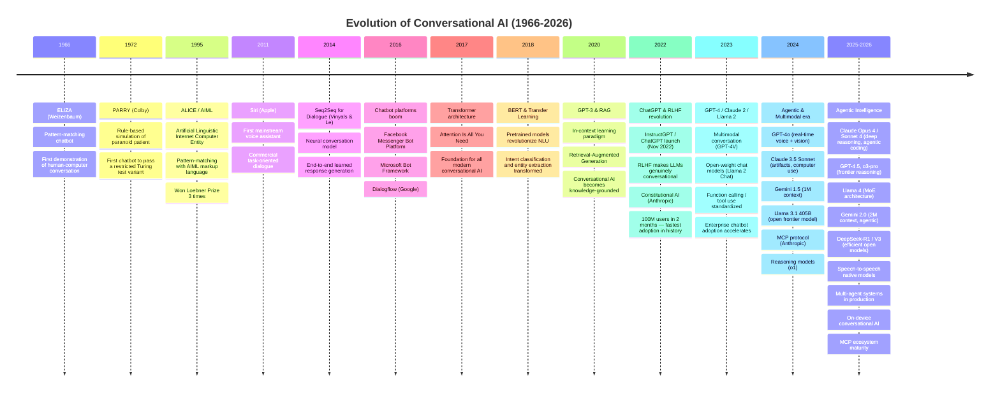
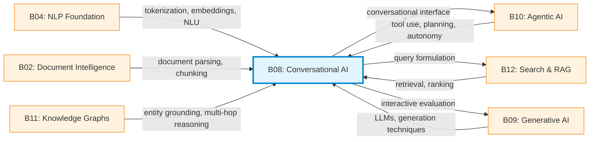

# Research Report: Conversational AI & Chatbots (B08)
## By Dr. Archon (R-alpha) — Date: 2026-03-31

---

## 1. Field Taxonomy

### Hierarchical Classification

- **Grand-parent field:** Artificial Intelligence
- **Parent field:** Natural Language Processing (NLP) > Dialogue Systems
- **Field:** Conversational AI & Chatbots (B08)
- **Sub-fields:**
  - **Task-Oriented Dialogue (TOD):** Systems designed to accomplish specific goals (booking, customer service, IT helpdesk). Characterized by structured intent-slot frameworks and dialogue state tracking.
  - **Open-Domain Chat:** Systems capable of free-form conversation on arbitrary topics without a fixed goal. Emphasizes engagingness, consistency, and personality (e.g., Meena, BlenderBot, Character.AI).
  - **Question Answering (QA):** Extractive, abstractive, and generative QA over documents, knowledge bases, or parametric memory. Includes conversational QA where context carries across turns.
  - **Retrieval-Augmented Generation (RAG):** Hybrid paradigm combining dense retrieval from external corpora with neural text generation, mitigating hallucination and enabling knowledge updates without retraining.
  - **Voice Assistants:** End-to-end spoken dialogue systems integrating ASR, NLU, dialogue management, NLG, and TTS (Alexa, Siri, Google Assistant). Increasingly moving to speech-to-speech LLM architectures.
  - **Multimodal Conversational AI:** Systems that process and generate across text, image, audio, and video modalities within dialogue (GPT-4o, Gemini 2.0, Claude with vision).

### Related Fields

| Related Field | Relationship to B08 |
|---|---|
| Natural Language Understanding (NLU) | Intent classification, entity extraction, semantic parsing — core input pipeline |
| Natural Language Generation (NLG) | Response generation, paraphrasing, style control — core output pipeline |
| Speech Recognition (ASR) | Voice-based conversational interfaces |
| Knowledge Graphs | Structured grounding for factual responses, entity linking |
| Information Retrieval | Document retrieval for RAG, passage ranking |
| Reinforcement Learning | RLHF alignment, dialogue policy optimization |
| Human-Computer Interaction | UX design, turn-taking, error recovery |
| Software Engineering | Tool-use agents, API orchestration, code generation in conversation |

### Taxonomy Diagram

```mermaid
graph TD
    AI[Artificial Intelligence] --> NLP[Natural Language Processing]
    NLP --> DS[Dialogue Systems]
    DS --> B08[B08: Conversational AI & Chatbots]

    B08 --> TOD[Task-Oriented Dialogue]
    B08 --> ODC[Open-Domain Chat]
    B08 --> QA[Question Answering]
    B08 --> RAG[Retrieval-Augmented Generation]
    B08 --> VA[Voice Assistants]
    B08 --> MCA[Multimodal Conversational AI]

    TOD --> DST[Dialogue State Tracking]
    TOD --> SF[Slot Filling]
    TOD --> DM[Dialogue Management]

    ODC --> PER[Persona & Consistency]
    ODC --> ENG[Engagingness & Safety]

    QA --> EQA[Extractive QA]
    QA --> AQA[Abstractive QA]
    QA --> CQA[Conversational QA]

    RAG --> DR[Dense Retrieval]
    RAG --> HYB[Hybrid Search]
    RAG --> AG[Agentic RAG]

    VA --> ASR[Speech Recognition]
    VA --> TTS[Text-to-Speech]
    VA --> S2S[Speech-to-Speech LLMs]

    MCA --> VIS[Vision + Language]
    MCA --> AUD[Audio + Language]

    B08 -.->|foundation| B04[B04: NLP]
    B08 -.->|documents| B02[B02: Document Intelligence]
    B08 -.->|search| B12[B12: Search & RAG]
    B08 -.->|generation| B09[B09: Generative AI]
    B08 -.->|agents| B10[B10: Agentic AI]
    B08 -.->|grounding| B11[B11: Knowledge Graphs]

    style B08 fill:#e1f5fe,stroke:#0288d1,stroke-width:3px
    style TOD fill:#f3e5f5,stroke:#7b1fa2
    style ODC fill:#f3e5f5,stroke:#7b1fa2
    style QA fill:#f3e5f5,stroke:#7b1fa2
    style RAG fill:#f3e5f5,stroke:#7b1fa2
    style VA fill:#f3e5f5,stroke:#7b1fa2
    style MCA fill:#f3e5f5,stroke:#7b1fa2
```



---

## 2. Mathematical Foundations

### 2.1 Attention Mechanism & Transformer Architecture

The Transformer (Vaswani et al., 2017) eliminated recurrence in favor of pure attention, enabling parallelization and long-range dependency modeling. The core computation is **Scaled Dot-Product Attention:**

$$
\text{Attention}(Q, K, V) = \text{softmax}\left(\frac{QK^\top}{\sqrt{d_k}}\right)V
$$

where $Q \in \mathbb{R}^{n \times d_k}$, $K \in \mathbb{R}^{m \times d_k}$, $V \in \mathbb{R}^{m \times d_v}$ are query, key, and value matrices, and $d_k$ is the key dimensionality used for scaling to prevent vanishing gradients in softmax.

**Multi-Head Attention** projects inputs into $h$ subspaces:

$$
\text{MultiHead}(Q, K, V) = \text{Concat}(\text{head}_1, \dots, \text{head}_h)W^O
$$
$$
\text{head}_i = \text{Attention}(QW_i^Q, KW_i^K, VW_i^V)
$$

where $W_i^Q \in \mathbb{R}^{d_{\text{model}} \times d_k}$, $W_i^K \in \mathbb{R}^{d_{\text{model}} \times d_k}$, $W_i^V \in \mathbb{R}^{d_{\text{model}} \times d_v}$, and $W^O \in \mathbb{R}^{hd_v \times d_{\text{model}}}$.

For conversational AI, the **causal (autoregressive) attention mask** is critical in decoder-only architectures (GPT family), where position $i$ can only attend to positions $\leq i$:

$$
\text{mask}_{ij} = \begin{cases} 0 & \text{if } j \leq i \\ -\infty & \text{if } j > i \end{cases}
$$

Modern efficiency improvements include:
- **Grouped Query Attention (GQA):** Shares key-value heads across query groups, reducing KV-cache memory. Used in Llama 2/3, Mistral.
- **Flash Attention:** IO-aware exact attention algorithm achieving O(N) memory instead of O(N^2) by tiling and recomputation (Dao et al., 2022).
- **Sliding Window Attention:** Limits attention span to a fixed window for efficiency (Mistral, Longformer).
- **Ring Attention:** Distributes sequence across devices for near-unlimited context (Liu et al., 2023).

### 2.2 Sequence-to-Sequence Modeling

The encoder-decoder framework maps an input sequence $\mathbf{x} = (x_1, \dots, x_n)$ to an output sequence $\mathbf{y} = (y_1, \dots, y_m)$ by factoring the conditional probability:

$$
P(\mathbf{y} | \mathbf{x}) = \prod_{t=1}^{m} P(y_t | y_1, \dots, y_{t-1}, \mathbf{x})
$$

The encoder produces contextualized representations $\mathbf{h} = \text{Encoder}(\mathbf{x})$, and the decoder generates tokens autoregressively conditioned on $\mathbf{h}$ and previously generated tokens.

**Training objective** is maximum likelihood estimation (MLE), minimizing the negative log-likelihood (cross-entropy loss):

$$
\mathcal{L}_{\text{MLE}} = -\sum_{t=1}^{m} \log P_\theta(y_t | y_{<t}, \mathbf{x})
$$

In modern decoder-only LLMs (GPT, Claude, Llama), the distinction between encoder and decoder collapses: the entire dialogue history (system prompt + user messages + assistant messages) is concatenated into a single sequence, and the model generates the next token autoregressively. The "encoding" of context happens implicitly through causal self-attention over the prefix.

### 2.3 Reinforcement Learning from Human Feedback (RLHF)

RLHF aligns language models with human preferences through a three-stage pipeline:

**Stage 1: Supervised Fine-Tuning (SFT).** Fine-tune a pretrained LM on demonstration data:

$$
\mathcal{L}_{\text{SFT}} = -\mathbb{E}_{(x,y) \sim \mathcal{D}_{\text{demo}}} \left[\log \pi_{\text{SFT}}(y|x)\right]
$$

**Stage 2: Reward Model (RM) Training.** Train a scalar reward model from human preference comparisons. Given prompt $x$ and two completions $y_w \succ y_l$ (where $y_w$ is preferred), the Bradley-Terry model gives:

$$
P(y_w \succ y_l | x) = \sigma(r_\phi(x, y_w) - r_\phi(x, y_l))
$$

The reward model loss is:

$$
\mathcal{L}_{\text{RM}} = -\mathbb{E}_{(x, y_w, y_l) \sim \mathcal{D}_{\text{pref}}} \left[\log \sigma(r_\phi(x, y_w) - r_\phi(x, y_l))\right]
$$

**Stage 3: RL Optimization.** Optimize the policy $\pi_\theta$ using PPO with a KL penalty to prevent divergence from the SFT policy:

$$
\mathcal{J}_{\text{RLHF}}(\theta) = \mathbb{E}_{x \sim \mathcal{D}, y \sim \pi_\theta(\cdot|x)} \left[r_\phi(x, y) - \beta \, D_{\text{KL}}\left(\pi_\theta(\cdot|x) \| \pi_{\text{SFT}}(\cdot|x)\right)\right]
$$

**Direct Preference Optimization (DPO)** (Rafailov et al., 2023) bypasses the explicit reward model by reparameterizing the RL objective:

$$
\mathcal{L}_{\text{DPO}}(\theta) = -\mathbb{E}_{(x, y_w, y_l)} \left[\log \sigma\left(\beta \log \frac{\pi_\theta(y_w|x)}{\pi_{\text{ref}}(y_w|x)} - \beta \log \frac{\pi_\theta(y_l|x)}{\pi_{\text{ref}}(y_l|x)}\right)\right]
$$

This is mathematically equivalent to RLHF under the Bradley-Terry model but is simpler, more stable, and avoids reward model training and PPO complexity. DPO and its variants (IPO, KTO, ORPO) have become the dominant alignment approach as of 2025-2026.

### 2.4 Retrieval-Augmented Generation (Dense Retrieval + Generation)

RAG (Lewis et al., 2020) combines a parametric generator with a non-parametric retrieval component. The marginal likelihood is:

$$
P(y|x) = \sum_{z \in \mathcal{Z}_{\text{top-k}}} P_\eta(z|x) \cdot P_\theta(y|x, z)
$$

where $z$ is a retrieved passage, $P_\eta(z|x)$ is the retriever score, and $P_\theta(y|x,z)$ is the generator probability conditioned on the retrieved context.

**Dense Retrieval** uses dual-encoder architecture. Query encoder $E_q$ and passage encoder $E_p$ produce embeddings, and relevance is computed via:

$$
\text{sim}(q, p) = E_q(q)^\top E_p(p)
$$

Training uses contrastive loss (InfoNCE):

$$
\mathcal{L}_{\text{retriever}} = -\log \frac{\exp(\text{sim}(q, p^+)/\tau)}{\exp(\text{sim}(q, p^+)/\tau) + \sum_{p^- \in \mathcal{N}} \exp(\text{sim}(q, p^-)/\tau)}
$$

where $p^+$ is a positive passage, $\mathcal{N}$ is the set of hard negatives, and $\tau$ is a temperature parameter.

Modern RAG systems (2025-2026) use **hybrid retrieval** combining dense vectors (semantic) with sparse vectors (BM25/SPLADE for keyword matching), **reranking** with cross-encoders, and **multi-hop retrieval** where the LLM iteratively formulates sub-queries.

### 2.5 Dialogue State Tracking (Belief State)

In task-oriented dialogue, the **belief state** $b_t$ at turn $t$ is a probability distribution over slot-value pairs $\{(s, v)\}$ given the dialogue history $H_t$:

$$
b_t(s = v) = P(s = v | H_t) = P(s = v | U_t, A_{t-1}, b_{t-1})
$$

where $U_t$ is the user utterance at turn $t$ and $A_{t-1}$ is the previous system action.

Classical approaches used **dynamic Bayesian networks** or hand-crafted rules. Neural DST models (TRADE, TripPy, DS2) directly predict slot values from dialogue context using encoder-decoder or span-extraction architectures:

$$
\hat{v}_s = \text{argmax}_v \, P_\theta(v | H_t, s)
$$

Modern LLM-based DST frames the problem as structured generation: given the dialogue, generate a JSON object representing the current belief state. This achieves state-of-the-art on MultiWOZ (>60% joint goal accuracy) with appropriate in-context examples.

### 2.6 Language Model Perplexity & Decoding Strategies

**Perplexity** is the standard intrinsic metric for language models:

$$
\text{PPL}(W) = \exp\left(-\frac{1}{N}\sum_{i=1}^{N} \log P(w_i | w_{<i})\right)
$$

Lower perplexity indicates better next-token prediction. However, perplexity on dialogue benchmarks does not always correlate with human-judged quality, motivating extrinsic evaluation.

**Decoding strategies** critically affect conversational quality:

- **Greedy decoding:** $y_t = \text{argmax}_v \, P(v | y_{<t})$. Deterministic but repetitive.
- **Beam search:** Maintains $k$ highest-probability partial sequences. Good for translation; often too generic for dialogue.
- **Top-k sampling:** Sample from the $k$ most probable tokens.
- **Top-p (nucleus) sampling** (Holtzman et al., 2020): Sample from the smallest set $V_p$ such that $\sum_{v \in V_p} P(v|y_{<t}) \geq p$. Adapts the candidate set size dynamically.
- **Temperature scaling:** $P_T(v) \propto \exp(\text{logit}(v)/T)$. $T < 1$ sharpens (more deterministic), $T > 1$ flattens (more creative).
- **Min-p sampling** (2024): Filters tokens below $p_{\text{base}} \times P(\text{top token})$, adapting to confidence level.
- **Speculative decoding:** Uses a small draft model to propose tokens verified by the large model in parallel, achieving 2-3x speedup without quality loss.

---

## 3. Core Concepts

### 3.1 Intent Recognition

Intent recognition classifies user utterances into predefined action categories. In a customer service chatbot, "I want to cancel my subscription" maps to `intent:cancel_subscription`. Formally, it is a text classification problem:

$$
\hat{c} = \text{argmax}_{c \in \mathcal{C}} \, P(c | \mathbf{x})
$$

**Classical approaches** used SVM or logistic regression over TF-IDF/n-gram features. **Modern approaches** fine-tune pretrained encoders (BERT, RoBERTa) or use LLMs with in-context learning. In production, intent classifiers are often hierarchical (domain > intent > sub-intent).

Key challenges: (1) **out-of-scope detection** — recognizing when an utterance does not match any known intent; (2) **multi-intent utterances** — "Book a flight and reserve a hotel"; (3) **intent shift** — user changes goal mid-conversation.

With LLM-powered chatbots (2024-2026), explicit intent classification is often replaced by the LLM's implicit understanding, but structured intent detection remains critical for routing in enterprise systems and hybrid architectures.

### 3.2 Slot Filling / Entity Extraction

Slot filling identifies and extracts relevant parameters from user utterances. For "Book a flight from Hanoi to Tokyo on March 15," the slots are:

| Slot | Value |
|---|---|
| origin_city | Hanoi |
| destination_city | Tokyo |
| departure_date | March 15 |

This is typically framed as **sequence labeling** using BIO tagging:

```
Book    O
a       O
flight  O
from    O
Hanoi   B-origin_city
to      O
Tokyo   B-destination_city
on      O
March   B-departure_date
15      I-departure_date
```

Modern systems use joint intent-slot models (e.g., JointBERT) that share encoder representations. LLM-based approaches extract slots via structured prompting or function calling schemas, returning JSON objects conforming to predefined schemas.

### 3.3 Dialogue Management (State Machines vs. Neural)

Dialogue management (DM) determines the system's next action given the current state.

**Rule-based / State Machine DM:** The dialogue is modeled as a finite state machine (FSM) or frame-based system. States correspond to dialogue phases (greeting, slot elicitation, confirmation, execution). Transitions are triggered by recognized intents and filled slots. Advantages: predictable, auditable, easy to debug. Disadvantages: brittle, exponential state explosion for complex dialogues.

**Statistical / Neural DM:** Policies are learned from data. Approaches include:
- **Supervised learning** from human-human dialogues.
- **Reinforcement learning** where the agent optimizes a reward signal (e.g., task success rate, dialogue length, user satisfaction). The state $s_t = (b_t, \text{context})$ and action $a_t$ are inputs to a policy $\pi(a_t | s_t)$ optimized via policy gradient or Q-learning.

**LLM as Dialogue Manager (2024-2026):** Modern systems use the LLM itself as the dialogue manager. The system prompt defines the conversation flow, available tools, and policies. The LLM implicitly tracks state, decides when to ask clarifying questions, when to call tools, and when to respond. This approach is more flexible but harder to guarantee compliance with strict business rules.

**Hybrid DM** is the most common production pattern: an orchestration layer (rules, state machine, or routing LLM) manages high-level flow and safety guardrails, while an LLM handles natural language understanding and generation within each state.

### 3.4 Context Window & Memory

The **context window** is the maximum number of tokens an LLM can process in a single forward pass. This is the fundamental constraint on conversational AI:

| Model (2025-2026) | Context Window |
|---|---|
| GPT-4o | 128K tokens |
| Claude (Opus/Sonnet) | 200K tokens |
| Gemini 2.0 | 2M tokens |
| Llama 3.1 | 128K tokens |
| Mistral Large | 128K tokens |

When conversations exceed the context window, systems must employ **memory strategies:**

1. **Truncation:** Drop oldest messages (simple but loses important context).
2. **Sliding window with summarization:** Periodically summarize older turns into a compressed representation that replaces the raw messages.
3. **Hierarchical memory:** Separate working memory (recent turns in context), episodic memory (summaries of past sessions stored in vector DB), and semantic memory (persistent user facts in structured storage).
4. **Retrieval-based memory:** Store all past turns in a vector database and retrieve relevant ones based on the current query (MemGPT / Letta architecture).
5. **External memory tools:** The LLM can explicitly save and retrieve facts using tool calls (memory_save, memory_search).

As of 2026, the trend is toward **infinite context via retrieval-augmented memory** rather than ever-larger context windows, as retrieval is more compute-efficient and allows selective attention to relevant history.

### 3.5 Retrieval-Augmented Generation (RAG)

RAG is the dominant paradigm for grounding conversational AI in external knowledge. The pipeline:

1. **Indexing:** Documents are chunked (by paragraphs, semantic boundaries, or recursive splitting), embedded via a dense encoder (e.g., text-embedding-3-large, Cohere Embed v3, BGE), and stored in a vector database (Pinecone, Weaviate, Qdrant, Milvus, pgvector).
2. **Retrieval:** At query time, the user message is embedded and top-k similar chunks are retrieved via approximate nearest neighbor (ANN) search. Hybrid retrieval combines dense and sparse (BM25) scores.
3. **Reranking:** A cross-encoder reranker (e.g., Cohere Rerank, bge-reranker) rescores the candidates with full query-passage attention.
4. **Generation:** Retrieved passages are injected into the LLM prompt as context. The LLM generates a response grounded in the retrieved information.

**Advanced RAG patterns (2025-2026):**
- **Agentic RAG:** The LLM decides when to retrieve, what queries to formulate, and whether retrieved results are sufficient. It can reformulate queries, do multi-hop retrieval, and combine information from multiple sources.
- **Graph RAG:** Uses knowledge graph structures to navigate relationships between entities, improving multi-hop reasoning (Microsoft GraphRAG).
- **Corrective RAG (CRAG):** Evaluates retrieval quality and falls back to web search or reformulation if passages are irrelevant.
- **Self-RAG:** The LLM generates special reflection tokens to decide whether to retrieve and to critique its own generation.
- **Late chunking / Contextual retrieval:** Embeds chunks with surrounding document context for better semantic representation (Anthropic's contextual retrieval, Jina's late chunking).

### 3.6 Prompt Engineering & In-Context Learning

**Prompt engineering** is the practice of designing input text to elicit desired behavior from LLMs without parameter updates. It is the primary interface for controlling conversational AI behavior.

Key techniques:
- **System prompts:** Define persona, capabilities, constraints, and output format. In conversational AI, the system prompt is the "soul" of the chatbot.
- **Few-shot examples:** Providing input-output examples in the prompt enables in-context learning (ICL), where the LLM infers the task pattern without gradient updates. Brown et al. (2020) demonstrated that ICL performance scales with model size.
- **Chain-of-Thought (CoT):** "Let's think step by step" elicits reasoning chains that improve accuracy on complex tasks (Wei et al., 2022).
- **Structured output prompting:** XML tags, JSON schemas, or markdown formatting to ensure parseable outputs.
- **Role prompting:** Assigning expert roles ("You are a medical assistant") activates relevant knowledge.

**In-context learning** remains theoretically intriguing. Proposed explanations include: implicit Bayesian inference (Xie et al., 2022), implicit gradient descent in transformer layers (Akyurek et al., 2023), and task vector formation in activation space (Todd et al., 2024).

### 3.7 Fine-Tuning vs. Few-Shot vs. Zero-Shot

The spectrum of adaptation methods for conversational AI:

| Method | Data Required | Compute Cost | Customization Depth | Latency Impact |
|---|---|---|---|---|
| **Zero-shot** | None | None | Low — relies on pretrained knowledge and prompt | None |
| **Few-shot (ICL)** | 3-20 examples | None (inference only) | Medium — task pattern from examples | Slightly increased (longer prompt) |
| **Fine-tuning (full)** | 1K-100K+ examples | High (full backprop) | High — modifies all parameters | None at inference |
| **LoRA / QLoRA** | 500-10K examples | Low-medium (adapter only) | High — efficient parameter-efficient tuning | Negligible |
| **RLHF / DPO** | 10K-100K preference pairs | High | Behavioral alignment | None at inference |

**When to use what in conversational AI:**
- **Zero-shot/few-shot:** Prototyping, low-data scenarios, rapidly changing requirements. Most enterprise chatbots in 2025-2026 start here.
- **Fine-tuning:** When the domain vocabulary, style, or task is sufficiently different from pretraining data (e.g., medical, legal, a specific brand voice). LoRA has made this accessible with minimal compute.
- **RLHF/DPO:** When human preference alignment is critical — reducing toxicity, improving helpfulness, matching organizational tone.

### 3.8 Guardrails & Safety

Guardrails are mechanisms to constrain LLM behavior within acceptable boundaries. This is critical for production conversational AI.

**Input guardrails:**
- Prompt injection detection (classifiers that detect attempts to override system instructions).
- Topic filtering (block off-topic or prohibited queries).
- PII detection and redaction.
- Rate limiting and abuse detection.

**Output guardrails:**
- Content safety classifiers (toxicity, hate speech, self-harm).
- Factuality checks against retrieved sources.
- Brand voice and policy compliance.
- Structured output validation (schema conformance).
- Citation verification.

**System-level guardrails:**
- Constitutional AI (Bai et al., 2022): Train the model to self-critique and revise outputs according to a set of principles.
- Tool-use permissions: Restrict which APIs/tools the chatbot can invoke.
- Human-in-the-loop escalation: Route uncertain or sensitive conversations to human agents.

**Frameworks:** Guardrails AI, NeMo Guardrails (NVIDIA), LlamaGuard (Meta), AWS Bedrock Guardrails, custom classifier chains.

### 3.9 Hallucination Detection & Mitigation

**Hallucination** in conversational AI occurs when the model generates statements that are factually incorrect, fabricated, or unsupported by provided context. Types:

- **Intrinsic hallucination:** Contradicts the provided source material.
- **Extrinsic hallucination:** Introduces claims not present in any source (neither supported nor contradicted).

**Detection methods:**
- **Self-consistency checking:** Generate multiple responses and check agreement. Disagreement signals potential hallucination.
- **Source attribution:** Require the model to cite specific passages. Verify that cited passages actually support the claim.
- **NLI-based verification:** Use a natural language inference model to check if the generated claim is entailed by the source.
- **LLM-as-judge:** A separate (or same) LLM evaluates whether the response is supported by provided context.
- **Confidence calibration:** Low token-level probabilities or high entropy may indicate uncertain (potentially hallucinated) content.

**Mitigation strategies:**
- RAG (ground responses in retrieved documents).
- Constrained decoding (restrict generation to information present in context).
- Explicit uncertainty expression ("Based on the available information..." / "I'm not sure about...").
- Fine-tuning on factuality-focused data.
- Chain-of-verification (CoVe): Generate, plan verification questions, answer them, revise the original response.

### 3.10 Multi-Turn Conversation Management

Managing coherent multi-turn conversations requires:

**Coreference resolution:** Understanding that "it," "they," "the previous one" refer to entities mentioned in earlier turns.

**Topic tracking:** Detecting topic shifts, maintaining multiple concurrent topics, and returning to suspended topics.

**Conversational grounding:** Ensuring mutual understanding — detecting and repairing misunderstandings through clarification questions.

**Turn-taking:** In voice systems, managing when to speak, when to listen, handling interruptions and backchanneling. Modern speech-to-speech models (GPT-4o, Gemini 2.0 Live) handle turn-taking natively.

**State persistence across sessions:** Remembering user preferences, past interactions, and unresolved issues across separate conversation sessions.

**Implementation patterns:**
- Thread-based message history (OpenAI Assistants API, Anthropic Messages API).
- Session state stored in databases with retrieval at conversation start.
- Summarization-based compression for long-running conversations.
- Explicit state objects (e.g., shopping cart, form fields) maintained alongside the conversation.

---

## 4. Algorithms & Methods

### 4.1 Rule-Based / Decision Tree Chatbots

The earliest and still widely deployed approach. The chatbot follows a predefined decision tree:

```
User says "hello" -> Respond with greeting
User says "check order" -> Ask for order number
  User provides order number -> Query database -> Return status
  User says "nevermind" -> Return to main menu
```

**Implementation:** Pattern matching (regex), keyword detection, finite state machines, or visual flow builders (Dialogflow, Botpress, Voiceflow).

**Advantages:** 100% predictable, easy to audit and debug, no hallucination, low latency, no GPU required.

**Disadvantages:** Cannot handle linguistic variation, brittle to unexpected inputs, exponential maintenance cost as complexity grows, poor user experience for open-ended queries.

**Current role (2026):** Still used for structured workflows (IVR menus, simple FAQ, transactional flows) and as the orchestration layer in hybrid systems.

### 4.2 Seq2Seq with Attention

The sequence-to-sequence model with attention (Bahdanau et al., 2015; Luong et al., 2015) was the first neural architecture to produce fluent dialogue responses.

**Architecture:** Encoder (bidirectional LSTM/GRU) encodes the input utterance into hidden states $\{h_1, \dots, h_n\}$. Decoder (LSTM/GRU) generates the response token by token, computing attention weights over encoder states at each step:

$$
\alpha_{t,i} = \frac{\exp(e_{t,i})}{\sum_j \exp(e_{t,j})}, \quad c_t = \sum_i \alpha_{t,i} h_i
$$

The context vector $c_t$ is concatenated with the decoder state to produce the output.

**In dialogue:** Used in early neural dialogue systems (Vinyals & Le, 2015). Suffered from generic responses ("I don't know"), lack of consistency, and no grounding. Historically important but fully superseded by Transformer-based approaches.

### 4.3 Transformer-Based LLMs (GPT, Claude, Llama, Gemini)

The current dominant paradigm. Large language models pretrained on massive text corpora, then instruction-tuned and aligned, serve as the backbone of modern conversational AI.

**GPT family (OpenAI):** GPT-3 (175B, 2020) demonstrated in-context learning. GPT-3.5-turbo (2022) and GPT-4 (2023) were fine-tuned for chat with RLHF. GPT-4o (2024) added native multimodal and real-time voice. o1/o3 (2024-2025) introduced extended reasoning ("thinking") for complex tasks.

**Claude family (Anthropic):** Trained with Constitutional AI (RLAIF) and RLHF. Claude 3 (2024) introduced Haiku/Sonnet/Opus tiers. Claude 3.5 Sonnet (2024) achieved strong coding and reasoning. Claude 4 / Opus 4 (2025) pushed the frontier on agentic tasks, extended thinking, and tool use. Known for safety emphasis, long context (200K), and instruction following.

**Llama family (Meta):** Open-weight models enabling self-hosted conversational AI. Llama 2 (2023) introduced chat fine-tuning. Llama 3 (2024) achieved near-frontier performance with 8B/70B/405B variants. Llama 4 (2025) introduced Mixture-of-Experts architecture (Scout 109B with 17B active, Maverick 401B with 17B active).

**Gemini family (Google):** Natively multimodal (text, image, audio, video). Gemini 1.5 (2024) introduced 1M+ token context. Gemini 2.0 (2025) added agentic capabilities and real-time streaming.

**Architecture commonalities:** All use decoder-only Transformer with causal attention, RoPE or ALiBi positional encoding, SwiGLU activation, RMSNorm, GQA, and are trained on trillions of tokens.

### 4.4 RAG (Dense Retriever + Generator)

Detailed in Section 3.5. The algorithm pipeline:

```
Input: user_query, document_store
1. query_embedding = encoder(user_query)
2. candidates = ANN_search(query_embedding, document_store, top_k=20)
3. candidates += BM25_search(user_query, document_store, top_k=20)  # hybrid
4. reranked = cross_encoder_rerank(user_query, candidates, top_k=5)
5. context = format_passages(reranked)
6. response = LLM(system_prompt + context + user_query)
7. Return response with citations
```

**Key design decisions:** Chunk size (256-1024 tokens typical), overlap (10-20%), embedding model selection, similarity metric (cosine vs. dot product), reranker threshold, context window budget allocation.

### 4.5 ReAct / Tool-Use Agents

**ReAct** (Yao et al., 2023) interleaves reasoning (chain-of-thought) and acting (tool invocation) in a single LLM generation:

```
Thought: I need to find the user's order status. Let me look up order #12345.
Action: query_database(order_id="12345")
Observation: {"status": "shipped", "tracking": "1Z999..."}
Thought: The order has shipped. I should provide the tracking number.
Answer: Your order #12345 has shipped! Tracking number: 1Z999...
```

**Tool-use** in modern conversational AI (2025-2026) is formalized through function calling APIs. The LLM receives tool schemas (name, description, parameters as JSON Schema) and can generate structured tool calls:

```json
{
  "tool": "search_knowledge_base",
  "arguments": {"query": "refund policy for electronics", "top_k": 3}
}
```

The orchestration framework executes the tool, returns results, and the LLM incorporates them into its response. This enables chatbots to access databases, APIs, search engines, calculators, and any external system.

**Model Context Protocol (MCP)** (Anthropic, 2024-2025) standardizes tool definitions and invocation across LLM providers, analogous to USB for AI tool connections.

### 4.6 RLHF / DPO Alignment

Detailed mathematically in Section 2.3. In practice:

**RLHF pipeline:**
1. Collect human comparisons (annotators rank 2+ model outputs for each prompt).
2. Train reward model on preferences.
3. Run PPO to optimize the chat model against the reward model.

**DPO pipeline (simpler):**
1. Collect preference pairs (chosen, rejected) for each prompt.
2. Directly optimize the policy using the DPO loss — no separate reward model needed.

**Variants gaining traction (2025-2026):**
- **KTO (Kahneman-Tversky Optimization):** Only requires binary feedback (good/bad), not paired comparisons.
- **ORPO (Odds Ratio Preference Optimization):** Combines SFT and alignment in a single stage.
- **Online DPO / Iterative DPO:** Generate new completions from the current policy, get preferences, and update — avoids distribution shift.
- **RLAIF (RL from AI Feedback):** Use a stronger LLM (or the same model with constitutional principles) as the preference annotator, reducing human labeling costs.

### 4.7 Dialogue State Tracking (DST)

DST maintains a structured representation of the user's goals throughout a task-oriented conversation. The belief state is typically a set of (domain, slot, value) triples:

```json
{
  "hotel": {"area": "centre", "stars": "4", "price_range": "expensive"},
  "restaurant": {"food": "italian", "people": "2"}
}
```

**Approaches:**
- **Classification-based:** For each slot, classify over a predefined value ontology. Scales poorly with large ontologies.
- **Span-extraction:** Extract slot values as spans from the dialogue history (TripPy). Cannot handle values not explicitly stated.
- **Generative:** Generate slot values as free-form text (TRADE, SOM-DST, D3ST). Most flexible.
- **LLM-based (2024-2026):** Prompt an LLM with the dialogue history and a schema description, generate the full belief state as structured JSON. Achieves SOTA on MultiWOZ 2.4 with appropriate prompting.

**Benchmark:** MultiWOZ 2.1/2.4 (multi-domain task-oriented dialogue). Joint goal accuracy (all slots correct simultaneously) has improved from ~50% (2019) to >65% (2025) with LLM approaches.

### 4.8 Multi-Agent Conversation Systems

Multiple specialized AI agents collaborate within a single conversation or workflow:

**Architectures:**
- **Router/Dispatcher:** A central agent classifies the user's request and routes to a specialist (billing agent, technical support agent, sales agent). Each specialist has its own system prompt, tools, and knowledge base.
- **Sequential pipeline:** Agents process the conversation in sequence — e.g., a safety-check agent preprocesses, a domain agent responds, a quality-check agent reviews.
- **Collaborative:** Multiple agents discuss and debate to reach a better answer (multi-agent debate for factuality improvement).
- **Hierarchical:** A planner agent breaks tasks into subtasks assigned to worker agents.

**Frameworks:** AutoGen (Microsoft), CrewAI, LangGraph, OpenAI Swarm, Anthropic multi-agent patterns.

**Applications in conversational AI:** Customer service with department-specialized agents, research assistants with separate retrieval/analysis/writing agents, complex enterprise workflows requiring multiple tool-sets.

### 4.9 Hybrid (Rules + LLM Fallback)

The most pragmatic production architecture combines deterministic rules with LLM flexibility:

```
User Input
    |
    v
[Intent Classifier / Router]
    |
    +---> [Known Intent] ---> Rule-based flow (form filling, API calls)
    |                              |
    |                              +--> [Ambiguity?] ---> LLM for clarification
    |
    +---> [Unknown/Complex Intent] ---> LLM with RAG
    |
    +---> [Safety Trigger] ---> Escalate to human / predefined safe response
```

**Advantages:** Predictable for known paths, flexible for novel queries, controllable, auditable. The rule-based layer acts as guardrails and business logic enforcement, while the LLM handles the "long tail" of user queries.

**This is the dominant enterprise architecture in 2025-2026.** Pure LLM chatbots are used for general-purpose assistants, but regulated industries (healthcare, finance, government) require the determinism and auditability of hybrid approaches.

---

## 5. Key Papers

### 5.1 Attention Is All You Need (Vaswani et al., 2017)

- **Citation:** Vaswani, A., Shazeer, N., Parmar, N., et al. "Attention Is All You Need." NeurIPS 2017.
- **Contribution:** Introduced the Transformer architecture, replacing RNNs/LSTMs with pure self-attention. Demonstrated superior performance on machine translation with massive parallelization advantages.
- **Impact on B08:** The Transformer is the universal backbone of every modern conversational AI system. Without this paper, the LLM revolution — and the entire modern chatbot ecosystem — would not exist. The multi-head attention mechanism enabled models to capture complex dependencies in dialogue context.

### 5.2 BERT: Pre-training of Deep Bidirectional Transformers (Devlin et al., 2018)

- **Citation:** Devlin, J., Chang, M., Lee, K., Toutanova, K. "BERT: Pre-training of Deep Bidirectional Transformers for Language Understanding." NAACL 2019.
- **Contribution:** Introduced bidirectional pretraining with masked language modeling (MLM) and next sentence prediction (NSP). Achieved SOTA on 11 NLP benchmarks.
- **Impact on B08:** BERT became the standard encoder for intent classification, slot filling, NLU pipelines, and dense retrieval in dialogue systems. Its bidirectional nature made it ideal for understanding user utterances (as opposed to generation).

### 5.3 Language Models are Few-Shot Learners — GPT-3 (Brown et al., 2020)

- **Citation:** Brown, T., Mann, B., Ryder, N., et al. "Language Models are Few-Shot Learners." NeurIPS 2020.
- **Contribution:** Scaled the GPT architecture to 175B parameters. Demonstrated that large language models can perform tasks via in-context learning (zero-shot, one-shot, few-shot) without fine-tuning.
- **Impact on B08:** Paradigm shift for conversational AI. Showed that a single general-purpose LLM could replace specialized NLU/NLG/DM pipelines. Enabled rapid prototyping of chatbots through prompting alone.

### 5.4 Retrieval-Augmented Generation (Lewis et al., 2020)

- **Citation:** Lewis, P., Perez, E., Piktus, A., et al. "Retrieval-Augmented Generation for Knowledge-Intensive NLP Tasks." NeurIPS 2020.
- **Contribution:** Proposed RAG, combining a dense passage retriever (DPR) with a seq2seq generator (BART). The retriever provides relevant passages that condition the generator, enabling knowledge-intensive tasks without storing all knowledge in parameters.
- **Impact on B08:** RAG became the standard approach for enterprise chatbots that need to answer questions from proprietary knowledge bases. It directly addresses the hallucination problem and enables knowledge updates without retraining. The RAG paradigm now underlies the majority of production conversational AI deployments.

### 5.5 Training Language Models to Follow Instructions with Human Feedback — InstructGPT (Ouyang et al., 2022)

- **Citation:** Ouyang, L., Wu, J., Jiang, X., et al. "Training Language Models to Follow Instructions with Human Feedback." NeurIPS 2022.
- **Contribution:** Introduced the three-stage RLHF pipeline (SFT -> Reward Model -> PPO) for aligning LLMs with human intent. The resulting InstructGPT (1.3B) was preferred over GPT-3 (175B) by human evaluators.
- **Impact on B08:** This paper made LLMs actually usable as chatbots. Raw pretrained models are poor conversationalists — they complete text rather than follow instructions. RLHF transformed language models into helpful, harmless, and honest dialogue agents. Every major chatbot (ChatGPT, Claude, Gemini) uses some form of this alignment approach.

### 5.6 Constitutional AI: Harmlessness from AI Feedback (Bai et al., 2022)

- **Citation:** Bai, Y., Kadavath, S., Kundu, S., et al. "Constitutional AI: Harmlessness from AI Feedback." arXiv 2022.
- **Contribution:** Proposed using a set of principles (a "constitution") to guide AI self-critique and revision (RLAIF). The model generates responses, critiques them against principles, revises, and the revised outputs are used for RL training — reducing reliance on human red-teaming.
- **Impact on B08:** Foundation for scalable safety in conversational AI. Enables chatbots to be trained for safety without exhaustive human annotation of harmful content. Directly influenced Claude's training methodology and the broader industry's approach to responsible conversational AI.

### 5.7 GPT-4 Technical Report (OpenAI, 2023)

- **Citation:** OpenAI. "GPT-4 Technical Report." arXiv 2023.
- **Contribution:** Described GPT-4, a large-scale multimodal model (text + image input) achieving human-level performance on many professional exams. Introduced extensive safety mitigations and red-teaming methodology.
- **Impact on B08:** Established the performance frontier for conversational AI and demonstrated that LLMs could handle complex, multi-step conversational tasks with near-human reliability. The multimodal capability (image understanding in conversation) opened new interaction paradigms.

### 5.8 Llama 2: Open Foundation and Fine-Tuned Chat Models (Touvron et al., 2023)

- **Citation:** Touvron, H., Martin, L., Stone, K., et al. "Llama 2: Open Foundation and Fine-Tuned Chat Models." arXiv 2023.
- **Contribution:** Released open-weight 7B/13B/70B models with chat-tuned variants. Detailed the RLHF recipe including rejection sampling and Ghost Attention for multi-turn consistency.
- **Impact on B08:** Democratized conversational AI. Organizations could deploy their own chatbots without depending on API providers, enabling on-premise deployment for data-sensitive applications. Ghost Attention technique improved system prompt adherence in long conversations.

### 5.9 Direct Preference Optimization (Rafailov et al., 2023)

- **Citation:** Rafailov, R., Sharma, A., Mitchell, E., et al. "Direct Preference Optimization: Your Language Model is Secretly a Reward Model." NeurIPS 2023.
- **Contribution:** Proved that the RLHF objective can be optimized directly without training a separate reward model or using RL. DPO is a simple classification loss on preference pairs that is mathematically equivalent to RLHF under the Bradley-Terry model.
- **Impact on B08:** Made alignment training accessible to smaller teams. DPO's simplicity (no reward model, no PPO instability) accelerated the pace at which organizations could customize and align conversational AI models.

### 5.10 Advances in 2025-2026

**Extended thinking / reasoning models:** OpenAI o1/o3 (2024-2025), Claude with extended thinking (2025), DeepSeek-R1 (2025), Gemini 2.0 Flash Thinking. These models perform explicit multi-step reasoning before responding, dramatically improving accuracy on complex conversational tasks (math tutoring, legal analysis, debugging).

**Agentic chatbots:** Computer-use capable models (Claude computer use, Operator by OpenAI), MCP standardization, and frameworks like LangGraph and CrewAI have moved chatbots from pure Q&A to action-taking agents that browse the web, write code, manage files, and operate software on behalf of users.

**Speech-native conversational AI:** GPT-4o real-time voice (2024), Gemini 2.0 Live, and open models like Moshi (Kyutai) enable sub-200ms voice conversations with emotional nuance, interruption handling, and multimodal awareness — moving beyond the ASR->LLM->TTS pipeline to end-to-end speech-to-speech models.

**Efficient deployment:** Quantization (GPTQ, AWQ, GGUF), speculative decoding, and distillation have made powerful conversational AI models runnable on consumer hardware. Llama 3.2 1B/3B and Gemma 2 2B enable on-device chatbots.

---

## 6. Evolution Timeline



### Detailed Milestones

| Year | Milestone | Significance |
|---|---|---|
| 1966 | ELIZA | Pattern matching; demonstrated humans attribute understanding to machines (ELIZA effect) |
| 1972 | PARRY | More sophisticated rule-based system; first chatbot evaluated by domain experts |
| 1995 | A.L.I.C.E. / AIML | Scalable pattern matching with markup language; open-source movement |
| 2001 | SmarterChild (AOL IM) | First widely-used commercial chatbot; 30M users on AIM/MSN |
| 2011 | Siri / Watson Jeopardy | Voice assistants enter mainstream; QA over knowledge bases |
| 2014 | Seq2Seq dialogue | Neural end-to-end conversation; eliminated handcrafted rules for generation |
| 2016 | Bot platform explosion | Messenger/Slack/Teams bots; enterprise chatbot industry forms |
| 2017 | Transformer | Architectural revolution enabling all subsequent progress |
| 2018-2019 | BERT, GPT-2, Transfer learning | Pretrained models make NLU and NLG dramatically better with less data |
| 2020 | GPT-3, RAG | In-context learning; grounded generation; knowledge-augmented chatbots |
| 2022 | ChatGPT, RLHF, Constitutional AI | Mainstream adoption explosion; alignment techniques; safety frameworks |
| 2023 | GPT-4, Claude 2, Llama 2, tool use | Multimodal, open-weight, and tool-using chatbots reach production quality |
| 2024 | GPT-4o, Claude 3.5, Gemini 1.5, o1, MCP | Real-time multimodal; computer use; million-token context; reasoning chains; tool protocol standardization |
| 2025-2026 | Claude 4, Llama 4, Gemini 2.0, DeepSeek | Deep reasoning, multi-agent orchestration, speech-native, on-device, MCP ecosystem |

---

## 7. Cross-Domain Connections

### 7.1 B04 — Natural Language Processing (Foundation)

B08 is a direct application domain of B04. Every component of a conversational AI system relies on NLP foundations:

- **Tokenization** (BPE, SentencePiece) — how user input is segmented for model consumption.
- **Embeddings** (word2vec, contextual embeddings) — semantic representations used for intent matching, retrieval, and understanding.
- **Syntactic and semantic parsing** — understanding sentence structure for slot filling and command interpretation.
- **Named Entity Recognition** — extracting entities (dates, names, locations, products) from user utterances.
- **Sentiment analysis** — detecting user frustration or satisfaction to adapt conversational strategy.
- **Text classification** — intent recognition, topic detection, content moderation.

**Dependency:** B08 cannot exist without B04. NLP is the substrate; conversational AI is the interactive application layer.

### 7.2 B02 — Document Intelligence (for RAG)

Document Intelligence provides the knowledge ingestion pipeline for RAG-powered chatbots:

- **Document parsing:** PDF, DOCX, HTML, and scanned document processing (OCR) to extract clean text.
- **Layout understanding:** Tables, figures, headers, and hierarchical structure preservation during chunking.
- **Metadata extraction:** Author, date, section titles — used for filtering and citation in chatbot responses.
- **Multi-format handling:** Enterprise chatbots must answer questions across diverse document types.

**Connection:** B02 is the "upstream data pipeline" for B08's RAG component. The quality of document parsing directly determines retrieval and answer quality. Poor table extraction leads to incorrect answers about tabular data; poor layout understanding leads to incoherent chunks.

### 7.3 B12 — Search & RAG

B12 provides the retrieval infrastructure that B08 consumes:

- **Vector search:** ANN algorithms (HNSW, IVF) and vector databases that power semantic retrieval.
- **Hybrid search:** Combining dense and sparse retrieval for robustness.
- **Query understanding:** Query expansion, reformulation, and decomposition.
- **Ranking models:** Cross-encoder rerankers and learning-to-rank.
- **Index management:** Document update, deletion, versioning.

**Connection:** B12 is the retrieval engine; B08 is the conversational interface. B12 answers "find relevant passages"; B08 answers "have a helpful conversation using those passages." The RAG pattern (B12's core topic) is the dominant architecture for production B08 systems.

### 7.4 B09 — Generative AI

B08 is a specialized application of generative AI focused on interactive dialogue:

- **Text generation models:** The same LLMs (GPT, Claude, Llama) power both general generative AI and conversational AI.
- **Controlled generation:** Techniques for style, tone, length, and format control developed in B09 are directly applicable to chatbot response shaping.
- **Multimodal generation:** Image generation in conversation (DALL-E in ChatGPT), code generation, structured data generation.
- **Evaluation methods:** BLEU, ROUGE, BERTScore, and human evaluation methodologies shared across B09 and B08.

**Connection:** B09 provides the generative backbone; B08 adds the interactive, multi-turn, goal-directed, and safety-constrained dimensions. A generative AI system becomes a chatbot when it gains dialogue management, memory, and user-facing interaction design.

### 7.5 B10 — Agentic AI

The boundary between B08 and B10 is rapidly dissolving (2025-2026):

- **Tool use:** Chatbots that call APIs, query databases, and execute code are agents.
- **Planning:** Multi-step task decomposition (breaking "plan my vacation" into flights, hotels, activities, budget).
- **Autonomous action:** Computer-use agents that operate GUIs, browse the web, write and execute code.
- **Multi-agent systems:** Conversational AI as the human interface to a swarm of specialized agents.
- **ReAct pattern:** Interleaving reasoning and tool use within conversation.

**Connection:** B10 provides the agency framework (planning, tool use, autonomy); B08 provides the human interaction layer. Modern "agentic chatbots" are the fusion of B08 and B10 — they converse like chatbots but act like agents. The MCP protocol bridges both fields by standardizing tool interfaces.

### 7.6 B11 — Knowledge Graphs (for Grounding)

Knowledge graphs provide structured, relational knowledge that complements RAG's unstructured retrieval:

- **Entity linking:** Mapping user mentions ("Apple") to knowledge graph entities (Apple Inc. vs. apple fruit) using context.
- **Relation extraction:** Understanding relationships between entities for complex queries ("Who is the CEO of the company that acquired Instagram?").
- **Multi-hop reasoning:** Traversing graph relationships to answer questions requiring multiple inference steps.
- **Ontological constraints:** Using KG schemas to validate chatbot responses (a person cannot be born after they died).
- **Graph RAG:** Microsoft's approach of building knowledge graphs from documents and using graph community summaries for global questions.

**Connection:** B11 provides structured knowledge and reasoning paths; B08 uses them for grounded, consistent, and logically valid responses. KGs address RAG's weakness on relational and multi-hop queries. The combination of vector retrieval (B12) + knowledge graph traversal (B11) + LLM generation (B09) within a conversational interface (B08) represents the state of the art for enterprise question answering.

### Cross-Domain Connection Map



---

## Appendix: Evaluation Metrics for Conversational AI

| Metric | Type | What It Measures |
|---|---|---|
| Perplexity | Automatic / Intrinsic | Language model quality (lower = better) |
| BLEU | Automatic / Reference-based | N-gram overlap with reference response |
| ROUGE | Automatic / Reference-based | Recall of n-grams from reference |
| BERTScore | Automatic / Semantic | Semantic similarity via contextual embeddings |
| Task success rate | Automatic / Task | Whether the dialogue achieved its goal |
| Joint goal accuracy | Automatic / DST | Belief state correctness across all slots |
| Faithfulness | Automatic / RAG | Whether response is supported by retrieved context |
| Answer relevance | Automatic / RAG | Whether response addresses the query |
| Human preference (Elo) | Human | Head-to-head comparison ratings (Chatbot Arena) |
| Safety rate | Automatic + Human | Percentage of responses free from harmful content |

---

*Report prepared by Dr. Archon (R-alpha) for the MAESTRO Knowledge Graph, Baseline B08.*
*Classification: L3 — Maximum Research Depth.*
