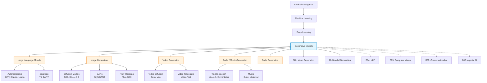
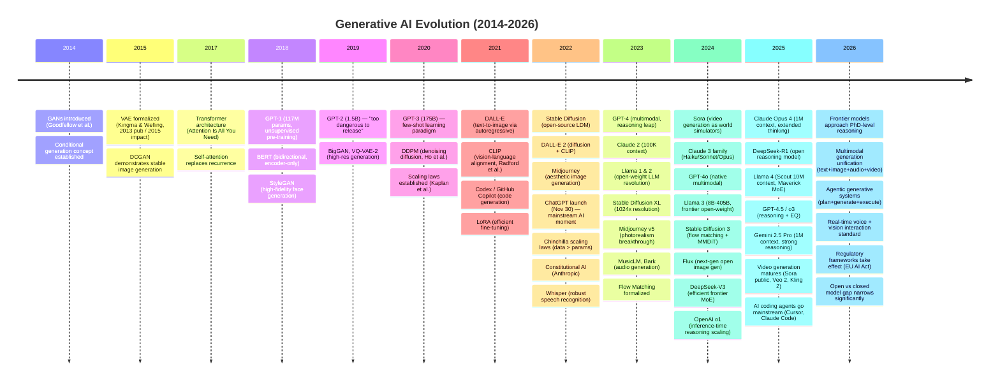

# Research Report: Generative AI (B09)
## By Dr. Archon (R-alpha) — Date: 2026-03-31

---

## 1. Field Taxonomy

**Parent field:** Artificial Intelligence > Deep Learning > Generative Models

**Sub-fields:**

| Sub-field | Description | Key Models (2026) |
|-----------|-------------|-------------------|
| Large Language Models (LLMs) | Autoregressive text generation at scale | GPT-4o, Claude 4, Llama 4, Gemini 2.5 |
| Image Generation | Text-to-image via diffusion, flow matching | Stable Diffusion 3.5, DALL-E 3, Midjourney v7, Flux |
| Video Generation | Text/image-to-video synthesis | Sora, Runway Gen-3, Kling 2, Veo 2 |
| Audio & Music Generation | Speech synthesis, music composition | Whisper v3, Suno v4, MusicLM, ElevenLabs |
| Code Generation | Program synthesis from natural language | Copilot X, Cursor, Claude Code, Codex |
| 3D & Mesh Generation | Text/image-to-3D asset creation | Point-E, Shap-E, Meshy, Tripo3D |
| Multimodal Generation | Joint generation across modalities | GPT-4o, Gemini 2.5, Claude 4 (vision+text) |

**Related fields:**

- B04 — Natural Language Processing (text understanding underpins text generation)
- B03 — Computer Vision (visual encoders for image/video generation)
- B08 — Conversational AI (dialogue as a generation task)
- B10 — Agentic AI (tool-augmented generation, planning with generative reasoning)
- B12 — Search & Information Retrieval (RAG as a generation paradigm)
- B02 — Document Intelligence (structured document generation)

**Taxonomy Diagram:**



---

## 2. Mathematical Foundations

### 2.1 Transformer Architecture & Self-Attention

The Transformer (Vaswani et al., 2017) is the architectural backbone of modern generative AI. Its core mechanism is scaled dot-product attention:

$$
\text{Attention}(Q, K, V) = \text{softmax}\!\left(\frac{QK^\top}{\sqrt{d_k}}\right) V
$$

where $Q = XW_Q$, $K = XW_K$, $V = XW_V$ are linear projections of input $X$ into query, key, and value spaces of dimension $d_k$.

**Multi-head attention** runs $h$ parallel attention heads and concatenates:

$$
\text{MultiHead}(Q,K,V) = \text{Concat}(\text{head}_1, \ldots, \text{head}_h) W_O
$$

$$
\text{head}_i = \text{Attention}(QW_Q^i, KW_K^i, VW_V^i)
$$

The full Transformer block applies: LayerNorm -> Multi-Head Attention -> Residual -> LayerNorm -> Feed-Forward Network -> Residual. Modern variants (Pre-LN, RMSNorm, RoPE, GQA) have refined this structure for stability and efficiency at scale.

**Complexity:** Standard self-attention is $O(n^2 d)$ in sequence length $n$. Efficient variants include FlashAttention ($O(n^2 d / M)$ I/O complexity where $M$ is SRAM size), linear attention, and ring attention for long contexts (up to 1M+ tokens in 2025-2026 models).

### 2.2 Diffusion Models

Diffusion models define a forward noising process and learn to reverse it.

**Forward process (fixed):** Gradually add Gaussian noise over $T$ timesteps:

$$
q(x_t | x_{t-1}) = \mathcal{N}(x_t; \sqrt{1 - \beta_t}\, x_{t-1},\; \beta_t I)
$$

With cumulative schedule $\bar{\alpha}_t = \prod_{s=1}^t (1 - \beta_s)$, we can sample any $x_t$ directly:

$$
q(x_t | x_0) = \mathcal{N}(x_t; \sqrt{\bar{\alpha}_t}\, x_0,\; (1 - \bar{\alpha}_t) I)
$$

**Reverse process (learned):** A neural network $\epsilon_\theta$ predicts the noise:

$$
p_\theta(x_{t-1} | x_t) = \mathcal{N}\!\left(x_{t-1};\; \frac{1}{\sqrt{\alpha_t}}\left(x_t - \frac{\beta_t}{\sqrt{1 - \bar{\alpha}_t}} \epsilon_\theta(x_t, t)\right),\; \sigma_t^2 I\right)
$$

**Training objective (simplified DDPM loss):**

$$
L_{\text{simple}} = \mathbb{E}_{x_0, \epsilon, t}\left[\|\epsilon - \epsilon_\theta(\sqrt{\bar{\alpha}_t}\, x_0 + \sqrt{1 - \bar{\alpha}_t}\, \epsilon,\; t)\|^2\right]
$$

**Score matching connection:** The noise predictor relates to the score function: $\nabla_{x_t} \log q(x_t) \approx -\epsilon_\theta(x_t, t) / \sqrt{1 - \bar{\alpha}_t}$.

**DDIM (Song et al., 2020):** Deterministic sampling via a non-Markovian reverse process enables fewer sampling steps (e.g., 20-50 instead of 1000) with minimal quality loss.

### 2.3 Variational Autoencoders (VAEs)

VAEs define a latent variable model $p_\theta(x) = \int p_\theta(x|z) p(z) dz$ with an approximate posterior $q_\phi(z|x)$.

**Evidence Lower Bound (ELBO):**

$$
\log p_\theta(x) \geq \mathbb{E}_{q_\phi(z|x)}[\log p_\theta(x|z)] - D_{\text{KL}}(q_\phi(z|x) \| p(z))
$$

The first term is the reconstruction loss; the second is the KL regularization forcing the latent space toward the prior $p(z) = \mathcal{N}(0, I)$.

**Reparameterization trick:** To backpropagate through sampling, express $z = \mu_\phi(x) + \sigma_\phi(x) \odot \epsilon$ where $\epsilon \sim \mathcal{N}(0, I)$.

VAEs are critical in **Latent Diffusion Models** (Stable Diffusion): the VAE compresses images from pixel space ($512 \times 512 \times 3$) to latent space ($64 \times 64 \times 4$), reducing computation by $\sim$48x while preserving perceptual quality.

### 2.4 GAN Theory

Generative Adversarial Networks (Goodfellow et al., 2014) formulate generation as a two-player minimax game:

$$
\min_G \max_D \; \mathbb{E}_{x \sim p_{\text{data}}}[\log D(x)] + \mathbb{E}_{z \sim p_z}[\log(1 - D(G(z)))]
$$

**Theoretical result:** At the Nash equilibrium, $G$ generates $p_g = p_{\text{data}}$ and $D(x) = 1/2$ everywhere.

**Practical challenges:** Mode collapse, training instability, vanishing gradients. Solutions include Wasserstein distance (WGAN), spectral normalization, progressive growing, and StyleGAN's mapping network.

While diffusion models have largely supplanted GANs for image generation quality (as of 2024-2026), GANs remain important for real-time applications due to single-pass inference and in hybrid architectures (e.g., adversarial losses for diffusion model fine-tuning).

### 2.5 Flow Matching & Rectified Flows

Flow matching (Lipman et al., 2023) provides a simulation-free framework for training continuous normalizing flows (CNFs).

**Core idea:** Learn a velocity field $v_\theta(x, t)$ that transports a noise distribution $p_0$ to the data distribution $p_1$ along straight paths:

$$
\frac{dx}{dt} = v_\theta(x, t), \quad t \in [0, 1]
$$

**Conditional flow matching loss:**

$$
L_{\text{CFM}} = \mathbb{E}_{t, x_0, x_1}\left[\|v_\theta(\phi_t(x_0, x_1), t) - (x_1 - x_0)\|^2\right]
$$

where $\phi_t(x_0, x_1) = (1-t)x_0 + t x_1$ is the linear interpolation path.

**Rectified flows** (Liu et al., 2023) iteratively straighten the learned transport paths, enabling few-step generation. This is the mathematical basis of Stable Diffusion 3 and Flux, which achieve high-quality image generation in 4-8 steps.

**Advantage over DDPM:** Simpler training objective, no noise schedule to tune, naturally supports few-step inference, and unifies diffusion and flow perspectives.

### 2.6 RLHF, DPO & Constitutional AI Alignment

Aligning generative models with human preferences is formalized as:

**RLHF (Ouyang et al., 2022):** Three-stage process:
1. Supervised fine-tuning (SFT) on demonstrations
2. Reward model training: $r_\phi(x, y)$ from pairwise human preferences using Bradley-Terry model:

$$
P(y_w \succ y_l | x) = \sigma(r_\phi(x, y_w) - r_\phi(x, y_l))
$$

3. RL optimization (PPO) with KL penalty:

$$
\max_\pi \; \mathbb{E}_{x \sim \mathcal{D},\, y \sim \pi(\cdot|x)}[r_\phi(x,y)] - \beta\, D_{\text{KL}}(\pi(\cdot|x) \| \pi_{\text{ref}}(\cdot|x))
$$

**DPO (Rafailov et al., 2023):** Eliminates the explicit reward model by directly optimizing the policy:

$$
L_{\text{DPO}} = -\mathbb{E}\!\left[\log \sigma\!\left(\beta \log \frac{\pi_\theta(y_w|x)}{\pi_{\text{ref}}(y_w|x)} - \beta \log \frac{\pi_\theta(y_l|x)}{\pi_{\text{ref}}(y_l|x)}\right)\right]
$$

**Constitutional AI (Bai et al., 2022):** Replaces human feedback with AI self-critique guided by a set of principles (a "constitution"). The model generates, critiques, and revises its own outputs, then trains on the self-improved data.

### 2.7 Autoregressive vs Non-Autoregressive Generation

**Autoregressive (AR):** Models factorize $p(x) = \prod_t p(x_t | x_{<t})$. Each token is generated sequentially conditioned on all previous tokens. Used by GPT, Claude, Llama. Inference is $O(n)$ sequential steps with KV-cache optimization.

**Non-autoregressive (NAR):** Models generate all tokens in parallel. Used in diffusion models (all pixels refined simultaneously) and masked prediction models (e.g., MaskGIT for images). Advantages: parallel decoding, bidirectional context. Disadvantages: typically lower quality without iterative refinement.

**Hybrid approaches (2025-2026 trend):** Models like MAR (Masked Autoregressive) and next-token prediction for images blur the line, applying AR factorization to latent tokens while using parallel decoding within each token's sub-components.

### 2.8 Scaling Laws

Neural scaling laws (Kaplan et al., 2020; Hoffmann et al., 2022) describe predictable power-law relationships:

$$
L(N, D) \approx \left(\frac{N_c}{N}\right)^{\alpha_N} + \left(\frac{D_c}{D}\right)^{\alpha_D} + L_\infty
$$

where $L$ is loss, $N$ is parameter count, $D$ is dataset size, and $\alpha_N \approx 0.076$, $\alpha_D \approx 0.095$ (Chinchilla estimates).

**Chinchilla-optimal scaling:** For a given compute budget $C \propto 6ND$, parameters and data should scale proportionally: $N \propto C^{0.5}$, $D \propto C^{0.5}$.

**Inference-time scaling (2024-2025):** Recent work demonstrates that additional test-time compute (chain-of-thought, search, verification) also follows scaling laws, enabling smaller models to match larger ones on reasoning tasks.

---

## 3. Core Concepts

### 3.1 Foundation Models & Scaling Laws

A **foundation model** (Bommasani et al., 2021) is a large model pre-trained on broad data that can be adapted to a wide range of downstream tasks. The foundation model paradigm has become the dominant approach across all generative AI sub-fields.

Key properties:
- **Scale:** Modern foundation models range from 7B to over 1T parameters (GPT-4 rumored ~1.8T MoE, DeepSeek-V3 671B MoE)
- **Emergent abilities:** Capabilities that appear only above certain scale thresholds (e.g., chain-of-thought reasoning, few-shot translation)
- **Homogenization risk:** Entire industries depend on a small number of base models, concentrating both capability and failure modes

Scaling laws (Section 2.8) provide the theoretical basis for why larger models trained on more data systematically produce better results, enabling organizations to predict model performance before committing to expensive training runs.

### 3.2 Tokenization & Vocabulary

Tokenization converts raw input into discrete tokens that models process.

- **BPE (Byte Pair Encoding):** Used by GPT-family. Iteratively merges frequent byte/character pairs. GPT-4 uses ~100k token vocabulary.
- **SentencePiece:** Used by Llama, T5. Operates on raw text without pre-tokenization.
- **Byte-level tokenization:** Used by some models to handle arbitrary text without unknown tokens.
- **Visual tokenization:** VQ-VAE, VQGAN encode image patches into discrete tokens for autoregressive image generation.
- **Multimodal tokenization:** Models like GPT-4o use unified token spaces spanning text, image, and audio.

Token count directly affects cost, context window utilization, and generation speed. The trend toward larger vocabularies (100k+) improves compression efficiency for multilingual and code-heavy workloads.

### 3.3 Pre-training vs Fine-tuning vs Prompting

The three stages of adaptation form a hierarchy of data efficiency:

| Stage | Data Required | Compute Cost | Flexibility |
|-------|--------------|-------------|-------------|
| **Pre-training** | Trillions of tokens | $10M-$100M+ | Broad capabilities |
| **Fine-tuning** | Thousands-millions of examples | $100-$100K | Task-specific expertise |
| **Prompting** | Zero to dozens of examples | Per-query cost | Immediate, no training |

**Pre-training** establishes world knowledge and linguistic competence from massive web corpora.

**Fine-tuning** variants:
- Full fine-tuning: Update all parameters (expensive)
- LoRA/QLoRA: Low-rank adapter training (Section 4.8)
- Instruction tuning: Align pre-trained model to follow instructions (FLAN, InstructGPT)

**Prompting** techniques: zero-shot, few-shot, chain-of-thought, tree-of-thought, system prompts. No weight updates required.

### 3.4 In-Context Learning & Emergent Abilities

**In-context learning (ICL)** is the ability of LLMs to perform tasks from examples provided in the prompt without any gradient updates. First demonstrated convincingly in GPT-3 (Brown et al., 2020).

**Emergent abilities** (Wei et al., 2022) are capabilities that appear discontinuously as model scale increases:
- Chain-of-thought reasoning (appears ~100B parameters)
- Multi-step arithmetic
- Code generation and debugging
- Theory of mind reasoning

The existence of truly "emergent" abilities has been debated (Schaeffer et al., 2023 argued it may be a measurement artifact), but the practical observation remains: larger models qualitatively unlock capabilities absent in smaller ones.

### 3.5 Diffusion Process: From Noise to Image

The diffusion process (Section 2.2) can be understood intuitively as:

1. **Forward:** Progressively corrupt a clean image by adding Gaussian noise until it becomes pure noise
2. **Reverse:** Starting from pure noise, iteratively denoise to reconstruct a clean image

The neural network (typically a U-Net or DiT/Transformer) learns to predict and remove the noise at each step. **Classifier-free guidance (CFG)** steers generation toward a text prompt:

$$
\hat{\epsilon} = \epsilon_\text{uncond} + s \cdot (\epsilon_\text{cond} - \epsilon_\text{uncond})
$$

where $s > 1$ is the guidance scale (typically 7-12 for images). Higher guidance produces images more aligned with the text but with reduced diversity.

### 3.6 Latent Space & Latent Diffusion

**Latent diffusion models (LDM)** (Rombach et al., 2022) perform the diffusion process in a compressed latent space rather than pixel space:

1. **Encoder:** VAE maps image $x \in \mathbb{R}^{H \times W \times 3}$ to latent $z \in \mathbb{R}^{h \times w \times c}$ (typically 8x spatial downsampling)
2. **Diffusion:** Forward/reverse process operates on $z$
3. **Decoder:** VAE reconstructs image from denoised latent

This reduces computational cost by ~48x while preserving perceptual quality. The latent space also provides a natural interface for conditioning (text embeddings via cross-attention, spatial controls, style vectors).

**Latent spaces in LLMs:** While not explicitly trained as VAEs, LLMs develop rich internal representations. Activation engineering and representation reading exploit these latent spaces for steering model behavior.

### 3.7 ControlNet & Guided Generation

**ControlNet** (Zhang et al., 2023) adds spatial conditioning to diffusion models by creating a trainable copy of the encoder blocks with zero-initialized convolutions:

- Input conditions: edge maps (Canny), depth maps, pose skeletons, segmentation masks, scribbles
- The control signal is injected into the frozen base model via residual connections
- Enables precise spatial control while preserving the base model's generation quality

**Broader guided generation paradigms:**
- **IP-Adapter:** Image prompt conditioning for style/content transfer
- **T2I-Adapter:** Lightweight alternative to ControlNet
- **Inpainting/Outpainting:** Masked region generation
- **Instruction-based editing:** InstructPix2Pix, MagicBrush

### 3.8 RLHF & Alignment

Alignment ensures generative models are helpful, harmless, and honest (the "HHH" criteria). See Section 2.6 for mathematical foundations.

**The alignment pipeline (as of 2026):**
1. Pre-training on filtered web data
2. Supervised fine-tuning on high-quality demonstrations
3. Preference optimization (RLHF, DPO, KTO, or Constitutional AI)
4. Red-teaming and safety evaluation
5. Deployment with runtime safety layers (classifiers, filters)

**Open challenges:**
- Reward hacking (model exploits reward model flaws)
- Sycophancy (model agrees with user even when wrong)
- Alignment tax (safety training can reduce capability on edge cases)
- Scalable oversight (how to align models smarter than their overseers)

### 3.9 Hallucination & Factuality

**Hallucination** refers to model outputs that are fluent but factually incorrect, nonsensical, or unsupported by input context.

**Types:**
- **Intrinsic hallucination:** Contradicts the source input
- **Extrinsic hallucination:** Cannot be verified from the source (fabricated facts)
- **Faithfulness hallucination:** In summarization, deviates from source document

**Mitigation strategies:**
- Retrieval-Augmented Generation (RAG) — ground responses in retrieved documents
- Citation and attribution mechanisms
- Confidence calibration and selective abstention
- Chain-of-verification (CoVe) prompting
- Fine-tuning on factuality-focused datasets
- Post-hoc fact-checking pipelines

Hallucination remains one of the most significant barriers to deploying generative AI in high-stakes domains (medical, legal, financial).

### 3.10 Multimodal Fusion (Text + Image + Audio)

**Multimodal models** process and generate across multiple modalities simultaneously.

**Fusion architectures:**
- **Early fusion:** Interleave tokens from all modalities in a single sequence (GPT-4o approach)
- **Cross-attention fusion:** Separate encoders per modality with cross-attention layers (Flamingo)
- **Late fusion:** Independent processing with fusion at the output/decision layer

**Key technical challenges:**
- Modality alignment: Ensuring text, image, and audio representations share a compatible embedding space (CLIP, ImageBind)
- Temporal alignment: Synchronizing audio and video streams
- Resolution asymmetry: Text tokens carry different information density than image patches

**State of the art (2026):** GPT-4o, Gemini 2.5, and Claude 4 can natively process text, images, and audio, with GPT-4o and Gemini also supporting native generation across modalities.

### 3.11 Responsible AI & Safety

Responsible deployment of generative AI encompasses:

- **Bias & fairness:** Models can amplify biases present in training data (gender, racial, cultural stereotypes)
- **Misinformation & deepfakes:** Realistic generation enables convincing disinformation
- **Copyright & IP:** Training on copyrighted data raises legal questions (ongoing litigation as of 2026)
- **Environmental impact:** Training large models has significant carbon footprint (GPT-4 estimated ~7,500 MWh)
- **Dual use:** Models capable of assisting with harmful activities (bioweapons, cyberattacks)
- **Transparency:** Model cards, datasheets, and capability disclosures

**Regulatory landscape (2026):** EU AI Act in effect, US executive orders on AI safety, China's generative AI regulations, emerging frameworks globally. Content provenance standards (C2PA) increasingly adopted for AI-generated media.

---

## 4. Algorithms & Methods

### 4.1 GPT Family (Autoregressive LLMs)

**Architecture:** Decoder-only Transformer, autoregressive next-token prediction.

| Model | Year | Parameters | Context | Key Advance |
|-------|------|-----------|---------|-------------|
| GPT-2 | 2019 | 1.5B | 1K | Demonstrated zero-shot capabilities |
| GPT-3 | 2020 | 175B | 4K | In-context learning, few-shot prompting |
| GPT-3.5 / ChatGPT | 2022 | ~175B | 4K-16K | RLHF alignment, conversational format |
| GPT-4 | 2023 | ~1.8T (MoE) | 8K-128K | Multimodal (vision), reasoning leap |
| GPT-4o | 2024 | Undisclosed | 128K | Native multimodal (text+image+audio), faster |
| GPT-4.5 | 2025 | Undisclosed | 128K | Improved EQ and factuality |
| o1 / o3 | 2024-2025 | Undisclosed | 200K | Chain-of-thought reasoning at inference time |

**Training pipeline:** Pre-training (next-token prediction on internet text) -> SFT (instruction following) -> RLHF/DPO (preference alignment) -> Safety training.

### 4.2 Claude / Anthropic (Constitutional AI)

Anthropic's Claude model family emphasizes safety and alignment:

- **Constitutional AI (CAI):** Self-supervised alignment using a set of principles rather than human labels for every example
- **Process:** Generate -> Self-critique against constitution -> Revise -> Train on revised outputs
- **Claude 3 family (2024):** Haiku, Sonnet, Opus — spanning efficiency to maximum capability
- **Claude 3.5 Sonnet (2024-2025):** Strong coding and reasoning, competitive with GPT-4
- **Claude 4 / Opus 4 (2025):** State-of-the-art reasoning, extended thinking, 1M token context window
- **Key differentiator:** Long-context capability (up to 1M tokens), strong instruction following, reduced hallucination through training methodology

### 4.3 Llama / Mistral (Open-Weight LLMs)

**Meta Llama family:**
- Llama 1 (2023): 7B-65B, trained on public data, catalyzed open-source LLM ecosystem
- Llama 2 (2023): 7B-70B, with chat variants, RLHF alignment
- Llama 3 (2024): 8B-405B, trained on 15T tokens, competitive with GPT-4 class
- Llama 4 (2025): Scout (17B active, 109B total MoE, 10M context) and Maverick (17B active, 400B total MoE), pushing open-weight frontier

**Mistral family:**
- Mistral 7B (2023): Outperformed Llama 2 13B, introduced sliding window attention
- Mixtral 8x7B (2023): Sparse MoE architecture, 12.9B active parameters
- Mistral Large (2024-2025): Competitive proprietary/open models

**Impact:** Open-weight models enabled fine-tuning, local deployment, academic research, and enterprise customization, democratizing access to frontier capabilities.

### 4.4 Stable Diffusion / SDXL / SD3

**Stable Diffusion (Stability AI):**

| Version | Year | Architecture | Key Advance |
|---------|------|-------------|-------------|
| SD 1.5 | 2022 | LDM + U-Net + CLIP | Open-source text-to-image, 512x512 |
| SDXL | 2023 | Dual U-Net + OpenCLIP | 1024x1024, improved aesthetics |
| SD3 / SD3.5 | 2024 | MMDiT + Flow Matching | Rectified flow, better text rendering, 3 text encoders |
| Flux | 2024 | DiT + Flow Matching | From Black Forest Labs (ex-Stability), state-of-the-art open image gen |

**SD3 architecture innovation:** The Multimodal Diffusion Transformer (MMDiT) uses separate weight sets for text and image tokens within the same Transformer, enabling tighter text-image integration. Uses flow matching instead of traditional DDPM training.

### 4.5 DALL-E 3 & Midjourney

**DALL-E 3 (OpenAI, 2023):**
- Built on diffusion architecture with a focus on prompt following
- Key innovation: Uses GPT-4 to rewrite/expand user prompts before generation, dramatically improving prompt adherence
- Integrated natively into ChatGPT for iterative image creation
- Safety: Trained to decline generating images of real public figures

**Midjourney:**
- Proprietary model (architecture undisclosed), accessed via Discord and web interface
- Known for exceptional aesthetic quality and artistic coherence
- v6 (2024): Major improvement in text rendering, photorealism, and prompt understanding
- v7 (2025): Personalization, faster generation, improved coherence

### 4.6 Sora / Runway / Kling (Video Generation)

**Sora (OpenAI, 2024-2025):**
- Architecture: Diffusion Transformer (DiT) operating on spacetime patches
- Compresses video into latent spacetime patches, then uses Transformer-based diffusion
- Capable of generating 60-second videos with temporal coherence
- Demonstrates emergent understanding of 3D consistency, physics, and object permanence
- Released publicly in late 2024 with limitations

**Runway Gen-3 Alpha (2024):**
- Trained jointly on images and videos for better visual fidelity
- Supports text-to-video, image-to-video, and video-to-video
- Widely used in creative production and filmmaking

**Kling (Kuaishou, 2024-2025):**
- 3D VAE for spatial-temporal compression
- Strong motion generation capabilities
- Competitive with Sora on many benchmarks

**Core challenge:** Video generation requires temporal coherence over hundreds of frames, consistent physics, and enormous compute. As of 2026, generated videos are typically limited to ~60 seconds with visible artifacts in complex scenes.

### 4.7 RAG (Retrieval-Augmented Generation)

**RAG (Lewis et al., 2020)** augments generation with retrieved knowledge:

```
Input Query -> Retriever (BM25/Dense) -> Top-K Documents -> [Query + Documents] -> Generator -> Answer
```

**Architecture variants:**
- **Naive RAG:** Single retrieval + generation pass
- **Advanced RAG:** Query rewriting, reranking, chunk optimization
- **Modular RAG:** Pluggable components (retriever, reranker, generator, verifier)
- **Agentic RAG (2025-2026):** Agent decides when and what to retrieve, with iterative retrieval

**Key components:**
- Embedding models for semantic search (text-embedding-3, BGE, E5)
- Vector databases (Pinecone, Weaviate, Chroma, Milvus)
- Chunking strategies (fixed-size, semantic, recursive)
- Reranking (cross-encoders, Cohere Rerank)

RAG is the primary production method for reducing hallucination and grounding LLM outputs in current, domain-specific knowledge.

### 4.8 LoRA / QLoRA Fine-tuning

**LoRA (Low-Rank Adaptation, Hu et al., 2021):** Instead of updating all parameters $W \in \mathbb{R}^{d \times k}$, learn low-rank decomposition:

$$
W' = W + \Delta W = W + BA
$$

where $B \in \mathbb{R}^{d \times r}$, $A \in \mathbb{R}^{r \times k}$, and $r \ll \min(d, k)$ (typically $r = 8$ to $64$).

**QLoRA (Dettmers et al., 2023):** Combines LoRA with 4-bit NormalFloat quantization of the base model, enabling fine-tuning of 65B parameter models on a single 48GB GPU.

**Practical impact:** LoRA/QLoRA democratized fine-tuning, enabling practitioners to customize models for specific domains (medical, legal, code) at a fraction of full fine-tuning cost. The LoRA ecosystem includes Hugging Face PEFT, adapters for Stable Diffusion (style LoRAs), and composition of multiple adapters.

### 4.9 Whisper + TTS (Speech Generation)

**Whisper (OpenAI, 2022-2023):**
- Encoder-decoder Transformer trained on 680,000 hours of labeled audio
- Robust speech recognition across languages, accents, and noise conditions
- v3 (2023): Improved multilingual performance, reduced hallucination

**Text-to-Speech (TTS) frontier:**
- **VALL-E (Microsoft, 2023):** Neural codec language model, 3-second voice cloning
- **ElevenLabs (2023-2025):** Production-quality voice synthesis, emotional control
- **OpenAI TTS (2024-2025):** Integrated into GPT-4o for real-time voice conversation
- **F5-TTS / CosyVoice (2024-2025):** Open-source high-quality TTS with flow matching

**Trend:** Moving toward real-time, zero-shot voice cloning with emotional expressiveness and multilingual capability.

### 4.10 Codex / Copilot / Cursor (Code Generation)

**Evolution:**
- **Codex (OpenAI, 2021):** GPT-3 fine-tuned on code, powered original GitHub Copilot
- **GitHub Copilot (2022-2026):** IDE-integrated code completion, evolved from line completion to multi-file editing
- **Cursor (2024-2026):** AI-native code editor with inline editing, chat, and codebase-aware context
- **Claude Code (Anthropic, 2025):** CLI-based agentic coding with terminal access and file editing

**State of the art (2026):** Code generation models can handle complex multi-file refactoring, write tests, debug issues, and maintain project context across thousands of files. The SWE-bench benchmark shows frontier models resolving >50% of real-world GitHub issues.

### 4.11 Music Generation (MusicLM, Suno)

- **MusicLM (Google, 2023):** Hierarchical sequence-to-sequence model generating music from text descriptions
- **Suno (2023-2025):** Text-to-song (lyrics + vocals + instrumentation), consumer product
- **Udio (2024-2025):** Competing text-to-music with high fidelity
- **Stable Audio (Stability AI, 2024):** Latent diffusion for audio generation

**Technical approach:** Most music generation models use audio tokenization (EnCodec, SoundStream) to convert audio waveforms into discrete token sequences, then apply autoregressive or diffusion-based generation in token space.

### 4.12 3D Generation

- **Point-E / Shap-E (OpenAI, 2023):** Text/image-to-3D via point cloud and implicit function generation
- **DreamFusion (Google, 2022):** Score Distillation Sampling (SDS) uses 2D diffusion models to optimize 3D representations (NeRF)
- **Instant3D / LRM (2024):** Single-image to 3D in seconds using large reconstruction models
- **Meshy / Tripo3D (2024-2025):** Production-ready text-to-3D for gaming and design

**Core challenge:** 3D generation requires geometric consistency, texture quality, and compatibility with existing 3D pipelines (meshes, UV maps). As of 2026, quality is rapidly improving but still below expert human artists for production assets.

---

## 5. Key Papers

### 5.1 Attention Is All You Need (Vaswani et al., 2017)

- **Citation:** Vaswani, A., et al. "Attention Is All You Need." NeurIPS 2017.
- **Contribution:** Introduced the Transformer architecture, replacing recurrence and convolution entirely with self-attention. Demonstrated superior performance on machine translation (BLEU 41.8 on EN-FR).
- **Impact:** Became the foundational architecture for virtually all modern generative AI. Over 130,000 citations by 2026. Enabled parallelized training and scaling to billions of parameters.
- **Key innovation:** Scaled dot-product attention, multi-head attention, positional encoding.

### 5.2 Language Models are Few-Shot Learners — GPT-3 (Brown et al., 2020)

- **Citation:** Brown, T., et al. "Language Models are Few-Shot Learners." NeurIPS 2020.
- **Contribution:** Demonstrated that a 175B parameter autoregressive LM exhibits strong few-shot and zero-shot capabilities across diverse tasks without fine-tuning.
- **Impact:** Established the "foundation model" paradigm. Showed that scale alone could yield qualitative capability jumps. Launched the API-based LLM economy.
- **Key finding:** Performance improves log-linearly with scale, and in-context learning emerges as a function of model size.

### 5.3 Zero-Shot Text-to-Image Generation — DALL-E (Ramesh et al., 2021)

- **Citation:** Ramesh, A., et al. "Zero-Shot Text-to-Image Generation." ICML 2021.
- **Contribution:** 12B parameter autoregressive Transformer generating images from text captions using discrete VAE tokens. Demonstrated that LLM-style training could produce coherent images from arbitrary text descriptions.
- **Impact:** Catalyzed the text-to-image generation field. DALL-E 2 (2022) introduced diffusion + CLIP guidance; DALL-E 3 (2023) added GPT-4 prompt rewriting.

### 5.4 High-Resolution Image Synthesis with Latent Diffusion Models (Rombach et al., 2022)

- **Citation:** Rombach, R., et al. "High-Resolution Image Synthesis with Latent Diffusion Models." CVPR 2022.
- **Contribution:** Proposed performing diffusion in VAE latent space rather than pixel space, reducing computation by ~48x while maintaining image quality. Introduced cross-attention conditioning for text guidance.
- **Impact:** Basis of Stable Diffusion, the most widely adopted open-source image generation model. Democratized high-quality image generation by making it feasible on consumer GPUs.

### 5.5 GPT-4 Technical Report (OpenAI, 2023)

- **Citation:** OpenAI. "GPT-4 Technical Report." arXiv 2303.08774, 2023.
- **Contribution:** Demonstrated a large multimodal model (text + image input) achieving human-level performance on professional and academic benchmarks (90th percentile on bar exam, 99th percentile on GRE verbal).
- **Impact:** Established the frontier for LLM capability. Introduced predictable scaling of eval performance from smaller models. Became the benchmark against which all subsequent models are measured.

### 5.6 Constitutional AI: Harmlessness from AI Feedback (Bai et al., 2022)

- **Citation:** Bai, Y., et al. "Constitutional AI: Harmlessness from AI Feedback." arXiv 2212.08073, 2022.
- **Contribution:** Proposed replacing human feedback in RLHF with AI self-critique guided by a set of written principles. Showed this achieves comparable or better harmlessness while being more scalable.
- **Impact:** Foundation of Anthropic's Claude alignment approach. Pioneered scalable alignment methods. Influenced the broader field toward principle-driven AI safety.

### 5.7 Video Generation Models as World Simulators — Sora (OpenAI, 2024)

- **Citation:** OpenAI. "Video Generation Models as World Simulators." Technical Report, 2024.
- **Contribution:** Demonstrated that scaling video diffusion Transformers (DiT) on spacetime patches produces emergent physical understanding — 3D consistency, object permanence, and long-range temporal coherence in generated videos up to 60 seconds.
- **Impact:** Set a new benchmark for video generation quality. Framed video generation as a path toward world models and physical simulation. Sparked a wave of video generation research and products.

### 5.8 The Llama 3 Herd of Models (Meta, 2024)

- **Citation:** Grattafiori, A., et al. "The Llama 3 Herd of Models." arXiv 2407.21783, 2024.
- **Contribution:** Released 8B, 70B, and 405B parameter models trained on 15T+ tokens, with the 405B variant matching GPT-4 on many benchmarks. Provided detailed training methodology including data curation, training recipes, and post-training alignment.
- **Impact:** Most capable open-weight model family. Enabled enterprise and academic access to frontier-class LLMs. Established new best practices for large-scale training.

### 5.9 Scaling Laws for Neural Language Models (Kaplan et al., 2020)

- **Citation:** Kaplan, J., et al. "Scaling Laws for Neural Language Models." arXiv 2001.08361, 2020.
- **Contribution:** Empirically demonstrated that LLM loss follows smooth power-law curves as a function of model size, dataset size, and compute budget. Found that larger models are more sample-efficient.
- **Impact:** Provided the theoretical foundation for "scaling up" as a research strategy. Led to the Chinchilla correction (Hoffmann et al., 2022) showing that most models were undertrained relative to their size.

### 5.10 Flow Matching for Generative Modeling (Lipman et al., 2023)

- **Citation:** Lipman, Y., et al. "Flow Matching for Generative Modeling." ICLR 2023.
- **Contribution:** Proposed a simulation-free training framework for continuous normalizing flows via conditional flow matching. Simpler than diffusion training with comparable or better results.
- **Impact:** Adopted by Stable Diffusion 3 and Flux as the training paradigm, replacing traditional DDPM. Enabled faster inference through naturally straighter sampling paths.

### 5.11 DeepSeek-V3 and R1 (DeepSeek, 2024-2025)

- **Citation:** DeepSeek-AI. "DeepSeek-V3 Technical Report." arXiv 2412.19437, 2024.
- **Contribution:** 671B parameter MoE model (37B active) trained for $5.6M total cost, achieving performance competitive with Claude 3.5 Sonnet and GPT-4o. DeepSeek-R1 (2025) demonstrated that reinforcement learning alone (without SFT) can elicit strong reasoning capabilities.
- **Impact:** Demonstrated that frontier capabilities could be achieved at dramatically lower cost. DeepSeek-R1 provided the first open-weight reasoning model competitive with OpenAI's o1, and its distilled variants brought reasoning to smaller models.

---

## 6. Evolution Timeline



**Detailed milestone annotations:**

| # | Year | Milestone | Significance |
|---|------|-----------|-------------|
| 1 | 2014 | GANs (Goodfellow) | Adversarial training paradigm for generation |
| 2 | 2017 | Transformer | Architectural backbone of all modern generative AI |
| 3 | 2020 | GPT-3 + DDPM | Foundation models + diffusion revolution, dual tracks |
| 4 | 2021 | DALL-E + CLIP | Vision-language alignment enables text-to-image |
| 5 | 2022 | Stable Diffusion | Open-source democratizes image generation |
| 6 | 2022 | ChatGPT | Consumer AI inflection — 100M users in 2 months |
| 7 | 2023 | GPT-4 | Multimodal reasoning at human-expert level |
| 8 | 2023 | Llama 1/2 | Open-weight LLMs catalyze ecosystem |
| 9 | 2024 | Sora | Video generation demonstrates world understanding |
| 10 | 2024 | o1 reasoning | Inference-time compute scaling for reasoning |
| 11 | 2025 | DeepSeek-R1 | Open reasoning model, cost-efficient frontier |
| 12 | 2025-26 | Agentic GenAI | Models that plan, generate, use tools, and execute |

---

## 7. Cross-Domain Connections

### 7.1 B09 (Generative AI) <-> B04 (Natural Language Processing)

**Connection type:** Foundational overlap

NLP provides the linguistic understanding that underpins all text generation. Tokenization, syntax, semantics, and discourse structure from NLP are embedded into LLM pre-training. Conversely, generative AI has transformed NLP: tasks previously framed as classification (sentiment, NER, relation extraction) are now cast as generation problems via instruction-tuned LLMs.

**Shared techniques:** Transformer architecture, attention mechanisms, embeddings, fine-tuning, evaluation metrics (BLEU, ROUGE, BERTScore).

**Key intersection:** Instruction-following models (GPT-4, Claude) unify NLP understanding and text generation into a single system.

### 7.2 B09 (Generative AI) <-> B03 (Computer Vision)

**Connection type:** Visual generation backbone

Computer vision provides the visual encoders (ViT, CLIP) and architectural patterns (U-Net, skip connections) used in image and video generation. The VAE encoder/decoder in latent diffusion models is a vision component. ControlNet and IP-Adapter rely on vision understanding (edge detection, depth estimation, pose estimation) for guided generation.

**Shared techniques:** Convolutional networks, Vision Transformers, feature pyramids, perceptual loss functions.

**Key intersection:** CLIP (Contrastive Language-Image Pre-training) bridges vision and language, serving as the conditioning mechanism for text-to-image generation.

### 7.3 B09 (Generative AI) <-> B08 (Conversational AI)

**Connection type:** Application layer

Conversational AI is the primary interface through which users interact with generative models. ChatGPT, Claude, Gemini are fundamentally generative models wrapped in a conversational framework. Dialogue management, turn-taking, persona consistency, and context tracking from conversational AI inform how generative models are deployed.

**Key intersection:** RLHF and instruction tuning transform base generative models into useful conversational agents. Multi-turn context management determines how effectively generative capabilities are delivered.

### 7.4 B09 (Generative AI) <-> B10 (Agentic AI)

**Connection type:** Capability extension

Agentic AI extends generative models beyond text production into action execution. LLMs serve as the "reasoning backbone" for agents that plan, use tools, write code, browse the web, and interact with APIs. The generative model produces both natural language reasoning (chain-of-thought) and structured action commands.

**Shared techniques:** LLM-based planning, ReAct prompting, tool-use fine-tuning, function calling.

**Key intersection:** The 2025-2026 trend of "agentic generative AI" merges generation and action — models like Claude Code and Copilot Workspace generate code and also execute it, debug errors, and iterate.

### 7.5 B09 (Generative AI) <-> B12 (Search & RAG)

**Connection type:** Knowledge grounding

Search and retrieval systems provide the factual grounding that generative models lack from parametric knowledge alone. RAG (Section 4.7) is the dominant production pattern for building knowledge-aware generative applications. Search provides the "what to say" while generation provides the "how to say it."

**Shared techniques:** Dense retrieval, embedding models, semantic similarity, reranking, query understanding.

**Key intersection:** The retrieval-generation pipeline is becoming increasingly integrated — models with native search (Gemini, Perplexity) blur the boundary between retrieval and generation.

### 7.6 B09 (Generative AI) <-> B02 (Document Intelligence)

**Connection type:** Structured generation

Document intelligence extracts structure from documents (OCR, layout analysis, table extraction), while generative AI can produce structured documents (reports, invoices, formatted content). The combination enables document-to-document transformation: reading a PDF, understanding its structure, and generating a reformatted or summarized version.

**Shared techniques:** Layout-aware models (LayoutLM), multi-modal encoding, template-based generation.

**Key intersection:** LLMs with vision capabilities (GPT-4V, Claude with vision) can now read complex documents and generate structured outputs, unifying document understanding and generation.

---

## 8. Summary & Research Frontiers (2026)

Generative AI in 2026 stands at an inflection point where multiple sub-fields are converging:

**Current frontier capabilities:**
- LLMs achieving PhD-level reasoning on specialized benchmarks
- Image generation indistinguishable from photography in many cases
- Video generation producing coherent 30-60 second clips
- Code generation resolving >50% of real-world software engineering tasks
- Real-time multimodal conversation (voice + vision + text)

**Open research challenges:**
1. **Reliable reasoning:** Models still make systematic errors on novel logical and mathematical problems
2. **Hallucination elimination:** Grounded generation remains imperfect, especially for rare or recent facts
3. **Long-horizon coherence:** Maintaining consistency in very long generated content (novels, codebases, video)
4. **Efficient training:** Reducing the compute cost of frontier model training by orders of magnitude
5. **Alignment at scale:** Ensuring superhuman models remain aligned with human values
6. **Unified multimodal generation:** Single models that fluidly generate across all modalities
7. **World models:** Moving from pattern matching to genuine physical and causal understanding
8. **Personalization without memorization:** Adapting to individual users while preserving privacy

**Predicted near-term developments (2026-2027):**
- Frontier models approaching AGI-adjacent capabilities on structured tasks
- Video generation extending to minutes-long coherent content
- Generative agents performing complex multi-step real-world tasks autonomously
- Significant regulatory action shaping deployment patterns globally
- Open-weight models closing the gap with proprietary frontier within 6-12 months

---

*Report prepared by Dr. Archon (R-alpha), Chief Research Scientist, MAESTRO AI Knowledge Graph Platform.*
*Classification: B09 — Generative AI | Depth: L3 (Comprehensive Academic) | Version: 2026-03-31*
