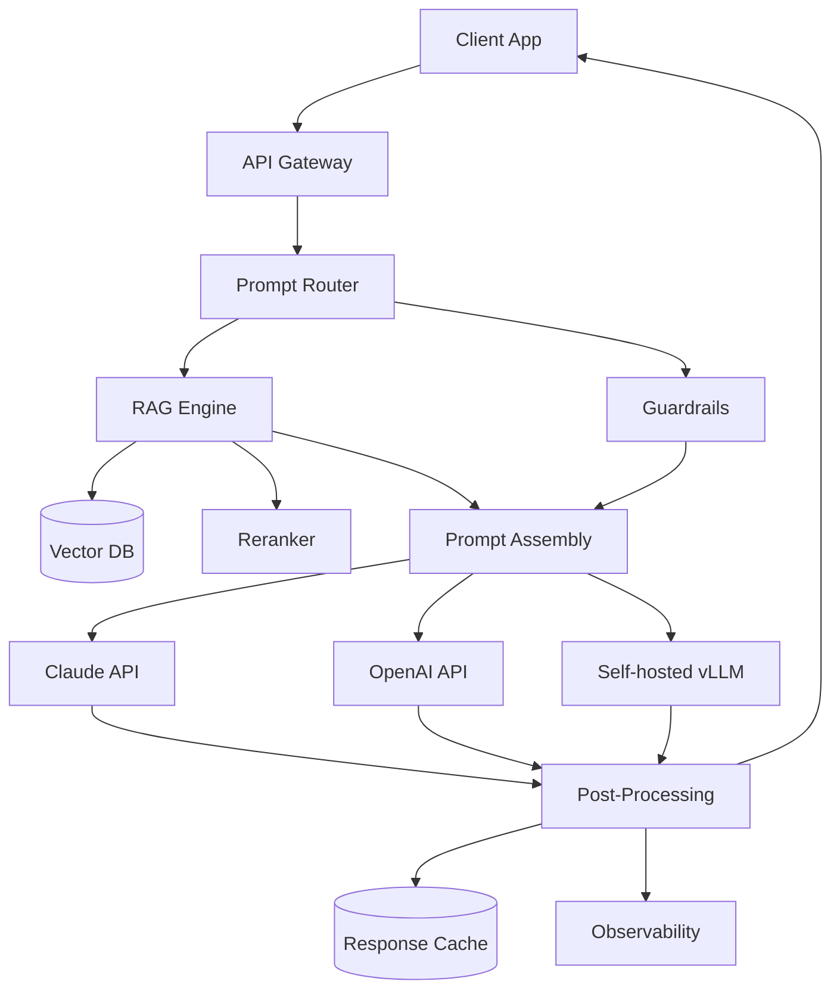
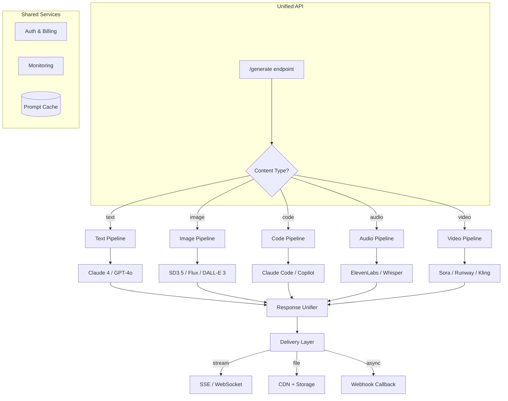
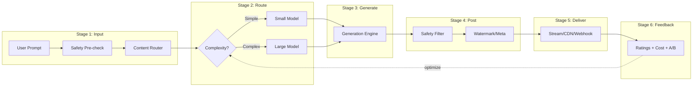

# Technical Report: Generative AI (B09)
## By Dr. Praxis (R-β) — Date: 2026-03-31

---

## 1. Architecture Overview

### 1.1 Text Generation Platform (LLM API + RAG + Guardrails)

```
┌─────────────────────────────────────────────────────────────────────┐
│                        CLIENT LAYER                                 │
│  Web App / Mobile App / CLI / API Consumer                         │
└──────────────────────────┬──────────────────────────────────────────┘
                           │ HTTPS / WebSocket (streaming)
                           ▼
┌─────────────────────────────────────────────────────────────────────┐
│                      API GATEWAY                                    │
│  Rate Limiting │ Auth (JWT/API Key) │ Request Logging │ Load Balance│
└──────────────────────────┬──────────────────────────────────────────┘
                           ▼
┌─────────────────────────────────────────────────────────────────────┐
│                   ORCHESTRATION LAYER                                │
│                                                                     │
│  ┌──────────────┐  ┌──────────────┐  ┌───────────────────┐         │
│  │ Prompt        │  │ RAG Engine   │  │ Guardrails        │         │
│  │ Router        │  │              │  │ (Input + Output)  │         │
│  │               │  │ Query→Embed  │  │                   │         │
│  │ simple→small  │  │ →VectorDB    │  │ PII detection     │         │
│  │ complex→large │  │ →Rerank      │  │ Toxicity filter   │         │
│  │ code→code     │  │ →Context     │  │ Hallucination     │         │
│  └──────┬───────┘  └──────┬───────┘  │ check             │         │
│         │                  │          └───────┬───────────┘         │
│         └──────────┬───────┘                  │                     │
│                    ▼                          │                     │
│         ┌──────────────────┐                  │                     │
│         │ Prompt Assembly  │◄─────────────────┘                     │
│         │ system + context │                                        │
│         │ + user + guard   │                                        │
│         └────────┬─────────┘                                        │
└──────────────────┼──────────────────────────────────────────────────┘
                   ▼
┌─────────────────────────────────────────────────────────────────────┐
│                    MODEL LAYER                                      │
│                                                                     │
│  ┌──────────────┐  ┌──────────────┐  ┌──────────────┐              │
│  │ Claude API   │  │ OpenAI API   │  │ Self-hosted  │              │
│  │ (Anthropic)  │  │ (GPT-4o)     │  │ vLLM/TGI    │              │
│  │              │  │              │  │ (Llama 4)    │              │
│  └──────────────┘  └──────────────┘  └──────────────┘              │
└──────────────────────────┬──────────────────────────────────────────┘
                           ▼
┌─────────────────────────────────────────────────────────────────────┐
│                   POST-PROCESSING                                   │
│  Output guardrails │ Citation injection │ Cost logging │ Caching    │
└──────────────────────────┬──────────────────────────────────────────┘
                           ▼
┌─────────────────────────────────────────────────────────────────────┐
│                   OBSERVABILITY                                     │
│  LangSmith / Phoenix │ Token usage │ Latency │ Quality scores      │
└─────────────────────────────────────────────────────────────────────┘
```



### 1.2 Image Generation Platform (Diffusion Model Serving)

```
┌──────────────────────────────────────────────────────────────────┐
│                     CLIENT / UI                                   │
│  Upload reference │ Enter prompt │ Select style │ View gallery    │
└─────────────────────────┬────────────────────────────────────────┘
                          ▼
┌──────────────────────────────────────────────────────────────────┐
│                   API + QUEUE LAYER                               │
│                                                                  │
│  ┌─────────────┐    ┌─────────────┐    ┌─────────────────┐      │
│  │ FastAPI /    │───▶│ Redis Queue │───▶│ Worker Pool     │      │
│  │ REST API     │    │ (Bull/Celery)│   │ (GPU Workers)   │      │
│  └─────────────┘    └─────────────┘    └────────┬────────┘      │
│        │                                         │               │
│        │ (polling / websocket)                   ▼               │
│        │                              ┌─────────────────┐        │
│        │                              │ Diffusion Model │        │
│        │                              │ SD3.5 / Flux /  │        │
│        │                              │ DALL-E 3 API    │        │
│        │                              └────────┬────────┘        │
│        │                                       ▼                 │
│        │                              ┌─────────────────┐        │
│        │                              │ Post-process    │        │
│        │◄─────────────────────────────│ Upscale/Safety  │        │
│        │                              │ Watermark/Meta  │        │
│        │                              └────────┬────────┘        │
└────────┼───────────────────────────────────────┼────────────────┘
         │                                       ▼
         │                              ┌─────────────────┐
         │                              │ Object Storage  │
         │                              │ S3 / R2 / GCS   │
         │                              │ + CDN            │
         └──────────────────────────────│ Gallery DB       │
                                        └─────────────────┘
```

### 1.3 Multimodal Generation Platform (Unified)



```
┌─────────────────────────────────────────────────────────────────┐
│                  UNIFIED GENERATION API                          │
│  POST /v1/generate { type, prompt, params, webhook? }           │
├─────────────────────────────────────────────────────────────────┤
│  Router: text→LLM | image→Diffusion | code→CodeLLM | audio→TTS │
├─────────┬──────────┬──────────┬───────────┬─────────────────────┤
│  Text   │  Image   │  Code    │  Audio    │  Video              │
│  Stream │  Queue   │  Stream  │  Queue    │  Async+Webhook      │
│  ~2s    │  ~10s    │  ~3s     │  ~5s      │  ~60-300s           │
├─────────┴──────────┴──────────┴───────────┴─────────────────────┤
│  Shared: Auth │ Rate Limit │ Cost Track │ Cache │ Monitor       │
└─────────────────────────────────────────────────────────────────┘
```

---

## 2. Tech Stack Recommendation

### 2.1 LLM Providers (API)

| Name | Category | Description | Use Case | Alternatives | Link |
|------|----------|-------------|----------|--------------|------|
| **Anthropic Claude 4** | Commercial LLM API | State-of-the-art reasoning, 1M context window, strong safety alignment | Complex analysis, long-doc processing, coding, Vietnamese support | GPT-4o, Gemini 2.5 | https://anthropic.com |
| **OpenAI GPT-4o** | Commercial LLM API | Multimodal (text+vision+audio), fast, broad ecosystem | General-purpose generation, vision tasks, function calling | Claude 4, Gemini 2.5 | https://openai.com |
| **Google Gemini 2.5 Pro** | Commercial LLM API | 2M context, strong multimodal, competitive pricing | Long documents, multimodal workflows, Google Cloud integration | Claude 4, GPT-4o | https://ai.google.dev |
| **Groq** | Fast inference API | Ultra-low latency inference via custom LPU hardware | Real-time applications, chatbots needing <100ms TTFT | Together AI, Fireworks | https://groq.com |

### 2.2 Open-Weight Models (Self-Hosted)

| Name | Category | Description | Use Case | Alternatives | Link |
|------|----------|-------------|----------|--------------|------|
| **Llama 4 (405B/70B/8B)** | Open-weight LLM | Meta's flagship open model family, strong multilingual | On-prem deployment, data-sovereign use cases, fine-tuning | Mistral Large, Qwen 2.5 | https://llama.meta.com |
| **Mistral Large 2** | Open-weight LLM | European-developed, strong reasoning, efficient architecture | EU data compliance, multilingual European + Asian languages | Llama 4, Command R+ | https://mistral.ai |
| **Qwen 2.5 (72B)** | Open-weight LLM | Alibaba's model, excellent CJK + Vietnamese language support | Asian-market applications, Vietnamese content generation | Llama 4, Vistral | https://qwenlm.github.io |
| **Vistral / PhoGPT** | Vietnamese LLM | Vietnamese-specific language models | Vietnamese-first applications, local compliance | Qwen 2.5, fine-tuned Llama | https://github.com/VinAIResearch |

### 2.3 Image Generation

| Name | Category | Description | Use Case | Alternatives | Link |
|------|----------|-------------|----------|--------------|------|
| **Stable Diffusion 3.5** | Open-weight diffusion | High-quality text-to-image, self-hostable, ControlNet support | Custom pipelines, product imagery, fine-tuning on brand assets | Flux, DALL-E 3 | https://stability.ai |
| **Flux (Black Forest Labs)** | Open-weight flow matching | Excellent prompt adherence, fast generation | High-fidelity image generation, artistic content | SD3.5, Midjourney | https://blackforestlabs.ai |
| **DALL-E 3** | Commercial API | OpenAI's image generation, native GPT integration | Quick prototyping, ChatGPT-integrated workflows | Midjourney, SD3.5 | https://openai.com |
| **Midjourney v7** | Commercial (Discord/API) | Best aesthetic quality, strong stylistic control | Marketing visuals, concept art, design exploration | DALL-E 3, Flux | https://midjourney.com |
| **ComfyUI** | Workflow engine | Node-based UI for building complex image gen pipelines | Custom workflows, inpainting, ControlNet chains, batch processing | A1111, Invoke AI | https://github.com/comfyanonymous/ComfyUI |

### 2.4 Video Generation

| Name | Category | Description | Use Case | Alternatives | Link |
|------|----------|-------------|----------|--------------|------|
| **Sora (OpenAI)** | Commercial API | High-fidelity text-to-video, up to 60s | Marketing videos, explainer content | Runway Gen-3, Kling 2 | https://openai.com/sora |
| **Runway Gen-3 Alpha** | Commercial API | Professional video generation + editing | Film/advertising production, video effects | Sora, Kling 2 | https://runway.ml |
| **Kling 2 (Kuaishou)** | Commercial API | Competitive quality, strong motion coherence | Cost-effective video generation, Asian market content | Sora, Veo 2 | https://kling.kuaishou.com |

### 2.5 Code Generation

| Name | Category | Description | Use Case | Alternatives | Link |
|------|----------|-------------|----------|--------------|------|
| **Claude Code** | CLI agent | Agentic coding assistant, edits files, runs commands | Full-stack development, refactoring, debugging | Cursor, Copilot | https://claude.ai |
| **GitHub Copilot X** | IDE integration | Inline code completion, chat, PR summaries | Day-to-day coding assistance, code review | Claude Code, Cursor | https://github.com/features/copilot |
| **Cursor** | AI-first IDE | Full IDE with multi-file editing, codebase-aware context | Complex multi-file refactors, new feature development | Claude Code, Copilot | https://cursor.com |

### 2.6 Embedding Models

| Name | Category | Description | Use Case | Alternatives | Link |
|------|----------|-------------|----------|--------------|------|
| **OpenAI text-embedding-3-large** | Commercial embedding | 3072-dim, strong multilingual, Matryoshka support | RAG, semantic search, clustering | Cohere Embed v3, Voyage | https://openai.com |
| **Cohere Embed v3** | Commercial embedding | Excellent multilingual, compression-friendly | Multilingual RAG, Vietnamese content retrieval | OpenAI, BGE-M3 | https://cohere.com |
| **BGE-M3 (BAAI)** | Open-weight embedding | Dense + sparse + ColBERT in one model, self-hostable | On-prem RAG, hybrid search, data-sovereign deployments | E5-Mistral, GTE | https://huggingface.co/BAAI/bge-m3 |

### 2.7 Vector Databases

| Name | Category | Description | Use Case | Alternatives | Link |
|------|----------|-------------|----------|--------------|------|
| **Qdrant** | Vector DB | Rust-based, fast, rich filtering, hybrid search | Production RAG, metadata-heavy filtering | Weaviate, Pinecone | https://qdrant.tech |
| **Pinecone** | Managed vector DB | Fully managed, serverless option, simple API | Quick RAG setup, serverless deployments | Qdrant, Weaviate | https://pinecone.io |
| **pgvector** | Postgres extension | Vector search in existing Postgres, HNSW index | Teams already on Postgres, simpler deployments | Qdrant, Pinecone | https://github.com/pgvector/pgvector |
| **ChromaDB** | Lightweight vector DB | Embedded, Python-native, good for prototyping | Local development, small-scale RAG, prototypes | LanceDB, SQLite-VSS | https://trychroma.com |

### 2.8 Orchestration Frameworks

| Name | Category | Description | Use Case | Alternatives | Link |
|------|----------|-------------|----------|--------------|------|
| **LangChain** | LLM orchestration | Chains, agents, tools, broad integrations | Complex multi-step LLM workflows, agent systems | LlamaIndex, Haystack | https://langchain.com |
| **LlamaIndex** | Data + LLM framework | Best-in-class RAG, data connectors, index management | RAG-heavy applications, document Q&A | LangChain, Haystack | https://llamaindex.ai |
| **Claude Agent SDK** | Agent framework | Anthropic's official agent orchestration SDK | Building Claude-powered agents, tool use | LangChain, CrewAI | https://github.com/anthropics/claude-code |
| **Instructor** | Structured output | Pydantic-validated LLM responses, retry logic | Structured data extraction, form filling, classification | Outlines, Marvin | https://github.com/jxnl/instructor |

### 2.9 Serving Infrastructure

| Name | Category | Description | Use Case | Alternatives | Link |
|------|----------|-------------|----------|--------------|------|
| **vLLM** | LLM serving engine | PagedAttention, continuous batching, high throughput | Production self-hosted LLM serving | TGI, TensorRT-LLM | https://vllm.ai |
| **TGI (Text Generation Inference)** | LLM serving engine | HuggingFace's server, flash attention, quantization | HuggingFace ecosystem deployments | vLLM, TensorRT-LLM | https://github.com/huggingface/text-generation-inference |
| **Replicate** | Model hosting | One-click model deployment, pay-per-use GPU | Quick deployment of SD/Flux, prototyping | Modal, RunPod | https://replicate.com |
| **Modal** | Serverless GPU | Serverless GPU functions, auto-scaling, container-based | Burst GPU workloads, batch image generation | Replicate, RunPod | https://modal.com |

### 2.10 Monitoring & Observability

| Name | Category | Description | Use Case | Alternatives | Link |
|------|----------|-------------|----------|--------------|------|
| **LangSmith** | LLM observability | Trace chains, evaluate outputs, dataset management | LangChain-based apps, prompt debugging | Phoenix, Langfuse | https://smith.langchain.com |
| **Arize Phoenix** | Open-source LLM observability | Tracing, evals, embeddings analysis, self-hostable | Self-hosted monitoring, framework-agnostic | LangSmith, Langfuse | https://phoenix.arize.com |
| **Langfuse** | Open-source LLM analytics | Cost tracking, latency, quality scoring, prompt management | Cost optimization, A/B testing prompts | LangSmith, Phoenix | https://langfuse.com |

### 2.11 Vietnamese-Specific Tools

| Name | Category | Description | Use Case | Alternatives | Link |
|------|----------|-------------|----------|--------------|------|
| **Vistral (VinAI)** | Vietnamese LLM | Pre-trained on Vietnamese corpus, understands local context | Vietnamese chatbots, content generation | PhoGPT, fine-tuned Qwen | https://github.com/VinAIResearch |
| **PhoBERT** | Vietnamese encoder | BERT for Vietnamese, excellent for NLU tasks | Vietnamese text classification, NER, embeddings | ViSoBERT, XLM-R | https://github.com/VinAIResearch/PhoBERT |
| **Underthesea** | Vietnamese NLP toolkit | Tokenization, POS, NER, dependency parsing for Vietnamese | Vietnamese text preprocessing for gen AI pipelines | VnCoreNLP, pyvi | https://github.com/undertheseanlp/underthesea |
| **VietTTS** | Vietnamese TTS | Text-to-speech optimized for Vietnamese tones | Vietnamese voice generation, accessibility | Zalo TTS API | https://github.com/NTT123/vietTTS |

---

## 3. Pipeline Design

### 3.1 Full Generation Pipeline

```
┌─────────────────────────────────────────────────────────────────────┐
│  STAGE 1: INPUT PROCESSING                                          │
│                                                                     │
│  User Prompt ──▶ Language Detection ──▶ Prompt Parsing ──▶ Safety   │
│                  (vi/en/auto)          (intent, params)   Pre-check │
│                                                           (PII,     │
│                                                            jailbreak│
│                                                            detection)│
│                       │                                             │
│                       ▼                                             │
│               Content Type Router                                   │
│               ├── text    ──▶ LLM Pipeline                          │
│               ├── image   ──▶ Diffusion Pipeline                    │
│               ├── code    ──▶ Code Pipeline                         │
│               ├── audio   ──▶ TTS Pipeline                          │
│               └── video   ──▶ Video Pipeline                        │
└─────────────────────────────────────────────────────────────────────┘
                          │
                          ▼
┌─────────────────────────────────────────────────────────────────────┐
│  STAGE 2: MODEL SELECTION & ROUTING                                 │
│                                                                     │
│  Complexity Classifier:                                             │
│  ┌───────────────────┬────────────────┬──────────────────────┐      │
│  │ Simple (greeting, │ Medium (Q&A,   │ Complex (analysis,   │      │
│  │ lookup, classify) │ summarize,     │ creative writing,    │      │
│  │                   │ translate)     │ multi-step reasoning)│      │
│  │ ▼                 │ ▼              │ ▼                    │      │
│  │ Llama 8B / Haiku  │ Claude Sonnet  │ Claude Opus / GPT-4o│      │
│  │ ~$0.08/1M tokens  │ ~$3/1M tokens  │ ~$15/1M tokens      │      │
│  └───────────────────┴────────────────┴──────────────────────┘      │
│                                                                     │
│  For images: prompt complexity → steps (20-50) + model (SD/Flux)    │
│  For code: language detection → specialized model routing            │
└─────────────────────────────────────────────────────────────────────┘
                          │
                          ▼
┌─────────────────────────────────────────────────────────────────────┐
│  STAGE 3: GENERATION                                                │
│                                                                     │
│  Text (Autoregressive):                                             │
│    prompt → tokenize → KV-cache → sample (top-p, temp) → decode    │
│    Streaming: yield tokens via SSE as they are generated            │
│                                                                     │
│  Image (Diffusion):                                                 │
│    prompt → CLIP encode → noise init → denoise (20-50 steps)       │
│    → VAE decode → pixel image                                      │
│    Progressive: send low-res preview at step 10, full at completion │
│                                                                     │
│  Code (Completion):                                                 │
│    context + instruction → fill-in-middle / completion → parse AST  │
│    Streaming: yield code blocks, syntax-highlight on client         │
│                                                                     │
│  Audio (TTS):                                                       │
│    text → phoneme → mel spectrogram → vocoder → WAV/MP3            │
│                                                                     │
│  Video (Diffusion/Autoregressive):                                  │
│    prompt → temporal planning → frame-by-frame diffusion → encode   │
│    Async: submit job → webhook on completion                        │
└─────────────────────────────────────────────────────────────────────┘
                          │
                          ▼
┌─────────────────────────────────────────────────────────────────────┐
│  STAGE 4: POST-PROCESSING                                           │
│                                                                     │
│  Text:    safety filter → fact-check (optional) → citation inject   │
│  Image:   NSFW classifier → watermark (C2PA) → metadata embed      │
│  Code:    linter/formatter → security scan (Semgrep) → test gen     │
│  Audio:   noise filter → normalize volume → watermark               │
│  Video:   frame safety check → watermark → compress                 │
└─────────────────────────────────────────────────────────────────────┘
                          │
                          ▼
┌─────────────────────────────────────────────────────────────────────┐
│  STAGE 5: DELIVERY                                                  │
│                                                                     │
│  Text:   SSE stream → client renders token-by-token                 │
│  Image:  progressive JPEG → CDN URL → gallery DB entry              │
│  Code:   streamed blocks → syntax-highlighted in IDE                │
│  Audio:  chunked audio stream → or full file download               │
│  Video:  webhook notification → signed URL → progressive download   │
└─────────────────────────────────────────────────────────────────────┘
                          │
                          ▼
┌─────────────────────────────────────────────────────────────────────┐
│  STAGE 6: FEEDBACK & OPTIMIZATION                                   │
│                                                                     │
│  User ratings (thumbs up/down) ──▶ Quality DB                       │
│  Token/cost tracking ──▶ Billing system                             │
│  Latency metrics ──▶ Prometheus/Grafana                             │
│  A/B testing (prompt variants) ──▶ Experiment tracker               │
│  Prompt cache hit rates ──▶ Cache optimization                      │
│  Model routing accuracy ──▶ Router retraining                       │
└─────────────────────────────────────────────────────────────────────┘
```



---

## 4. Mini Examples

### Example 1: Quick Start — Build an AI Writing Assistant with Claude API
**Level:** Beginner | **Time:** 30 minutes

#### Step 1: Project Setup

```bash
mkdir ai-writer && cd ai-writer
python -m venv venv && source venv/bin/activate
pip install fastapi uvicorn anthropic python-dotenv
```

```
ai-writer/
├── main.py
├── .env
└── requirements.txt
```

#### Step 2: Environment Configuration

```env
# .env
ANTHROPIC_API_KEY=sk-ant-xxxxxxxxxxxxx
```

```txt
# requirements.txt
fastapi==0.115.0
uvicorn==0.32.0
anthropic==0.42.0
python-dotenv==1.0.1
```

#### Step 3: Core Application with Streaming

```python
# main.py
import os
from dotenv import load_dotenv
from fastapi import FastAPI, Request
from fastapi.responses import StreamingResponse, HTMLResponse
from anthropic import Anthropic

load_dotenv()

app = FastAPI(title="AI Writing Assistant")
client = Anthropic(api_key=os.getenv("ANTHROPIC_API_KEY"))

# System prompt defines the assistant's personality and capabilities
SYSTEM_PROMPT = """You are a professional writing assistant. You help users with:
- Blog posts, articles, and essays
- Marketing copy and social media content
- Email drafts and business communication
- Creative writing and storytelling

Guidelines:
- Write in the user's requested language (default: English)
- Match the requested tone (formal, casual, persuasive, etc.)
- Structure content with clear headings and paragraphs
- Ask clarifying questions if the request is ambiguous
"""

TONE_PRESETS = {
    "professional": "Use formal language, data-driven arguments, and authoritative tone.",
    "casual": "Use conversational language, contractions, and a friendly tone.",
    "persuasive": "Use compelling arguments, emotional appeals, and strong CTAs.",
    "academic": "Use scholarly language, citations style, and objective analysis.",
}


@app.post("/generate")
async def generate_text(request: Request):
    """Generate text with streaming response."""
    body = await request.json()
    user_prompt = body.get("prompt", "")
    tone = body.get("tone", "professional")
    max_tokens = body.get("max_tokens", 2048)

    tone_instruction = TONE_PRESETS.get(tone, TONE_PRESETS["professional"])
    full_system = f"{SYSTEM_PROMPT}\n\nTone: {tone_instruction}"

    async def stream_response():
        with client.messages.stream(
            model="claude-sonnet-4-20250514",
            max_tokens=max_tokens,
            system=full_system,
            messages=[{"role": "user", "content": user_prompt}],
        ) as stream:
            for text in stream.text_stream:
                yield f"data: {text}\n\n"
        yield "data: [DONE]\n\n"

    return StreamingResponse(
        stream_response(),
        media_type="text/event-stream",
        headers={"Cache-Control": "no-cache", "X-Accel-Buffering": "no"},
    )


@app.get("/", response_class=HTMLResponse)
async def ui():
    """Minimal UI for testing."""
    return """
    <!DOCTYPE html>
    <html>
    <head><title>AI Writer</title>
    <style>
        body { font-family: system-ui; max-width: 800px; margin: 2rem auto; padding: 0 1rem; }
        textarea { width: 100%; height: 100px; margin: 0.5rem 0; padding: 0.5rem; }
        select, button { padding: 0.5rem 1rem; margin: 0.25rem; }
        #output { white-space: pre-wrap; border: 1px solid #ddd; padding: 1rem;
                  min-height: 200px; margin-top: 1rem; border-radius: 4px; }
    </style></head>
    <body>
        <h1>AI Writing Assistant</h1>
        <textarea id="prompt" placeholder="Describe what you want to write..."></textarea>
        <div>
            <select id="tone">
                <option value="professional">Professional</option>
                <option value="casual">Casual</option>
                <option value="persuasive">Persuasive</option>
                <option value="academic">Academic</option>
            </select>
            <button onclick="generate()">Generate</button>
        </div>
        <div id="output"></div>
        <script>
        async function generate() {
            const output = document.getElementById('output');
            output.textContent = '';
            const resp = await fetch('/generate', {
                method: 'POST',
                headers: {'Content-Type': 'application/json'},
                body: JSON.stringify({
                    prompt: document.getElementById('prompt').value,
                    tone: document.getElementById('tone').value
                })
            });
            const reader = resp.body.getReader();
            const decoder = new TextDecoder();
            while (true) {
                const {done, value} = await reader.read();
                if (done) break;
                const text = decoder.decode(value);
                for (const line of text.split('\\n')) {
                    if (line.startsWith('data: ') && line !== 'data: [DONE]') {
                        output.textContent += line.slice(6);
                    }
                }
            }
        }
        </script>
    </body></html>
    """
```

#### Step 4: Run and Test

```bash
uvicorn main:app --reload --port 8000
```

```bash
# Test via curl with streaming
curl -N -X POST http://localhost:8000/generate \
  -H "Content-Type: application/json" \
  -d '{"prompt": "Write a 200-word blog intro about AI in 2026", "tone": "casual"}'
```

#### Step 5: Add Conversation Memory (Multi-Turn)

```python
# Add to main.py - conversation memory via in-memory store
from collections import defaultdict
import uuid

conversations: dict[str, list] = defaultdict(list)


@app.post("/chat")
async def chat(request: Request):
    body = await request.json()
    conv_id = body.get("conversation_id", str(uuid.uuid4()))
    user_msg = body.get("message", "")

    conversations[conv_id].append({"role": "user", "content": user_msg})

    # Keep last 20 messages to manage context window
    messages = conversations[conv_id][-20:]

    async def stream_response():
        full_response = ""
        with client.messages.stream(
            model="claude-sonnet-4-20250514",
            max_tokens=2048,
            system=SYSTEM_PROMPT,
            messages=messages,
        ) as stream:
            for text in stream.text_stream:
                full_response += text
                yield f"data: {text}\n\n"
        conversations[conv_id].append(
            {"role": "assistant", "content": full_response}
        )
        yield f"data: [DONE]\n\n"

    return StreamingResponse(
        stream_response(),
        media_type="text/event-stream",
        headers={"X-Conversation-ID": conv_id},
    )
```

#### Step 6: Add Basic Guardrails

```python
# guardrails.py
import re

BLOCKED_PATTERNS = [
    r"ignore (?:all )?(?:previous |above )?instructions",
    r"you are now",
    r"act as (?:a )?(?:different|new)",
    r"system prompt",
    r"reveal your instructions",
]

PII_PATTERNS = {
    "email": r"[a-zA-Z0-9._%+-]+@[a-zA-Z0-9.-]+\.[a-zA-Z]{2,}",
    "phone_vn": r"(?:\+84|0)\d{9,10}",
    "ssn": r"\d{3}-\d{2}-\d{4}",
    "credit_card": r"\d{4}[\s-]?\d{4}[\s-]?\d{4}[\s-]?\d{4}",
}


def check_prompt_injection(text: str) -> bool:
    """Returns True if prompt injection is detected."""
    lower = text.lower()
    return any(re.search(p, lower) for p in BLOCKED_PATTERNS)


def detect_pii(text: str) -> dict[str, list[str]]:
    """Returns dict of PII type -> matches found."""
    found = {}
    for pii_type, pattern in PII_PATTERNS.items():
        matches = re.findall(pattern, text)
        if matches:
            found[pii_type] = matches
    return found


def sanitize_output(text: str) -> str:
    """Redact PII from generated output."""
    for pii_type, pattern in PII_PATTERNS.items():
        text = re.sub(pattern, f"[REDACTED_{pii_type.upper()}]", text)
    return text
```

#### Step 7: Wire Guardrails into the API

```python
# Update the generate endpoint in main.py
from guardrails import check_prompt_injection, detect_pii, sanitize_output
from fastapi import HTTPException


@app.post("/generate-safe")
async def generate_safe(request: Request):
    body = await request.json()
    user_prompt = body.get("prompt", "")

    # Input guardrails
    if check_prompt_injection(user_prompt):
        raise HTTPException(status_code=400, detail="Prompt injection detected")

    pii = detect_pii(user_prompt)
    if pii:
        raise HTTPException(
            status_code=400,
            detail=f"PII detected in prompt: {list(pii.keys())}. Please remove before sending.",
        )

    # Generation (same as before)
    async def stream_response():
        with client.messages.stream(
            model="claude-sonnet-4-20250514",
            max_tokens=body.get("max_tokens", 2048),
            system=SYSTEM_PROMPT,
            messages=[{"role": "user", "content": user_prompt}],
        ) as stream:
            for text in stream.text_stream:
                clean = sanitize_output(text)
                yield f"data: {clean}\n\n"
        yield "data: [DONE]\n\n"

    return StreamingResponse(stream_response(), media_type="text/event-stream")
```

---

### Example 2: Production — Multi-Modal Content Generation Platform
**Level:** Advanced | **Time:** 4 hours

#### Architecture

```
┌─────────────────────────────────────────────────────────────┐
│                    Next.js Frontend                          │
│  Text Editor │ Image Gallery │ Cost Dashboard │ API Keys     │
└──────────┬──────────────────────────────────────────────────┘
           │
           ▼
┌─────────────────────────────────────────────────────────────┐
│                   FastAPI Backend                            │
│  /v1/generate/text    (streaming SSE)                       │
│  /v1/generate/image   (async, returns job_id)               │
│  /v1/generate/code    (streaming SSE)                       │
│  /v1/jobs/{id}        (poll status)                         │
│  /v1/gallery          (list generated assets)               │
│  /v1/usage            (cost & token tracking)               │
├─────────────────────────────────────────────────────────────┤
│  Auth (API Key per tenant) │ Rate Limiter │ Cost Tracker     │
└────┬──────────┬──────────┬──────────────────────────────────┘
     │          │          │
     ▼          ▼          ▼
┌────────┐ ┌────────┐ ┌────────────┐
│Claude  │ │Replicate│ │Redis Queue │
│API     │ │(SD3.5) │ │+ Workers   │
│(text)  │ │(image) │ │(async jobs)│
└────────┘ └────────┘ └─────┬──────┘
                            │
                    ┌───────┴───────┐
                    │  S3 / R2      │
                    │  Asset Storage│
                    └───────────────┘
```

#### Step 1: Project Structure

```
multimodal-platform/
├── app/
│   ├── __init__.py
│   ├── main.py              # FastAPI app
│   ├── config.py             # Settings
│   ├── models.py             # Pydantic schemas
│   ├── routers/
│   │   ├── text.py           # Text generation
│   │   ├── image.py          # Image generation
│   │   └── code.py           # Code generation
│   ├── services/
│   │   ├── llm.py            # LLM abstraction
│   │   ├── image_gen.py      # Image gen abstraction
│   │   └── cost_tracker.py   # Usage & billing
│   ├── workers/
│   │   └── image_worker.py   # Async image generation
│   ├── middleware/
│   │   ├── auth.py           # Multi-tenant auth
│   │   └── rate_limit.py     # Rate limiting
│   └── storage/
│       └── s3.py             # Asset storage
├── docker-compose.yml
├── .env
└── requirements.txt
```

#### Step 2: Configuration & Models

```python
# app/config.py
from pydantic_settings import BaseSettings


class Settings(BaseSettings):
    anthropic_api_key: str
    openai_api_key: str
    replicate_api_token: str
    redis_url: str = "redis://localhost:6379"
    s3_bucket: str = "gen-ai-assets"
    s3_endpoint: str = ""  # For R2/MinIO
    s3_access_key: str = ""
    s3_secret_key: str = ""
    database_url: str = "postgresql://localhost/genai"

    # Rate limits per tier
    rate_limit_free: int = 10       # requests per minute
    rate_limit_pro: int = 100
    rate_limit_enterprise: int = 1000

    # Cost caps (USD per month)
    cost_cap_free: float = 5.0
    cost_cap_pro: float = 100.0
    cost_cap_enterprise: float = 10000.0

    class Config:
        env_file = ".env"


settings = Settings()
```

```python
# app/models.py
from pydantic import BaseModel, Field
from enum import Enum
from datetime import datetime


class GenerationType(str, Enum):
    TEXT = "text"
    IMAGE = "image"
    CODE = "code"


class TextRequest(BaseModel):
    prompt: str = Field(..., max_length=10000)
    model: str = "claude-sonnet-4-20250514"
    max_tokens: int = Field(default=2048, le=8192)
    temperature: float = Field(default=0.7, ge=0.0, le=1.0)
    system_prompt: str | None = None
    stream: bool = True


class ImageRequest(BaseModel):
    prompt: str = Field(..., max_length=2000)
    model: str = "stability-ai/stable-diffusion-3.5-large"
    width: int = Field(default=1024, ge=256, le=2048)
    height: int = Field(default=1024, ge=256, le=2048)
    num_images: int = Field(default=1, ge=1, le=4)
    style: str | None = None


class CodeRequest(BaseModel):
    prompt: str = Field(..., max_length=10000)
    language: str = "python"
    context: str | None = None  # surrounding code
    model: str = "claude-sonnet-4-20250514"
    max_tokens: int = Field(default=4096, le=8192)


class JobStatus(str, Enum):
    PENDING = "pending"
    PROCESSING = "processing"
    COMPLETED = "completed"
    FAILED = "failed"


class Job(BaseModel):
    id: str
    type: GenerationType
    status: JobStatus
    created_at: datetime
    completed_at: datetime | None = None
    result_urls: list[str] = []
    error: str | None = None
    cost_usd: float = 0.0


class UsageRecord(BaseModel):
    tenant_id: str
    type: GenerationType
    model: str
    input_tokens: int = 0
    output_tokens: int = 0
    cost_usd: float
    timestamp: datetime
```

#### Step 3: Multi-Tenant Auth & Rate Limiting

```python
# app/middleware/auth.py
from fastapi import Security, HTTPException, Depends
from fastapi.security import APIKeyHeader
from app.config import settings

api_key_header = APIKeyHeader(name="X-API-Key")

# In production, this would be a database lookup
TENANTS = {
    "key_free_demo_123": {"tenant_id": "demo", "tier": "free"},
    "key_pro_acme_456": {"tenant_id": "acme", "tier": "pro"},
    "key_ent_corp_789": {"tenant_id": "bigcorp", "tier": "enterprise"},
}


async def get_current_tenant(api_key: str = Security(api_key_header)):
    tenant = TENANTS.get(api_key)
    if not tenant:
        raise HTTPException(status_code=401, detail="Invalid API key")
    return tenant
```

```python
# app/middleware/rate_limit.py
import time
import redis.asyncio as redis
from fastapi import HTTPException, Request
from app.config import settings

redis_client = redis.from_url(settings.redis_url)

TIER_LIMITS = {
    "free": settings.rate_limit_free,
    "pro": settings.rate_limit_pro,
    "enterprise": settings.rate_limit_enterprise,
}


async def check_rate_limit(tenant: dict):
    tier = tenant["tier"]
    tenant_id = tenant["tenant_id"]
    limit = TIER_LIMITS[tier]
    key = f"rate:{tenant_id}:{int(time.time()) // 60}"

    current = await redis_client.incr(key)
    if current == 1:
        await redis_client.expire(key, 60)

    if current > limit:
        raise HTTPException(
            status_code=429,
            detail=f"Rate limit exceeded ({limit}/min for {tier} tier)",
        )
```

#### Step 4: Cost Tracking Service

```python
# app/services/cost_tracker.py
from datetime import datetime, timezone
from collections import defaultdict
import json
import redis.asyncio as redis
from app.config import settings
from app.models import UsageRecord, GenerationType

redis_client = redis.from_url(settings.redis_url)

# Cost per 1M tokens (USD) - as of Q1 2026
MODEL_COSTS = {
    "claude-sonnet-4-20250514": {"input": 3.00, "output": 15.00},
    "claude-haiku-3-5-20241022": {"input": 0.25, "output": 1.25},
    "claude-opus-4-20250514": {"input": 15.00, "output": 75.00},
    "gpt-4o": {"input": 2.50, "output": 10.00},
    "gpt-4o-mini": {"input": 0.15, "output": 0.60},
}

IMAGE_COSTS = {
    "stability-ai/stable-diffusion-3.5-large": 0.035,  # per image
    "black-forest-labs/flux-1.1-pro": 0.040,
    "dall-e-3": {"1024x1024": 0.040, "1024x1792": 0.080},
}

TIER_CAPS = {
    "free": settings.cost_cap_free,
    "pro": settings.cost_cap_pro,
    "enterprise": settings.cost_cap_enterprise,
}


async def calculate_llm_cost(
    model: str, input_tokens: int, output_tokens: int
) -> float:
    costs = MODEL_COSTS.get(model, {"input": 5.0, "output": 15.0})
    return (input_tokens * costs["input"] + output_tokens * costs["output"]) / 1_000_000


async def calculate_image_cost(model: str, num_images: int, size: str = "1024x1024") -> float:
    cost_info = IMAGE_COSTS.get(model, 0.04)
    if isinstance(cost_info, dict):
        per_image = cost_info.get(size, 0.04)
    else:
        per_image = cost_info
    return per_image * num_images


async def record_usage(tenant_id: str, record: UsageRecord):
    month_key = f"usage:{tenant_id}:{datetime.now(timezone.utc).strftime('%Y-%m')}"
    await redis_client.rpush(month_key, record.model_dump_json())
    await redis_client.incrbyfloat(f"{month_key}:total", record.cost_usd)
    await redis_client.expire(month_key, 90 * 86400)  # 90 day retention


async def check_cost_cap(tenant_id: str, tier: str) -> tuple[float, float]:
    """Returns (current_spend, cap). Raises if over cap."""
    month_key = f"usage:{tenant_id}:{datetime.now(timezone.utc).strftime('%Y-%m')}:total"
    current = float(await redis_client.get(month_key) or 0)
    cap = TIER_CAPS[tier]
    if current >= cap:
        from fastapi import HTTPException
        raise HTTPException(
            status_code=402,
            detail=f"Monthly cost cap reached (${current:.2f}/${cap:.2f})",
        )
    return current, cap
```

#### Step 5: Text Generation Router (Streaming)

```python
# app/routers/text.py
from fastapi import APIRouter, Depends, HTTPException
from fastapi.responses import StreamingResponse
from anthropic import Anthropic
from datetime import datetime, timezone
from app.config import settings
from app.models import TextRequest, UsageRecord, GenerationType
from app.middleware.auth import get_current_tenant
from app.middleware.rate_limit import check_rate_limit
from app.services.cost_tracker import (
    calculate_llm_cost, record_usage, check_cost_cap
)

router = APIRouter(prefix="/v1/generate/text", tags=["text"])
client = Anthropic(api_key=settings.anthropic_api_key)


@router.post("")
async def generate_text(req: TextRequest, tenant=Depends(get_current_tenant)):
    await check_rate_limit(tenant)
    await check_cost_cap(tenant["tenant_id"], tenant["tier"])

    system = req.system_prompt or "You are a helpful AI writing assistant."

    if req.stream:
        async def stream():
            input_tokens = 0
            output_tokens = 0
            with client.messages.stream(
                model=req.model,
                max_tokens=req.max_tokens,
                temperature=req.temperature,
                system=system,
                messages=[{"role": "user", "content": req.prompt}],
            ) as response:
                for text in response.text_stream:
                    yield f"data: {text}\n\n"
                # Get final usage from the response
                final = response.get_final_message()
                input_tokens = final.usage.input_tokens
                output_tokens = final.usage.output_tokens

            cost = await calculate_llm_cost(req.model, input_tokens, output_tokens)
            await record_usage(tenant["tenant_id"], UsageRecord(
                tenant_id=tenant["tenant_id"],
                type=GenerationType.TEXT,
                model=req.model,
                input_tokens=input_tokens,
                output_tokens=output_tokens,
                cost_usd=cost,
                timestamp=datetime.now(timezone.utc),
            ))
            yield f"data: {{\"done\": true, \"usage\": {{\"input_tokens\": {input_tokens}, \"output_tokens\": {output_tokens}, \"cost_usd\": {cost:.6f}}}}}\n\n"

        return StreamingResponse(stream(), media_type="text/event-stream")
    else:
        response = client.messages.create(
            model=req.model,
            max_tokens=req.max_tokens,
            temperature=req.temperature,
            system=system,
            messages=[{"role": "user", "content": req.prompt}],
        )
        cost = await calculate_llm_cost(
            req.model, response.usage.input_tokens, response.usage.output_tokens
        )
        await record_usage(tenant["tenant_id"], UsageRecord(
            tenant_id=tenant["tenant_id"],
            type=GenerationType.TEXT,
            model=req.model,
            input_tokens=response.usage.input_tokens,
            output_tokens=response.usage.output_tokens,
            cost_usd=cost,
            timestamp=datetime.now(timezone.utc),
        ))
        return {
            "content": response.content[0].text,
            "usage": {
                "input_tokens": response.usage.input_tokens,
                "output_tokens": response.usage.output_tokens,
                "cost_usd": round(cost, 6),
            },
        }
```

#### Step 6: Image Generation Router (Async Queue)

```python
# app/routers/image.py
import uuid
import json
from datetime import datetime, timezone
from fastapi import APIRouter, Depends
from app.models import ImageRequest, Job, JobStatus, GenerationType
from app.middleware.auth import get_current_tenant
from app.middleware.rate_limit import check_rate_limit
from app.services.cost_tracker import check_cost_cap
import redis.asyncio as redis
from app.config import settings

router = APIRouter(prefix="/v1/generate/image", tags=["image"])
redis_client = redis.from_url(settings.redis_url)


@router.post("", response_model=Job)
async def generate_image(req: ImageRequest, tenant=Depends(get_current_tenant)):
    await check_rate_limit(tenant)
    await check_cost_cap(tenant["tenant_id"], tenant["tier"])

    job_id = str(uuid.uuid4())
    job = Job(
        id=job_id,
        type=GenerationType.IMAGE,
        status=JobStatus.PENDING,
        created_at=datetime.now(timezone.utc),
    )

    # Store job metadata
    await redis_client.set(f"job:{job_id}", job.model_dump_json(), ex=86400)

    # Enqueue for worker processing
    task = {
        "job_id": job_id,
        "tenant_id": tenant["tenant_id"],
        "tier": tenant["tier"],
        "prompt": req.prompt,
        "model": req.model,
        "width": req.width,
        "height": req.height,
        "num_images": req.num_images,
        "style": req.style,
    }
    await redis_client.rpush("queue:image_generation", json.dumps(task))

    return job


@router.get("/jobs/{job_id}", response_model=Job)
async def get_job_status(job_id: str, tenant=Depends(get_current_tenant)):
    data = await redis_client.get(f"job:{job_id}")
    if not data:
        from fastapi import HTTPException
        raise HTTPException(status_code=404, detail="Job not found")
    return Job.model_validate_json(data)
```

```python
# app/workers/image_worker.py
"""
Run with: python -m app.workers.image_worker
Processes image generation jobs from Redis queue.
"""
import asyncio
import json
import replicate
import httpx
import boto3
from datetime import datetime, timezone
import redis.asyncio as aioredis
from app.config import settings
from app.models import Job, JobStatus, GenerationType, UsageRecord
from app.services.cost_tracker import calculate_image_cost, record_usage

redis_client = aioredis.from_url(settings.redis_url)

s3 = boto3.client(
    "s3",
    endpoint_url=settings.s3_endpoint or None,
    aws_access_key_id=settings.s3_access_key,
    aws_secret_access_key=settings.s3_secret_key,
)


async def process_job(task: dict):
    job_id = task["job_id"]
    print(f"Processing image job {job_id}")

    # Update status to processing
    job_data = await redis_client.get(f"job:{job_id}")
    job = Job.model_validate_json(job_data)
    job.status = JobStatus.PROCESSING
    await redis_client.set(f"job:{job_id}", job.model_dump_json(), ex=86400)

    try:
        # Build prompt with style
        prompt = task["prompt"]
        if task.get("style"):
            prompt = f"{prompt}, {task['style']} style"

        # Run on Replicate
        output = replicate.run(
            task["model"],
            input={
                "prompt": prompt,
                "width": task["width"],
                "height": task["height"],
                "num_outputs": task["num_images"],
            },
        )

        # Download and upload to S3
        result_urls = []
        async with httpx.AsyncClient() as http:
            for i, image_url in enumerate(output):
                resp = await http.get(str(image_url))
                s3_key = f"generated/{task['tenant_id']}/{job_id}/{i}.png"
                s3.put_object(
                    Bucket=settings.s3_bucket,
                    Key=s3_key,
                    Body=resp.content,
                    ContentType="image/png",
                )
                cdn_url = f"https://{settings.s3_bucket}.cdn.example.com/{s3_key}"
                result_urls.append(cdn_url)

        # Calculate and record cost
        size = f"{task['width']}x{task['height']}"
        cost = await calculate_image_cost(task["model"], task["num_images"], size)
        await record_usage(task["tenant_id"], UsageRecord(
            tenant_id=task["tenant_id"],
            type=GenerationType.IMAGE,
            model=task["model"],
            cost_usd=cost,
            timestamp=datetime.now(timezone.utc),
        ))

        # Update job as completed
        job.status = JobStatus.COMPLETED
        job.completed_at = datetime.now(timezone.utc)
        job.result_urls = result_urls
        job.cost_usd = cost

    except Exception as e:
        job.status = JobStatus.FAILED
        job.error = str(e)

    await redis_client.set(f"job:{job_id}", job.model_dump_json(), ex=86400)
    print(f"Job {job_id}: {job.status}")


async def worker_loop():
    print("Image worker started, waiting for jobs...")
    while True:
        result = await redis_client.blpop("queue:image_generation", timeout=5)
        if result:
            _, task_data = result
            task = json.loads(task_data)
            await process_job(task)


if __name__ == "__main__":
    asyncio.run(worker_loop())
```

#### Step 7: Docker Compose for Full Stack

```yaml
# docker-compose.yml
version: "3.9"
services:
  api:
    build: .
    ports:
      - "8000:8000"
    env_file: .env
    depends_on:
      - redis
      - postgres
    command: uvicorn app.main:app --host 0.0.0.0 --port 8000

  image-worker:
    build: .
    env_file: .env
    depends_on:
      - redis
    command: python -m app.workers.image_worker
    deploy:
      replicas: 2  # Scale workers as needed

  redis:
    image: redis:7-alpine
    ports:
      - "6379:6379"
    volumes:
      - redis_data:/data

  postgres:
    image: postgres:16-alpine
    environment:
      POSTGRES_DB: genai
      POSTGRES_USER: genai
      POSTGRES_PASSWORD: ${DB_PASSWORD}
    volumes:
      - pg_data:/var/lib/postgresql/data

  minio:
    image: minio/minio
    ports:
      - "9000:9000"
      - "9001:9001"
    environment:
      MINIO_ROOT_USER: minioadmin
      MINIO_ROOT_PASSWORD: minioadmin
    command: server /data --console-address ":9001"
    volumes:
      - minio_data:/data

volumes:
  redis_data:
  pg_data:
  minio_data:
```

#### Step 8: Main App Assembly

```python
# app/main.py
from fastapi import FastAPI
from fastapi.middleware.cors import CORSMiddleware
from app.routers import text, image

app = FastAPI(
    title="Multi-Modal Content Generation Platform",
    version="1.0.0",
    description="Unified API for text, image, and code generation",
)

app.add_middleware(
    CORSMiddleware,
    allow_origins=["*"],
    allow_methods=["*"],
    allow_headers=["*"],
)

app.include_router(text.router)
app.include_router(image.router)


@app.get("/health")
async def health():
    return {"status": "healthy"}


@app.get("/v1/usage/{tenant_id}")
async def get_usage(tenant_id: str):
    """Get current month usage and cost breakdown."""
    from datetime import datetime, timezone
    import redis.asyncio as redis_lib
    from app.config import settings
    import json

    r = redis_lib.from_url(settings.redis_url)
    month_key = f"usage:{tenant_id}:{datetime.now(timezone.utc).strftime('%Y-%m')}"
    total = float(await r.get(f"{month_key}:total") or 0)
    records = await r.lrange(month_key, 0, -1)

    breakdown = {"text": 0.0, "image": 0.0, "code": 0.0}
    for raw in records:
        rec = json.loads(raw)
        breakdown[rec["type"]] = breakdown.get(rec["type"], 0) + rec["cost_usd"]

    return {
        "tenant_id": tenant_id,
        "month": datetime.now(timezone.utc).strftime("%Y-%m"),
        "total_cost_usd": round(total, 4),
        "breakdown": {k: round(v, 4) for k, v in breakdown.items()},
    }
```

---

## 5. Integration Patterns

### 5.1 CMS Integration (WordPress, Strapi)

```python
# WordPress integration via REST API
import httpx


class WordPressAIPublisher:
    """Generate and publish content directly to WordPress."""

    def __init__(self, wp_url: str, wp_user: str, wp_app_password: str, gen_api_url: str):
        self.wp_url = wp_url
        self.wp_auth = (wp_user, wp_app_password)
        self.gen_api = gen_api_url

    async def generate_and_publish(
        self, topic: str, tone: str = "professional", status: str = "draft"
    ):
        async with httpx.AsyncClient() as http:
            # 1. Generate article text
            text_resp = await http.post(
                f"{self.gen_api}/v1/generate/text",
                json={
                    "prompt": f"Write a comprehensive blog post about: {topic}. "
                              f"Include an SEO-friendly title, meta description, "
                              f"and structured content with H2/H3 headings.",
                    "max_tokens": 4096,
                    "stream": False,
                },
                headers={"X-API-Key": "your-api-key"},
            )
            article = text_resp.json()["content"]

            # 2. Generate featured image
            img_resp = await http.post(
                f"{self.gen_api}/v1/generate/image",
                json={
                    "prompt": f"Professional blog header image for article about {topic}, "
                              f"clean modern design, no text",
                    "width": 1200, "height": 630,
                },
                headers={"X-API-Key": "your-api-key"},
            )
            job_id = img_resp.json()["id"]

            # 3. Poll for image completion
            image_url = None
            for _ in range(60):
                import asyncio
                await asyncio.sleep(2)
                status_resp = await http.get(
                    f"{self.gen_api}/v1/generate/image/jobs/{job_id}",
                    headers={"X-API-Key": "your-api-key"},
                )
                job = status_resp.json()
                if job["status"] == "completed":
                    image_url = job["result_urls"][0]
                    break

            # 4. Parse title from generated content
            lines = article.strip().split("\n")
            title = lines[0].lstrip("# ").strip()
            body = "\n".join(lines[1:]).strip()

            # 5. Publish to WordPress
            post_data = {
                "title": title,
                "content": body,
                "status": status,  # "draft" or "publish"
                "format": "standard",
            }
            wp_resp = await http.post(
                f"{self.wp_url}/wp-json/wp/v2/posts",
                json=post_data,
                auth=self.wp_auth,
            )
            return wp_resp.json()
```

### 5.2 Strapi Headless CMS

```python
# Strapi integration - auto-populate content types
class StrapiAIContent:
    def __init__(self, strapi_url: str, strapi_token: str, gen_api_url: str, gen_api_key: str):
        self.strapi = strapi_url
        self.headers = {"Authorization": f"Bearer {strapi_token}"}
        self.gen_api = gen_api_url
        self.gen_key = gen_api_key

    async def populate_product(self, product_name: str, category: str):
        async with httpx.AsyncClient() as http:
            # Generate product description
            resp = await http.post(
                f"{self.gen_api}/v1/generate/text",
                json={
                    "prompt": f"Write a compelling product description for '{product_name}' "
                              f"in the '{category}' category. Return JSON with fields: "
                              f"short_description (50 words), long_description (200 words), "
                              f"seo_title, seo_description, key_features (list of 5).",
                    "stream": False,
                    "system_prompt": "You are a product copywriter. Always return valid JSON.",
                },
                headers={"X-API-Key": self.gen_key},
            )
            import json
            content = json.loads(resp.json()["content"])

            # Update Strapi entry
            await http.put(
                f"{self.strapi}/api/products",
                json={"data": content},
                headers=self.headers,
            )
```

### 5.3 Design Tool Integration (Figma)

```python
# Figma plugin backend - generate design variations
from fastapi import APIRouter

figma_router = APIRouter(prefix="/integrations/figma")


@figma_router.post("/generate-copy")
async def generate_figma_copy(request: dict):
    """Called from Figma plugin to generate UI copy variations."""
    element_type = request["element_type"]  # button, heading, body, tooltip
    context = request["context"]  # what the UI element is for
    brand_voice = request.get("brand_voice", "friendly and clear")
    num_variants = request.get("variants", 3)

    prompt = f"""Generate {num_variants} copy variants for a UI {element_type}.
Context: {context}
Brand voice: {brand_voice}
Return JSON array of objects with: text, character_count, tone_tag"""

    # ... call LLM and return variants
    # Figma plugin receives and lets designer pick from options


@figma_router.post("/generate-asset")
async def generate_figma_asset(request: dict):
    """Generate image assets for Figma frames."""
    description = request["description"]
    dimensions = request["dimensions"]  # {width, height}
    style = request.get("style", "flat illustration")

    # ... queue image generation job
    # Figma plugin polls and imports result as a fill
```

### 5.4 Marketing Platform Integration (HubSpot)

```python
# HubSpot integration - AI-powered email campaigns
class HubSpotAICampaign:
    def __init__(self, hubspot_token: str, gen_api_url: str, gen_api_key: str):
        self.hs_token = hubspot_token
        self.gen_api = gen_api_url
        self.gen_key = gen_api_key

    async def generate_email_variants(
        self, campaign_brief: str, num_variants: int = 3
    ) -> list[dict]:
        """Generate A/B test email variants."""
        async with httpx.AsyncClient() as http:
            resp = await http.post(
                f"{self.gen_api}/v1/generate/text",
                json={
                    "prompt": f"""Create {num_variants} email marketing variants for A/B testing.
Campaign brief: {campaign_brief}

For each variant return JSON with:
- subject_line (max 60 chars)
- preview_text (max 100 chars)
- body_html (email body with HTML formatting)
- cta_text (call to action button text)
- tone (e.g., urgent, friendly, professional)

Return as JSON array.""",
                    "stream": False,
                    "max_tokens": 4096,
                },
                headers={"X-API-Key": self.gen_key},
            )
            import json
            return json.loads(resp.json()["content"])

    async def create_hubspot_email(self, variant: dict, campaign_id: str):
        """Push generated variant to HubSpot as a marketing email."""
        async with httpx.AsyncClient() as http:
            await http.post(
                "https://api.hubapi.com/marketing/v3/emails",
                json={
                    "name": f"AI Generated - {variant['subject_line'][:30]}",
                    "subject": variant["subject_line"],
                    "body": {"html": variant["body_html"]},
                    "campaignGuid": campaign_id,
                },
                headers={"Authorization": f"Bearer {self.hs_token}"},
            )
```

### 5.5 Vietnamese Platforms (Zalo, TikTok Shop)

```python
# Zalo OA integration - AI chatbot with generative responses
from fastapi import APIRouter, Request

zalo_router = APIRouter(prefix="/integrations/zalo")


@zalo_router.post("/webhook")
async def zalo_webhook(request: Request):
    """Handle Zalo OA webhook events."""
    body = await request.json()
    event = body.get("event_name")

    if event == "user_send_text":
        user_id = body["sender"]["id"]
        message = body["message"]["text"]

        # Generate response using Claude (supports Vietnamese natively)
        from anthropic import Anthropic
        client = Anthropic()

        response = client.messages.create(
            model="claude-sonnet-4-20250514",
            max_tokens=500,
            system="""You are a customer service assistant for a Vietnamese e-commerce store.
Respond in Vietnamese. Be helpful, polite, and concise.
If asked about products, provide helpful information.
If asked about orders, ask for the order number.""",
            messages=[{"role": "user", "content": message}],
        )

        reply_text = response.content[0].text

        # Send reply via Zalo OA API
        async with httpx.AsyncClient() as http:
            await http.post(
                "https://openapi.zalo.me/v3.0/oa/message/cs",
                json={
                    "recipient": {"user_id": user_id},
                    "message": {"text": reply_text},
                },
                headers={"access_token": "ZALO_OA_ACCESS_TOKEN"},
            )

    return {"status": "ok"}


# TikTok Shop - AI product listing generator
class TikTokShopAI:
    async def generate_product_listing(self, product_info: dict) -> dict:
        """Generate optimized TikTok Shop listing from basic product info."""
        from anthropic import Anthropic
        client = Anthropic()

        resp = client.messages.create(
            model="claude-sonnet-4-20250514",
            max_tokens=2048,
            system="You are a TikTok Shop listing optimization expert for the Vietnamese market.",
            messages=[{
                "role": "user",
                "content": f"""Create an optimized TikTok Shop product listing:
Product: {product_info['name']}
Category: {product_info['category']}
Price: {product_info['price']} VND
Features: {product_info.get('features', 'N/A')}

Return JSON with:
- title_vi (Vietnamese, max 120 chars, SEO optimized)
- description_vi (Vietnamese, engaging, with emojis, 300 words)
- hashtags (10 relevant Vietnamese hashtags)
- key_selling_points (5 bullet points in Vietnamese)
- suggested_video_script (30-second script in Vietnamese)""",
            }],
        )
        import json
        return json.loads(resp.content[0].text)
```

### 5.6 CI/CD Code Generation Integration

```yaml
# .github/workflows/ai-code-review.yml
name: AI Code Review
on:
  pull_request:
    types: [opened, synchronize]

jobs:
  ai-review:
    runs-on: ubuntu-latest
    steps:
      - uses: actions/checkout@v4
        with:
          fetch-depth: 0

      - name: Get diff
        id: diff
        run: |
          echo "diff<<EOF" >> $GITHUB_OUTPUT
          git diff origin/main...HEAD -- '*.py' '*.ts' '*.js' | head -3000 >> $GITHUB_OUTPUT
          echo "EOF" >> $GITHUB_OUTPUT

      - name: AI Review
        env:
          ANTHROPIC_API_KEY: ${{ secrets.ANTHROPIC_API_KEY }}
        run: |
          python -c "
          from anthropic import Anthropic
          client = Anthropic()
          resp = client.messages.create(
              model='claude-sonnet-4-20250514',
              max_tokens=2048,
              messages=[{
                  'role': 'user',
                  'content': '''Review this code diff and provide:
          1. Security issues (critical)
          2. Bug risks (high)
          3. Performance concerns (medium)
          4. Style suggestions (low)
          Be concise. Only flag real issues.

          Diff:
          ${{ steps.diff.outputs.diff }}'''
              }]
          )
          print(resp.content[0].text)
          " > review.md

      - name: Post review comment
        uses: actions/github-script@v7
        with:
          script: |
            const fs = require('fs');
            const review = fs.readFileSync('review.md', 'utf8');
            await github.rest.issues.createComment({
              owner: context.repo.owner,
              repo: context.repo.repo,
              issue_number: context.issue.number,
              body: `## 🤖 AI Code Review\n\n${review}`
            });
```

---

## 6. Performance & Cost

### 6.1 LLM Cost Comparison (per 1M tokens, USD, Q1 2026)

| Model | Input Cost | Output Cost | Context Window | Speed (tokens/s) | Best For |
|-------|-----------|-------------|----------------|-------------------|----------|
| **Claude Opus 4** | $15.00 | $75.00 | 1M | ~30 | Complex reasoning, research |
| **Claude Sonnet 4** | $3.00 | $15.00 | 200K | ~80 | General production use |
| **Claude Haiku 3.5** | $0.25 | $1.25 | 200K | ~150 | High-volume, simple tasks |
| **GPT-4o** | $2.50 | $10.00 | 128K | ~80 | Multimodal, function calling |
| **GPT-4o mini** | $0.15 | $0.60 | 128K | ~130 | Budget tasks, classification |
| **Gemini 2.5 Pro** | $1.25 | $10.00 | 2M | ~70 | Ultra-long context |
| **Llama 4 405B** (self-hosted) | ~$1.50* | ~$1.50* | 128K | ~40 | Data sovereignty, custom |
| **Llama 4 70B** (self-hosted) | ~$0.50* | ~$0.50* | 128K | ~80 | Cost-efficient self-hosted |
| **Llama 4 8B** (self-hosted) | ~$0.10* | ~$0.10* | 128K | ~150 | Edge, high-volume simple |
| **Mistral Large 2** | $2.00 | $6.00 | 128K | ~70 | EU compliance, multilingual |
| **Qwen 2.5 72B** (self-hosted) | ~$0.50* | ~$0.50* | 128K | ~75 | Vietnamese/Asian content |

*Self-hosted costs are estimated based on GPU rental prices amortized per 1M tokens at typical utilization.

### 6.2 Image Generation Cost Comparison

| Model | Cost per Image | Resolution | Speed | Quality (subjective) | API/Self-hosted |
|-------|---------------|------------|-------|---------------------|-----------------|
| **DALL-E 3** | $0.04-0.08 | 1024x1024 to 1792x1024 | ~10s | 8/10 | API only |
| **Midjourney v7** | ~$0.02* | Up to 2048x2048 | ~15s | 9.5/10 | API (limited) |
| **SD3.5 (Replicate)** | $0.03-0.05 | Up to 2048x2048 | ~8s | 8.5/10 | Both |
| **SD3.5 (self-hosted)** | ~$0.005** | Up to 2048x2048 | ~5s | 8.5/10 | Self-hosted |
| **Flux 1.1 Pro** | $0.04 | Up to 2048x2048 | ~6s | 9/10 | Both |
| **Flux (self-hosted)** | ~$0.008** | Up to 2048x2048 | ~5s | 9/10 | Self-hosted |

*Midjourney pricing based on subscription plan divided by typical monthly usage.
**Self-hosted costs assume A100 80GB at $2/hr with batch processing throughput.

### 6.3 GPU Cost for Self-Hosted Models

| GPU Setup | Monthly Cost | Can Run | Throughput |
|-----------|-------------|---------|------------|
| 1x A100 80GB | $1,500-2,000 | Llama 70B (4-bit), SD3.5, Flux | ~80 tok/s LLM, ~5 img/min |
| 2x A100 80GB | $3,000-4,000 | Llama 405B (4-bit), any image model | ~40 tok/s LLM |
| 1x H100 80GB | $2,500-3,500 | Llama 70B (FP16), any image model | ~150 tok/s LLM |
| 8x H100 (node) | $20,000-25,000 | Llama 405B (FP16), multi-model | ~200 tok/s LLM |
| 1x L40S 48GB | $800-1,200 | Llama 8B, SD3.5, Flux | ~100 tok/s LLM, ~8 img/min |
| 1x RTX 4090 24GB | $300-500* | Llama 8B (4-bit), SD3.5 (FP16) | ~60 tok/s LLM |

*RTX 4090 pricing for on-prem purchase amortized over 24 months.

### 6.4 Optimization Strategies

#### Prompt Caching (Claude)

```python
# Claude prompt caching - save 90% on repeated system prompts
from anthropic import Anthropic

client = Anthropic()

# First call: cache miss, writes to cache
response = client.messages.create(
    model="claude-sonnet-4-20250514",
    max_tokens=1024,
    system=[{
        "type": "text",
        "text": "You are an expert assistant... (long system prompt, 2000+ tokens)",
        "cache_control": {"type": "ephemeral"},  # Cache this block
    }],
    messages=[{"role": "user", "content": "Question 1"}],
)
# usage.cache_creation_input_tokens: 2000 (charged at 1.25x)

# Subsequent calls: cache hit, 90% discount
response = client.messages.create(
    model="claude-sonnet-4-20250514",
    max_tokens=1024,
    system=[{
        "type": "text",
        "text": "You are an expert assistant... (same system prompt)",
        "cache_control": {"type": "ephemeral"},
    }],
    messages=[{"role": "user", "content": "Question 2"}],
)
# usage.cache_read_input_tokens: 2000 (charged at 0.1x = 90% savings)
```

#### Intelligent Model Routing

```python
# Route requests to cheapest model that can handle the task
from anthropic import Anthropic

client = Anthropic()

ROUTING_PROMPT = """Classify this user request complexity. Return only one word:
- SIMPLE: greetings, lookups, simple formatting, translation under 200 words
- MEDIUM: Q&A, summarization, translation over 200 words, simple writing
- COMPLEX: analysis, creative writing, multi-step reasoning, coding

Request: {user_request}"""

MODEL_MAP = {
    "SIMPLE": "claude-haiku-3-5-20241022",   # $0.25 / $1.25 per 1M
    "MEDIUM": "claude-sonnet-4-20250514",     # $3 / $15 per 1M
    "COMPLEX": "claude-opus-4-20250514",      # $15 / $75 per 1M
}


async def route_and_generate(user_request: str) -> str:
    # Classify with the cheapest model
    classification = client.messages.create(
        model="claude-haiku-3-5-20241022",
        max_tokens=10,
        messages=[{
            "role": "user",
            "content": ROUTING_PROMPT.format(user_request=user_request),
        }],
    )
    level = classification.content[0].text.strip().upper()
    model = MODEL_MAP.get(level, MODEL_MAP["MEDIUM"])

    # Generate with the appropriate model
    response = client.messages.create(
        model=model,
        max_tokens=4096,
        messages=[{"role": "user", "content": user_request}],
    )
    return response.content[0].text
```

#### Batching for Throughput

```python
# Batch API for non-real-time workloads (50% cost reduction)
import json
from anthropic import Anthropic

client = Anthropic()


def create_batch_requests(prompts: list[str], output_file: str):
    """Create JSONL file for batch processing."""
    with open(output_file, "w") as f:
        for i, prompt in enumerate(prompts):
            request = {
                "custom_id": f"req_{i}",
                "params": {
                    "model": "claude-sonnet-4-20250514",
                    "max_tokens": 1024,
                    "messages": [{"role": "user", "content": prompt}],
                },
            }
            f.write(json.dumps(request) + "\n")


def submit_batch(input_file: str):
    """Submit batch for processing (up to 50% cheaper)."""
    batch = client.messages.batches.create(
        input_file=open(input_file, "rb"),
    )
    print(f"Batch ID: {batch.id}, Status: {batch.processing_status}")
    return batch.id
```

#### Quantization for Self-Hosted

```python
# vLLM with AWQ quantization - 2-3x faster, 50-75% less memory
# Run Llama 4 70B on a single A100 80GB with 4-bit quantization

# Terminal command:
# python -m vllm.entrypoints.openai.api_server \
#   --model meta-llama/Llama-4-70B-AWQ \
#   --quantization awq \
#   --max-model-len 32768 \
#   --tensor-parallel-size 1 \
#   --gpu-memory-utilization 0.9 \
#   --port 8000

# Client usage (OpenAI-compatible API):
from openai import OpenAI

client = OpenAI(base_url="http://localhost:8000/v1", api_key="dummy")

response = client.chat.completions.create(
    model="meta-llama/Llama-4-70B-AWQ",
    messages=[{"role": "user", "content": "Explain quantum computing"}],
    max_tokens=1024,
    stream=True,
)
for chunk in response:
    if chunk.choices[0].delta.content:
        print(chunk.choices[0].delta.content, end="")
```

### 6.5 Cost Optimization Decision Tree

```
Is this a real-time user-facing request?
├── YES
│   ├── Is the task simple? (classify, translate short text, format)
│   │   └── Use Haiku 3.5 (~$0.25/1M input) or GPT-4o-mini (~$0.15/1M)
│   ├── Is the task medium? (Q&A, summarize, general writing)
│   │   └── Use Sonnet 4 (~$3/1M input) with prompt caching
│   └── Is the task complex? (analysis, creative, multi-step)
│       └── Use Opus 4 (~$15/1M input) — still cheaper than lost quality
│
└── NO (batch, async, background)
    ├── Can you wait 24 hours?
    │   └── Use Batch API (50% discount on any model)
    ├── Do you need data sovereignty?
    │   └── Self-host Llama 4 70B on A100 (~$0.50/1M tokens)
    └── Is volume > 10M tokens/day?
        └── Self-host with vLLM + quantization (cheapest at scale)
```

---

## 7. Technology Selection Matrix

### 7.1 Text Generation

| Criteria (weight) | Claude API (Sonnet/Opus) | OpenAI GPT-4o | Self-hosted Llama 4 70B | Self-hosted Qwen 2.5 72B |
|-------------------|:------------------------:|:--------------:|:-----------------------:|:------------------------:|
| **Quality** (25%) | 9.5 | 9.0 | 8.0 | 8.0 |
| **Speed** (15%) | 8.5 | 8.5 | 7.0 | 7.0 |
| **Cost** (20%) | 7.0 | 7.5 | 9.0 | 9.0 |
| **Vietnamese** (10%) | 8.5 | 8.0 | 7.0 | 9.0 |
| **Data Privacy** (15%) | 7.0 | 7.0 | 10.0 | 10.0 |
| **Ease of Use** (10%) | 9.5 | 9.5 | 5.0 | 5.0 |
| **Ecosystem** (5%) | 8.0 | 9.5 | 8.0 | 7.0 |
| **Weighted Total** | **8.3** | **8.2** | **7.8** | **8.0** |

### 7.2 Image Generation

| Criteria (weight) | Stable Diffusion 3.5 (self-hosted) | DALL-E 3 (API) | Midjourney v7 | Flux 1.1 Pro |
|-------------------|:----------------------------------:|:--------------:|:-------------:|:------------:|
| **Quality** (25%) | 8.5 | 8.0 | 9.5 | 9.0 |
| **Customization** (20%) | 10.0 | 3.0 | 4.0 | 8.0 |
| **Cost at Scale** (20%) | 9.5 | 5.0 | 6.0 | 7.0 |
| **Speed** (10%) | 8.0 | 7.0 | 6.0 | 8.5 |
| **API Availability** (15%) | 7.0 | 10.0 | 5.0 | 8.0 |
| **Fine-tuning** (10%) | 10.0 | 1.0 | 1.0 | 7.0 |
| **Weighted Total** | **8.9** | **5.8** | **5.7** | **7.9** |

### 7.3 Build vs Buy Decision Matrix

| Modality | Build (Self-host) When... | Buy (API) When... | Recommendation |
|----------|--------------------------|-------------------|----------------|
| **Text (LLM)** | >10M tokens/day, data sovereignty required, need fine-tuning | <10M tokens/day, want best quality, fast iteration | **Buy** (Claude/OpenAI) for most teams. Build only for compliance or extreme scale. |
| **Image** | Need custom ControlNet pipelines, brand fine-tuning, >1000 images/day | Prototyping, <100 images/day, no GPU infra | **Build** (SD3.5/Flux on GPU) if you have infra. **Buy** (Replicate/DALL-E) otherwise. |
| **Video** | Almost never worth self-hosting in 2026 | Any volume — models are massive and rapidly improving | **Buy** (Sora/Runway API). Self-hosting video gen requires 8+ H100s. |
| **Code** | Never — IDE integrations are the moat | Always | **Buy** (Claude Code, Copilot, Cursor). |
| **Audio/TTS** | Custom voices, Vietnamese TTS, data control | Standard voices, low volume | **Hybrid**: Buy ElevenLabs for quality, build VietTTS for Vietnamese-specific. |
| **Embeddings** | High volume (>100M docs), data sovereignty | <10M docs, want simplicity | **Buy** under 10M docs (OpenAI/Cohere). **Build** (BGE-M3) for scale or privacy. |

### 7.4 Recommended Architecture by Team Size

| Team Size | Text | Image | Infra | Estimated Monthly Cost |
|-----------|------|-------|-------|----------------------|
| **Solo/Startup** (1-3 devs) | Claude API (Sonnet) | DALL-E 3 or Replicate | Vercel + Railway | $100-500 |
| **Small Team** (4-10 devs) | Claude API + model routing | Replicate (SD3.5/Flux) | AWS/GCP + managed Redis | $500-3,000 |
| **Medium Team** (10-30 devs) | Claude API + self-hosted Llama for routing | Self-hosted SD3.5 + ComfyUI on GPU | K8s + dedicated GPUs | $3,000-15,000 |
| **Enterprise** (30+ devs) | Multi-provider (Claude + GPT + self-hosted) | Self-hosted fleet + API fallback | Multi-region K8s + GPU cluster | $15,000-100,000+ |

---

## Appendix: Quick Reference Commands

```bash
# Spin up a local Llama 4 8B for development
docker run --gpus all -p 8000:8000 \
  ghcr.io/vllm-project/vllm:latest \
  --model meta-llama/Llama-4-8B-Instruct \
  --max-model-len 8192

# Run ComfyUI for image generation workflows
docker run --gpus all -p 8188:8188 \
  -v $(pwd)/models:/app/models \
  comfyanonymous/comfyui:latest

# Start a Qdrant vector database
docker run -p 6333:6333 -p 6334:6334 \
  -v $(pwd)/qdrant_storage:/qdrant/storage \
  qdrant/qdrant:latest

# Monitor LLM costs with Langfuse (self-hosted)
docker compose -f langfuse-docker-compose.yml up -d
```

---

*Report generated by Dr. Praxis (R-β) for the MAESTRO Knowledge Graph. Baseline B09: Generative AI.*
*Cross-references: B04 (NLP), B03 (Computer Vision), B08 (Conversational AI), B10 (Agentic AI), B12 (Search & IR).*
