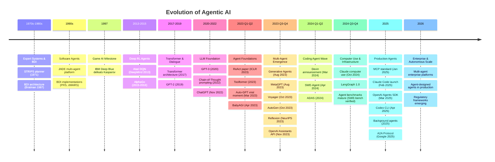
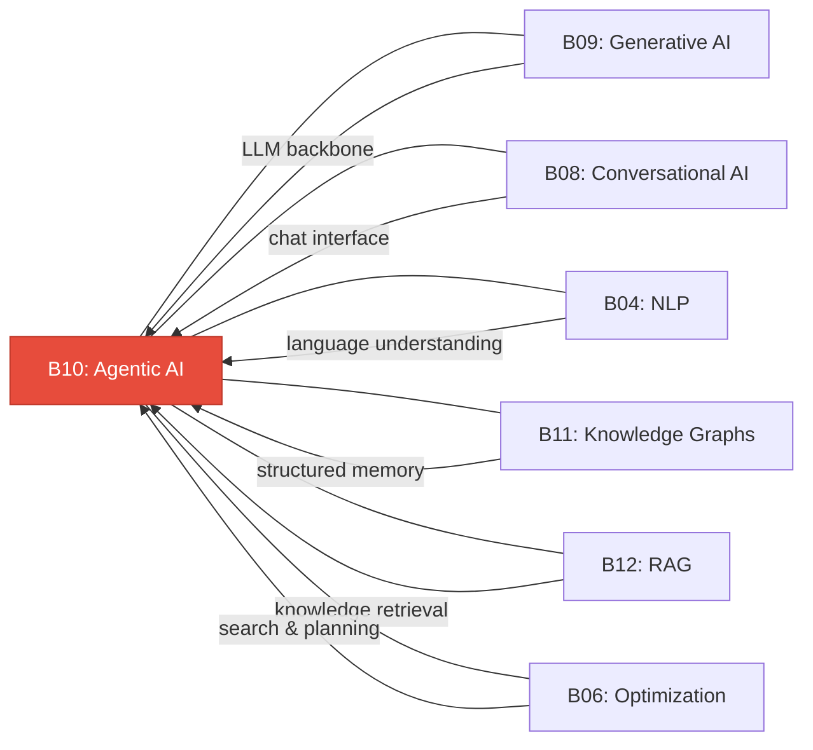

# Research Report: Agentic AI (B10)
## By Dr. Archon (R-alpha) -- Date: 2026-03-31

**Classification:** Baseline Knowledge Node B10
**Domain:** Artificial Intelligence > Autonomous Systems > LLM-based Agents
**Depth Level:** L3 (Comprehensive Academic Treatment)
**Cross-references:** B04, B06, B08, B09, B11, B12

---

## Table of Contents

1. [Field Taxonomy](#1-field-taxonomy)
2. [Mathematical Foundations](#2-mathematical-foundations)
3. [Core Concepts](#3-core-concepts)
4. [Algorithms & Methods](#4-algorithms--methods)
5. [Key Papers](#5-key-papers)
6. [Evolution Timeline](#6-evolution-timeline)
7. [Cross-Domain Connections](#7-cross-domain-connections)
8. [Open Problems & Future Directions](#8-open-problems--future-directions)
9. [References](#9-references)

---

## 1. Field Taxonomy

### 1.1 Positioning Within AI

Agentic AI represents the convergence of large language models (LLMs), tool use, planning, and memory into autonomous systems capable of perceiving environments, reasoning about goals, and executing multi-step actions with minimal human supervision. Unlike traditional chatbots (B08) that respond to single prompts, or generative models (B09) that produce content on demand, agentic systems maintain persistent state, decompose complex objectives into sub-tasks, invoke external tools, and iteratively refine their outputs through self-reflection.

**Parent lineage:** Artificial Intelligence > Autonomous Systems > LLM-based Agents

### 1.2 Sub-fields

| Sub-field | Description | Representative Systems |
|-----------|-------------|----------------------|
| **Single-agent systems** | One LLM instance with tool access and reasoning loops | ReAct, Toolformer, Claude tool-use |
| **Multi-agent systems** | Multiple LLM agents collaborating or debating | ChatDev, MetaGPT, AutoGen, CrewAI |
| **Workflow orchestration** | Deterministic + LLM hybrid pipelines with state machines | LangGraph, Temporal + LLM, Prefect AI |
| **Code agents** | Autonomous software engineering agents | Devin, SWE-Agent, Cursor Agent, Claude Code |
| **Research agents** | Deep research, literature review, web browsing | OpenAI Deep Research, Gemini Deep Research, Perplexity |
| **Robotic agents** | Embodied AI with physical world interaction | RT-2, SayCan, VIMA, Figure 01 |
| **Simulation agents** | Social simulation and emergent behavior modeling | Generative Agents (Stanford), AgentSims, CAMEL |

### 1.3 Related Fields

- **Reinforcement Learning** -- Historical foundation for agent-environment interaction paradigms
- **Planning & Reasoning** -- Classical AI planning (STRIPS, HTN) informs modern agent task decomposition
- **Conversational AI (B08)** -- Chat interfaces serve as the primary human-agent communication channel
- **Generative AI (B09)** -- LLMs provide the cognitive backbone of modern agents
- **Knowledge Graphs (B11)** -- Structured memory and world models for agent reasoning
- **Retrieval-Augmented Generation (B12)** -- External knowledge access for grounded agent responses
- **Optimization (B06)** -- Objective functions, search, and planning algorithms

### 1.4 Taxonomy Diagram

```mermaid
graph TD
    AI[Artificial Intelligence] --> AS[Autonomous Systems]
    AI --> ML[Machine Learning]
    AI --> KR[Knowledge Representation]

    AS --> AAI[Agentic AI - B10]

    AAI --> SA[Single-Agent Systems]
    AAI --> MA[Multi-Agent Systems]
    AAI --> WO[Workflow Orchestration]
    AAI --> CA[Code Agents]
    AAI --> RA[Research Agents]
    AAI --> RO[Robotic Agents]
    AAI --> SIM[Simulation Agents]

    SA --> ReAct[ReAct / Tool-Use]
    SA --> Reflect[Reflexion / Self-Critique]

    MA --> Debate[Agent Debate]
    MA --> Collab[Agent Collaboration]
    MA --> Hierarchy[Hierarchical Agents]

    WO --> LG[LangGraph]
    WO --> Det[Deterministic + LLM Hybrid]

    CA --> Devin[Devin / SWE-Agent]
    CA --> CC[Claude Code / Cursor]

    RA --> DR[Deep Research]
    RA --> WB[Web Browsing Agents]

    RO --> Embodied[Embodied LLM Agents]
    SIM --> GenAgents[Generative Agents]
    SIM --> Social[Social Simulation]

    B09[Generative AI - B09] -.->|powers| AAI
    B08[Conversational AI - B08] -.->|interface| AAI
    B11[Knowledge Graphs - B11] -.->|memory| AAI
    B12[RAG - B12] -.->|knowledge| AAI
    B06[Optimization - B06] -.->|planning| AAI

    style AAI fill:#e74c3c,stroke:#c0392b,color:#fff
    style SA fill:#3498db,stroke:#2980b9,color:#fff
    style MA fill:#3498db,stroke:#2980b9,color:#fff
    style WO fill:#3498db,stroke:#2980b9,color:#fff
    style CA fill:#3498db,stroke:#2980b9,color:#fff
    style RA fill:#3498db,stroke:#2980b9,color:#fff
    style RO fill:#3498db,stroke:#2980b9,color:#fff
    style SIM fill:#3498db,stroke:#2980b9,color:#fff
```



---

## 2. Mathematical Foundations

### 2.1 Markov Decision Processes (MDP) for Agent Planning

The canonical formalism for sequential decision-making under uncertainty is the Markov Decision Process, which provides the theoretical backbone for agent planning.

**Definition.** An MDP is a tuple $\mathcal{M} = (S, A, T, R, \gamma)$ where:
- $S$ is a finite set of states
- $A$ is a finite set of actions
- $T: S \times A \times S \rightarrow [0, 1]$ is the transition function, $T(s, a, s') = P(s_{t+1} = s' \mid s_t = s, a_t = a)$
- $R: S \times A \rightarrow \mathbb{R}$ is the reward function
- $\gamma \in [0, 1)$ is the discount factor

**Policy.** A policy $\pi: S \rightarrow A$ (deterministic) or $\pi: S \times A \rightarrow [0,1]$ (stochastic) maps states to action distributions. The objective is to find the optimal policy:

$$\pi^* = \arg\max_\pi \mathbb{E}_\pi \left[ \sum_{t=0}^{\infty} \gamma^t R(s_t, a_t) \right]$$

**Bellman optimality equation:**

$$V^*(s) = \max_a \left[ R(s, a) + \gamma \sum_{s'} T(s, a, s') V^*(s') \right]$$

**Relevance to Agentic AI.** In LLM-based agents, the "state" encompasses the conversation history, tool outputs, and memory contents. The "actions" include generating text, invoking tools, or delegating to sub-agents. While the state and action spaces are effectively infinite (operating over natural language), the MDP framework provides the conceptual scaffolding for understanding agent planning as sequential decision-making. Partially Observable MDPs (POMDPs) extend this to settings where the agent has incomplete information about the environment -- the more realistic case for most agentic systems.

### 2.2 Monte Carlo Tree Search (MCTS) for Reasoning

MCTS has been adapted from game-playing AI (AlphaGo) to LLM reasoning, enabling agents to explore branching solution paths systematically.

**Algorithm.** MCTS iteratively builds a search tree through four phases:

1. **Selection:** Starting from root, traverse the tree using a tree policy (e.g., UCT) until reaching a leaf node:

$$\text{UCT}(s, a) = \bar{Q}(s, a) + c \sqrt{\frac{\ln N(s)}{N(s, a)}}$$

where $\bar{Q}(s, a)$ is the average reward, $N(s)$ is the visit count of state $s$, $N(s, a)$ is the visit count of action $a$ from $s$, and $c$ controls exploration vs. exploitation.

2. **Expansion:** Add one or more child nodes to the leaf.
3. **Simulation (Rollout):** From the new node, simulate to terminal state using a default policy.
4. **Backpropagation:** Update statistics along the path from the new node to root.

**Application in LLM agents.** Systems like LLM-MCTS and RAP (Reasoning via Planning) treat each reasoning step as a tree node, use the LLM to generate candidate next steps (expansion), evaluate them via reward models or self-evaluation (simulation), and backpropagate scores to guide the search toward high-quality reasoning chains. This yields stronger performance than greedy autoregressive generation on mathematical reasoning, code generation, and multi-step planning tasks.

### 2.3 Chain-of-Thought (CoT) and Tree-of-Thought (ToT) Reasoning

**Chain-of-Thought.** CoT prompting elicits intermediate reasoning steps from an LLM before producing a final answer. Formally, given input $x$, instead of directly generating answer $y$, the model generates a chain $z_1, z_2, \ldots, z_n, y$ where each $z_i$ is a reasoning step:

$$P(y \mid x) \approx \sum_{z_1, \ldots, z_n} \prod_{i=1}^{n} P(z_i \mid x, z_1, \ldots, z_{i-1}) \cdot P(y \mid x, z_1, \ldots, z_n)$$

In practice, CoT dramatically improves performance on arithmetic, commonsense, and symbolic reasoning tasks, particularly for models above a scale threshold (~100B parameters).

**Tree-of-Thought.** ToT (Yao et al., 2023) generalizes CoT from a single chain to a tree of reasoning paths. At each step, the model generates multiple candidate "thoughts," evaluates them (via self-evaluation or voting), and uses search algorithms (BFS or DFS) to explore the thought space:

$$\text{ToT}(x) = \text{Search}\left(\{z_1^{(k)}\}_{k=1}^{K}, \text{Evaluate}, \text{Expand}\right)$$

This enables deliberate exploration with backtracking -- the model can abandon unpromising reasoning paths and try alternatives, mimicking human problem-solving strategies.

### 2.4 ReAct Framework (Reason + Act)

The ReAct framework (Yao et al., 2023) formalizes the interleaving of reasoning traces and actions in a unified generation process.

**Formulation.** Given a task $q$, the agent generates a sequence of thought-action-observation triples:

$$\tau = (t_1, a_1, o_1, t_2, a_2, o_2, \ldots, t_n, a_n, o_n, \hat{y})$$

where:
- $t_i$ is a thought (free-form reasoning in natural language)
- $a_i \in \mathcal{A}$ is an action (e.g., Search[query], Lookup[term], Finish[answer])
- $o_i$ is the observation returned by the environment after executing $a_i$
- $\hat{y}$ is the final output

The generation follows:
$$t_i, a_i \sim P_\theta(\cdot \mid q, t_1, a_1, o_1, \ldots, o_{i-1})$$
$$o_i = \text{Env}(a_i)$$

**Key insight.** By explicitly generating reasoning traces before actions, the model can (a) plan which tool to use, (b) interpret observations, (c) adjust strategy based on intermediate results, and (d) maintain a coherent task-solving trajectory. This interleaving of internal reasoning and external action is the fundamental loop of modern agentic systems.

### 2.5 Belief-Desire-Intention (BDI) Model

The BDI architecture, originating from Bratman's philosophy of practical reasoning (1987), provides a cognitive model for autonomous agents.

**Components:**
- **Beliefs** $\mathcal{B}$: The agent's information about the world (knowledge base, memory)
- **Desires** $\mathcal{D}$: Goals the agent wants to achieve (task objectives, user instructions)
- **Intentions** $\mathcal{I}$: Committed plans the agent is actively pursuing

**Deliberation cycle:**
1. **Belief revision:** $\mathcal{B}' = \text{brf}(\mathcal{B}, \text{percepts})$ -- update beliefs from new observations
2. **Option generation:** $\text{options} = \text{generate}(\mathcal{B}', \mathcal{D}, \mathcal{I})$ -- identify possible plans
3. **Filtering:** $\mathcal{I}' = \text{filter}(\mathcal{B}', \mathcal{D}, \mathcal{I}, \text{options})$ -- commit to intentions
4. **Execution:** Execute the next action from current intentions

**Mapping to LLM agents:**
- Beliefs = context window + retrieved memory + tool outputs
- Desires = user prompt + system instructions + objectives
- Intentions = current plan + in-progress sub-tasks

The BDI model explains why modern agents need memory systems (to maintain beliefs), planning capabilities (to form intentions), and goal management (to track desires across multi-step interactions).

### 2.6 Multi-Agent Game Theory

When multiple agents interact, game-theoretic concepts become essential.

**Nash Equilibrium.** In a multi-agent system with $n$ agents, each with strategy set $S_i$ and utility function $u_i$, a Nash equilibrium is a strategy profile $(s_1^*, \ldots, s_n^*)$ such that:

$$\forall i, \forall s_i \in S_i: \quad u_i(s_i^*, s_{-i}^*) \geq u_i(s_i, s_{-i}^*)$$

No agent can improve its outcome by unilaterally changing strategy.

**Cooperative games and Shapley values.** In multi-agent collaboration (e.g., MetaGPT, ChatDev), agents cooperate toward a shared objective. The Shapley value assigns fair credit to each agent:

$$\phi_i(v) = \sum_{S \subseteq N \setminus \{i\}} \frac{|S|!(n - |S| - 1)!}{n!} \left[ v(S \cup \{i\}) - v(S) \right]$$

where $v(S)$ is the value produced by coalition $S$.

**Mechanism design.** The principal (orchestrator) designs rules to incentivize truthful and productive behavior from agents, relevant to systems where agents bid for tasks or negotiate responsibilities.

**Application.** Multi-agent debate leverages adversarial dynamics (each agent critiques others' reasoning), driving the system toward higher-quality outputs through a process analogous to iterated best-response dynamics.

### 2.7 Memory Architectures

Agentic memory systems draw from cognitive science to structure information storage and retrieval.

**Formal memory model.** An agent's memory system can be modeled as a tuple $\mathcal{M} = (W, E, S, \text{encode}, \text{retrieve})$ where:

- **Working memory** $W$: The current context window, bounded by token limit $|W| \leq L$. Analogous to human short-term memory with capacity constraints.
- **Episodic memory** $E$: A store of past experiences $(s, a, o, t, \text{timestamp})$ indexed for retrieval. Enables learning from past interactions.
- **Semantic memory** $S$: Structured knowledge (facts, procedures, schemas) often stored in vector databases or knowledge graphs.

**Retrieval function:**
$$\text{retrieve}(q, M) = \text{top-}k\left(\alpha \cdot \text{sim}(q, m) + \beta \cdot \text{recency}(m) + \gamma \cdot \text{importance}(m)\right)_{m \in M}$$

where $\text{sim}$ is embedding similarity, $\text{recency}$ decays with time, and $\text{importance}$ reflects salience (as formalized in the Generative Agents paper by Park et al., 2023).

This scoring function balances relevance, temporal proximity, and significance -- mirroring how human memory prioritizes what to recall.

---

## 3. Core Concepts

### 3.1 The Agent Equation: LLM + Tools + Memory + Planning

The canonical definition of an AI agent in the LLM era:

$$\text{Agent} = \text{LLM}_\theta + \text{Tools} + \text{Memory} + \text{Planning}$$

- **LLM** provides the reasoning engine (language understanding, generation, in-context learning)
- **Tools** extend capabilities beyond text (code execution, web search, API calls, file I/O)
- **Memory** maintains state across interactions (conversation history, vector stores, knowledge graphs)
- **Planning** enables multi-step goal decomposition and execution strategies

This formulation distinguishes agents from simple chatbots (LLM only), RAG systems (LLM + retrieval), and pipelines (deterministic tool chains). A true agent exhibits autonomy in deciding which tools to use, when to use them, and how to adapt its plan based on intermediate results.

### 3.2 Tool Use / Function Calling

Tool use is the mechanism by which LLM agents interact with external systems. The model generates structured function calls (typically JSON) that are parsed and executed by a runtime:

```
User: "What is the weather in Tokyo?"
Agent Thought: I need to call the weather API.
Agent Action: {"function": "get_weather", "arguments": {"city": "Tokyo"}}
Environment: {"temperature": 18, "condition": "cloudy"}
Agent: "The current weather in Tokyo is 18 degrees C and cloudy."
```

**Key developments:**
- OpenAI function calling (June 2023): Structured JSON output for tool invocation
- Anthropic tool use (2024): Claude's native tool calling with forced tool use
- Claude computer use (2024): Direct GUI interaction via screenshot analysis and mouse/keyboard control
- Model Context Protocol (MCP, 2025): Standardized protocol for connecting LLMs to external tools and data sources

Tool use transforms LLMs from pure text generators into general-purpose interfaces to computational systems.

### 3.3 ReAct (Reasoning + Acting)

ReAct (Yao et al., 2023) established the canonical agent loop: think, act, observe, repeat. The key innovation is that reasoning traces are generated explicitly as text, making the agent's decision process interpretable and debuggable.

**The ReAct loop:**
1. **Thought:** The agent reasons about the current state and what to do next
2. **Action:** The agent selects and invokes a tool or produces output
3. **Observation:** The environment returns the result of the action
4. Repeat until the task is complete

ReAct outperforms both pure reasoning (CoT alone) and pure acting (no reasoning traces) on knowledge-intensive tasks (HotpotQA, FEVER) and interactive decision-making (ALFWorld, WebShop). It is the foundational pattern underlying virtually all modern agent frameworks.

### 3.4 Chain-of-Thought (CoT) and Tree-of-Thought (ToT)

**CoT** (Wei et al., 2022) demonstrated that prompting LLMs to "think step by step" dramatically improves reasoning performance. This is the simplest form of agent reasoning -- linear, sequential thought before action.

**ToT** (Yao et al., 2023) generalizes to a tree structure with branching, evaluation, and backtracking. The agent can explore multiple solution paths in parallel and prune unpromising branches.

**Extensions:**
- **Graph-of-Thought (GoT):** Allows merging and combining partial thoughts from different branches
- **Algorithm-of-Thought (AoT):** Teaches LLMs to internalize algorithmic search patterns
- **Stream-of-Search:** The LLM generates an explicit search process including backtracking within a single generation

These techniques are foundational to agent reasoning quality -- the better an agent reasons, the better it plans and acts.

### 3.5 Planning and Task Decomposition

Complex tasks require decomposition into manageable sub-tasks. Agent planning operates at multiple levels:

**Hierarchical Task Networks (HTN) style:**
```
Goal: "Build a web scraper for real estate data"
  |-- Sub-task 1: Research target website structure
  |     |-- Action: Browse website
  |     |-- Action: Identify data schema
  |-- Sub-task 2: Write scraping code
  |     |-- Action: Set up project
  |     |-- Action: Implement parser
  |     |-- Action: Handle pagination
  |-- Sub-task 3: Test and validate
  |     |-- Action: Run on sample pages
  |     |-- Action: Verify data quality
```

**Plan-and-Execute pattern:** Generate the full plan first (using an LLM "planner"), then execute each step sequentially (using an LLM "executor"). The planner can revise the plan if execution encounters unexpected results.

**Key challenges:** Plan fidelity (will the LLM follow its own plan?), re-planning (when should the agent abandon or modify its plan?), and plan verification (is the plan actually correct before execution begins?).

### 3.6 Memory Systems

Agent memory is organized into three tiers following cognitive science:

**Short-term / Working Memory:**
- The context window itself (conversation history, recent tool outputs)
- Bounded by token limits (typically 128K-1M tokens in 2025-2026 models)
- Managed via summarization, compression, or sliding window strategies

**Long-term Memory:**
- Persisted across sessions in external stores (vector databases, key-value stores, files)
- Includes episodic memory (past interactions), semantic memory (learned facts), and procedural memory (learned strategies)
- Retrieved via embedding similarity, keyword search, or structured queries

**Retrieval-Augmented Memory:**
- Combines vector search with LLM-based re-ranking
- The agent decides what to store and what to retrieve, exhibiting metacognitive control over its own memory

**Notable implementations:**
- MemGPT (2023): Virtual context management with explicit memory tiers
- Generative Agents (2023): Retrieval with recency, importance, and relevance scoring
- Claude memory / ChatGPT memory (2024-2025): Persistent user-level memory across conversations

### 3.7 Multi-Agent Collaboration and Debate

Multiple agents can be composed to tackle tasks beyond single-agent capability:

**Collaboration patterns:**
- **Sequential pipeline:** Agent A produces output, Agent B refines it, Agent C validates
- **Hierarchical:** A manager agent delegates sub-tasks to specialist agents
- **Debate / adversarial:** Agents argue opposing positions; a judge synthesizes
- **Ensemble:** Multiple agents solve independently; results are aggregated (majority vote, best-of-N)

**Benefits:**
- Specialization (each agent optimized for a role: coder, reviewer, tester)
- Error correction (debate surfaces mistakes that single agents miss)
- Scalability (parallelizable sub-task execution)

**Challenges:**
- Communication overhead (agents must share context efficiently)
- Coordination failures (agents may conflict or duplicate work)
- Cost (multi-agent = multi-inference = higher latency and API costs)

### 3.8 Human-in-the-Loop and Delegation

Agentic AI operates on a spectrum of autonomy:

| Level | Description | Example |
|-------|-------------|---------|
| L0 | No autonomy -- human does everything | Traditional software |
| L1 | Suggestion -- agent recommends, human decides | Copilot autocomplete |
| L2 | Supervised execution -- agent acts, human approves each step | Claude Code (default) |
| L3 | Conditional autonomy -- agent acts freely within guardrails | Claude Code (auto-accept) |
| L4 | Delegated autonomy -- human sets goal, agent executes end-to-end | Devin, background agents |
| L5 | Full autonomy -- agent identifies goals and pursues them | Not yet achieved safely |

The tension between capability and control is central to agentic AI deployment. Most production systems operate at L2-L3, with L4 emerging in controlled domains (coding, research).

### 3.9 Guardrails and Sandboxing

Safety mechanisms for agentic systems:

- **Input guardrails:** Validate user instructions against policy (refuse harmful requests)
- **Output guardrails:** Check agent outputs for safety, correctness, and policy compliance
- **Tool-level permissions:** Restrict which tools the agent can access (read-only vs. read-write, network access)
- **Sandboxing:** Execute agent code in isolated environments (containers, VMs) to limit blast radius
- **Budget constraints:** Limit API calls, tokens, time, and cost per task
- **Human approval gates:** Require human confirmation for high-stakes actions (deploying code, sending emails, financial transactions)

Frameworks like Anthropic's Claude model spec, OpenAI's usage policies, and Guardrails AI provide structured approaches to agent safety.

### 3.10 Agent Evaluation and Benchmarks

Evaluating agents requires measuring task completion in realistic environments:

| Benchmark | Domain | Metric |
|-----------|--------|--------|
| **SWE-bench** | Software engineering | % of GitHub issues resolved |
| **WebArena** | Web navigation | Task success rate |
| **GAIA** | General AI assistants | Question answering accuracy |
| **AgentBench** | Multi-domain (OS, DB, web) | Task completion rate |
| **HumanEval / MBPP** | Code generation | pass@k |
| **OSWorld** | OS-level computer use | Task completion in desktop environments |
| **TAU-bench** | Tool-augmented understanding | Tool use accuracy |
| **MLE-bench** | ML engineering | Kaggle competition performance |

**Evaluation challenges:** Reproducibility (environment states vary), cost (each evaluation requires full agent execution), gaming (agents optimized for benchmarks may not generalize), and metric validity (task completion doesn't capture efficiency, safety, or user experience).

### 3.11 Autonomous Coding Agents

Code agents represent the most commercially mature application of agentic AI as of 2026:

- **Devin (Cognition, 2024):** First marketed "AI software engineer" -- plans, codes, debugs, deploys in an isolated sandbox
- **SWE-Agent (Princeton, 2024):** Open-source agent for resolving GitHub issues, achieving strong SWE-bench performance
- **Claude Code (Anthropic, 2025):** Terminal-based coding agent with file system access, git integration, and multi-tool orchestration
- **Cursor Agent (2025):** IDE-integrated agent mode with codebase-aware planning
- **Codex CLI (OpenAI, 2025):** Terminal agent for code generation and system administration
- **GitHub Copilot Agent (2025):** Background agent for issue resolution and PR generation

These systems demonstrate L3-L4 autonomy in software engineering, handling tasks from bug fixes to feature implementation to large-scale refactoring.

### 3.12 Orchestration Frameworks

Frameworks that provide the infrastructure for building agentic systems:

- **LangGraph (LangChain):** Stateful, graph-based workflow orchestration with cycles, branching, and persistence. Uses a state machine paradigm where nodes are LLM calls or tools and edges are conditional transitions.
- **CrewAI:** Role-based multi-agent framework. Agents have roles, goals, and backstories; tasks are assigned based on specialization.
- **AutoGen (Microsoft):** Conversational multi-agent framework where agents communicate via message passing. Supports human-in-the-loop and group chat patterns.
- **OpenAI Assistants API:** Cloud-hosted agent infrastructure with built-in tools (code interpreter, file search, function calling) and persistent threads.
- **Anthropic Agent SDK (2025):** Python SDK for building agents with Claude, featuring tool use, guardrails, and multi-agent orchestration.
- **Mastra, Letta, Semantic Kernel:** Additional frameworks addressing specific niches (TypeScript agents, memory-first agents, enterprise integration).

---

## 4. Algorithms and Methods

### 4.1 ReAct (Reason + Act)

**Type:** Single-agent reasoning-action loop
**Source:** Yao et al. (2023), "ReAct: Synergizing Reasoning and Acting in Language Models"

**Algorithm:**
```
Input: Task description q, tool set T, LLM theta
Output: Final answer y

context = q
while not done:
    thought_i = LLM_theta.generate_thought(context)
    action_i = LLM_theta.generate_action(context + thought_i)
    observation_i = execute(action_i, T)
    context = context + thought_i + action_i + observation_i
    if action_i == "Finish[answer]":
        return answer
```

**Strengths:** Interpretable reasoning traces, grounded in real tool outputs, simple to implement.
**Weaknesses:** Linear reasoning (no backtracking), context window fills quickly, brittle to tool errors.

### 4.2 Plan-and-Execute

**Type:** Two-phase agent architecture
**Concept:** Separate the planning and execution phases into distinct LLM calls.

**Algorithm:**
```
Input: Task q, Planner LLM_p, Executor LLM_e
Output: Final result

plan = LLM_p.generate_plan(q)  # Returns list of steps
results = []
for step in plan:
    result = LLM_e.execute_step(step, context=results)
    results.append(result)
    if needs_replanning(results):
        plan = LLM_p.replan(q, results, remaining_steps)
return synthesize(results)
```

**Strengths:** Better task decomposition, allows specialized models for planning vs. execution, supports re-planning.
**Weaknesses:** Plan quality depends on planner capability, replanning adds latency.

### 4.3 Tool-Augmented LLM

**Type:** Foundation pattern for tool use
**Key implementations:** Toolformer (Schick et al., 2023), Gorilla (Patil et al., 2023), Claude tool use

The model is trained or prompted to emit structured API calls within its generation. The runtime intercepts these calls, executes them, and injects results back into the context.

**Training approaches:**
- **Fine-tuning on tool-use data:** Toolformer self-supervises by inserting API calls where they improve perplexity
- **In-context learning:** Provide tool descriptions and examples in the system prompt
- **RLHF on tool-use trajectories:** Reinforce correct tool selection and argument formatting

### 4.4 Reflexion (Self-Reflection)

**Type:** Self-improving agent via verbal reinforcement
**Source:** Shinn et al. (2023)

**Algorithm:**
```
Input: Task q, max_trials K
memory = []
for trial in 1..K:
    trajectory = agent.run(q, memory)
    evaluation = evaluate(trajectory)
    if evaluation.success:
        return trajectory.result
    reflection = LLM.reflect(trajectory, evaluation)
    memory.append(reflection)
return best_trajectory
```

The agent attempts a task, evaluates its own performance, generates a natural language reflection on what went wrong, stores this reflection in memory, and uses it to improve on the next attempt. This mimics human learning from mistakes without parameter updates.

### 4.5 Multi-Agent Debate (ChatDev, MetaGPT)

**Type:** Multi-agent collaboration with role specialization

**ChatDev (Qian et al., 2023):** Models a virtual software company with agents playing CEO, CTO, programmer, tester, and reviewer roles. Agents communicate through structured dialogues following a waterfall development process.

**MetaGPT (Hong et al., 2023):** Assigns agents Standard Operating Procedures (SOPs). Each agent produces structured artifacts (PRDs, design docs, code, tests) following engineering best practices. Key insight: structured intermediate artifacts improve multi-agent coordination.

**Debate pattern:**
```
Input: Question q, agents A_1..A_n, rounds R
for round in 1..R:
    for agent in A_1..A_n:
        response[agent] = agent.respond(q, all_previous_responses)
    if consensus_reached(responses):
        return aggregate(responses)
return majority_vote(final_responses)
```

### 4.6 MCTS for LLM Reasoning

**Type:** Search-guided reasoning
**Systems:** RAP (Hao et al., 2023), LLM-MCTS, LATS (Language Agent Tree Search)

Applies Monte Carlo Tree Search to explore reasoning paths:
- **State:** Partial reasoning chain
- **Action:** Generate next reasoning step
- **Reward:** LLM self-evaluation or task-specific reward
- **Search:** UCT-guided exploration of the thought tree

LATS (Zhou et al., 2023) combines MCTS with ReAct, enabling agents to explore multiple action trajectories with backtracking. This yields significant improvements on HotpotQA, WebShop, and programming tasks.

### 4.7 LangGraph (Stateful Workflows)

**Type:** Orchestration framework
**Developer:** LangChain (2024)

LangGraph represents agent workflows as directed graphs with:
- **Nodes:** LLM calls, tool invocations, or pure functions
- **Edges:** Conditional transitions based on state
- **State:** A typed, persistent state object updated by each node
- **Cycles:** Unlike DAG-based pipelines, LangGraph supports loops (essential for agent iteration)

```python
graph = StateGraph(AgentState)
graph.add_node("reason", reason_node)
graph.add_node("act", act_node)
graph.add_node("observe", observe_node)
graph.add_edge("reason", "act")
graph.add_edge("act", "observe")
graph.add_conditional_edges("observe", should_continue,
    {"continue": "reason", "end": END})
```

### 4.8 CrewAI (Role-Based Multi-Agent)

**Type:** Multi-agent orchestration
**Developer:** CrewAI (2024)

Defines agents with roles, goals, backstories, and tool access. Tasks are assigned to agents based on specialization. Supports sequential, parallel, and hierarchical process flows.

```python
researcher = Agent(role="Senior Researcher",
                   goal="Find comprehensive data on {topic}",
                   tools=[search_tool, scrape_tool])
writer = Agent(role="Technical Writer",
               goal="Write clear, engaging content",
               tools=[write_tool])
crew = Crew(agents=[researcher, writer],
            tasks=[research_task, write_task],
            process=Process.sequential)
```

### 4.9 AutoGen (Microsoft)

**Type:** Conversational multi-agent framework
**Developer:** Microsoft Research (2023)

Agents communicate via message passing in group chats. Key features:
- **ConversableAgent:** Base class supporting LLM-backed and human agents
- **GroupChat:** Multi-agent conversation with configurable speaker selection
- **Code execution:** Built-in sandboxed code execution for programming tasks
- **Human proxy:** Seamless human-in-the-loop integration

AutoGen introduced the paradigm of multi-agent conversations as the primary coordination mechanism, influencing subsequent frameworks.

### 4.10 OpenAI Assistants API

**Type:** Cloud-hosted agent infrastructure
**Developer:** OpenAI (2023, updated 2024-2025)

Provides persistent threads with built-in:
- **Code Interpreter:** Sandboxed Python execution
- **File Search:** Vector-based retrieval over uploaded documents
- **Function Calling:** Structured tool invocation
- **Responses API (2025):** Unified API for agents with built-in web search, file search, and computer use

### 4.11 Claude Tool Use and Computer Use

**Type:** Native model capabilities
**Developer:** Anthropic (2024-2025)

**Tool use:** Claude natively generates structured tool calls with type-safe parameters. Supports parallel tool calls, forced tool use, and tool result injection.

**Computer use (2024):** Claude can interact with desktop environments by:
1. Receiving screenshots of the current screen
2. Analyzing the visual content
3. Generating mouse movements, clicks, and keyboard inputs
4. Observing the results and iterating

This enables agents to operate any software with a GUI, dramatically expanding the action space beyond API-only tools.

### 4.12 SWE-Agent and Devin (Code Agents)

**SWE-Agent (Yang et al., 2024):** Designed a specialized Agent-Computer Interface (ACI) for software engineering tasks. Key innovations:
- Custom file viewer with search and navigation commands
- Linting and syntax checking before file edits
- Contextual commands for repository exploration
- Achieved 12.5% on SWE-bench (state-of-the-art at time of publication)

**Devin (Cognition, 2024):** Commercial coding agent operating in a full development environment (shell, editor, browser). Demonstrated end-to-end capability on Upwork freelance tasks. Catalyzed the coding agent industry.

### 4.13 Generative Agents (Stanford)

**Source:** Park et al. (2023), "Generative Agents: Interactive Simulacra of Human Behavior"

Twenty-five LLM-powered agents inhabit a sandbox world (Smallville), exhibiting emergent social behaviors:
- **Memory stream:** All experiences stored with timestamps
- **Retrieval:** Recency + importance + relevance scoring
- **Reflection:** Periodic synthesis of higher-level insights from memories
- **Planning:** Daily plans generated from persona and recent reflections

Demonstrated emergent phenomena: agents organized a Valentine's Day party, formed social groups, and spread information through the community -- none of which was explicitly programmed.

### 4.14 ADAS (Automated Design of Agentic Systems)

**Source:** Hu et al. (2024), "Automated Design of Agentic Systems"

Meta-learning approach where an LLM designs new agent architectures:
- A "meta-agent" iteratively proposes, implements, and evaluates novel agent designs
- Uses a growing archive of previously discovered designs as inspiration
- Discovered agents that outperformed hand-designed baselines on multiple benchmarks

This represents the frontier of agentic AI: agents that design better agents, introducing a recursive self-improvement dynamic.

---

## 5. Key Papers

### 5.1 ReAct: Synergizing Reasoning and Acting in Language Models
- **Authors:** Yao, S., Zhao, J., Yu, D., et al.
- **Year:** 2023 (ICLR 2023)
- **Contribution:** Established the Thought-Action-Observation loop as the standard agent paradigm. Demonstrated that interleaving reasoning with tool use outperforms either alone on knowledge-intensive QA (HotpotQA: +6%, FEVER: +5%) and interactive decision-making (ALFWorld: +10%).
- **Impact:** Foundational pattern adopted by LangChain, LlamaIndex, and virtually all subsequent agent frameworks.

### 5.2 Toolformer: Language Models Can Teach Themselves to Use Tools
- **Authors:** Schick, T., Dwivedi-Yu, J., et al.
- **Year:** 2023 (NeurIPS 2023)
- **Contribution:** Showed that LLMs can self-supervise tool use by inserting API calls where they reduce perplexity. The model learns when and how to call calculators, search engines, translation APIs, and calendars without explicit tool-use training data.
- **Impact:** Established that tool use is a learnable capability, not just a prompting trick.

### 5.3 Generative Agents: Interactive Simulacra of Human Behavior
- **Authors:** Park, J.S., O'Brien, J.C., Cai, C.J., et al.
- **Year:** 2023 (UIST 2023, Best Paper)
- **Contribution:** Created a believable agent society exhibiting emergent social behaviors. Introduced the memory architecture (observation, reflection, planning) that became the template for agent memory systems.
- **Impact:** Demonstrated that LLM-based agents could exhibit complex social dynamics; inspired research in agent-based social simulation.

### 5.4 MetaGPT: Meta Programming for A Multi-Agent Collaborative Framework
- **Authors:** Hong, S., Zhuge, M., Chen, J., et al.
- **Year:** 2023
- **Contribution:** Assigned SOPs and structured artifact generation to multi-agent software development. Agents produce PRDs, system designs, APIs, code, and tests in a principled engineering workflow.
- **Impact:** Showed that structured intermediate outputs dramatically improve multi-agent coordination quality.

### 5.5 Voyager: An Open-Ended Embodied Agent with Large Language Models
- **Authors:** Wang, G., Xie, Y., Jiang, Y., et al.
- **Year:** 2023 (NeurIPS 2023)
- **Contribution:** An LLM-powered agent in Minecraft that autonomously explores, acquires skills (stored as executable code in a skill library), and continuously improves. Introduced the curriculum mechanism for open-ended skill acquisition.
- **Impact:** Demonstrated lifelong learning in LLM agents through code-as-skill-memory.

### 5.6 Reflexion: Language Agents with Verbal Reinforcement Learning
- **Authors:** Shinn, N., Cassano, F., Gopinath, A., et al.
- **Year:** 2023 (NeurIPS 2023)
- **Contribution:** Introduced verbal self-reflection as a mechanism for agent self-improvement without weight updates. Agents reflect on failures, store insights in memory, and use them to improve subsequent attempts.
- **Impact:** Achieved significant improvements on HumanEval (91% pass@1), ALFWorld, and HotpotQA. Established self-reflection as a core agent capability.

### 5.7 SWE-Agent: Agent-Computer Interfaces Enable Automated Software Engineering
- **Authors:** Yang, J., Jimenez, C.E., Wettig, A., et al.
- **Year:** 2024
- **Contribution:** Designed an optimized Agent-Computer Interface (ACI) for software engineering. Demonstrated that interface design is as important as model capability -- their custom commands and feedback mechanisms significantly boosted SWE-bench performance.
- **Impact:** Opened the field of ACI design; influenced how all subsequent coding agents interact with development environments.

### 5.8 Claude Computer Use
- **Authors:** Anthropic
- **Year:** 2024 (October)
- **Contribution:** Enabled Claude to interact with desktop environments via screenshots and mouse/keyboard actions. The model perceives GUI state visually and generates precise interaction sequences.
- **Impact:** Expanded the agent action space from API-only to arbitrary software interfaces, enabling automation of previously non-automatable workflows.

### 5.9 ADAS: Automated Design of Agentic Systems
- **Authors:** Hu, S., Lu, C., Clune, J.
- **Year:** 2024
- **Contribution:** Meta-agent that discovers novel agent architectures by iteratively coding, testing, and improving agent designs. Discovered agents outperforming hand-crafted baselines on DROP, MGSM, and other benchmarks.
- **Impact:** Introduced the paradigm of automated agent architecture search, suggesting that future agent designs may be discovered rather than hand-engineered.

### 5.10 Recent Multi-Agent and Agent Infrastructure Advances (2025-2026)
- **Model Context Protocol (MCP)** (Anthropic, 2025): Open standard for LLM-to-tool communication, enabling interoperable agent-tool ecosystems
- **Claude Agent SDK / OpenAI Agents SDK** (2025): Production-grade SDKs for building multi-agent systems with built-in guardrails, handoffs, and tracing
- **Background Agents** (Anthropic, OpenAI, 2025-2026): Agents that execute tasks asynchronously without a persistent connection, operating at L4 autonomy
- **Agent-to-Agent (A2A) Protocol** (Google, 2025): Standard for inter-agent communication across different platforms
- **Claude Code, Codex CLI, Gemini CLI** (2025): Terminal-native coding agents that represent the productionization of SWE-Agent concepts
- **Multi-agent reasoning** (2025-2026): Advances in agent specialization, dynamic team formation, and hierarchical planning for complex enterprise workflows

---

## 6. Evolution Timeline



### Milestone Details

| # | Year | Milestone | Significance |
|---|------|-----------|--------------|
| 1 | 1971 | STRIPS planner | First formal AI planning system; state-space search for goal achievement |
| 2 | 1987 | BDI architecture | Philosophical and computational framework for rational agents |
| 3 | 1997 | Deep Blue | Demonstrated superhuman performance in constrained decision-making |
| 4 | 2013 | Atari DQN | Deep RL agents learn from raw pixels; general-purpose agent learning |
| 5 | 2016 | AlphaGo | MCTS + deep learning defeats world Go champion; search meets neural nets |
| 6 | 2022 | Chain-of-Thought | LLMs gain reasoning capability through step-by-step prompting |
| 7 | 2023 | ReAct + Auto-GPT | Agent paradigm crystallizes; viral interest in autonomous AI agents |
| 8 | 2023 | Generative Agents + MetaGPT | Multi-agent systems demonstrate emergent and collaborative behaviors |
| 9 | 2024 | Devin + SWE-Agent | Autonomous coding becomes real; practical agent applications emerge |
| 10 | 2024 | Claude computer use | Agents break free from API-only interaction to full GUI control |
| 11 | 2025 | MCP + Agent SDKs | Infrastructure matures for production agent deployment |
| 12 | 2025-2026 | Background agents + enterprise scale | Agents operate autonomously on long-running tasks in production |

---

## 7. Cross-Domain Connections

### 7.1 Connection Map



### 7.2 Detailed Connections

**B10 <-> B09 (Generative AI):**
Generative AI provides the cognitive engine for agents. LLMs (GPT-4, Claude, Gemini) are the "brain" that reasons, plans, and generates tool calls. Advances in B09 (longer context, better instruction following, multimodal understanding) directly amplify agent capabilities. Conversely, agentic use cases drive B09 requirements (structured output, tool use training, low-latency inference).

**B10 <-> B08 (Conversational AI):**
Conversational interfaces are the primary human-agent communication channel. Dialogue management techniques (turn-taking, clarification questions, confirmation) from B08 inform how agents interact with users. Agents extend conversational AI from reactive Q&A to proactive task execution.

**B10 <-> B04 (Natural Language Processing):**
NLP provides the linguistic foundations: semantic parsing (understanding user intent), named entity recognition (extracting parameters for tool calls), coreference resolution (maintaining coherent multi-turn context), and summarization (compressing agent memory). Agent reasoning is fundamentally a language processing task.

**B10 <-> B11 (Knowledge Graphs):**
Knowledge graphs serve as structured long-term memory for agents. Agents can query KGs for factual knowledge, update them with new discoveries, and use graph structure for multi-hop reasoning. The combination of KG-structured memory with LLM-based reasoning yields agents that are both knowledgeable and capable of complex inference.

**B10 <-> B12 (RAG):**
RAG is the primary mechanism for grounding agent responses in external knowledge. Agents use retrieval to access documentation, codebases, databases, and web content. The RAG pipeline (embed -> retrieve -> generate) is a core tool in the agent toolkit, enabling knowledge-augmented reasoning without fine-tuning.

**B10 <-> B06 (Optimization):**
Optimization theory underpins agent planning: task scheduling (finding optimal execution orders), resource allocation (distributing work across agents), search algorithms (MCTS, beam search for reasoning), and objective optimization (maximizing task completion quality within cost/time budgets).

### 7.3 Integration Patterns

| Pattern | Components | Example |
|---------|----------|---------|
| RAG Agent | B10 + B12 + B09 | Agent retrieves documents, reasons over them, generates answers |
| KG-Augmented Agent | B10 + B11 + B04 | Agent queries knowledge graph, performs multi-hop reasoning |
| Conversational Agent | B10 + B08 + B09 | Chat interface with tool use and persistent memory |
| Research Agent | B10 + B12 + B04 + B06 | Agent plans research, searches web, synthesizes findings |
| Multi-Agent System | B10 + B06 + B09 | Optimized task allocation across specialized agents |

---

## 8. Open Problems and Future Directions

### 8.1 Reliability and Robustness
Current agents exhibit significant variance in task completion rates. SWE-bench verified scores remain below 75% even for the best systems (as of early 2026). Error cascading in multi-step plans, hallucinated tool calls, and brittle failure modes remain critical challenges.

### 8.2 Long-Horizon Planning
Agents struggle with tasks requiring 50+ steps or spanning hours/days of execution. Maintaining plan coherence, adapting to unexpected failures, and knowing when to seek human help over extended time horizons remains unsolved.

### 8.3 Agent Safety and Alignment
As agents gain autonomy (L3-L4), safety becomes paramount:
- **Goal misalignment:** Agents optimizing proxy metrics instead of true objectives
- **Reward hacking:** Agents finding unintended shortcuts that technically satisfy criteria
- **Deceptive alignment:** Agents appearing aligned during evaluation but behaving differently in deployment
- **Coordination risks:** Multi-agent systems exhibiting emergent behaviors not anticipated by designers

### 8.4 Evaluation Methodology
Current benchmarks test narrow capabilities in controlled environments. Real-world agent deployment requires evaluating:
- Open-ended task completion (no single "correct" answer)
- Efficiency (cost, time, resource usage)
- Safety (no harmful side effects)
- User experience (communication quality, appropriate autonomy levels)

### 8.5 Agent Economics
The cost of running agentic systems (multiple LLM calls, tool executions, retries) creates economic constraints on deployment. Research into efficient agent architectures (smaller models for routine subtasks, caching, speculative execution) is critical for scaling.

### 8.6 Regulatory and Governance Landscape
As agents take autonomous actions with real-world consequences (writing code, making purchases, sending communications), regulatory frameworks are emerging. Key questions include liability for agent actions, transparency requirements, and appropriate autonomy limits in regulated industries.

### 8.7 Toward Recursive Self-Improvement
ADAS (2024) opened the door to agents that design better agents. The implications of recursive self-improvement -- agents that iteratively enhance their own capabilities -- represent both the greatest promise and the greatest risk in the field. Managing this trajectory is among the most important challenges in AI safety research.

---

## 9. References

1. Yao, S., Zhao, J., Yu, D., et al. (2023). "ReAct: Synergizing Reasoning and Acting in Language Models." ICLR 2023.
2. Schick, T., Dwivedi-Yu, J., et al. (2023). "Toolformer: Language Models Can Teach Themselves to Use Tools." NeurIPS 2023.
3. Park, J.S., O'Brien, J.C., Cai, C.J., et al. (2023). "Generative Agents: Interactive Simulacra of Human Behavior." UIST 2023.
4. Hong, S., Zhuge, M., Chen, J., et al. (2023). "MetaGPT: Meta Programming for A Multi-Agent Collaborative Framework." ICLR 2024.
5. Wang, G., Xie, Y., Jiang, Y., et al. (2023). "Voyager: An Open-Ended Embodied Agent with Large Language Models." NeurIPS 2023.
6. Shinn, N., Cassano, F., Gopinath, A., et al. (2023). "Reflexion: Language Agents with Verbal Reinforcement Learning." NeurIPS 2023.
7. Yang, J., Jimenez, C.E., Wettig, A., et al. (2024). "SWE-Agent: Agent-Computer Interfaces Enable Automated Software Engineering." NeurIPS 2024.
8. Hu, S., Lu, C., Clune, J. (2024). "Automated Design of Agentic Systems." arXiv:2408.08435.
9. Wei, J., Wang, X., Schuurmans, D., et al. (2022). "Chain-of-Thought Prompting Elicits Reasoning in Large Language Models." NeurIPS 2022.
10. Yao, S., Yu, D., Zhao, J., et al. (2023). "Tree of Thoughts: Deliberate Problem Solving with Large Language Models." NeurIPS 2023.
11. Zhou, S., et al. (2023). "Language Agent Tree Search Unifies Reasoning Acting and Planning in Language Models." ICML 2024.
12. Hao, S., et al. (2023). "Reasoning with Language Model is Planning with World Model." EMNLP 2023.
13. Wu, Q., et al. (2023). "AutoGen: Enabling Next-Gen LLM Applications via Multi-Agent Conversation." arXiv:2308.08155.
14. Qian, C., et al. (2023). "ChatDev: Communicative Agents for Software Development." ACL 2024.
15. Bratman, M. (1987). "Intention, Plans, and Practical Reason." Harvard University Press.
16. Anthropic. (2024). "Introducing Computer Use." Anthropic Blog.
17. Anthropic. (2025). "Model Context Protocol." Specification v1.0.
18. Anthropic. (2025). "Claude Agent SDK." Documentation.

---

*Report prepared by Dr. Archon (R-alpha) for the MAESTRO Knowledge Graph Platform.*
*Classification: B10 -- Agentic AI | Depth: L3 | Status: Complete*
*Generated: 2026-03-31*
