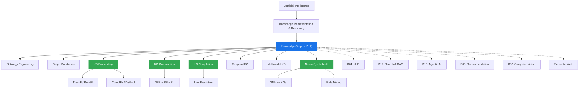

# Research Report: Knowledge Graph (B11)
## By Dr. Archon (R-alpha) -- Date: 2026-03-31

---

## 1. Field Taxonomy

**Parent Lineage:** Artificial Intelligence > Knowledge Representation & Reasoning > Knowledge Graphs

### Sub-fields

| Sub-field | Description | Key Venue |
|---|---|---|
| Ontology Engineering | Design of formal conceptual schemas (TBox) using OWL/RDFS | ISWC, ESWC |
| Graph Databases | Storage & query engines -- property graphs (Neo4j, TigerGraph) and RDF stores (Blazegraph, Virtuoso) | VLDB, SIGMOD |
| KG Embedding | Geometric/algebraic representations of entities & relations in continuous vector spaces | NeurIPS, ICLR |
| KG Construction | End-to-end pipelines: NER, relation extraction, entity linking, coreference resolution | ACL, EMNLP |
| KG Completion | Link prediction and triple classification to fill missing facts | AAAI, IJCAI |
| Temporal Knowledge Graphs | Modeling time-dependent facts with validity intervals or event sequences | AAAI, WWW |
| Multimodal Knowledge Graphs | Integrating images, text, and structured triples into unified graph representations | ACM MM, AAAI |
| Neuro-Symbolic AI | Combining neural learning with symbolic reasoning over KGs | NeSy Workshop, IJCAI |

### Related Baselines & Fields

- **B04 (NLP):** Language models provide the text understanding backbone for KG construction; KGs reciprocally ground LLMs with factual knowledge.
- **B12 (Search & RAG):** GraphRAG augments retrieval-augmented generation by traversing knowledge graphs for multi-hop reasoning.
- **B10 (Agentic AI):** Agents use KGs as persistent world models and memory stores for planning and tool use.
- **B05 (Recommendation Systems):** KG-enhanced recommenders leverage entity-relation paths for explainable suggestions.
- **B02 (Computer Vision):** Scene graphs are domain-specific KGs; visual relationship detection feeds multimodal KGs.
- **Semantic Web:** The foundational movement (RDF, OWL, SPARQL) from which modern KGs descend.

### Field Taxonomy Diagram



---

## 2. Mathematical Foundations

### 2.1 Graph Theory Fundamentals

A knowledge graph is formally a directed labeled multigraph:

```
G = (E, R, T)
where:
  E = set of entities (nodes)
  R = set of relation types (edge labels)
  T ⊆ E × R × E = set of triples (edges)
```

Each triple `(h, r, t)` denotes a directed edge from head entity `h` to tail entity `t` with relation label `r`. The adjacency structure can be represented as a 3rd-order binary tensor `X ∈ {0,1}^{|E| × |R| × |E|}` where `X[i,k,j] = 1` iff `(e_i, r_k, e_j) ∈ T`.

**Key graph-theoretic properties exploited in KG reasoning:**
- **Degree distribution:** Real-world KGs follow power-law degree distributions; hub entities (e.g., "United States") connect to millions of triples.
- **Connected components:** Most large KGs (Wikidata, Freebase) form a single giant connected component.
- **Path semantics:** A path `e_1 -r_1-> e_2 -r_2-> ... -r_n-> e_{n+1}` encodes a compositional relation; path-based reasoning is central to multi-hop QA.

### 2.2 RDF Model and Description Logic

The Resource Description Framework (RDF) formalizes knowledge as a set of subject-predicate-object triples:

```
RDF Triple: (s, p, o) ∈ (URI ∪ BNode) × URI × (URI ∪ BNode ∪ Literal)
```

RDF Schema (RDFS) and the Web Ontology Language (OWL) layer description logic (DL) axioms atop RDF:

- **TBox (Terminological Box):** Class hierarchies and property constraints.
  - `C ⊑ D` (subsumption): every instance of C is an instance of D.
  - `∃r.C` (existential restriction): entities related via r to some instance of C.
  - `∀r.C` (universal restriction): all r-related entities must be in C.
- **ABox (Assertional Box):** Ground facts about individuals.
  - `C(a)`: individual a is an instance of class C.
  - `r(a, b)`: individuals a and b are related by r.

**OWL 2 DL** corresponds to the description logic SROIQ(D), which is decidable with 2-NExpTime complexity for consistency checking. Practical reasoners (HermiT, Pellet) use tableau-based algorithms.

### 2.3 KG Embedding: Translational Models

**TransE** (Bordes et al., 2013) is the foundational translational embedding model:

```
Scoring function: f(h, r, t) = -||h + r - t||_{L1/L2}

Training objective (margin-based):
L = Σ_{(h,r,t) ∈ T} Σ_{(h',r,t') ∈ T'} [γ + f(h,r,t) - f(h',r,t')]_+

where:
  h, r, t ∈ R^d (entity and relation embeddings)
  γ = margin hyperparameter
  T' = set of corrupted (negative) triples
  [x]_+ = max(0, x)
```

**Limitations and extensions:**
- TransE cannot model 1-to-N, N-to-1, or N-to-N relations (e.g., "hasNationality").
- **TransR** projects entities into relation-specific spaces: `f(h,r,t) = -||M_r h + r - M_r t||` where `M_r ∈ R^{k×d}`.
- **RotatE** (Sun et al., 2019) models relations as rotations in complex space: `t = h ∘ r` where `|r_i| = 1`, naturally capturing symmetry, antisymmetry, inversion, and composition patterns.

### 2.4 Bilinear and Complex-Valued Models

**DistMult** (Yang et al., 2015):
```
f(h, r, t) = h^T diag(r) t = Σ_i h_i · r_i · t_i
```
Symmetric by construction -- cannot model antisymmetric relations.

**ComplEx** (Trouillon et al., 2016) extends DistMult to complex space:
```
f(h, r, t) = Re(Σ_i h_i · r_i · t̄_i)

where h, r, t ∈ C^d and t̄ is the complex conjugate.
```
This breaks symmetry: `f(h,r,t) ≠ f(t,r,h)` in general, enabling modeling of antisymmetric relations while retaining the efficiency of diagonal bilinear models.

### 2.5 Graph Neural Networks: Message Passing Framework

GNNs on KGs follow a relational message-passing scheme. For entity `v` at layer `l`:

```
h_v^(l+1) = σ( Σ_{r∈R} Σ_{u∈N_r(v)} (1/c_{v,r}) W_r^(l) h_u^(l) + W_0^(l) h_v^(l) )

where:
  N_r(v) = neighbors of v under relation r
  W_r^(l) = relation-specific weight matrix at layer l
  c_{v,r} = normalization constant
  σ = nonlinear activation (e.g., ReLU)
```

**R-GCN** (Schlichtkrull et al., 2018) uses basis decomposition to manage parameter explosion:
```
W_r^(l) = Σ_{b=1}^{B} a_{rb}^(l) V_b^(l)
```
where `V_b` are shared basis matrices and `a_{rb}` are relation-specific scalar coefficients. This reduces parameters from `O(|R| × d^2)` to `O(B × d^2 + |R| × B)`.

### 2.6 Probabilistic Knowledge Graphs

Real-world KGs contain uncertain, noisy, and conflicting information. Probabilistic KGs attach confidence scores:

```
Probabilistic KG: G_p = {(h, r, t, p) | (h,r,t) ∈ E×R×E, p ∈ [0,1]}
```

**Markov Logic Networks (MLNs)** combine first-order logic with probabilistic graphical models:
```
P(X = x) = (1/Z) exp(Σ_i w_i n_i(x))

where:
  w_i = weight of formula i
  n_i(x) = number of true groundings of formula i in world x
  Z = partition function (intractable in general)
```

Scalable alternatives include **Probabilistic Soft Logic (PSL)**, which relaxes Boolean variables to `[0,1]` and uses convex optimization instead of sampling.

### 2.7 SPARQL Algebra

SPARQL query evaluation is grounded in relational algebra over RDF graphs. The core operations:

```
Basic Graph Pattern (BGP): a set of triple patterns tp_1 ∧ ... ∧ tp_n
evaluated as: [[BGP]]_G = ⋈_{i=1}^{n} [[tp_i]]_G  (natural join)

Key operators:
  AND (⋈):   Ω1 ⋈ Ω2 = {μ1 ∪ μ2 | μ1 ∈ Ω1, μ2 ∈ Ω2, μ1 ~ μ2}
  OPTIONAL:  Ω1 ⟕ Ω2 = (Ω1 ⋈ Ω2) ∪ (Ω1 \ Ω2)
  UNION:     Ω1 ∪ Ω2
  FILTER:    σ_F(Ω) = {μ ∈ Ω | F(μ) = true}

where μ ~ μ' means compatible mappings (agree on shared variables).
```

SPARQL 1.1 adds property paths (regex-like navigation), aggregation (GROUP BY), subqueries, and federation (SERVICE keyword for distributed query).

---

## 3. Core Concepts

### 3.1 Triple (Subject-Predicate-Object)

The atomic unit of knowledge in a KG. Every fact is encoded as a directed labeled edge: `(Barack_Obama, bornIn, Honolulu)`. Triples compose into a graph where entities appear as nodes and relations as edges. The simplicity of this representation is both its strength (universal composability) and its limitation (difficulty encoding n-ary relations, context, provenance without reification).

**Reification** addresses n-ary relations by creating a statement node:
```
Statement_1 --subject--> Obama
Statement_1 --predicate--> presidentOf
Statement_1 --object--> USA
Statement_1 --startDate--> 2009-01-20
Statement_1 --endDate--> 2017-01-20
```
Wikidata uses qualifiers on statements to implement a form of reification at scale.

### 3.2 Ontology Design

An ontology defines the schema layer of a KG: classes (concepts), properties (relations), domain/range constraints, cardinality restrictions, and axioms. Good ontology design follows principles from:

- **Upper ontologies** (SUMO, DOLCE, BFO): provide top-level categories (Object, Process, Quality) to ensure interoperability.
- **Domain ontologies** (Gene Ontology, SNOMED CT, FIBO): codify expert knowledge in specific fields.
- **Design patterns:** Content Ontology Design Patterns (CODPs) are reusable modeling solutions analogous to software design patterns.

Key decisions: open-world vs. closed-world assumption, unique name assumption, property characteristics (transitivity, symmetry, functionality).

### 3.3 Entity Resolution (Entity Alignment)

The process of determining that two references denote the same real-world entity. This is critical for KG integration (e.g., merging DBpedia, Wikidata, and YAGO).

**Approaches:**
- **String similarity:** Jaro-Winkler, Levenshtein distance on entity labels.
- **Structural matching:** Comparing neighborhood graph patterns (e.g., Paris-Sorbonne has similar relational context in different KGs).
- **Embedding-based:** MTransE, GCN-Align, RDGCN project entities from different KGs into a shared embedding space; aligned entity pairs serve as seed anchors.
- **LLM-based (2024-2026):** Prompting LLMs with entity descriptions for zero-shot entity matching, achieving state-of-the-art on benchmarks like OpenEA.

### 3.4 Relation Extraction

The task of identifying semantic relations between entity mentions in unstructured text. This is the primary bottleneck in automated KG construction.

**Pipeline:**
1. Named Entity Recognition (NER) identifies entity spans.
2. Entity Linking (EL) maps spans to KG identifiers.
3. Relation Classification assigns a relation type to each entity pair.

**State-of-the-art approaches:**
- Supervised: Fine-tuned BERT/RoBERTa with entity markers achieves F1 > 90% on TACRED.
- Distant supervision: Aligning KG triples with text corpora to generate noisy training data (Mintz et al., 2009); denoising via multi-instance learning.
- LLM-based extraction (2024-2026): GPT-4, Claude, and open models prompted with schema definitions extract triples with competitive accuracy and dramatically lower engineering cost.

### 3.5 KG Embedding

The representation of entities and relations as continuous vectors (or matrices, tensors) in low-dimensional space, enabling algebraic reasoning over the graph structure. KG embeddings serve as the foundation for link prediction, triple classification, entity typing, and relation prediction.

**Model families:**
| Family | Examples | Scoring Function | Strengths |
|---|---|---|---|
| Translational | TransE, TransR, RotatE | Distance-based | Simple, scalable |
| Bilinear | DistMult, ComplEx, TuckER | Tensor product | Rich interactions |
| Neural | ConvE, InteractE | CNN/MLP on embeddings | Expressiveness |
| GNN-based | R-GCN, CompGCN | Message passing | Structural context |

### 3.6 Link Prediction

Given a KG with missing edges, predict the most likely missing triples. Formally: given `(h, r, ?)` or `(?, r, t)`, rank all candidate entities.

**Evaluation metrics:**
- **Mean Reciprocal Rank (MRR):** `(1/|Q|) Σ 1/rank_i`
- **Hits@K:** Fraction of queries where the correct entity appears in top-K.
- **Filtered setting:** Remove other valid triples from ranking (avoids penalizing correct predictions).

Current state-of-the-art on FB15k-237: MRR ~0.37 (embedding models), ~0.42 (LLM-augmented models, 2025). On WN18RR: MRR ~0.50.

### 3.7 GNN-based KG Reasoning

Graph Neural Networks aggregate information from multi-hop neighborhoods, enabling inductive reasoning (generalizing to unseen entities at test time). Unlike transductive embeddings (TransE, ComplEx) which require retraining for new entities, GNNs compute representations from local structure.

**Key architectures:**
- **R-GCN:** Relation-specific weight matrices with basis decomposition.
- **CompGCN:** Jointly embeds entities and relations using composition operators (subtraction, multiplication, circular correlation).
- **NBFNet (2021):** Generalizes Bellman-Ford algorithm with learned message functions; achieves strong inductive link prediction.

### 3.8 Neuro-Symbolic Reasoning

Combines the pattern recognition strengths of neural networks with the logical rigor of symbolic systems. On KGs, this manifests as:

- **Neural Theorem Provers (NTP):** Differentiable unification over KG triples, learning soft rules end-to-end.
- **Logic Tensor Networks (LTN):** Ground first-order logic formulas in real-valued tensor computations.
- **DRUM / NeuralLP:** Learn differentiable logical rules (e.g., `uncle(X,Y) :- brother(X,Z), parent(Z,Y)`) via attention over relation sequences.
- **LLM + Symbolic (2024-2026):** LLMs generate candidate logical rules; symbolic engines verify them on KG. This hybrid outperforms either approach alone.

### 3.9 Temporal Knowledge Graphs

Standard KGs treat facts as timeless. Temporal KGs attach time validity:

```
Quadruple: (h, r, t, [t_start, t_end])
Example: (Obama, presidentOf, USA, [2009, 2017])
```

**Approaches:**
- **TTransE, HyTE:** Extend translational models with time-dependent hyperplanes or translations.
- **TNTComplEx (2020):** Tensor decomposition over 4th-order (entity x relation x entity x time) tensors.
- **RE-GCN (2021):** Recurrent GNN for evolving graph snapshots; predicts future events.
- **Applications:** Event prediction, temporal question answering, dynamic risk assessment.

### 3.10 Multimodal Knowledge Graphs

Integrate information across modalities -- text, images, video, audio, tabular data -- into a unified graph structure.

**Examples:**
- **MMKG:** Entities linked to images (e.g., Wikidata entity for "Eiffel Tower" linked to photos).
- **Visual Genome:** Scene graph with objects, attributes, and relationships extracted from images.
- **MKGC (Multimodal KG Completion):** Uses image features alongside structural embeddings for link prediction; improvements of 3-8% MRR over text-only baselines.

### 3.11 GraphRAG (KG + LLM)

GraphRAG (Microsoft, 2024) represents a paradigm shift in retrieval-augmented generation by replacing flat document chunks with structured knowledge graphs:

1. **Indexing phase:** LLM extracts entities and relations from a document corpus, builds a KG, applies community detection (Leiden algorithm), and generates summaries at multiple levels of the community hierarchy.
2. **Query phase:** For global queries, the system aggregates community summaries; for local queries, it traverses the KG neighborhood of relevant entities.

**Advantages over naive RAG:**
- Multi-hop reasoning: "What are the main themes across all documents?" requires synthesis that chunk-based RAG cannot perform.
- Explainability: Answers are grounded in explicit entity-relation paths.
- Reduced hallucination: KG structure constrains generation.

**Variants (2025-2026):** LightRAG (lightweight graph construction), nano-GraphRAG, HippoRAG (hippocampal-inspired memory graphs), and agentic GraphRAG (agents that dynamically query and update KGs).

### 3.12 Federated Knowledge Graphs

Distributed KGs maintained by different organizations, queryable without centralization. The Semantic Web's original vision of linked data is realized through:

- **SPARQL Federation:** The SERVICE keyword routes sub-queries to remote endpoints.
- **Knowledge Graph Federation protocols:** Standardized APIs (e.g., Triple Pattern Fragments) for cost-effective distributed query.
- **Privacy-preserving KG reasoning:** Federated learning over KG embeddings without sharing raw triples; relevant for healthcare (patient data) and finance (transaction graphs).
- **Enterprise KG mesh (2025-2026):** Organizations maintain domain-specific KGs with standardized ontologies, connected via federated query layers.

---

## 4. Algorithms & Methods

### 4.1 TransE / TransR / RotatE

**TransE** models relations as translations: `h + r ≈ t`. Training uses margin-based ranking loss with negative sampling. Complexity: O(d) per triple scoring, making it highly scalable (handles billions of triples).

**TransR** introduces relation-specific projection matrices `M_r ∈ R^{k×d}`:
```
f(h, r, t) = -||M_r h + r - M_r t||
```
Complexity increases to O(dk) per triple but enables modeling of 1-N/N-1 relations.

**RotatE** defines each relation as a rotation in complex space:
```
t = h ∘ r, where r_i = e^{iθ_i}, |r_i| = 1
f(h, r, t) = -||h ∘ r - t||
```
This elegantly captures relation patterns:
- Symmetry: `θ_i = 0 or π` for all i.
- Antisymmetry: `θ_i ≠ 0, π` for some i.
- Inversion: `r_2 = r̄_1` (complex conjugate).
- Composition: `r_3 = r_1 ∘ r_2` (element-wise product).

### 4.2 ComplEx / DistMult

**DistMult** uses a diagonal bilinear form. Fast (O(d) scoring) but symmetric, limiting expressiveness.

**ComplEx** extends to Hermitian product in complex space. The asymmetry from complex conjugation enables antisymmetric relation modeling with minimal overhead. On FB15k-237, ComplEx achieves MRR ~0.34, competitive with far more complex models.

**TuckER** (Balazevic et al., 2019) generalizes all bilinear models as Tucker decomposition of the triple tensor, providing a unified framework.

### 4.3 R-GCN (Relational Graph Convolutional Network)

Extends GCN to multi-relational graphs. Each relation type has its own transformation matrix, regularized via:
- **Basis decomposition:** `W_r = Σ_b a_{rb} V_b` (B shared bases).
- **Block-diagonal decomposition:** `W_r = diag(W_r^1, ..., W_r^B)`.

Used for both entity classification and link prediction. For link prediction, entity embeddings from R-GCN are fed into a DistMult decoder:
```
f(h, r, t) = e_h^T R_r e_t
```
where `e_h, e_t` are R-GCN outputs and `R_r` is a diagonal relation matrix.

### 4.4 CompGCN (Composition-based Multi-Relational GCN)

Jointly learns entity and relation embeddings via composition operators within the message-passing framework:
```
h_v^(l+1) = f( Σ_{(u,r)∈N(v)} W_λ^(l) φ(h_u^(l), h_r^(l)) )

where φ is a composition operator:
  - Subtraction: φ(e_u, e_r) = e_u - e_r
  - Multiplication: φ(e_u, e_r) = e_u * e_r
  - Circular correlation: φ(e_u, e_r) = e_u ⋆ e_r
```

Relation embeddings are also updated across layers, unlike R-GCN. CompGCN with circular correlation achieves state-of-the-art results on link prediction and relation prediction tasks.

### 4.5 GraphSAGE (Adapted for KGs)

GraphSAGE's inductive sampling-and-aggregation framework is adapted for KGs by:
1. Sampling a fixed-size neighborhood per entity (stratified by relation type).
2. Aggregating neighbor features via mean, LSTM, or attention pooling.
3. Concatenating with the entity's own features and projecting through a learned matrix.

Key advantage: scales to billion-node graphs via mini-batch training with neighborhood sampling. Used in production KGs at LinkedIn, Pinterest, and Uber.

### 4.6 SPARQL Query Execution

SPARQL engines implement query evaluation via:
1. **Parsing:** SPARQL query string to abstract syntax tree.
2. **Algebraic optimization:** Rewrite using algebraic identities (push filters down, reorder joins).
3. **Physical plan:** Choose join algorithms (nested-loop, hash join, merge join) based on cardinality estimation.
4. **Execution:** Iterator-based or vectorized execution over the RDF index.

**Index structures:** SPO, POS, OSP permutations (6 possible orderings of S, P, O) enable constant-time lookup for any triple pattern. Virtuoso, Blazegraph, and Apache Jena TDB use B+ tree or hash-based indices.

### 4.7 OWL Reasoning (Tableau Algorithm)

OWL DL reasoning determines entailment, consistency, and classification using tableau-based algorithms:

1. **Negation normal form:** Convert axioms to NNF.
2. **Expansion:** Apply tableau rules that decompose complex concepts:
   - `C ⊓ D` generates both C and D for the individual.
   - `C ⊔ D` branches (nondeterministic choice).
   - `∃r.C` creates a new individual related by r, typed as C.
   - `∀r.C` propagates C to all r-successors.
3. **Clash detection:** Contradiction (e.g., `C(a)` and `¬C(a)`) means that branch is unsatisfiable.
4. **Blocking:** Prevents infinite expansion for cyclic ontologies.

Modern reasoners (HermiT, Konclude) add optimizations: absorption, binary encoding, hyper-tableau calculus.

### 4.8 NER + RE Pipeline for KG Construction

The standard pipeline for extracting structured knowledge from text:

```
Text --> [NER] --> Entity Mentions --> [Entity Linking] --> KG Entity IDs
     --> [Coreference Resolution] --> Resolved Mentions
     --> [Relation Extraction] --> Candidate Triples
     --> [Confidence Filtering] --> KG Triples
```

**Modern (2024-2026) approach:** LLMs perform all stages in a single pass via structured output:
```
Input: "Barack Obama was born in Honolulu and served as the 44th president."
Output: [
  {"head": "Barack Obama", "relation": "bornIn", "tail": "Honolulu"},
  {"head": "Barack Obama", "relation": "presidentOf", "tail": "United States", "ordinal": 44}
]
```
Post-processing: entity linking to canonical KG identifiers, deduplication, confidence calibration.

### 4.9 Entity Linking

Maps entity mentions in text to their canonical identifiers in a KG (e.g., "Obama" -> `wd:Q76` in Wikidata).

**Steps:**
1. **Mention detection:** Identify entity spans (may overlap with NER).
2. **Candidate generation:** Retrieve candidate entities via alias tables, string matching, or dense retrieval.
3. **Entity disambiguation:** Rank candidates using contextual features:
   - Local context: surrounding words match entity description.
   - Global coherence: selected entities should be topically consistent.

**State-of-the-art:** BLINK (Facebook, 2020) uses bi-encoder for candidate retrieval + cross-encoder for reranking. REFinED (Amazon, 2022) achieves real-time entity linking. By 2025-2026, LLM-based entity linking with in-context examples rivals dedicated systems.

### 4.10 GraphRAG Pipeline

Detailed algorithm (Edge et al., 2024):

1. **Source document chunking:** Split corpus into overlapping text chunks (default: 300 tokens, 100 overlap).
2. **Entity & relation extraction:** LLM extracts entities (with types and descriptions) and relations from each chunk.
3. **Graph construction:** Merge extracted triples, resolve duplicate entities via embedding similarity.
4. **Community detection:** Apply Leiden algorithm at multiple resolutions to identify hierarchical communities.
5. **Community summarization:** LLM generates natural language summaries for each community, bottom-up through the hierarchy.
6. **Query routing:** Classify query as local (entity-specific) or global (thematic).
7. **Response generation:**
   - Local: Retrieve relevant entities, traverse k-hop neighborhood, generate response with entity context.
   - Global: Map-reduce over community summaries at the appropriate hierarchy level.

### 4.11 AMIE+ Rule Mining

AMIE+ (Galarraga et al., 2015) mines first-order Horn rules from KGs:

```
Rule form: B_1 ∧ B_2 ∧ ... ∧ B_n => H
Example: bornIn(X, Y) ∧ locatedIn(Y, Z) => nationality(X, Z)
```

**Key measures:**
- **Support:** Number of distinct (X, Z) pairs satisfying the rule.
- **PCA Confidence:** `support / #(X,Z) satisfying body with ∃ nationality(X, *)`.

**Algorithm:** Iteratively extends rules by adding atoms, pruning via confidence thresholds and maximum rule length. Optimizations include query rewriting and approximation strategies.

AMIE+ rules serve as interpretable explanations for link prediction and as constraints for embedding training.

### 4.12 KG-BERT and LLM-based KG Completion

**KG-BERT** (Yao et al., 2019) reformulates triple classification as textual entailment:
```
Input: "[CLS] Barack Obama [SEP] born in [SEP] Honolulu [SEP]"
Output: P(valid triple) via classification head
```

**Modern LLM-based approaches (2024-2026):**
- **KG-LLM prompting:** Few-shot examples of valid/invalid triples; LLM scores or generates missing entities.
- **Fine-tuned LLMs:** LoRA-adapted models on KG completion tasks achieve MRR improvements of 5-15% over pure embedding methods on sparse KGs.
- **Hybrid:** Embedding models for candidate retrieval (top-100) + LLM reranker for final scoring. Combines scalability of embeddings with the semantic understanding of LLMs.

---

## 5. Key Papers

### 5.1 TransE -- Translating Embeddings for Modeling Multi-relational Data
**Authors:** Bordes, Usunier, Garcia-Duran, Weston, Yakhnenko (2013)
**Venue:** NeurIPS 2013
**Core Contribution:** Introduced the translational principle `h + r ≈ t` for KG embedding. Despite its simplicity, TransE established the entire field of KG embedding research. The model's O(d) scoring complexity enables scaling to millions of entities.
**Impact:** 15,000+ citations. Spawned the TransX family (TransH, TransR, TransD, RotatE). Every subsequent KG embedding paper benchmarks against TransE.
**Limitations:** Cannot model symmetric relations or 1-N mappings, motivating all subsequent work.

### 5.2 Knowledge Vault: A Web-Scale Approach to Probabilistic Knowledge Fusion
**Authors:** Dong, Gabrilovich, Heitz, Horn, Lao, Murphy, Strohmann, Sun, Zhang (2014)
**Venue:** KDD 2014
**Core Contribution:** Combined KG embedding (PTransE), text extraction, tabular extraction, and web-page structure extraction into a unified probabilistic framework for large-scale KG construction. Fused predictions from multiple extractors via supervised combination and prior-aware logistic regression.
**Impact:** Demonstrated that automated KG construction at web scale was feasible. Directly influenced Google Knowledge Graph expansion strategies.

### 5.3 Wikidata: A Free Collaborative Knowledge Base
**Authors:** Vrandecic, Krotzsch (2014)
**Venue:** Communications of the ACM
**Core Contribution:** Described the design and launch of Wikidata, a free, collaborative, multilingual knowledge base. Key architectural decisions: items (entities) with statements (claims + qualifiers + references), support for conflicting information, and a community-driven editing model.
**Impact:** Wikidata has become the de facto open KG, with 100M+ items (2026), serving as the backbone for Wikipedia infoboxes, Google's Knowledge Panel, and countless research projects.

### 5.4 ComplEx: Complex Embeddings for Simple Link Prediction
**Authors:** Trouillon, Welbl, Riedel, Gaussier, Bouchard (2016)
**Venue:** ICML 2016
**Core Contribution:** Showed that extending embeddings to complex-valued vectors with Hermitian dot product scoring naturally handles antisymmetric relations while maintaining linear time complexity. Provided theoretical analysis proving ComplEx is fully expressive (can represent any KG given sufficient dimensionality).
**Impact:** Established complex-valued embeddings as a research direction; directly influenced RotatE, QuatE, and many others.

### 5.5 Modeling Relational Data with Graph Convolutional Networks (R-GCN)
**Authors:** Schlichtkrull, Kipf, Bloem, van den Berg, Titov, Welling (2018)
**Venue:** ESWC 2018
**Core Contribution:** Adapted GCNs for multi-relational data via relation-specific weight matrices with basis decomposition. Demonstrated effectiveness on both entity classification (node-level) and link prediction (graph-level) tasks on KGs.
**Impact:** Foundational paper for GNNs on KGs. Spawned CompGCN, SACN, VR-GCN, and the entire line of GNN-based KG reasoning research.

### 5.6 KG-BERT: BERT for Knowledge Graph Completion
**Authors:** Yao, Mao, Luo (2019)
**Venue:** arXiv (widely cited)
**Core Contribution:** First to apply pre-trained language models (BERT) to KG completion by treating triples as text sequences. Demonstrated that textual descriptions of entities and relations contain rich semantic information that complements graph structure.
**Impact:** Bridged the NLP and KG communities. Paved the way for the LLM+KG convergence that now dominates the field.

### 5.7 From Local to Global: A Graph RAG Approach to Query-Focused Summarization
**Authors:** Edge, Trinh, Cheng, Bradley, Chao, Mody, Truitt, Larson (Microsoft Research, 2024)
**Venue:** arXiv / NeurIPS 2024 Workshop
**Core Contribution:** Introduced GraphRAG, which builds a hierarchical knowledge graph from document corpora using LLM-based extraction and community detection, enabling both local entity-specific and global thematic queries that naive RAG cannot handle.
**Impact:** Rapidly adopted in industry; spawned LightRAG, nano-GraphRAG, HippoRAG, and became the dominant paradigm for enterprise knowledge management. Shifted RAG research from flat retrieval to structured knowledge integration.

### 5.8 Unifying Large Language Models and Knowledge Graphs: A Roadmap
**Authors:** Pan, Luo, Wang, Chen, Wang, Wu (2024)
**Venue:** IEEE TKDE 2024
**Core Contribution:** Comprehensive survey categorizing LLM+KG integration into three paradigms: (1) KG-enhanced LLMs (grounding, reducing hallucination), (2) LLM-enhanced KGs (construction, completion, question answering), and (3) Synergized LLMs+KGs (bidirectional enhancement). Covered 400+ papers.
**Impact:** Definitive reference for the LLM+KG convergence; highly cited in both communities. Clarified the research landscape and identified open challenges.

### 5.9 RotatE: Knowledge Graph Embedding by Relational Rotation in Complex Space
**Authors:** Sun, Deng, Wang, Tang (2019)
**Venue:** ICLR 2019
**Core Contribution:** Modeled relations as rotations in complex vector space, providing a unified framework that captures symmetry, antisymmetry, inversion, and composition patterns. Introduced self-adversarial negative sampling for more effective training.
**Impact:** Became the standard baseline for KG embedding; RotatE's elegant mathematical framework influenced subsequent geometric embedding models.

---

## 6. Evolution Timeline

```mermaid
timeline
    title Knowledge Graph Evolution
    1998 : Semantic Web vision (Tim Berners-Lee)
    1999 : RDF 1.0 specification published by W3C
    2001 : "The Semantic Web" article (Berners-Lee, Hendler, Lassila) in Scientific American
    2004 : OWL Web Ontology Language becomes W3C Recommendation
         : SPARQL query language introduced
    2007 : DBpedia launched -- first large-scale structured extraction from Wikipedia
         : Freebase launched by Metaweb
    2008 : Linked Open Data (LOD) Cloud reaches 4.7B triples across 300+ datasets
    2010 : Google acquires Metaweb/Freebase
    2012 : Google Knowledge Graph announced ("things, not strings")
         : Powers Knowledge Panels in search results
    2013 : TransE published -- birth of KG embedding research
         : Wikidata publicly launched
    2014 : Knowledge Vault (Google) -- automated KG construction at web scale
         : ComplEx, DistMult advance bilinear embedding models
    2016 : Freebase deprecated in favor of Wikidata
         : Industry KGs proliferate (Amazon Product Graph, LinkedIn Knowledge Graph)
    2018 : R-GCN -- GNNs for multi-relational data
         : BERT enables language-model-based KG completion
    2019 : KG-BERT bridges NLP and KG communities
         : RotatE achieves state-of-the-art embedding results
    2020 : COVID-19 KGs demonstrate KG utility in crisis response
         : GPT-3 raises questions about KGs vs. parametric knowledge
    2022 : Wikidata surpasses 100M items
         : Industry shift toward enterprise knowledge graphs (Stardog, Neo4j Aura)
    2023 : LLM + KG papers surge (hallucination mitigation via KG grounding)
         : Knowledge graph construction via LLM extraction becomes viable
    2024 : GraphRAG (Microsoft) -- KG-structured RAG for global queries
         : Pan et al. survey unifies LLM+KG research landscape
         : LightRAG, HippoRAG, nano-GraphRAG emerge
    2025 : Agentic KGs -- autonomous agents build, maintain, and query KGs
         : Temporal + multimodal KGs integrated into production LLM systems
         : KG-as-memory for persistent agent world models
    2026 : KG-native LLM architectures (structured attention over KG subgraphs)
         : Federated enterprise KG meshes with privacy-preserving reasoning
         : Real-time KG construction from multimodal streams
```



### Detailed Timeline Narrative

| Year | Milestone | Significance |
|---|---|---|
| 1998-2001 | Semantic Web vision and RDF | Tim Berners-Lee's vision of machine-readable web; RDF provides the triple-based data model that underpins all modern KGs. |
| 2004 | OWL and SPARQL | Formal ontology language and query language standardized; enables reasoning and interoperability across KGs. |
| 2007-2008 | DBpedia and Linked Open Data | First proof that large-scale KGs can be automatically constructed; LOD Cloud demonstrates cross-KG linking. |
| 2012 | Google Knowledge Graph | Mainstreams KGs commercially; "things, not strings" becomes an industry mantra. |
| 2013 | TransE | Launches the entire field of KG embedding; shifts KG research from symbolic to statistical. |
| 2014-2016 | Knowledge Vault, Wikidata maturation | Automated construction and community-driven curation emerge as complementary KG building strategies. |
| 2018-2019 | R-GCN, KG-BERT, RotatE | GNNs and pre-trained LMs converge on KGs; embedding models reach maturity. |
| 2024 | GraphRAG and LLM+KG unification | KGs become essential infrastructure for LLM grounding; RAG evolves from flat retrieval to structured knowledge navigation. |
| 2025-2026 | Agentic KGs, federated KG mesh | KGs serve as persistent memory for autonomous agents; enterprise KGs interconnect via federated protocols with privacy guarantees. |

---

## 7. Cross-Domain Connections

### 7.1 B04 -- Natural Language Processing

**Bidirectional synergy:**
- **NLP -> KG:** NLP provides the extraction backbone (NER, RE, entity linking, coreference) for KG construction from text. Pre-trained LMs (BERT, GPT) dramatically improve extraction quality.
- **KG -> NLP:** KGs ground LLMs with factual knowledge, reducing hallucination. Entity embeddings from KGs improve NER, relation extraction, and question answering. Knowledge-aware pre-training (ERNIE, KEPLER) injects KG structure into LMs.

**Integration pattern:** KG-augmented language models retrieve relevant subgraphs during inference, providing structured context that complements parametric knowledge.

### 7.2 B12 -- Search & Retrieval-Augmented Generation

**GraphRAG as the convergence point:**
- Traditional RAG retrieves flat document chunks; GraphRAG retrieves structured knowledge paths through a KG.
- Multi-hop reasoning: "What connects entity A to entity B?" requires graph traversal, not vector similarity.
- KGs enable entity-centric indexing: instead of chunk-level retrieval, search at the entity and relation level.
- Enterprise search increasingly combines vector search (for recall) with KG traversal (for precision and explainability).

### 7.3 B10 -- Agentic AI

**KG as agent world model:**
- Agents use KGs as persistent memory: facts learned in one task transfer to future tasks.
- Planning: KG encodes action preconditions and effects; agents traverse the KG to construct plans.
- Tool selection: Agent KGs map capabilities to tools, enabling dynamic tool routing.
- Multi-agent coordination: Shared KG serves as a common ground for inter-agent communication.
- **MAESTRO-relevant:** The 12x12 knowledge graph structure itself serves as the agent's navigational map across baselines and industries.

### 7.4 B08 -- Generative AI

**Grounding generation in structured knowledge:**
- KG-conditioned text generation produces factually consistent outputs.
- KG-to-text: Verbalizing KG subgraphs for natural language explanations.
- KG-guided image generation: Scene graphs (a form of KG) control spatial relationships in generated images.
- Structured hallucination detection: Compare LLM outputs against KG facts for automated fact-checking.

### 7.5 B05 -- Recommendation Systems

**KG-enhanced recommendations:**
- KG paths explain recommendations: "Recommended because you liked Movie A, which shares director D with Movie B."
- Propagation-based methods (RippleNet, KGAT) propagate user preferences along KG edges.
- Side information enrichment: KGs provide attributes (genre, director, cast) that augment sparse user-item interaction matrices.
- Cold-start mitigation: New items with KG connections can be recommended based on structural similarity.

### 7.6 B02 -- Computer Vision

**Visual knowledge and scene understanding:**
- Scene graphs: KG-like representations of image content (objects, attributes, spatial relations).
- Visual question answering (VQA): KGs provide world knowledge that images alone cannot convey ("What is the capital of the country whose flag is shown?").
- Multimodal KGs link visual features to entity nodes, enabling cross-modal reasoning.
- Image-text KG construction: Extract entities and relations from images and their captions jointly.

---

## 8. Current Frontier & Open Problems (2025-2026)

### 8.1 Open Challenges

1. **Scalability of LLM-based KG construction:** LLM extraction is expensive; constructing KGs from billions of documents requires cost-efficient architectures (distilled models, batched extraction, incremental updates).

2. **Temporal consistency:** Maintaining KG freshness as the world changes; automated detection of stale facts and contradiction resolution.

3. **KG quality assurance at scale:** Balancing precision (avoiding false triples) with recall (capturing all relevant facts); automated quality metrics beyond simple triple-level accuracy.

4. **Neuro-symbolic integration depth:** Current LLM+KG systems are loosely coupled (retrieval-augmented). True integration -- where the model's reasoning process is structured by the KG -- remains an open problem.

5. **Privacy-preserving federated KG reasoning:** Computing answers over distributed KGs without exposing raw data; differential privacy for KG embeddings.

6. **Multimodal KG completion:** Jointly reasoning over text, images, and graph structure; current models treat modalities largely independently.

7. **Evaluation beyond link prediction:** Real-world KG utility (QA accuracy, recommendation quality, agent task success) is poorly correlated with MRR on standard benchmarks.

### 8.2 Emerging Directions

- **KG-native LLM architectures:** Models with explicit graph attention mechanisms that operate over KG subgraphs during forward passes, rather than KG information being serialized as text.
- **Self-improving KGs:** Agents that autonomously identify gaps in a KG, formulate extraction queries, and validate new triples against existing knowledge.
- **KG reasoning as a service:** Cloud-hosted KG reasoning engines that support SPARQL, graph traversal, and embedding-based inference through unified APIs.
- **Domain-specific foundation KGs:** Pre-built, continuously updated KGs for healthcare, finance, legal, and scientific domains, analogous to foundation models for NLP.

---

## 9. Recommended Learning Path

| Stage | Topics | Resources |
|---|---|---|
| Foundation | RDF, SPARQL, graph databases | W3C RDF Primer; Neo4j GraphAcademy |
| Core Theory | KG embeddings (TransE, ComplEx, RotatE) | Bordes et al. 2013; Wang et al. "Knowledge Graph Embedding" survey |
| Advanced | GNNs on KGs, neuro-symbolic reasoning | R-GCN paper; Hamilton "Graph Representation Learning" book |
| Frontier | GraphRAG, LLM+KG integration | Edge et al. 2024; Pan et al. 2024 survey |
| Practice | Build a domain KG from text using LLMs | LangChain + Neo4j tutorial; Microsoft GraphRAG library |

---

*Report generated by Dr. Archon (R-alpha) for the MAESTRO Knowledge Graph Platform. This document covers the B11 baseline (Knowledge Graphs) at L3 depth, integrating foundational theory, state-of-the-art methods, and cross-domain connections across the MAESTRO 12-baseline framework.*
