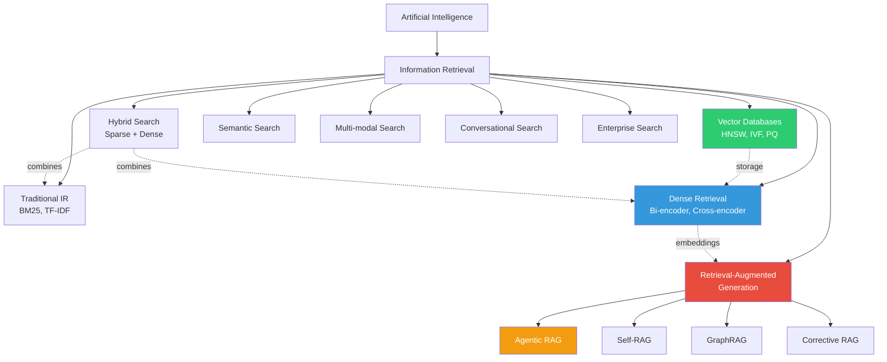
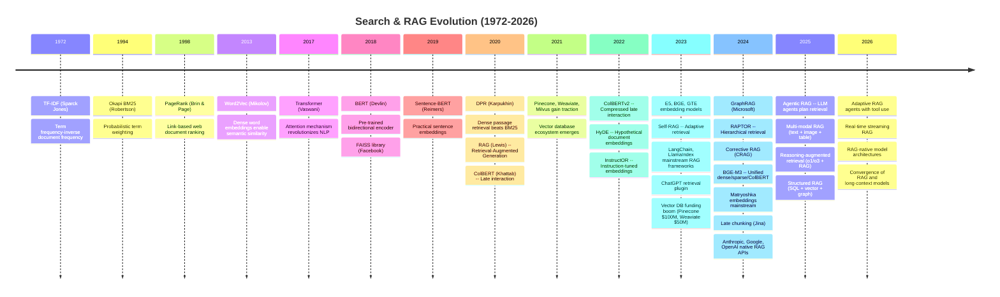
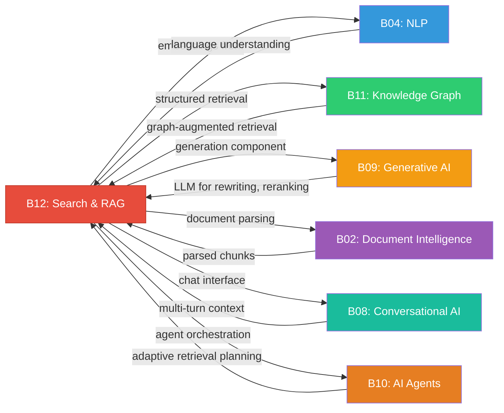

# Research Report: Search & RAG (B12)
## By Dr. Archon (R-alpha) -- MAESTRO Knowledge Graph
### Date: 2026-03-31 | Depth: L3 (Thorough)

---

## 1. Field Taxonomy

**Parent Lineage:**
Artificial Intelligence > Information Retrieval > Neural Search & Retrieval-Augmented Generation

**Sub-fields:**

| Sub-field | Scope | Maturity |
|-----------|-------|----------|
| Traditional IR (BM25, TF-IDF) | Lexical term-matching over inverted indexes | Mature |
| Dense Retrieval (bi-encoder, cross-encoder) | Neural embedding-based similarity search | Growth |
| Hybrid Search (sparse + dense) | Combining lexical and semantic signals | Growth |
| Retrieval-Augmented Generation (RAG) | Grounding LLM generation with retrieved evidence | Rapid Growth |
| Vector Databases | Purpose-built storage for high-dimensional embeddings | Rapid Growth |
| Semantic Search | Meaning-aware document retrieval beyond keywords | Growth |
| Multi-modal Search | Retrieval across text, image, audio, video | Emerging |
| Conversational Search | Multi-turn query resolution with dialogue context | Growth |
| Enterprise Search | Unified search across organizational data silos | Mature/Evolving |
| Agentic RAG | LLM agents that autonomously plan retrieval strategies | Emerging |

**Related Baselines:**
- B04 (NLP) -- language understanding underpins all retrieval
- B11 (Knowledge Graph) -- structured knowledge for GraphRAG
- B09 (Generative AI) -- generation component of RAG
- B02 (Document Intelligence) -- document parsing feeds retrieval pipelines
- B08 (Conversational AI) -- conversational search and QA interfaces
- B10 (AI Agents) -- agentic RAG orchestration

**Taxonomy Diagram:**



---

## 2. Mathematical Foundations

### 2.1 BM25 Scoring (Okapi)

The BM25 ranking function scores a document D against a query Q containing terms q_1, ..., q_n:

```
BM25(D, Q) = SUM_{i=1}^{n} IDF(q_i) * [ f(q_i, D) * (k1 + 1) ] / [ f(q_i, D) + k1 * (1 - b + b * |D| / avgdl) ]
```

Where:
- `f(q_i, D)` = term frequency of q_i in document D
- `|D|` = document length in tokens
- `avgdl` = average document length across the corpus
- `k1` (typically 1.2-2.0) = term frequency saturation parameter
- `b` (typically 0.75) = length normalization parameter
- `IDF(q_i) = log( (N - n(q_i) + 0.5) / (n(q_i) + 0.5) + 1 )` where N = total documents, n(q_i) = documents containing q_i

**Key insight:** BM25 introduces sublinear term-frequency saturation (diminishing returns for repeated terms) and document-length normalization, both absent from raw TF-IDF.

### 2.2 Cosine Similarity and Dot Product in Embedding Space

For embedding vectors u, v in R^d:

```
cosine(u, v) = (u . v) / (||u|| * ||v||) = SUM_{i=1}^{d} u_i * v_i / (sqrt(SUM u_i^2) * sqrt(SUM v_i^2))
```

When embeddings are L2-normalized (||u|| = ||v|| = 1), cosine similarity reduces to the dot product:

```
cosine(u, v) = u . v    (for unit vectors)
```

**Maximum Inner Product Search (MIPS)** is used when embeddings are not normalized, preserving magnitude information that may encode relevance confidence. Most modern embedding models (E5, BGE) produce normalized embeddings, making cosine and dot product interchangeable.

### 2.3 Contrastive Learning Loss (InfoNCE)

Dense retrieval models are trained using the InfoNCE (Noise-Contrastive Estimation) loss:

```
L = -log [ exp(sim(q, d+) / tau) / ( exp(sim(q, d+) / tau) + SUM_{j=1}^{K} exp(sim(q, d_j-) / tau) ) ]
```

Where:
- `q` = query embedding
- `d+` = positive (relevant) document embedding
- `d_j-` = negative (irrelevant) document embeddings (K negatives)
- `tau` = temperature parameter controlling distribution sharpness
- `sim(.)` = similarity function (typically dot product)

**Hard negative mining** is critical: using BM25-retrieved but irrelevant documents as negatives produces far stronger models than random negatives. DPR demonstrated this, and subsequent work (ANCE, RocketQA) further refined negative selection.

### 2.4 Cross-Encoder Scoring

A cross-encoder computes relevance by jointly encoding query and document:

```
score(q, d) = sigmoid( W * BERT_CLS([q; SEP; d]) + b )
```

The query-document pair is concatenated and fed through a transformer, producing a single relevance score from the [CLS] token. This enables full token-level attention between query and document, yielding higher accuracy than bi-encoders at the cost of O(N) inference (cannot pre-compute document embeddings).

**Computational tradeoff:**
- Bi-encoder: O(1) per query-document pair (precomputed doc embeddings), but no cross-attention
- Cross-encoder: O(N) per pair (must re-encode), but full cross-attention

This motivates the retrieve-then-rerank pipeline: bi-encoder retrieves top-K candidates, cross-encoder reranks them.

### 2.5 Approximate Nearest Neighbor (ANN) Algorithms

#### HNSW (Hierarchical Navigable Small World)

Constructs a multi-layer proximity graph. The search process:

```
Search(query q, entry point ep, layers L0..Lmax):
  for layer = Lmax down to 1:
    ep = greedy_search(q, ep, layer)   // navigate to nearest node
  return beam_search(q, ep, L0, ef)    // ef = beam width at base layer
```

- Build complexity: O(N * log(N))
- Search complexity: O(log(N)) average
- Space: O(N * M) where M = max connections per node
- Parameters: M (connectivity), efConstruction (build quality), efSearch (query quality)

#### IVF-PQ (Inverted File with Product Quantization)

Two-stage approximation:
1. **IVF:** Partition embedding space into C clusters via k-means. At query time, probe only the nearest `nprobe` clusters.
2. **PQ:** Compress each d-dimensional vector into m sub-vectors, each quantized to k centroids (typically 256, stored as 1 byte each). Distance approximation:

```
dist_PQ(q, x) ~= SUM_{j=1}^{m} || q_j - centroid(code_j(x)) ||^2
```

This compresses a 768-dim float32 vector (3072 bytes) to ~96 bytes (m=96 sub-quantizers), enabling billion-scale search in memory.

### 2.6 RAG Probabilistic Formulation

RAG (Lewis et al., 2020) marginalizes over retrieved documents:

```
p(y | x) = SUM_{z in top-K} p(z | x) * p(y | x, z)
```

Where:
- `x` = input query
- `z` = retrieved document
- `y` = generated answer
- `p(z | x)` = retrieval probability (from dense retriever, normalized over top-K)
- `p(y | x, z)` = generation probability (from seq2seq model conditioned on query + document)

**RAG-Sequence** generates the full output conditioned on each document, then marginalizes:
```
p_RAG-Seq(y | x) = SUM_z p(z|x) * PROD_t p(y_t | x, z, y_{1:t-1})
```

**RAG-Token** marginalizes at each token position, allowing different tokens to attend to different documents:
```
p_RAG-Token(y | x) = PROD_t SUM_z p(z|x) * p(y_t | x, z, y_{1:t-1})
```

### 2.7 Reciprocal Rank Fusion (RRF)

Combines multiple ranked lists into a single ranking:

```
RRF_score(d) = SUM_{r in rankers} 1 / (k + rank_r(d))
```

Where:
- `k` = smoothing constant (typically 60)
- `rank_r(d)` = rank of document d in ranker r's list (1-indexed)

RRF is parameter-free (besides k), requires no score normalization, and is robust to outlier scores. It is the standard fusion method for hybrid search combining BM25 and dense retrieval results.

### 2.8 Normalized Discounted Cumulative Gain (NDCG)

The standard evaluation metric for ranked retrieval:

```
DCG@K = SUM_{i=1}^{K} (2^{rel_i} - 1) / log2(i + 1)

NDCG@K = DCG@K / IDCG@K
```

Where `IDCG@K` is the DCG of the ideal (perfect) ranking. NDCG ranges from 0 to 1, with 1 indicating perfect ranking. It accounts for graded relevance (not just binary) and position bias (earlier results matter more).

---

## 3. Core Concepts

### 3.1 Inverted Index

The foundational data structure of information retrieval. Maps each unique term to a posting list of (document_id, term_frequency, positions) tuples. Enables O(1) lookup of all documents containing a term and efficient Boolean/scored retrieval. Modern implementations (Lucene, Tantivy) add skip lists, compression (variable-byte, PFOR), and block-max scoring (BMW) for sub-linear query evaluation. Despite the neural retrieval revolution, inverted indexes remain essential for exact-match queries, filtering, and as the sparse component of hybrid search.

### 3.2 Dense Embeddings and Bi-Encoders

Dense retrieval encodes queries and documents independently into a shared embedding space (typically 384-1024 dimensions). A bi-encoder architecture uses a shared or dual transformer encoder:

- `embed_q = Encoder_Q(query)` -- query encoder
- `embed_d = Encoder_D(document)` -- document encoder (often same weights)
- `score = sim(embed_q, embed_d)` -- cosine or dot product

Document embeddings are pre-computed and indexed for fast retrieval. This decoupling enables sub-second search over millions of documents. Key models: DPR (2020), Sentence-BERT (2019), E5 (2023), BGE (2023), GTE (2024), Nomic-Embed (2024). Modern embedding models support 8192+ token inputs and achieve strong zero-shot transfer across domains.

### 3.3 Cross-Encoder Reranking

Cross-encoders jointly encode the (query, document) pair, enabling full bidirectional attention between query tokens and document tokens. This produces significantly higher accuracy than bi-encoders (typically 3-8% MRR improvement) but cannot pre-compute document representations, making them unsuitable for first-stage retrieval. In practice, a bi-encoder retrieves top-100 candidates, and a cross-encoder reranks them to top-10. Models: ms-marco-MiniLM, BGE-Reranker, Cohere Rerank, Jina Reranker. The FlashRank family provides efficient reranking with reduced latency.

### 3.4 Hybrid Search (BM25 + Vector)

Combines lexical (BM25) and semantic (dense) retrieval to capture both exact keyword matches and meaning-based similarity. Fusion strategies:

1. **RRF (Reciprocal Rank Fusion):** Rank-based, parameter-free, most common
2. **Linear combination:** `score = alpha * BM25_norm + (1 - alpha) * dense_score`, requires score normalization
3. **Learned fusion:** Train a model to combine signals (used in Vespa, Elasticsearch)

Hybrid consistently outperforms either method alone. BM25 excels at rare terms, proper nouns, and exact phrases; dense retrieval captures paraphrases, synonyms, and semantic intent. Systems like Elasticsearch 8.x, Weaviate, Qdrant, and Pinecone natively support hybrid search.

### 3.5 Chunking Strategies

Documents must be split into retrievable units. Strategies ranked by sophistication:

| Strategy | Description | Best For |
|----------|-------------|----------|
| Fixed-size | Split every N tokens with M overlap | Simple baselines |
| Sentence-based | Split at sentence boundaries | Short documents |
| Paragraph/section | Split at structural boundaries | Structured docs |
| Semantic chunking | Split where embedding similarity drops | Heterogeneous content |
| Recursive character | LangChain default: try splits in priority order | General purpose |
| Document-aware | Use headings, tables, page breaks | PDFs, HTML |
| Proposition-based | Decompose into atomic factual statements | QA systems |
| Late chunking (2024) | Encode full document, then pool chunks from token embeddings | Context-preserving |

Chunk size is a critical hyperparameter: too small loses context, too large dilutes relevance. Typical sweet spot: 256-512 tokens with 10-20% overlap. Parent-child chunking (small chunks for retrieval, return parent context for generation) is a proven pattern.

### 3.6 RAG Pipeline (Retrieve, Augment, Generate)

The canonical RAG pipeline:

```
Query --> [Query Processing] --> [Retriever] --> [Reranker] --> [Context Assembly] --> [LLM Generator] --> Answer
```

**Stages in detail:**
1. **Query Processing:** Rewriting, expansion, decomposition, HyDE
2. **Retrieval:** Bi-encoder search over vector DB + BM25 (hybrid)
3. **Reranking:** Cross-encoder or LLM-based reranking of top-K
4. **Context Assembly:** Select top chunks, order them, add metadata, enforce token budget
5. **Generation:** LLM generates answer grounded in retrieved context
6. **Post-processing:** Citation extraction, hallucination detection, answer validation

**Failure modes:** retrieval misses (relevant docs not retrieved), context poisoning (irrelevant docs mislead generation), lost-in-the-middle (LLMs attend poorly to middle context), over-reliance on parametric knowledge (ignoring retrieved evidence).

### 3.7 Query Expansion and Rewriting

Techniques to bridge the vocabulary gap between user queries and documents:

- **Query expansion:** Add synonyms, related terms (Pseudo-Relevance Feedback, PRF)
- **Query rewriting:** LLM reformulates the query for better retrieval (e.g., "What's HNSW?" -> "Hierarchical Navigable Small World graph algorithm for approximate nearest neighbor search")
- **HyDE:** Generate a hypothetical answer, embed it, use as query (Gao et al., 2022)
- **Multi-query:** Generate multiple query variants, retrieve for each, union results
- **Step-back prompting:** Ask a more general question first to retrieve broader context
- **Query decomposition:** Break complex queries into sub-queries, retrieve separately

### 3.8 Semantic vs. Lexical Search

| Dimension | Lexical (BM25) | Semantic (Dense) |
|-----------|---------------|-----------------|
| Matching | Exact token overlap | Meaning similarity |
| Synonyms | Misses | Captures |
| Rare terms | Excellent | Often misses |
| Zero-shot | Language-specific | Cross-lingual possible |
| Explainability | High (term weights) | Low (black-box embeddings) |
| Speed | Very fast (inverted index) | Fast (ANN) but needs GPU for encoding |
| Cold start | No training needed | Requires embedding model |

The field has converged on hybrid approaches as the default, recognizing that neither modality alone is sufficient.

### 3.9 Vector Databases and ANN Indexes

Purpose-built systems for storing, indexing, and querying embedding vectors at scale:

| System | Index Types | Key Feature | Scale |
|--------|------------|-------------|-------|
| Pinecone | Proprietary | Fully managed, serverless | Billions |
| Weaviate | HNSW | Multi-modal, GraphQL API | Millions-Billions |
| Qdrant | HNSW + quantization | Rust-based, filtering | Billions |
| Milvus/Zilliz | IVF, HNSW, DiskANN | GPU support, hybrid | Billions |
| Chroma | HNSW (hnswlib) | Developer-friendly, embedded | Millions |
| pgvector | IVF, HNSW | PostgreSQL extension | Millions |
| FAISS | IVF-PQ, HNSW, Flat | Library (not DB), GPU | Billions |
| Vespa | HNSW + BM25 | Full hybrid engine | Billions |

Key capabilities: metadata filtering, multi-tenancy, hybrid search, real-time updates, scalar/binary quantization for cost reduction. The 2024-2025 trend is toward integrated databases (PostgreSQL + pgvector, Elasticsearch 8.x) rather than standalone vector DBs.

### 3.10 Multi-Stage Retrieval (Retrieve, Rerank, Generate)

Production RAG systems use cascading stages of increasing accuracy and decreasing throughput:

```
Stage 1: Candidate retrieval (bi-encoder + BM25)
  - Input: full corpus (millions-billions)
  - Output: top-100-1000 candidates
  - Latency: ~10-50ms

Stage 2: Reranking (cross-encoder or LLM)
  - Input: top-100 candidates
  - Output: top-5-20 reranked
  - Latency: ~50-200ms

Stage 3: Generation (LLM)
  - Input: top-5-10 with context
  - Output: grounded answer
  - Latency: ~500-3000ms
```

This cascading architecture trades compute for accuracy at each stage. Some systems add a Stage 0 (pre-filtering by metadata, date, source) to reduce the candidate pool before retrieval.

### 3.11 Evaluation Metrics

| Metric | Formula | Measures |
|--------|---------|----------|
| MRR (Mean Reciprocal Rank) | mean(1/rank of first relevant) | First-hit quality |
| NDCG@K | See Section 2.8 | Graded ranking quality |
| Recall@K | relevant retrieved / total relevant | Coverage |
| Precision@K | relevant in top-K / K | Top-K accuracy |
| MAP (Mean Average Precision) | mean of per-query AP | Overall ranking |
| Hit Rate@K | queries with >= 1 relevant in top-K | Binary coverage |
| Faithfulness | LLM-judged grounding | RAG hallucination |
| Answer Relevancy | LLM-judged query match | RAG response quality |
| Context Relevancy | relevant chunks / total chunks | Retrieval precision |

**RAG-specific evaluation frameworks:** RAGAS, TruLens, DeepEval, LangSmith. These combine retrieval metrics with generation quality metrics (faithfulness, answer correctness) using LLM-as-judge.

### 3.12 Agentic RAG and Self-RAG

**Self-RAG (Asai et al., 2023):** The LLM learns to decide when to retrieve, what to retrieve, and whether the retrieved content is useful. Special tokens control the flow:
- `[Retrieve]`: model decides if retrieval is needed
- `[IsRel]`: model judges if retrieved passage is relevant
- `[IsSup]`: model judges if generation is supported by passage
- `[IsUse]`: model judges overall utility

**Agentic RAG (2024-2026):** The retrieval system becomes an autonomous agent:
- Plans multi-step retrieval strategies
- Decides which tools/sources to query
- Iteratively refines queries based on intermediate results
- Routes queries to specialized retrievers
- Self-corrects when initial retrieval fails

Frameworks: LangGraph, LlamaIndex Workflows, CrewAI, AutoGen. The agent pattern enables complex research tasks that require reasoning over multiple retrieval steps.

---

## 4. Algorithms & Methods

### 4.1 BM25 / TF-IDF

**Type:** Lexical retrieval scoring function
**Core idea:** Score documents by weighted term overlap with query, with term-frequency saturation and document-length normalization.
**Complexity:** O(|Q| * avg_posting_list_length) per query with inverted index
**Strengths:** No training required, excellent for exact matches, rare terms, proper nouns. Extremely fast with optimized indexes (block-max WAND).
**Weaknesses:** No semantic understanding, vocabulary mismatch problem, no synonym/paraphrase handling.
**Implementations:** Lucene/Elasticsearch/OpenSearch, Tantivy, Anserini, rank_bm25 (Python)
**Status:** Remains a critical component in hybrid search (2026). Reports of BM25's death are greatly exaggerated.

### 4.2 Dense Passage Retriever (DPR)

**Reference:** Karpukhin et al., 2020
**Core idea:** Train separate BERT-based query and passage encoders using contrastive learning with in-batch negatives and BM25 hard negatives. Retrieve by MIPS over pre-computed passage embeddings.
**Architecture:** Dual BERT-base encoders, 768-dim embeddings, FAISS index
**Training:** InfoNCE loss with 1 positive + 1 BM25-hard negative + in-batch negatives per query
**Impact:** Demonstrated that dense retrieval can outperform BM25 on open-domain QA. Launched the dense retrieval revolution.
**Limitations:** Requires domain-specific training data, poor zero-shot transfer, no late interaction.

### 4.3 ColBERT (Late Interaction)

**Reference:** Khattab & Zaharia, 2020; ColBERT v2 (Santhanam et al., 2022)
**Core idea:** Preserve token-level embeddings for both query and document. Score via late interaction (MaxSim):

```
score(q, d) = SUM_{i=1}^{|q|} MAX_{j=1}^{|d|} q_i . d_j^T
```

Each query token attends to its best-matching document token. This captures fine-grained interactions while allowing document pre-computation.
**ColBERT v2 improvements:** Residual compression (32x storage reduction), denoised supervision, cross-encoder distillation.
**Strengths:** Near cross-encoder accuracy with near bi-encoder efficiency.
**Implementations:** ColBERTv2, RAGatouille, Stanford PLAID engine

### 4.4 Sentence-BERT / E5 / BGE Embeddings

**Sentence-BERT (Reimers & Gurevych, 2019):** Siamese BERT with mean pooling, trained on NLI + STS data. Made BERT practical for similarity search (3000x speedup over cross-encoder for pair-wise comparison).

**E5 (Wang et al., 2023):** "EmbEddings from bidirEctional Encoder rEpresentations." Trained with contrastive pre-training on large-scale text pairs + fine-tuning. Uses task-specific prefixes ("query:", "passage:").

**BGE (Xiao et al., 2023):** BAAI General Embedding. Similar to E5 with RetroMAE pre-training + contrastive fine-tuning. BGE-M3 supports multi-lingual, multi-granularity, multi-functionality (dense + sparse + ColBERT in one model).

**GTE (Alibaba, 2024), Nomic-Embed (2024), Jina-Embeddings-v3 (2024):** Latest generation supporting 8192 tokens, Matryoshka representation learning (flexible dimensions), and instruction-tuned embeddings.

**MTEB Leaderboard** (Massive Text Embedding Benchmark) is the standard benchmark with 56+ tasks across retrieval, classification, clustering, and STS.

### 4.5 HNSW Index

**Reference:** Malkov & Yashunin, 2018
**Core idea:** Build a hierarchical graph where each layer is a navigable small-world graph with exponentially fewer nodes. Search starts at the top layer (coarse navigation) and descends to the base layer (fine-grained search).
**Parameters:**
- `M` = max edges per node (higher = better recall, more memory; typical: 16-64)
- `efConstruction` = beam width during build (typical: 100-400)
- `efSearch` = beam width during query (typical: 50-200, tunable at query time)
**Performance:** 95%+ recall@10 with <5ms latency on million-scale datasets
**Tradeoff:** High memory (stores full vectors + graph), but excellent query latency. The dominant ANN algorithm in production vector databases.

### 4.6 IVF-PQ Index

**Core idea:** Two-level approximation for billion-scale search with limited memory.
1. **IVF (Inverted File):** K-means clustering of the vector space into C centroids (C typically sqrt(N)). At query time, search only the nearest `nprobe` clusters.
2. **PQ (Product Quantization):** Split each vector into m sub-vectors, quantize each to 256 centroids (1 byte). Compute approximate distances using pre-computed lookup tables.

**Memory:** m bytes per vector (e.g., 64 bytes for 768-dim, a 48x compression)
**Performance:** Lower recall than HNSW but dramatically lower memory. GPU-accelerated variants (FAISS-GPU) achieve >10M QPS.
**Use case:** Billion-scale datasets where HNSW memory is prohibitive.

### 4.7 Cross-Encoder Reranking

**Models:** ms-marco-MiniLM-L-6-v2, BGE-Reranker-v2, Cohere Rerank v3, Jina Reranker v2
**Implementation:**
```
for each (query, candidate_doc) pair:
    score = cross_encoder.predict([query, candidate_doc])
reranked = sorted(candidates, key=score, reverse=True)
```
**Latency optimization:** Batch processing, quantized models (ONNX, TensorRT), speculative reranking (early stopping when confident). LLM-based reranking (using GPT-4/Claude as reranker via prompting) is increasingly competitive and handles longer contexts.

### 4.8 RAG (Lewis et al., 2020)

**Reference:** "Retrieval-Augmented Generation for Knowledge-Intensive NLP Tasks"
**Architecture:** DPR retriever + BART generator, jointly fine-tuned (retriever is frozen during generation training in the original paper).
**Variants:**
- RAG-Sequence: Marginalize over docs per sequence
- RAG-Token: Marginalize over docs per token
**Impact:** Established the RAG paradigm. Demonstrated that retrieval augmentation outperforms pure parametric models on knowledge-intensive tasks (open-domain QA, fact verification, slot filling).
**Modern RAG (2024-2026):** The term now refers to any retrieve-then-generate pipeline, regardless of whether it uses the original architecture. Production RAG uses off-the-shelf embedding models + off-the-shelf LLMs + vector databases.

### 4.9 Self-RAG (Asai et al., 2023)

**Reference:** "Self-RAG: Learning to Retrieve, Generate, and Critique through Self-Reflection"
**Core idea:** Train an LLM to output special reflection tokens that control retrieval and self-assess generation quality. The model learns when retrieval is necessary (not always), judges retrieved passage relevance, and evaluates whether its generation is supported by evidence.
**Training:** Critic model labels training data with reflection tokens; the generator learns to produce these tokens alongside normal text.
**Advantage over standard RAG:** Adaptive retrieval (skip when unnecessary), self-correction, reduced hallucination. Outperforms standard RAG and vanilla LLMs on knowledge-intensive benchmarks.

### 4.10 RAPTOR (Sarthi et al., 2024)

**Reference:** "RAPTOR: Recursive Abstractive Processing for Tree-Organized Retrieval"
**Core idea:** Build a hierarchical tree of document summaries. Leaf nodes are text chunks; parent nodes are LLM-generated summaries of their children. Retrieval can access any tree level, enabling both fine-grained and high-level reasoning.
**Process:**
1. Chunk documents into leaf nodes
2. Cluster similar chunks (using GMM or k-means on embeddings)
3. Summarize each cluster with an LLM to create parent nodes
4. Recursively repeat until a root summary is produced
5. At query time, retrieve from any level of the tree

**Strength:** Handles questions requiring multi-document synthesis or high-level understanding, where flat chunking fails.

### 4.11 HyDE (Hypothetical Document Embeddings)

**Reference:** Gao et al., 2022
**Core idea:** Instead of embedding the short query, instruct an LLM to generate a hypothetical answer, then embed that answer as the search query. The hypothetical document is semantically closer to actual relevant documents than the original query.
**Process:**
```
Query: "What causes aurora borealis?"
  --> LLM generates: "Aurora borealis is caused by charged particles from the sun..."
  --> Embed the generated text
  --> Search vector DB with this embedding
```
**Tradeoff:** Adds LLM call latency (~500ms-2s) but significantly improves retrieval quality for ambiguous or underspecified queries. Works best when the LLM has reasonable parametric knowledge of the domain.

### 4.12 GraphRAG (Microsoft, 2024)

**Reference:** Edge et al., 2024 -- "From Local to Global: A Graph RAG Approach to Query-Focused Summarization"
**Core idea:** Build a knowledge graph from the corpus using LLM entity/relation extraction, detect communities (Leiden algorithm), generate community summaries at multiple levels. At query time, retrieve relevant communities and their summaries.
**Pipeline:**
1. Extract entities and relationships from each chunk (LLM-based)
2. Build a knowledge graph
3. Detect communities at multiple resolutions
4. Generate hierarchical community summaries
5. For global queries: map summaries to partial answers, reduce to final answer
6. For local queries: combine entity-centric retrieval with standard vector search

**Strength:** Excels at global/thematic queries ("What are the main themes in this corpus?") where standard RAG fails because no single chunk contains the answer.
**Limitation:** High indexing cost (many LLM calls for extraction + summarization).

### 4.13 Corrective RAG (CRAG)

**Reference:** Yan et al., 2024
**Core idea:** Add a retrieval evaluator that assesses whether retrieved documents are relevant. If documents are irrelevant, trigger corrective actions: web search, query rewriting, or knowledge refinement.
**Flow:**
```
Retrieve documents --> Evaluate relevance (Correct / Incorrect / Ambiguous)
  If Correct: use as context
  If Incorrect: discard, trigger web search
  If Ambiguous: combine internal and web results + knowledge refinement
```
**Impact:** Robust to retrieval failure, the primary failure mode of standard RAG. Combines the reliability of web search fallback with the efficiency of local retrieval.

### 4.14 Multi-Vector Retrieval (ColBERT v2, Multi-Representation)

Beyond ColBERT's token-level multi-vector approach, the broader multi-vector paradigm includes:
- **Multi-representation indexing:** Store multiple embeddings per document (title, abstract, full-text, summary, questions-the-doc-answers)
- **Matryoshka embeddings:** Single model produces usable embeddings at multiple dimensions (256, 512, 768, 1024), enabling coarse-to-fine search
- **Multi-aspect embeddings:** Separate embeddings for different semantic aspects (topic, sentiment, entity)

This approach increases storage but captures richer document semantics than a single vector.

---

## 5. Key Papers

### 5.1 Okapi BM25 (Robertson et al., 1994)
**Title:** "Some Simple Effective Approximations to the 2-Poisson Model for Probabilistic Weighted Retrieval"
**Venue:** SIGIR 1994
**Contribution:** Introduced the BM25 ranking function with term-frequency saturation and document-length normalization. Became the default retrieval function for 25+ years.
**Impact:** Still the strongest unsupervised baseline. Built into every search engine (Lucene, Elasticsearch, Solr). Over 6000 citations.

### 5.2 Sentence-BERT (Reimers & Gurevych, 2019)
**Title:** "Sentence-BERT: Sentence Embeddings using Siamese BERT-Networks"
**Venue:** EMNLP 2019
**Contribution:** Made BERT practical for semantic similarity by training siamese/triplet networks. Reduced comparison time from 65 hours (cross-encoder, 10K sentences) to 5 seconds (bi-encoder + cosine).
**Impact:** Launched the modern embedding model ecosystem. The sentence-transformers library has 10M+ monthly downloads.

### 5.3 DPR (Karpukhin et al., 2020)
**Title:** "Dense Passage Retrieval for Open-Domain Question Answering"
**Venue:** EMNLP 2020
**Contribution:** Demonstrated that a simple dual-encoder trained with contrastive learning outperforms BM25 on open-domain QA retrieval (top-20 accuracy: 78.4% vs 59.1% on Natural Questions).
**Key insight:** BM25 hard negatives are crucial for training strong dense retrievers.

### 5.4 ColBERT (Khattab & Zaharia, 2020)
**Title:** "ColBERT: Efficient and Effective Passage Search via Contextualized Late Interaction over BERT"
**Venue:** SIGIR 2020
**Contribution:** Introduced late interaction: preserve per-token embeddings, compute MaxSim for scoring. Achieves near cross-encoder quality with 170x speedup.
**Follow-up:** ColBERTv2 (2022) added residual compression reducing storage by 6-10x.

### 5.5 RAG (Lewis et al., 2020)
**Title:** "Retrieval-Augmented Generation for Knowledge-Intensive NLP Tasks"
**Venue:** NeurIPS 2020
**Contribution:** Unified retrieval and generation in a single differentiable framework. Showed that grounding generation in retrieved documents reduces hallucination and enables knowledge updates without retraining.
**Impact:** Arguably the most influential NLP paper of 2020. "RAG" became the standard term for any retrieval-grounded generation system.

### 5.6 E5 / BGE Embedding Models (2023)
**E5:** Wang et al., "Text Embeddings by Weakly-Supervised Contrastive Pre-training" (ACL 2023). Pre-trained on 270M text pairs mined from the web with consistency filtering.
**BGE:** Xiao et al., "C-Pack: Packaged Resources To Advance General Chinese Embedding" (2023). RetroMAE pre-training + multi-stage fine-tuning. BGE-M3 (2024) unifies dense, sparse, and ColBERT retrieval in one model.
**Impact:** Democratized high-quality embeddings. Open-source models matching or exceeding proprietary (OpenAI, Cohere) on MTEB.

### 5.7 Self-RAG (Asai et al., 2023)
**Title:** "Self-RAG: Learning to Retrieve, Generate, and Critique through Self-Reflection"
**Venue:** ICLR 2024
**Contribution:** LLM learns when to retrieve (adaptive), whether retrieved passages are relevant, and whether its generation is supported by evidence. Uses special reflection tokens.
**Results:** Outperforms standard RAG by 5-10% on knowledge-intensive QA while reducing unnecessary retrievals.

### 5.8 RAPTOR (Sarthi et al., 2024)
**Title:** "RAPTOR: Recursive Abstractive Processing for Tree-Organized Retrieval"
**Venue:** ICLR 2024
**Contribution:** Hierarchical summarization tree for multi-granularity retrieval. Enables answering questions that require synthesizing information across multiple documents or understanding high-level themes.

### 5.9 GraphRAG (Edge et al., 2024)
**Title:** "From Local to Global: A Graph RAG Approach to Query-Focused Summarization"
**Venue:** Microsoft Research, 2024
**Contribution:** Knowledge graph construction + community detection + hierarchical summarization for corpus-level question answering. Handles global sensemaking queries where standard RAG fails.
**Open source:** microsoft/graphrag on GitHub, widely adopted in enterprise settings.

### 5.10 ColBERTv2 (Santhanam et al., 2022)
**Title:** "ColBERTv2: Effective and Efficient Retrieval via Lightweight Late Interaction"
**Venue:** NAACL 2022
**Contribution:** Residual compression (centroids + residuals quantized to 2 bits) reduces ColBERT storage by 6-10x. Denoised supervision via cross-encoder distillation improves quality. Made late interaction practical for large-scale deployment.

---

## 6. Evolution Timeline



**Key inflection points:**
1. **2018-2019:** BERT + Sentence-BERT made dense embeddings practical
2. **2020:** DPR + RAG proved neural retrieval can replace and augment BM25
3. **2023:** Open-source embedding models (E5/BGE) + RAG frameworks (LangChain) democratized the technology
4. **2024:** Advanced RAG patterns (GraphRAG, Self-RAG, CRAG) addressed failure modes of naive RAG
5. **2025-2026:** Agentic RAG and long-context models are reshaping the retrieval landscape, with emerging debate on "RAG vs. long context" (answer: both have roles)

---

## 7. Cross-Domain Connections

### 7.1 B04 -- Natural Language Processing

**Connection type:** Foundational dependency
- All embedding models are NLP models (BERT-family, encoder-only transformers)
- Query understanding, intent classification, and named entity recognition improve retrieval
- Tokenization and text preprocessing directly affect BM25 and chunking quality
- Multilingual NLP enables cross-lingual retrieval (mBERT, mE5, multilingual BGE)

### 7.2 B11 -- Knowledge Graph

**Connection type:** Structural augmentation
- GraphRAG builds knowledge graphs from unstructured text for retrieval
- Entity linking connects retrieved passages to KG nodes for disambiguation
- KG-augmented retrieval: traverse graph relationships to find related documents
- Ontology-guided chunking: use domain ontologies to inform document segmentation
- Knowledge graphs provide structured context that complements unstructured retrieval

### 7.3 B09 -- Generative AI

**Connection type:** Generation component
- LLMs are the "G" in RAG, generating answers from retrieved context
- LLMs serve as query rewriters, hypothetical document generators (HyDE), and rerankers
- RAG grounds generative models, reducing hallucination
- Embedding models are increasingly trained via generative objectives (GritLM unifies generation and embedding)
- The RAG vs. long-context debate: 128K-1M context windows reduce (but do not eliminate) need for retrieval

### 7.4 B02 -- Document Intelligence

**Connection type:** Input processing
- Document parsing (PDF, DOCX, HTML) is the first step in any RAG pipeline
- Table extraction, OCR, and layout analysis determine chunk quality
- Multi-modal document understanding enables retrieval over charts, figures, and scanned documents
- Document Intelligence provides structured metadata (headings, sections, page numbers) that improves chunking and citation

### 7.5 B08 -- Conversational AI

**Connection type:** Interface and context management
- Conversational search requires multi-turn query resolution (coreference, context carryover)
- Chat-based RAG interfaces are the primary deployment pattern (ChatGPT, Claude, enterprise bots)
- Dialogue history informs query rewriting and retrieval context
- Conversational memory complements retrieval memory

### 7.6 B10 -- AI Agents

**Connection type:** Orchestration layer
- Agentic RAG: agents decide when, what, and how to retrieve
- Multi-tool agents combine retrieval with SQL queries, API calls, web search, and code execution
- Planning and reasoning over retrieval results (chain-of-thought + retrieval)
- Agent frameworks (LangGraph, LlamaIndex Workflows) provide RAG orchestration primitives
- Self-correcting agents detect retrieval failures and retry with modified strategies

### Cross-Domain Synergy Map



---

## Appendix A: Production RAG Architecture (2026)

```
                        +-------------------+
                        |   User Interface  |
                        |  (Chat / Search)  |
                        +---------+---------+
                                  |
                        +---------v---------+
                        |  Query Processor  |
                        | - Rewrite/Expand  |
                        | - Intent Classify |
                        | - Decompose       |
                        +---------+---------+
                                  |
                  +---------------+---------------+
                  |                               |
          +-------v-------+             +---------v--------+
          | Dense Retriever|             | Sparse Retriever |
          | (Bi-encoder)   |             | (BM25)           |
          +-------+-------+             +---------+--------+
                  |                               |
                  +---------------+---------------+
                                  |
                        +---------v---------+
                        |   Hybrid Fusion   |
                        |   (RRF / Linear)  |
                        +---------+---------+
                                  |
                        +---------v---------+
                        |    Reranker       |
                        | (Cross-encoder /  |
                        |  LLM-based)       |
                        +---------+---------+
                                  |
                        +---------v---------+
                        | Context Assembly  |
                        | - Token budget    |
                        | - Dedup / Order   |
                        | - Add metadata    |
                        +---------+---------+
                                  |
                        +---------v---------+
                        |   LLM Generator   |
                        | - Grounded answer |
                        | - Citations       |
                        +---------+---------+
                                  |
                        +---------v---------+
                        |  Post-Processing  |
                        | - Hallucination   |
                        |   detection       |
                        | - Answer validate |
                        +-------------------+
```

---

## Appendix B: Key Open-Source Tools & Frameworks (2026)

| Category | Tools |
|----------|-------|
| Embedding Models | sentence-transformers, FlagEmbedding (BGE), E5, GTE, Nomic-Embed |
| Vector Databases | FAISS, Qdrant, Weaviate, Milvus, Chroma, pgvector, LanceDB |
| RAG Frameworks | LangChain, LlamaIndex, Haystack, RAGFlow, Verba |
| Agent Frameworks | LangGraph, LlamaIndex Workflows, CrewAI, AutoGen, Semantic Kernel |
| Evaluation | RAGAS, DeepEval, TruLens, ARES, LangSmith |
| Search Engines | Elasticsearch 8.x, OpenSearch, Vespa, Typesense, Meilisearch |
| Rerankers | FlashRank, BGE-Reranker, cross-encoder (sentence-transformers) |

---

*Report generated by Dr. Archon (R-alpha) for the MAESTRO Knowledge Graph.*
*Baseline B12: Search & RAG | Depth: L3 | Version: 1.0*
