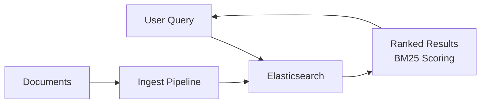
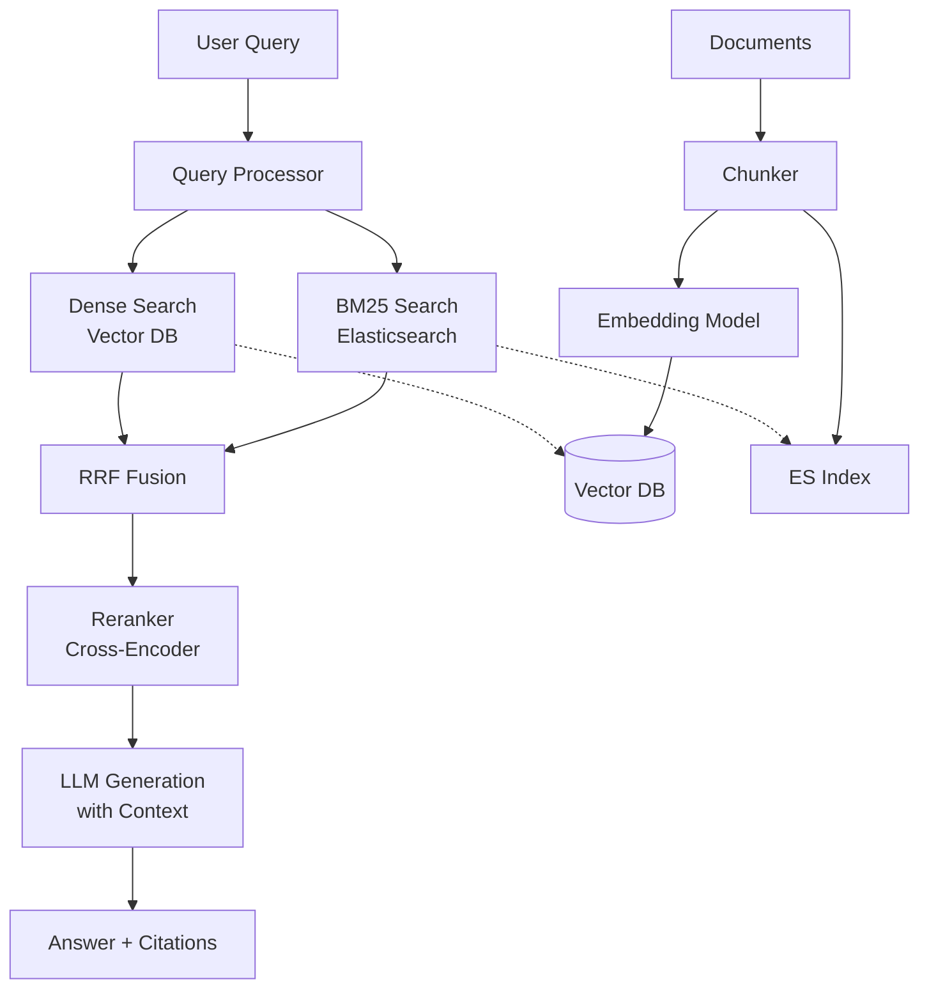
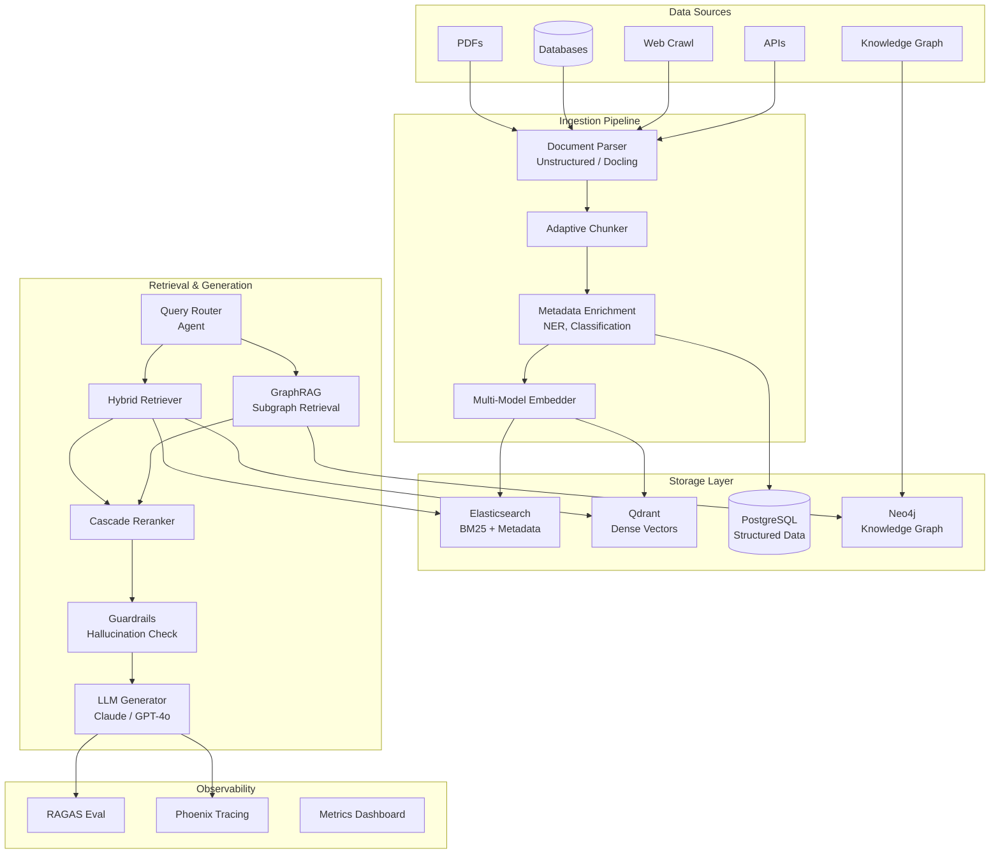
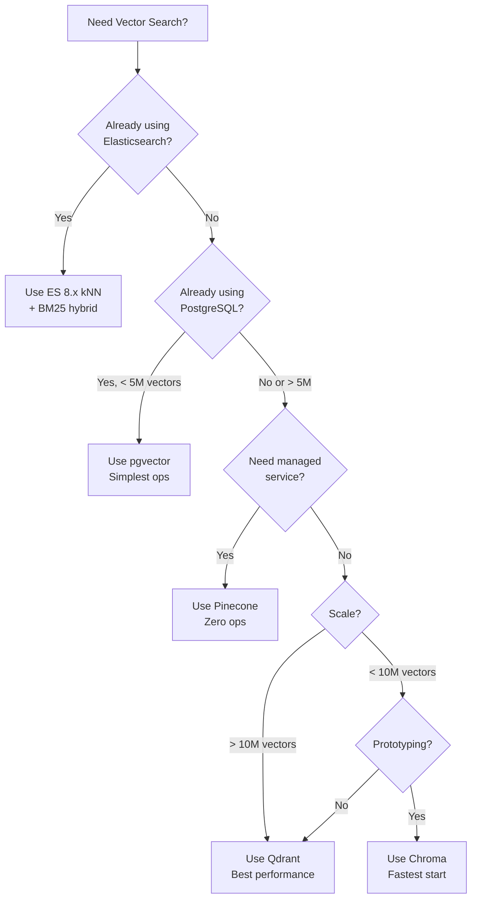

# Technical Report: Search & RAG (B12)
## By Dr. Praxis (R-Beta) -- MAESTRO Knowledge Graph
### Date: 2026-03-31 | Focus: Architecture, Implementation & Production Patterns

---

## 1. Architecture Overview

Three maturity tiers for Search & RAG systems, each building on the previous.

### 1.1 Simple: Keyword Search (Elasticsearch + BM25)



**When to use:** Internal document search, e-commerce product search, log analytics. No LLM cost, sub-50ms latency, battle-tested at scale.

**Core setup (docker-compose):**

```yaml
# docker-compose.yml
services:
  elasticsearch:
    image: elasticsearch:8.15.0
    environment:
      - discovery.type=single-node
      - xpack.security.enabled=false
      - ES_JAVA_OPTS=-Xms1g -Xmx1g
    ports:
      - "9200:9200"
    volumes:
      - es_data:/usr/share/elasticsearch/data

  kibana:
    image: kibana:8.15.0
    ports:
      - "5601:5601"
    depends_on:
      - elasticsearch

volumes:
  es_data:
```

**Index with Vietnamese analyzer:**

```python
from elasticsearch import Elasticsearch

es = Elasticsearch("http://localhost:9200")

# Create index with ICU analyzer for Vietnamese
es.indices.create(index="documents", body={
    "settings": {
        "analysis": {
            "analyzer": {
                "vietnamese_analyzer": {
                    "type": "custom",
                    "tokenizer": "icu_tokenizer",
                    "filter": ["icu_folding", "lowercase"]
                }
            }
        }
    },
    "mappings": {
        "properties": {
            "title":   {"type": "text", "analyzer": "vietnamese_analyzer"},
            "content": {"type": "text", "analyzer": "vietnamese_analyzer"},
            "source":  {"type": "keyword"},
            "created": {"type": "date"}
        }
    }
})

# Index a document
es.index(index="documents", body={
    "title": "Hướng dẫn triển khai hệ thống RAG",
    "content": "RAG kết hợp truy xuất thông tin với sinh văn bản...",
    "source": "internal_wiki",
    "created": "2026-03-01"
})

# BM25 search
results = es.search(index="documents", body={
    "query": {
        "multi_match": {
            "query": "triển khai RAG production",
            "fields": ["title^2", "content"],
            "type": "best_fields"
        }
    },
    "size": 10
})
for hit in results["hits"]["hits"]:
    print(f"{hit['_score']:.2f} | {hit['_source']['title']}")
```

---

### 1.2 Intermediate: Hybrid Search + RAG



**When to use:** Customer support Q&A, knowledge base search, documentation assistants. Handles synonyms and semantic queries that BM25 misses.

---

### 1.3 Advanced: Enterprise RAG Platform



**When to use:** Enterprise knowledge management, legal/compliance search, multi-department AI assistant. Justifies complexity when accuracy and auditability are critical.

---

## 2. Tech Stack

### 2.1 Stack by Layer

| Layer | Technology | Purpose | License/Pricing |
|-------|-----------|---------|-----------------|
| **Search Engine** | Elasticsearch 8.x | BM25 + kNN hybrid search | Elastic License 2.0 |
| **Search Engine** | OpenSearch 2.x | BM25 + neural search | Apache 2.0 |
| **Vector DB** | Qdrant | High-perf vector search, HNSW | Apache 2.0 |
| **Vector DB** | Weaviate | GraphQL API, modules ecosystem | BSD-3 |
| **Vector DB** | Chroma | Lightweight, in-process embedding | Apache 2.0 |
| **Vector DB** | pgvector | Postgres extension, familiar ops | PostgreSQL License |
| **Vector DB** | Pinecone | Fully managed, serverless | SaaS ($0.33/1M reads) |
| **Embeddings** | intfloat/e5-large-v2 | 1024-dim, strong MTEB | MIT |
| **Embeddings** | BAAI/bge-m3 | Multilingual, sparse+dense | MIT |
| **Embeddings** | sentence-transformers/all-MiniLM-L6-v2 | 384-dim, fast | Apache 2.0 |
| **Reranker** | Cohere Rerank 3.5 | API-based, multilingual | SaaS ($1/1K searches) |
| **Reranker** | BAAI/bge-reranker-v2-m3 | Open-source cross-encoder | MIT |
| **Reranker** | flashrank | Ultra-fast, CPU-friendly | Apache 2.0 |
| **Orchestration** | LangChain 0.3+ | Chains, agents, retriever abstractions | MIT |
| **Orchestration** | LlamaIndex 0.11+ | Data connectors, index abstractions | MIT |
| **LLM** | Claude 3.5/4 (Anthropic) | 200K context, strong instruction following | API pricing |
| **LLM** | GPT-4o (OpenAI) | Multimodal, function calling | API pricing |
| **LLM** | Llama 3.1 70B (local) | Self-hosted, no data egress | Meta License |
| **Evaluation** | RAGAS | Faithfulness, relevancy, context metrics | Apache 2.0 |
| **Tracing** | Arize Phoenix | LLM traces, spans, evals | Apache 2.0 |
| **Vietnamese NLP** | underthesea | Tokenization, NER, POS | GPL-3.0 |
| **Vietnamese NLP** | VnCoreNLP / PhoBERT | Word segmentation, embeddings | MIT |

### 2.2 Embedding Model Selection Guide

```python
# Quick benchmark to choose the right embedding model for your data
from sentence_transformers import SentenceTransformer
import time

models = {
    "fast":        "sentence-transformers/all-MiniLM-L6-v2",   # 384-dim, 80MB
    "balanced":    "intfloat/multilingual-e5-base",             # 768-dim, 278MB
    "accurate":    "BAAI/bge-m3",                               # 1024-dim, 567MB
}

test_queries = [
    "How to deploy RAG in production?",
    "Cách triển khai RAG trong thực tế?",   # Vietnamese
    "vector database comparison",
]
test_docs = [
    "RAG systems combine retrieval with generation for accurate AI responses.",
    "Hệ thống RAG kết hợp truy xuất với sinh văn bản để tạo câu trả lời chính xác.",
    "Qdrant and Weaviate are popular open-source vector databases for production use.",
]

for name, model_id in models.items():
    model = SentenceTransformer(model_id)
    start = time.time()
    q_embs = model.encode(test_queries, normalize_embeddings=True)
    d_embs = model.encode(test_docs, normalize_embeddings=True)
    elapsed = time.time() - start

    # Compute similarity matrix
    sims = q_embs @ d_embs.T
    print(f"\n--- {name} ({model_id}) ---")
    print(f"  Dim: {q_embs.shape[1]} | Time: {elapsed:.3f}s")
    print(f"  Similarity matrix:\n{sims.round(3)}")
```

---

## 3. Pipeline Design

### 3.1 Document Ingestion & Chunking

```python
"""
Ingestion pipeline: PDF/HTML/DOCX -> parsed text -> chunks -> embeddings -> vector DB
"""
from dataclasses import dataclass, field
from typing import Generator
import hashlib

@dataclass
class Chunk:
    id: str
    text: str
    metadata: dict = field(default_factory=dict)
    embedding: list[float] | None = None

class ChunkingStrategy:
    """Recursive character splitting with overlap, respecting sentence boundaries."""

    def __init__(self, chunk_size: int = 512, overlap: int = 64, separators: list[str] | None = None):
        self.chunk_size = chunk_size
        self.overlap = overlap
        self.separators = separators or ["\n\n", "\n", ". ", " "]

    def chunk(self, text: str, metadata: dict | None = None) -> list[Chunk]:
        metadata = metadata or {}
        splits = self._recursive_split(text, self.separators)
        chunks = []
        current = ""

        for split in splits:
            if len(current) + len(split) > self.chunk_size and current:
                chunk_id = hashlib.sha256(current.encode()).hexdigest()[:16]
                chunks.append(Chunk(
                    id=chunk_id,
                    text=current.strip(),
                    metadata={**metadata, "chunk_index": len(chunks)}
                ))
                # Keep overlap from the end of current chunk
                overlap_text = current[-self.overlap:] if self.overlap else ""
                current = overlap_text + split
            else:
                current += split

        if current.strip():
            chunk_id = hashlib.sha256(current.encode()).hexdigest()[:16]
            chunks.append(Chunk(
                id=chunk_id,
                text=current.strip(),
                metadata={**metadata, "chunk_index": len(chunks)}
            ))
        return chunks

    def _recursive_split(self, text: str, separators: list[str]) -> list[str]:
        if not separators:
            return [text[i:i+self.chunk_size] for i in range(0, len(text), self.chunk_size)]

        sep = separators[0]
        parts = text.split(sep)
        result = []
        for part in parts:
            if len(part) > self.chunk_size:
                result.extend(self._recursive_split(part, separators[1:]))
            else:
                result.append(part + sep)
        return result


# --- Ingestion with unstructured ---
from unstructured.partition.auto import partition

def ingest_document(file_path: str) -> list[Chunk]:
    """Parse any document format and return chunks."""
    elements = partition(filename=file_path)
    full_text = "\n\n".join(str(el) for el in elements)

    chunker = ChunkingStrategy(chunk_size=512, overlap=64)
    chunks = chunker.chunk(full_text, metadata={"source": file_path})
    return chunks
```

### 3.2 Embedding Generation & Indexing

```python
"""
Batch embedding + indexing into Qdrant
"""
from qdrant_client import QdrantClient, models
from sentence_transformers import SentenceTransformer
import numpy as np

COLLECTION = "documents"
EMBED_MODEL = "BAAI/bge-m3"
EMBED_DIM = 1024
BATCH_SIZE = 64

def create_index(client: QdrantClient):
    client.create_collection(
        collection_name=COLLECTION,
        vectors_config=models.VectorParams(
            size=EMBED_DIM,
            distance=models.Distance.COSINE,
        ),
        # Enable payload indexing for filtered search
        optimizers_config=models.OptimizersConfigDiff(
            indexing_threshold=20000,
        ),
    )
    # Create payload indexes for common filters
    client.create_payload_index(COLLECTION, "source", models.PayloadSchemaType.KEYWORD)
    client.create_payload_index(COLLECTION, "created", models.PayloadSchemaType.DATETIME)

def embed_and_index(client: QdrantClient, chunks: list[Chunk]):
    model = SentenceTransformer(EMBED_MODEL)

    for i in range(0, len(chunks), BATCH_SIZE):
        batch = chunks[i:i + BATCH_SIZE]
        texts = [c.text for c in batch]
        embeddings = model.encode(texts, normalize_embeddings=True, show_progress_bar=False)

        client.upsert(
            collection_name=COLLECTION,
            points=[
                models.PointStruct(
                    id=idx + i,
                    vector=emb.tolist(),
                    payload={"text": chunk.text, **chunk.metadata}
                )
                for idx, (chunk, emb) in enumerate(zip(batch, embeddings))
            ]
        )
    print(f"Indexed {len(chunks)} chunks into '{COLLECTION}'")
```

### 3.3 Query Processing

```python
"""
Query understanding: expansion, rewriting, and classification.
"""
import anthropic

client = anthropic.Anthropic()

def rewrite_query(user_query: str, chat_history: list[dict] | None = None) -> dict:
    """
    Use LLM to:
    1. Resolve coreferences from chat history
    2. Expand acronyms
    3. Generate sub-queries for complex questions
    """
    system = """You are a search query optimizer. Given a user query (and optional chat history),
output a JSON object with:
- "rewritten": the clarified standalone query
- "sub_queries": list of 1-3 sub-queries for retrieval (decompose if complex)
- "filters": any detected metadata filters (e.g., date ranges, source types)
Only output valid JSON, no markdown."""

    messages = []
    if chat_history:
        messages.extend(chat_history)
    messages.append({"role": "user", "content": user_query})

    response = client.messages.create(
        model="claude-sonnet-4-20250514",
        max_tokens=300,
        system=system,
        messages=[{"role": "user", "content": f"Chat history: {chat_history}\n\nLatest query: {user_query}"}]
    )
    import json
    return json.loads(response.content[0].text)


# Example
result = rewrite_query(
    "What about its pricing?",
    chat_history=[
        {"role": "user", "content": "Tell me about Qdrant"},
        {"role": "assistant", "content": "Qdrant is an open-source vector database..."}
    ]
)
# Output: {"rewritten": "What is Qdrant's pricing model?",
#          "sub_queries": ["Qdrant pricing tiers", "Qdrant cloud costs"],
#          "filters": {}}
```

### 3.4 Retrieval: Sparse + Dense + Hybrid

```python
"""
Hybrid retrieval with Reciprocal Rank Fusion (RRF).
"""
from elasticsearch import Elasticsearch
from qdrant_client import QdrantClient, models
from sentence_transformers import SentenceTransformer

class HybridRetriever:
    def __init__(
        self,
        es_client: Elasticsearch,
        qdrant_client: QdrantClient,
        embed_model: SentenceTransformer,
        es_index: str = "documents",
        qdrant_collection: str = "documents",
        rrf_k: int = 60,
    ):
        self.es = es_client
        self.qdrant = qdrant_client
        self.embed_model = embed_model
        self.es_index = es_index
        self.qdrant_collection = qdrant_collection
        self.rrf_k = rrf_k

    def search_bm25(self, query: str, top_k: int = 50) -> list[dict]:
        """Sparse retrieval via Elasticsearch BM25."""
        resp = self.es.search(index=self.es_index, body={
            "query": {"multi_match": {"query": query, "fields": ["title^2", "content"]}},
            "size": top_k,
            "_source": ["text", "source", "chunk_index"]
        })
        return [
            {"id": hit["_id"], "text": hit["_source"]["text"],
             "score": hit["_score"], "metadata": hit["_source"]}
            for hit in resp["hits"]["hits"]
        ]

    def search_dense(self, query: str, top_k: int = 50) -> list[dict]:
        """Dense retrieval via Qdrant."""
        q_embedding = self.embed_model.encode(query, normalize_embeddings=True).tolist()
        results = self.qdrant.query_points(
            collection_name=self.qdrant_collection,
            query=q_embedding,
            limit=top_k,
            with_payload=True,
        )
        return [
            {"id": str(pt.id), "text": pt.payload["text"],
             "score": pt.score, "metadata": pt.payload}
            for pt in results.points
        ]

    def hybrid_search(self, query: str, top_k: int = 20) -> list[dict]:
        """Combine BM25 + dense results using RRF."""
        bm25_results = self.search_bm25(query, top_k=50)
        dense_results = self.search_dense(query, top_k=50)

        # Build rank maps
        rrf_scores: dict[str, float] = {}
        doc_map: dict[str, dict] = {}

        for rank, doc in enumerate(bm25_results, start=1):
            doc_id = doc["id"]
            rrf_scores[doc_id] = rrf_scores.get(doc_id, 0) + 1.0 / (self.rrf_k + rank)
            doc_map[doc_id] = doc

        for rank, doc in enumerate(dense_results, start=1):
            doc_id = doc["id"]
            rrf_scores[doc_id] = rrf_scores.get(doc_id, 0) + 1.0 / (self.rrf_k + rank)
            doc_map[doc_id] = doc

        # Sort by RRF score
        sorted_ids = sorted(rrf_scores, key=rrf_scores.get, reverse=True)[:top_k]
        return [
            {**doc_map[doc_id], "rrf_score": rrf_scores[doc_id]}
            for doc_id in sorted_ids
        ]
```

### 3.5 Reranking

```python
"""
Two reranking options: API-based (Cohere) and local (cross-encoder).
"""

# Option A: Cohere Rerank API
import cohere

def rerank_cohere(query: str, documents: list[dict], top_n: int = 5) -> list[dict]:
    co = cohere.ClientV2()
    texts = [d["text"] for d in documents]
    response = co.rerank(
        model="rerank-v3.5",
        query=query,
        documents=texts,
        top_n=top_n,
    )
    return [
        {**documents[r.index], "rerank_score": r.relevance_score}
        for r in response.results
    ]


# Option B: Local cross-encoder (no API cost)
from sentence_transformers import CrossEncoder

def rerank_local(query: str, documents: list[dict], top_n: int = 5) -> list[dict]:
    model = CrossEncoder("BAAI/bge-reranker-v2-m3", max_length=512)
    pairs = [(query, d["text"]) for d in documents]
    scores = model.predict(pairs)

    ranked_indices = scores.argsort()[::-1][:top_n]
    return [
        {**documents[i], "rerank_score": float(scores[i])}
        for i in ranked_indices
    ]
```

### 3.6 Generation (LLM with Retrieved Context)

```python
"""
RAG generation with citations and streaming.
"""
import anthropic
from typing import Generator

def generate_rag_answer(
    query: str,
    context_docs: list[dict],
    model: str = "claude-sonnet-4-20250514",
    stream: bool = True,
) -> str | Generator[str, None, None]:

    # Format context with source indices for citation
    context_block = "\n\n".join(
        f"[Source {i+1}] (from: {doc.get('metadata', {}).get('source', 'unknown')})\n{doc['text']}"
        for i, doc in enumerate(context_docs)
    )

    system_prompt = """You are a precise research assistant. Answer the user's question
based ONLY on the provided sources. Rules:
1. Cite sources using [Source N] notation inline
2. If the sources don't contain enough information, say so explicitly
3. Never fabricate information not present in the sources
4. Be concise but thorough"""

    user_message = f"""## Retrieved Sources:
{context_block}

## Question:
{query}

## Answer:"""

    client = anthropic.Anthropic()

    if stream:
        def _stream():
            with client.messages.stream(
                model=model,
                max_tokens=1024,
                system=system_prompt,
                messages=[{"role": "user", "content": user_message}],
            ) as stream:
                for text in stream.text_stream:
                    yield text
        return _stream()
    else:
        response = client.messages.create(
            model=model,
            max_tokens=1024,
            system=system_prompt,
            messages=[{"role": "user", "content": user_message}],
        )
        return response.content[0].text
```

### 3.7 Evaluation & Feedback

```python
"""
RAG evaluation using RAGAS framework.
"""
from ragas import evaluate
from ragas.metrics import faithfulness, answer_relevancy, context_precision, context_recall
from datasets import Dataset

def evaluate_rag_pipeline(
    questions: list[str],
    answers: list[str],
    contexts: list[list[str]],
    ground_truths: list[str],
) -> dict:
    """
    Evaluate RAG pipeline on 4 key metrics:
    - Faithfulness: Is the answer grounded in the context? (0-1)
    - Answer Relevancy: Does the answer address the question? (0-1)
    - Context Precision: Are retrieved docs relevant? (0-1)
    - Context Recall: Do retrieved docs cover the ground truth? (0-1)
    """
    eval_dataset = Dataset.from_dict({
        "question": questions,
        "answer": answers,
        "contexts": contexts,
        "ground_truth": ground_truths,
    })

    results = evaluate(
        eval_dataset,
        metrics=[faithfulness, answer_relevancy, context_precision, context_recall],
    )

    print(f"Faithfulness:      {results['faithfulness']:.3f}")
    print(f"Answer Relevancy:  {results['answer_relevancy']:.3f}")
    print(f"Context Precision: {results['context_precision']:.3f}")
    print(f"Context Recall:    {results['context_recall']:.3f}")
    return results

# Tracing with Phoenix
import phoenix as px

def setup_tracing():
    """Launch Phoenix for LLM observability."""
    session = px.launch_app()
    print(f"Phoenix UI: {session.url}")

    # Auto-instrument LangChain or LlamaIndex
    from phoenix.otel import register
    tracer_provider = register(project_name="rag-pipeline")

    # Now all LangChain/LlamaIndex calls are auto-traced
    from openinference.instrumentation.langchain import LangChainInstrumentor
    LangChainInstrumentor().instrument(tracer_provider=tracer_provider)
```

---

## 4. Mini Examples

### Example 1: Quick Start -- Build a RAG Q&A System in 30 Minutes

**Goal:** PDF ingestion, chunking, embedding, Q&A with Claude.
**Stack:** LangChain + Chroma + Claude API
**Level:** Beginner

```bash
# Setup
pip install langchain langchain-anthropic langchain-chroma langchain-community \
    chromadb pypdf sentence-transformers
```

```python
"""
quick_rag.py - Complete RAG Q&A in ~50 lines of core logic.
"""
from langchain_community.document_loaders import PyPDFLoader
from langchain.text_splitter import RecursiveCharacterTextSplitter
from langchain_chroma import Chroma
from langchain_community.embeddings import HuggingFaceEmbeddings
from langchain_anthropic import ChatAnthropic
from langchain.chains import RetrievalQA
from langchain.prompts import PromptTemplate

# 1. Load PDF
loader = PyPDFLoader("company_handbook.pdf")
pages = loader.load()
print(f"Loaded {len(pages)} pages")

# 2. Chunk
splitter = RecursiveCharacterTextSplitter(
    chunk_size=500,
    chunk_overlap=50,
    separators=["\n\n", "\n", ". ", " "]
)
chunks = splitter.split_documents(pages)
print(f"Created {len(chunks)} chunks")

# 3. Embed + Store
embeddings = HuggingFaceEmbeddings(
    model_name="sentence-transformers/all-MiniLM-L6-v2"
)
vectorstore = Chroma.from_documents(
    documents=chunks,
    embedding=embeddings,
    persist_directory="./chroma_db"
)
print(f"Indexed into Chroma")

# 4. RAG Chain
llm = ChatAnthropic(model="claude-sonnet-4-20250514", temperature=0)

prompt = PromptTemplate(
    template="""Use the following context to answer the question.
If the context doesn't contain the answer, say "I don't have enough information."
Cite the relevant section when possible.

Context:
{context}

Question: {question}

Answer:""",
    input_variables=["context", "question"]
)

qa_chain = RetrievalQA.from_chain_type(
    llm=llm,
    chain_type="stuff",
    retriever=vectorstore.as_retriever(search_kwargs={"k": 4}),
    chain_type_kwargs={"prompt": prompt},
    return_source_documents=True,
)

# 5. Query
result = qa_chain.invoke({"query": "What is the company's remote work policy?"})
print(f"\nAnswer: {result['result']}")
print(f"\nSources ({len(result['source_documents'])}):")
for doc in result['source_documents']:
    print(f"  - Page {doc.metadata['page']}: {doc.page_content[:100]}...")
```

**Run it:**
```bash
export ANTHROPIC_API_KEY="sk-ant-..."
python quick_rag.py
```

**Expected output:**
```
Loaded 42 pages
Created 186 chunks
Indexed into Chroma
Answer: According to the company handbook, the remote work policy allows employees
to work from home up to 3 days per week with manager approval [Section 4.2]...
Sources (4):
  - Page 12: Section 4.2 Remote Work Policy. Employees in good standing may...
  - Page 13: Remote work equipment will be provided including...
```

---

### Example 2: Production -- Enterprise Hybrid Search + RAG Platform

**Goal:** Multi-source ingestion, hybrid BM25+vector search, reranking, streaming answers with citations.
**Stack:** FastAPI + Elasticsearch + Qdrant + Cohere Rerank + Claude
**Level:** Advanced

```bash
pip install fastapi uvicorn elasticsearch qdrant-client cohere anthropic \
    sentence-transformers unstructured python-multipart
```

**Project structure:**
```
enterprise_rag/
├── main.py              # FastAPI app
├── config.py            # Settings
├── ingestion.py         # Document processing
├── retriever.py         # Hybrid search
├── generator.py         # RAG generation
└── docker-compose.yml   # Infrastructure
```

**`config.py`:**

```python
from pydantic_settings import BaseSettings

class Settings(BaseSettings):
    # Elasticsearch
    es_url: str = "http://localhost:9200"
    es_index: str = "rag_documents"

    # Qdrant
    qdrant_url: str = "http://localhost:6333"
    qdrant_collection: str = "rag_documents"

    # Models
    embed_model: str = "BAAI/bge-m3"
    embed_dim: int = 1024
    rerank_model: str = "rerank-v3.5"
    llm_model: str = "claude-sonnet-4-20250514"

    # Retrieval
    bm25_top_k: int = 50
    dense_top_k: int = 50
    rerank_top_n: int = 5
    rrf_k: int = 60
    chunk_size: int = 512
    chunk_overlap: int = 64

    class Config:
        env_prefix = "RAG_"

settings = Settings()
```

**`ingestion.py`:**

```python
import hashlib
from pathlib import Path
from unstructured.partition.auto import partition
from elasticsearch import Elasticsearch
from qdrant_client import QdrantClient, models
from sentence_transformers import SentenceTransformer
from config import settings

embedder = SentenceTransformer(settings.embed_model)

def ingest_file(file_path: str, es: Elasticsearch, qdrant: QdrantClient) -> int:
    """Ingest a single file into both ES and Qdrant."""
    elements = partition(filename=file_path)
    full_text = "\n\n".join(str(el) for el in elements)

    # Chunk
    chunks = recursive_chunk(full_text, settings.chunk_size, settings.chunk_overlap)

    # Embed
    texts = [c["text"] for c in chunks]
    embeddings = embedder.encode(texts, normalize_embeddings=True, batch_size=64)

    # Index into Elasticsearch (BM25)
    for i, chunk in enumerate(chunks):
        doc_id = hashlib.sha256(f"{file_path}:{i}".encode()).hexdigest()[:16]
        es.index(index=settings.es_index, id=doc_id, body={
            "text": chunk["text"],
            "source": str(file_path),
            "chunk_index": i,
        })

    # Index into Qdrant (dense)
    qdrant.upsert(
        collection_name=settings.qdrant_collection,
        points=[
            models.PointStruct(
                id=hashlib.sha256(f"{file_path}:{i}".encode()).hexdigest()[:16],
                vector=embeddings[i].tolist(),
                payload={"text": c["text"], "source": str(file_path), "chunk_index": i}
            )
            for i, c in enumerate(chunks)
        ]
    )
    return len(chunks)

def recursive_chunk(text: str, size: int, overlap: int) -> list[dict]:
    """Simple recursive chunker."""
    separators = ["\n\n", "\n", ". ", " "]
    chunks = []
    start = 0
    while start < len(text):
        end = start + size
        if end < len(text):
            # Try to break at a separator
            for sep in separators:
                last_sep = text[start:end].rfind(sep)
                if last_sep > size // 2:
                    end = start + last_sep + len(sep)
                    break
        chunk_text = text[start:end].strip()
        if chunk_text:
            chunks.append({"text": chunk_text})
        start = end - overlap
    return chunks
```

**`retriever.py`:**

```python
import cohere
from elasticsearch import Elasticsearch
from qdrant_client import QdrantClient
from sentence_transformers import SentenceTransformer
from config import settings

embedder = SentenceTransformer(settings.embed_model)
co = cohere.ClientV2()

def hybrid_search(query: str, es: Elasticsearch, qdrant: QdrantClient) -> list[dict]:
    """Hybrid BM25 + dense retrieval with RRF fusion and reranking."""

    # BM25
    bm25_resp = es.search(index=settings.es_index, body={
        "query": {"match": {"text": query}},
        "size": settings.bm25_top_k,
    })
    bm25_docs = [
        {"id": h["_id"], "text": h["_source"]["text"], "source": h["_source"].get("source", "")}
        for h in bm25_resp["hits"]["hits"]
    ]

    # Dense
    q_vec = embedder.encode(query, normalize_embeddings=True).tolist()
    dense_resp = qdrant.query_points(
        collection_name=settings.qdrant_collection,
        query=q_vec,
        limit=settings.dense_top_k,
        with_payload=True,
    )
    dense_docs = [
        {"id": str(p.id), "text": p.payload["text"], "source": p.payload.get("source", "")}
        for p in dense_resp.points
    ]

    # RRF Fusion
    rrf_scores = {}
    doc_map = {}
    for rank, doc in enumerate(bm25_docs, 1):
        rrf_scores[doc["id"]] = rrf_scores.get(doc["id"], 0) + 1.0 / (settings.rrf_k + rank)
        doc_map[doc["id"]] = doc
    for rank, doc in enumerate(dense_docs, 1):
        rrf_scores[doc["id"]] = rrf_scores.get(doc["id"], 0) + 1.0 / (settings.rrf_k + rank)
        doc_map[doc["id"]] = doc

    sorted_ids = sorted(rrf_scores, key=rrf_scores.get, reverse=True)[:20]
    fused = [{**doc_map[did], "rrf_score": rrf_scores[did]} for did in sorted_ids]

    # Rerank with Cohere
    if fused:
        rerank_resp = co.rerank(
            model=settings.rerank_model,
            query=query,
            documents=[d["text"] for d in fused],
            top_n=settings.rerank_top_n,
        )
        return [
            {**fused[r.index], "rerank_score": r.relevance_score}
            for r in rerank_resp.results
        ]
    return []
```

**`main.py`:**

```python
"""
Enterprise RAG API with FastAPI.
Run: uvicorn main:app --reload --port 8000
"""
from fastapi import FastAPI, UploadFile, File
from fastapi.responses import StreamingResponse
from elasticsearch import Elasticsearch
from qdrant_client import QdrantClient, models
import anthropic
import tempfile
import json

from config import settings
from ingestion import ingest_file
from retriever import hybrid_search

app = FastAPI(title="Enterprise RAG API", version="1.0.0")

# Clients
es = Elasticsearch(settings.es_url)
qdrant = QdrantClient(url=settings.qdrant_url)
llm_client = anthropic.Anthropic()

@app.on_event("startup")
async def startup():
    """Initialize indexes if they don't exist."""
    if not es.indices.exists(index=settings.es_index):
        es.indices.create(index=settings.es_index, body={
            "mappings": {"properties": {
                "text": {"type": "text"},
                "source": {"type": "keyword"},
                "chunk_index": {"type": "integer"},
            }}
        })

    collections = [c.name for c in qdrant.get_collections().collections]
    if settings.qdrant_collection not in collections:
        qdrant.create_collection(
            collection_name=settings.qdrant_collection,
            vectors_config=models.VectorParams(size=settings.embed_dim, distance=models.Distance.COSINE),
        )


@app.post("/ingest")
async def ingest_endpoint(file: UploadFile = File(...)):
    """Upload and ingest a document."""
    with tempfile.NamedTemporaryFile(delete=False, suffix=f"_{file.filename}") as tmp:
        content = await file.read()
        tmp.write(content)
        tmp_path = tmp.name

    num_chunks = ingest_file(tmp_path, es, qdrant)
    return {"filename": file.filename, "chunks_indexed": num_chunks}


@app.get("/search")
async def search_endpoint(q: str, top_k: int = 5):
    """Hybrid search without generation."""
    results = hybrid_search(q, es, qdrant)
    return {"query": q, "results": results[:top_k]}


@app.get("/ask")
async def ask_endpoint(q: str):
    """RAG: retrieve + generate with streaming response."""
    # Retrieve
    context_docs = hybrid_search(q, es, qdrant)

    if not context_docs:
        return {"answer": "No relevant documents found.", "sources": []}

    # Build context
    context_block = "\n\n".join(
        f"[Source {i+1}] ({doc['source']})\n{doc['text']}"
        for i, doc in enumerate(context_docs)
    )

    # Stream generation
    def stream_response():
        with llm_client.messages.stream(
            model=settings.llm_model,
            max_tokens=1024,
            system="Answer based ONLY on the provided sources. Cite using [Source N]. "
                   "If sources are insufficient, say so.",
            messages=[{"role": "user", "content": f"Sources:\n{context_block}\n\nQuestion: {q}"}],
        ) as stream:
            for text in stream.text_stream:
                yield f"data: {json.dumps({'text': text})}\n\n"

        # Send sources at the end
        yield f"data: {json.dumps({'sources': [d['source'] for d in context_docs]})}\n\n"
        yield "data: [DONE]\n\n"

    return StreamingResponse(stream_response(), media_type="text/event-stream")


@app.get("/health")
async def health():
    return {
        "elasticsearch": es.ping(),
        "qdrant": qdrant.get_collections() is not None,
        "status": "ok"
    }
```

**`docker-compose.yml`:**

```yaml
services:
  elasticsearch:
    image: elasticsearch:8.15.0
    environment:
      - discovery.type=single-node
      - xpack.security.enabled=false
      - ES_JAVA_OPTS=-Xms1g -Xmx1g
    ports: ["9200:9200"]
    volumes: [es_data:/usr/share/elasticsearch/data]

  qdrant:
    image: qdrant/qdrant:v1.12.0
    ports: ["6333:6333"]
    volumes: [qdrant_data:/qdrant/storage]

  app:
    build: .
    ports: ["8000:8000"]
    environment:
      - RAG_ES_URL=http://elasticsearch:9200
      - RAG_QDRANT_URL=http://qdrant:6333
      - ANTHROPIC_API_KEY=${ANTHROPIC_API_KEY}
      - COHERE_API_KEY=${COHERE_API_KEY}
    depends_on: [elasticsearch, qdrant]

volumes:
  es_data:
  qdrant_data:
```

**Test it:**
```bash
# Start infrastructure
docker compose up -d elasticsearch qdrant

# Run the app
uvicorn main:app --reload --port 8000

# Ingest a document
curl -X POST http://localhost:8000/ingest \
  -F "file=@company_handbook.pdf"

# Search
curl "http://localhost:8000/search?q=remote+work+policy"

# Ask with RAG (streaming)
curl -N "http://localhost:8000/ask?q=What+is+the+remote+work+policy?"
```

---

## 5. Integration Patterns

### 5.1 CMS Integration (WordPress/Strapi)

```python
"""
Webhook-based ingestion: CMS publishes -> webhook triggers re-indexing.
"""
from fastapi import FastAPI, Request

@app.post("/webhooks/cms")
async def cms_webhook(request: Request):
    """Handle CMS content update webhooks."""
    payload = await request.json()
    event = payload.get("event")  # "entry.create", "entry.update", "entry.delete"

    if event in ("entry.create", "entry.update"):
        content = payload["entry"]
        chunks = chunk_text(f"{content['title']}\n\n{content['body']}")
        embed_and_index(chunks, metadata={
            "source": "cms",
            "cms_id": content["id"],
            "content_type": content["type"],
            "updated_at": content["updatedAt"],
        })
        return {"status": "indexed", "chunks": len(chunks)}

    elif event == "entry.delete":
        delete_by_metadata(source="cms", cms_id=payload["entry"]["id"])
        return {"status": "deleted"}
```

### 5.2 Database Connector (SQL -> RAG)

```python
"""
Periodically sync database records into the RAG index.
"""
import sqlalchemy as sa
from datetime import datetime, timedelta

def sync_database_to_rag(
    db_url: str,
    table: str,
    text_columns: list[str],
    last_sync: datetime | None = None,
):
    engine = sa.create_engine(db_url)
    query = f"SELECT * FROM {table}"
    if last_sync:
        query += f" WHERE updated_at > '{last_sync.isoformat()}'"

    with engine.connect() as conn:
        rows = conn.execute(sa.text(query)).fetchall()

    for row in rows:
        text = " | ".join(str(row[col]) for col in text_columns if row[col])
        chunks = chunk_text(text)
        embed_and_index(chunks, metadata={
            "source": "database",
            "table": table,
            "record_id": str(row["id"]),
        })

    return len(rows)
```

### 5.3 Vietnamese Platform Integration

```python
"""
Vietnamese-specific preprocessing for better retrieval quality.
"""
from underthesea import word_tokenize, ner

def preprocess_vietnamese(text: str) -> dict:
    """Segment Vietnamese text and extract entities for metadata enrichment."""
    # Word segmentation (critical for Vietnamese search quality)
    segmented = word_tokenize(text, format="text")

    # NER for metadata
    entities = ner(text)
    named_entities = {
        "persons": [e[0] for e in entities if e[3].endswith("PER")],
        "organizations": [e[0] for e in entities if e[3].endswith("ORG")],
        "locations": [e[0] for e in entities if e[3].endswith("LOC")],
    }

    return {
        "original": text,
        "segmented": segmented,  # Use this for BM25 indexing
        "entities": named_entities,  # Store as metadata for filtering
    }

# When indexing Vietnamese documents:
# - Store segmented text in ES for better BM25 matching
# - Use multilingual embedding model (bge-m3) for dense retrieval
# - Original text goes to LLM for generation
```

---

## 6. Performance & Cost

### 6.1 Latency Breakdown (Typical RAG Query)

| Stage | Latency | Notes |
|-------|---------|-------|
| Query rewriting (LLM) | 200-500ms | Optional, skip for simple queries |
| BM25 search (ES) | 5-20ms | Sub-linear with inverted index |
| Dense search (Qdrant) | 10-30ms | HNSW, ~1M vectors |
| RRF fusion | <1ms | In-memory rank merge |
| Reranking (Cohere API) | 100-300ms | 20 docs, network overhead |
| Reranking (local cross-encoder) | 50-150ms | GPU, 20 docs |
| LLM generation | 500-2000ms | Depends on output length |
| **Total (with rewrite)** | **~900-3000ms** | |
| **Total (no rewrite)** | **~700-2500ms** | |

### 6.2 Cost Analysis (per 1,000 RAG Queries)

| Component | Cost/1K Queries | Assumptions |
|-----------|----------------|-------------|
| Embedding (encode query) | ~$0.00 | Local model, amortized GPU |
| Elasticsearch hosting | ~$0.03 | $50/mo shared, prorated |
| Qdrant hosting | ~$0.03 | $50/mo for 1M vectors |
| Cohere Rerank | $1.00 | $1/1K searches |
| Claude Sonnet (generation) | $1.50 | ~500 input + 200 output tokens avg |
| Claude Opus (if needed) | $7.50 | 5x Sonnet pricing |
| **Total (Sonnet + Cohere)** | **~$2.56** | |
| **Total (local reranker)** | **~$1.56** | No Cohere cost |

### 6.3 Embedding Generation Cost (One-Time Indexing)

| Corpus Size | Chunks (~500 tokens) | Embed Time (GPU) | Embed Time (CPU) | Qdrant Storage |
|-------------|---------------------|-------------------|-------------------|----------------|
| 1K docs | ~5K | ~30s | ~5min | ~20MB |
| 10K docs | ~50K | ~5min | ~1hr | ~200MB |
| 100K docs | ~500K | ~1hr | ~12hr | ~2GB |
| 1M docs | ~5M | ~10hr | N/A (use GPU) | ~20GB |

### 6.4 Optimization Strategies

```python
"""
Key optimizations for production RAG systems.
"""

# 1. Caching: Cache frequent queries and their results
from functools import lru_cache
import hashlib

@lru_cache(maxsize=1000)
def cached_embed(text: str) -> tuple:
    """Cache query embeddings to avoid re-computation."""
    return tuple(embedder.encode(text, normalize_embeddings=True).tolist())

# 2. Batch reranking: Process multiple queries in parallel
import asyncio

async def batch_rerank(queries_and_docs: list[tuple[str, list[dict]]]) -> list[list[dict]]:
    tasks = [
        asyncio.to_thread(rerank_cohere, q, docs)
        for q, docs in queries_and_docs
    ]
    return await asyncio.gather(*tasks)

# 3. Quantization: Reduce vector storage by 4x with minimal quality loss
def create_quantized_collection(client: QdrantClient, name: str, dim: int):
    client.create_collection(
        collection_name=name,
        vectors_config=models.VectorParams(size=dim, distance=models.Distance.COSINE),
        quantization_config=models.ScalarQuantization(
            scalar=models.ScalarQuantizationConfig(
                type=models.ScalarType.INT8,
                quantile=0.99,
                always_ram=True,
            )
        ),
    )

# 4. Prefetch + two-stage retrieval in Qdrant
def optimized_dense_search(client: QdrantClient, query_vec: list[float]):
    """Qdrant prefetch: fast overselection + precise rescoring."""
    return client.query_points(
        collection_name="documents",
        prefetch=models.Prefetch(
            query=query_vec,
            using="fast_vectors",  # quantized
            limit=200,
        ),
        query=query_vec,  # rescore with full precision
        limit=50,
    )
```

---

## 7. Technology Selection Matrix

### 7.1 Vector Database Comparison

| Criteria | Elasticsearch 8.x | Qdrant | Weaviate | Chroma | pgvector | Pinecone |
|----------|-------------------|--------|----------|--------|----------|----------|
| **Primary Use** | Hybrid (BM25+kNN) | Pure vector search | Modular vector DB | Lightweight embed DB | Postgres extension | Managed vector DB |
| **ANN Algorithm** | HNSW | HNSW (custom) | HNSW | HNSW (via hnswlib) | IVFFlat, HNSW | Proprietary |
| **Hybrid Search** | Native | Native (sparse+dense) | Native (BM25+vector) | No | Manual (with FTS) | Sparse+dense |
| **Filtering** | Full Lucene DSL | Payload filters, fast | GraphQL filters | Where clause | SQL WHERE | Metadata filters |
| **Max Scale** | Billions (sharded) | 100M+ per node | 100M+ per node | <1M (in-process) | ~10M practical | Billions (managed) |
| **Quantization** | None (kNN only) | Scalar, Product, Binary | PQ, BQ | None | None | Automatic |
| **Multi-tenancy** | Index per tenant | Collection/payload | Class-based | Collection | Schema/RLS | Namespace |
| **Latency (1M vectors)** | 10-30ms | 5-15ms | 10-25ms | 5-10ms (in-proc) | 20-50ms | 10-30ms |
| **Ops Complexity** | High (JVM tuning) | Low-Medium | Medium | Very Low | Very Low (it's PG) | None (managed) |
| **Cost (1M vectors)** | $200+/mo | $50-100/mo | $75-150/mo | Free (in-process) | $0 (existing PG) | $70/mo (serverless) |
| **Best For** | Already using ES, need hybrid | High-perf vector workloads | GraphQL-native apps | Prototyping, small apps | Already on Postgres | Zero-ops, enterprise |
| **License** | Elastic License 2.0 | Apache 2.0 | BSD-3 | Apache 2.0 | PostgreSQL | Proprietary SaaS |

### 7.2 Decision Flowchart



### 7.3 Embedding Model Comparison

| Model | Dimensions | MTEB Avg | Multilingual | Max Tokens | Size | Speed |
|-------|-----------|----------|--------------|------------|------|-------|
| all-MiniLM-L6-v2 | 384 | 56.3 | No | 512 | 80MB | Very Fast |
| bge-base-en-v1.5 | 768 | 63.6 | No | 512 | 220MB | Fast |
| multilingual-e5-large | 1024 | 61.5 | Yes (100 langs) | 512 | 560MB | Medium |
| bge-m3 | 1024 | 66.1 | Yes (100+ langs) | 8192 | 567MB | Medium |
| nomic-embed-text-v1.5 | 768 | 62.3 | No | 8192 | 274MB | Fast |
| text-embedding-3-large (OpenAI) | 3072 | 64.6 | Yes | 8191 | API | API |

**Recommendation for Vietnamese + English:** Use `BAAI/bge-m3` -- strong multilingual performance, supports both sparse and dense retrieval natively, 8K context window for long documents.

---

## Appendix: Quick Reference

### A. Essential Commands

```bash
# Start local dev infrastructure
docker compose up -d

# Test Elasticsearch
curl http://localhost:9200/_cat/indices?v

# Test Qdrant
curl http://localhost:6333/collections

# Run RAGAS evaluation
python -m ragas.eval --dataset eval_data.json --metrics faithfulness,answer_relevancy

# Monitor with Phoenix
python -c "import phoenix as px; px.launch_app()"
```

### B. Common Pitfalls

| Pitfall | Symptom | Fix |
|---------|---------|-----|
| Chunks too large | Low retrieval precision | Reduce chunk_size to 256-512 tokens |
| Chunks too small | Missing context in generation | Increase overlap or use parent-child chunking |
| No reranking | Irrelevant docs in top-5 | Add cross-encoder reranker |
| Single retrieval method | Misses synonyms OR exact matches | Use hybrid (BM25 + dense) |
| No Vietnamese segmentation | Poor BM25 recall for Vietnamese | Use underthesea word_tokenize before indexing |
| LLM hallucination | Answers beyond source material | Add faithfulness check (RAGAS), use strict system prompt |
| Stale index | Outdated answers | Implement incremental sync with timestamps |

---

*Report generated by Dr. Praxis (R-Beta) for the MAESTRO Knowledge Graph project.*
*Baseline: B12 (Search & RAG) | Depth: L3 (Implementation-Ready)*
