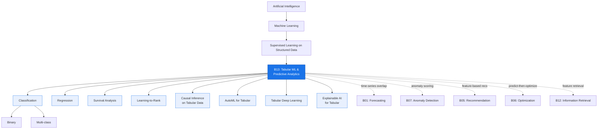

# Research Report: Tabular ML & Predictive Analytics (B13)
## By Dr. Archon (R-α) — Date: 2026-03-31

---

## 1. Field Taxonomy

**Parent Lineage:** Artificial Intelligence > Machine Learning > Supervised Learning on Structured Data

**Sub-fields:**

| Sub-field | Description |
|---|---|
| Binary Classification | Predicting one of two outcomes (churn, fraud, click) |
| Multi-class Classification | Predicting among K>2 discrete categories |
| Regression | Predicting continuous targets (price, demand, risk score) |
| Survival Analysis | Modeling time-to-event with censoring (Cox PH, accelerated failure time) |
| Learning-to-Rank | Ordering items by relevance or utility (LambdaMART, pairwise/listwise losses) |
| Time-to-Event Modeling | Discrete-time hazard modeling on tabular features |
| Causal Inference on Tabular Data | Estimating treatment effects from observational tabular data (meta-learners, double ML) |
| AutoML for Tabular | Automated pipeline construction: feature engineering, model selection, HPO |
| Tabular Deep Learning | Neural architectures designed for heterogeneous tabular inputs |
| Explainable AI (XAI) for Tabular | Post-hoc and intrinsic interpretability methods for tabular predictors |

**Related Baselines:**

- **B01 — Forecasting:** Time-series forecasting overlaps when temporal tabular features drive predictions; tabular ML provides the feature-engineering backbone for many forecasting pipelines.
- **B07 — Anomaly Detection:** Anomaly scoring on structured data uses supervised tabular classifiers when labels exist; unsupervised scoring feeds tabular features.
- **B05 — Recommendation Systems:** Feature-based recommendation (e.g., click-through-rate prediction) is fundamentally a tabular classification problem.
- **B06 — Optimization:** The predict-then-optimize paradigm uses tabular ML as the prediction layer before feeding into a mathematical program.
- **B12 — Information Retrieval:** Feature stores and retrieval-augmented pipelines supply engineered features to tabular models at serving time.

**Taxonomy Diagram:**

---

## 2. Mathematical Foundations

### 2.1 Gradient Boosting Theory (Functional Gradient Descent)

Gradient boosting constructs an additive model in function space. Given a differentiable loss function $L(y, F(x))$, the model at stage $m$ is:

$$F_m(x) = F_{m-1}(x) + \eta \cdot h_m(x)$$

where $h_m$ is a weak learner (typically a shallow decision tree) fitted to the **negative gradient** (pseudo-residuals):

$$r_{im} = -\left[\frac{\partial L(y_i, F(x_i))}{\partial F(x_i)}\right]_{F=F_{m-1}}$$

The learning rate $\eta \in (0,1]$ controls shrinkage. This framework unifies regression (squared error residuals), classification (logistic loss gradients), and ranking (LambdaMART gradients) under a single functional gradient descent lens.

**Second-order approximation (XGBoost):** XGBoost extends this by using a second-order Taylor expansion of the loss:

$$\mathcal{L}^{(m)} \approx \sum_{i=1}^{n}\left[g_i h_m(x_i) + \frac{1}{2} H_i h_m(x_i)^2\right] + \Omega(h_m)$$

where $g_i = \partial L / \partial F$ and $H_i = \partial^2 L / \partial F^2$ are per-sample first and second derivatives, and $\Omega$ is a regularization term on tree complexity.

### 2.2 Decision Tree Splits

A decision tree partitions the feature space by recursively choosing the split $(j, s)$ on feature $j$ at threshold $s$ that maximizes an impurity reduction criterion.

**Gini impurity** (classification):

$$\text{Gini}(S) = 1 - \sum_{k=1}^{K} p_k^2$$

where $p_k$ is the proportion of class $k$ in node $S$.

**Entropy / Information gain:**

$$H(S) = -\sum_{k=1}^{K} p_k \log_2 p_k$$

$$\text{Gain}(S, j, s) = H(S) - \frac{|S_L|}{|S|} H(S_L) - \frac{|S_R|}{|S|} H(S_R)$$

**Variance reduction** (regression):

$$\text{Reduction} = \text{Var}(S) - \frac{|S_L|}{|S|}\text{Var}(S_L) - \frac{|S_R|}{|S|}\text{Var}(S_R)$$

LightGBM uses **histogram-based** splitting: continuous features are discretized into $B$ bins; the optimal split is found by scanning bin boundaries, reducing complexity from $O(n \cdot d)$ to $O(B \cdot d)$.

### 2.3 Regularization Techniques

Regularization prevents overfitting and is critical for tabular ML where sample sizes are moderate.

**L1 (Lasso) regularization:** Adds $\lambda \sum |w_j|$ to the loss, inducing sparsity (automatic feature selection).

**L2 (Ridge) regularization:** Adds $\lambda \sum w_j^2$, shrinking coefficients toward zero without eliminating them.

**Elastic Net:** Combines both: $\lambda_1 \sum |w_j| + \lambda_2 \sum w_j^2$.

**In tree ensembles:**
- `max_depth`, `min_child_weight` (XGBoost) / `min_data_in_leaf` (LightGBM) constrain tree complexity.
- `subsample` (row subsampling) and `colsample_bytree` (feature subsampling) inject randomness.
- **Early stopping:** Training halts when validation loss stops improving for $p$ consecutive rounds, acting as implicit regularization on the number of boosting iterations $M$.
- `reg_alpha` (L1 on leaf weights) and `reg_lambda` (L2 on leaf weights) regularize the leaf outputs directly.

### 2.4 Loss Functions

| Loss | Formula | Use Case |
|---|---|---|
| Mean Squared Error | $L = \frac{1}{n}\sum(y_i - \hat{y}_i)^2$ | Regression (sensitive to outliers) |
| Mean Absolute Error | $L = \frac{1}{n}\sum\|y_i - \hat{y}_i\|$ | Regression (robust to outliers) |
| Huber Loss | $L_\delta = \begin{cases} \frac{1}{2}(y-\hat{y})^2 & \|y-\hat{y}\| \le \delta \\ \delta\|y-\hat{y}\| - \frac{1}{2}\delta^2 & \text{otherwise}\end{cases}$ | Regression (compromise) |
| Binary Cross-Entropy | $L = -\frac{1}{n}\sum[y\log\hat{p} + (1-y)\log(1-\hat{p})]$ | Binary classification |
| Multi-class Cross-Entropy | $L = -\frac{1}{n}\sum\sum y_{ik}\log\hat{p}_{ik}$ | Multi-class classification |
| Focal Loss | $L = -\alpha_t(1-p_t)^\gamma \log(p_t)$ | Imbalanced classification ($\gamma$ down-weights easy examples) |
| Quantile Loss | $L_\tau = \sum[\tau \cdot \max(0, y-\hat{y}) + (1-\tau)\cdot\max(0, \hat{y}-y)]$ | Quantile regression / prediction intervals |

### 2.5 Ensemble Theory

**Bagging (Bootstrap Aggregating):** Train $B$ base learners on bootstrap samples; aggregate via averaging (regression) or majority vote (classification). Reduces variance while keeping bias constant. Random Forest extends bagging by additionally subsampling $m \ll d$ features at each split.

**Bias-variance decomposition for ensembles:** For $B$ models with pairwise correlation $\rho$, individual variance $\sigma^2$:

$$\text{Var}_{\text{ensemble}} = \rho \sigma^2 + \frac{1-\rho}{B}\sigma^2$$

Decorrelating base learners (low $\rho$) is key; this motivates feature subsampling in Random Forest.

**Boosting:** Sequential training where each learner corrects errors of the ensemble so far. Primarily reduces bias. AdaBoost re-weights samples; gradient boosting fits pseudo-residuals.

**Stacking (Stacked Generalization):** Train a meta-learner on cross-validated out-of-fold predictions from diverse base models. The meta-learner (often logistic regression or a shallow GBDT) learns optimal combination weights, often outperforming simple averaging.

### 2.6 SHAP Values (Shapley Additive Explanations)

Rooted in cooperative game theory, the Shapley value of feature $j$ for prediction $f(x)$ is:

$$\phi_j(f, x) = \sum_{S \subseteq N \setminus \{j\}} \frac{|S|!(|N|-|S|-1)!}{|N|!}\left[f(S \cup \{j\}) - f(S)\right]$$

where $N$ is the set of all features and $f(S)$ denotes the model output when only features in $S$ are "present" (others marginalized out).

**Properties:** Efficiency ($\sum_j \phi_j = f(x) - E[f(x)]$), symmetry, dummy, linearity. These axioms uniquely determine Shapley values.

**TreeSHAP** computes exact Shapley values for tree ensembles in $O(TLD^2)$ time (where $T$ = trees, $L$ = leaves, $D$ = depth), making it practical for XGBoost/LightGBM at scale.

### 2.7 Bayesian Hyperparameter Optimization

HPO seeks $\lambda^* = \arg\min_\lambda f(\lambda)$ where $f(\lambda)$ is validation loss as a function of hyperparameters $\lambda$.

**Gaussian Process (GP) surrogate:** Model $f(\lambda)$ as a GP: $f \sim \mathcal{GP}(\mu, k)$. After $t$ observations $\{(\lambda_i, y_i)\}$, the posterior provides a mean $\mu_t(\lambda)$ and uncertainty $\sigma_t(\lambda)$.

**Acquisition function (Expected Improvement):**

$$\text{EI}(\lambda) = E[\max(0, f^* - f(\lambda))] = \sigma_t(\lambda)[\gamma \Phi(\gamma) + \phi(\gamma)]$$

where $\gamma = (f^* - \mu_t(\lambda))/\sigma_t(\lambda)$ and $\Phi, \phi$ are the standard normal CDF/PDF.

**Tree-structured Parzen Estimator (TPE):** Used by Optuna; models $p(\lambda | y < y^*)$ and $p(\lambda | y \geq y^*)$ separately, then maximizes the ratio $p(\lambda | y < y^*) / p(\lambda | y \geq y^*)$. Handles conditional and hierarchical hyperparameter spaces efficiently.

---

## 3. Core Concepts

### 3.1 Feature Engineering

Feature engineering transforms raw tabular columns into representations that improve model performance. Key techniques:

- **Encoding categorical variables:** One-hot encoding for low-cardinality features; target encoding (mean of the target per category, with smoothing) for high-cardinality features; ordinal encoding when categories have a natural order. CatBoost implements ordered target statistics to avoid leakage.
- **Numerical transformations:** Log transforms for skewed distributions; binning/discretization to capture non-linear effects in linear models; rank transformation for robustness.
- **Feature interactions:** Explicitly constructing $x_i \times x_j$ or $x_i / x_j$ features. Tree models learn interactions implicitly through successive splits, but explicit interactions help linear models and shallow trees.
- **Aggregation features:** Group-by statistics (mean, median, count, std) over categorical groupings -- critical in competition and production settings.
- **Domain-specific features:** Ratios, differences, rolling statistics, date-part extraction (day-of-week, month, holiday flags).

### 3.2 Missing Value Handling

| Strategy | When to Use |
|---|---|
| Native handling (XGBoost/LightGBM) | Default for GBDT; learns optimal split direction for missing values |
| Mean/median imputation | Simple baseline; introduces bias if data is not MCAR |
| Mode imputation | Categorical features |
| KNN imputation | Preserves local structure; expensive at scale |
| Iterative imputation (MICE) | Multiple features with complex missing patterns |
| Missing indicator feature | Add a binary column flagging missingness; captures informative missingness |
| Dropping | Only when missingness is rare (<1%) and confirmed random |

Tree-based models handle missingness natively by learning a default direction at each split node when a feature value is absent. This is one of their practical advantages over neural networks on tabular data.

### 3.3 Class Imbalance Techniques

When the positive class is rare (e.g., fraud at 0.1%), standard models optimize accuracy and underperform on minority class recall.

- **Class weights:** Set `scale_pos_weight = neg_count / pos_count` in XGBoost; equivalently, weight the loss contribution of minority samples.
- **SMOTE (Synthetic Minority Over-sampling Technique):** Generates synthetic minority examples by interpolating between nearest neighbors in feature space. Variants: Borderline-SMOTE, SMOTE-ENN (combined with Edited Nearest Neighbors for cleaning).
- **Focal loss:** Down-weights well-classified examples via $(1-p_t)^\gamma$ modulation, forcing the model to focus on hard negatives. Originally from object detection (Lin et al., 2017), widely adopted for tabular imbalance.
- **Threshold tuning:** Train with standard loss but optimize the classification threshold on a validation set using the F1 score, precision-recall curve, or business cost matrix.
- **Undersampling + ensembling:** Train multiple models on balanced subsets (random undersampling) and ensemble them (EasyEnsemble, BalanceCascade).

### 3.4 Cross-Validation Strategies

- **Stratified K-Fold:** Preserves class distribution in each fold. Standard for classification tasks.
- **Group K-Fold:** Ensures all samples from the same group (e.g., same customer, same entity) appear in the same fold. Prevents leakage from correlated observations.
- **Time-based / Temporal Split:** Training always precedes validation chronologically. Essential when data has temporal ordering to prevent future leakage. Walk-forward validation expands the training window iteratively.
- **Repeated Stratified K-Fold:** Repeats stratified K-fold with different random seeds; reduces variance of the performance estimate at the cost of computation.
- **Nested CV:** Outer loop evaluates generalization; inner loop tunes hyperparameters. Provides unbiased estimate of tuned-model performance.

### 3.5 Gradient Boosted Decision Trees (GBDT)

GBDT is the dominant paradigm for tabular ML. The model sequentially adds decision trees that fit the negative gradient of the loss function (see Section 2.1). Key properties:

- **Handles heterogeneous features** (numeric + categorical) without extensive preprocessing.
- **Robust to irrelevant features** due to feature subsampling and split-based selection.
- **Highly tunable** with well-understood hyperparameters (learning rate, depth, regularization).
- **Fast inference** -- a prediction requires traversing $M$ trees of depth $D$, i.e., $O(M \cdot D)$.
- **State-of-the-art performance** on most tabular benchmarks as of 2026.

The three dominant GBDT frameworks (XGBoost, LightGBM, CatBoost) differ in splitting strategy, categorical handling, and parallelization but share the core gradient boosting framework.

### 3.6 AutoML for Tabular Data

AutoML automates the ML pipeline: preprocessing, feature engineering, model selection, and hyperparameter optimization.

- **Pipeline search:** AutoML systems like AutoGluon, H2O, and FLAML search over multiple model families (GBDT, linear models, neural networks, k-NN) and preprocessing steps.
- **Multi-layer stacking:** AutoGluon's strategy trains multiple models, generates out-of-fold predictions, and stacks them with a meta-learner -- often achieving near-expert performance with zero configuration.
- **Time-budgeted optimization:** FLAML uses cost-aware search, prioritizing cheap-to-evaluate configurations (e.g., low `n_estimators`) early and scaling up as budget permits.
- **Neural architecture search for tabular:** More recent AutoML systems include TabNet and FT-Transformer variants in their search space.

### 3.7 Model Explainability

Explainability methods for tabular models fall into two categories:

**Global methods:**
- **Feature importance:** Gain-based (total gain from splits on a feature), split-count-based, or permutation importance (drop in metric when a feature is shuffled).
- **SHAP summary plots:** Distribution of Shapley values across all samples, showing feature impact direction and magnitude.
- **Partial Dependence Plots (PDP):** Marginal effect of one or two features on the prediction, averaging over other features.

**Local methods:**
- **SHAP waterfall:** Decomposition of a single prediction into feature contributions.
- **LIME (Local Interpretable Model-agnostic Explanations):** Fits a local linear model around a single prediction by perturbing the input and observing output changes.
- **Counterfactual explanations:** "What minimal change to the input would flip the prediction?"

In regulated industries (finance, healthcare), explainability is not optional -- it is a compliance requirement.

### 3.8 Model Calibration

A model is **calibrated** if $P(\text{event} | \hat{p} = p) = p$ for all $p$. GBDT models are often poorly calibrated out of the box.

- **Platt scaling:** Fits a logistic regression on the model's raw outputs using a held-out calibration set: $p_{\text{calibrated}} = \sigma(a \cdot f(x) + b)$.
- **Isotonic regression:** Non-parametric monotonic function mapping raw scores to calibrated probabilities. More flexible than Platt scaling but requires more data.
- **Reliability diagrams:** Visualization tool: bin predictions, plot mean predicted probability vs. observed frequency per bin.
- **Expected Calibration Error (ECE):** $\text{ECE} = \sum_{b=1}^{B} \frac{n_b}{N} |\text{acc}(b) - \text{conf}(b)|$ -- the weighted average gap between accuracy and confidence per bin.

Calibration matters when predicted probabilities drive downstream decisions (e.g., insurance pricing, medical risk stratification).

### 3.9 Feature Stores & Feature Serving

A **feature store** is an infrastructure layer that manages the lifecycle of features: computation, storage, versioning, and serving.

- **Offline store:** Stores historical feature values for training data generation. Typically backed by a data warehouse (BigQuery, Snowflake, Delta Lake).
- **Online store:** Serves features at low latency (<10ms) for real-time inference. Backed by Redis, DynamoDB, or purpose-built systems.
- **Feature registry:** Catalog of feature definitions, ownership, lineage, and freshness SLAs.
- **Key platforms:** Feast (open-source), Tecton, Hopsworks, Vertex AI Feature Store, SageMaker Feature Store.

Feature stores solve the training-serving skew problem: the same feature transformation code runs in both training and inference, ensuring consistency.

### 3.10 Data Leakage Prevention

Data leakage occurs when information from the target variable or from the future inadvertently enters the training data. Common sources:

- **Target leakage:** A feature derived from the target (e.g., including "claim amount" when predicting "claim filed").
- **Temporal leakage:** Using future data for training (e.g., next-month revenue as a feature when predicting current-month churn).
- **Train-test contamination:** Fitting encoders (target encoding, standardization) on the full dataset including test data.
- **Group leakage:** Related samples (same patient, same transaction chain) split across train and test sets.

**Prevention:** Use pipelines that encapsulate preprocessing within cross-validation folds; enforce temporal ordering; audit feature definitions; use group-aware splitting.

### 3.11 Tabular Deep Learning

Despite the dominance of GBDT, neural approaches for tabular data have made significant progress:

- **TabNet (Google, 2021):** Uses sequential attention to select features at each step, providing instance-wise feature selection and interpretability. Supports self-supervised pretraining.
- **FT-Transformer (Gorishniy et al., 2021):** Treats each feature as a token, applies a Transformer encoder over the token sequence. Competitive with GBDT on datasets with many features.
- **TabPFN (Hollmann et al., 2023):** A Prior-Data Fitted Network trained on millions of synthetic datasets. At inference, it performs Bayesian prediction in a single forward pass -- no training loop needed. Effective for small datasets (n < 10,000).
- **Neural Oblivious Decision Ensembles (NODE):** Differentiable oblivious decision trees (all nodes at the same depth use the same feature), trained end-to-end with backpropagation.

**When to use deep tabular:** Large datasets (>100K rows), when representation learning from raw features is valuable, when multimodal inputs (tabular + text + image) are present, or when pretraining on unlabeled tabular data is feasible.

### 3.12 Entity Embeddings for Categorical Features

Introduced by Guo & Berkhahn (2016) in the context of Kaggle's Rossmann Store Sales competition:

- Each categorical feature is mapped to a dense vector via a learned embedding layer: $e_j = \text{Embedding}(x_j) \in \mathbb{R}^{d_j}$.
- Embedding dimensions are typically set as $d_j = \min(50, \lceil c_j / 2 \rceil)$ where $c_j$ is the cardinality.
- Embeddings capture semantic similarity: similar stores, zip codes, or product categories cluster in embedding space.
- Pretrained embeddings can be extracted and used as features in GBDT models, combining the representation learning of neural networks with the predictive power of tree ensembles.

---

## 4. Algorithms & Methods

### 4.1 XGBoost (eXtreme Gradient Boosting)

- **Authors:** Tianqi Chen, Carlos Guestrin (2016)
- **Key innovations:** Second-order Taylor expansion of the loss for optimal leaf weights and split gains; weighted quantile sketch for approximate split finding; sparsity-aware algorithm for missing values; column block structure for parallelized split evaluation; cache-aware access patterns.
- **Regularization:** L1 and L2 on leaf weights, max depth, min child weight, column/row subsampling, gamma (minimum loss reduction for a split).
- **Strengths:** Mature ecosystem, GPU training (`gpu_hist`), distributed training, extensive language support.
- **Typical hyperparameters:** `learning_rate` (0.01-0.3), `max_depth` (3-10), `n_estimators` (100-10000 with early stopping), `subsample` (0.6-1.0), `colsample_bytree` (0.6-1.0).

### 4.2 LightGBM

- **Authors:** Ke et al. (Microsoft, 2017)
- **Key innovations:** **Gradient-based One-Side Sampling (GOSS):** Retains samples with large gradients, randomly samples from small-gradient samples -- speeds up training while preserving accuracy. **Exclusive Feature Bundling (EFB):** Bundles mutually exclusive sparse features into single features, reducing effective dimensionality.
- **Leaf-wise growth:** Instead of level-wise (XGBoost default), LightGBM grows the leaf with the largest loss reduction. Achieves lower loss with fewer leaves but requires `max_depth` or `num_leaves` constraints to prevent overfitting.
- **Speed:** Typically 2-10x faster than XGBoost on large datasets due to histogram-based splitting and GOSS.

### 4.3 CatBoost

- **Authors:** Prokhorova et al. (Yandex, 2018)
- **Key innovations:** **Ordered Target Statistics:** Computes target encoding using only preceding samples (in a random permutation), preventing target leakage. **Oblivious trees:** All nodes at the same depth use the same split condition, producing balanced trees that are faster to evaluate and more regularized. **Built-in categorical handling:** No manual encoding needed.
- **Strengths:** Best out-of-the-box performance on datasets with many categorical features; strong default hyperparameters; symmetric trees enable faster inference.

### 4.4 Random Forest

- **Core mechanism:** Ensemble of $B$ decision trees trained on bootstrap samples with random feature subsets ($m \approx \sqrt{d}$ for classification, $m \approx d/3$ for regression) at each split.
- **Properties:** Embarrassingly parallel; robust to hyperparameters; provides out-of-bag (OOB) error estimate as a free validation metric; feature importance via permutation or impurity reduction.
- **Limitations:** Generally lower accuracy than gradient boosting on most tabular benchmarks; cannot extrapolate beyond the range of training data.

### 4.5 Logistic Regression & Linear Regression (Baselines)

Every tabular ML project should start with a linear baseline:

- **Logistic regression:** $P(y=1|x) = \sigma(w^Tx + b)$. Fast, interpretable, well-calibrated. With L1 regularization, performs automatic feature selection.
- **Linear regression:** $\hat{y} = w^Tx + b$. Optimal under Gauss-Markov assumptions. Elastic Net variant handles multicollinearity and feature selection.
- **Role:** Establishes a performance floor; if a GBDT provides only marginal improvement, the problem may be approximately linear. Also serves as a meta-learner in stacking.

### 4.6 TabNet

- **Architecture:** Sequential attention-based feature selection across decision steps. Each step selects a sparse subset of features via a learnable mask (sparsemax activation), processes them through a shared and step-specific fully-connected network, and outputs a partial prediction.
- **Self-supervised pretraining:** Mask random features and train a decoder to reconstruct them. Improves performance on small labeled datasets.
- **Trade-offs:** More complex to tune than GBDT; sensitive to learning rate and batch size; interpretable via attention masks.

### 4.7 FT-Transformer (Feature Tokenizer + Transformer)

- **Architecture:** Each feature (numerical and categorical) is projected into a $d$-dimensional token. A special `[CLS]` token is prepended. Standard Transformer encoder layers process the token sequence. The `[CLS]` token's final representation feeds a prediction head.
- **Performance:** Competitive with GBDT on many benchmarks, sometimes superior on datasets with many features or complex feature interactions.
- **Limitations:** Higher computational cost; requires larger datasets to outperform GBDT.

### 4.8 TabPFN (Prior-Data Fitted Network)

- **Concept:** A transformer meta-trained on millions of synthetic tabular datasets sampled from a prior (Bayesian neural networks, decision trees, etc.). At inference, the entire training set is provided as context (in-context learning), and predictions are made in a single forward pass.
- **Strengths:** No hyperparameter tuning needed; excellent performance on small datasets (n < 10,000); provides well-calibrated uncertainty estimates.
- **Limitations:** Scales poorly to large datasets (context length limits); limited to classification with moderate feature counts; the prior may not match the data-generating process.

### 4.9 AutoGluon

- **Approach:** Multi-layer stacking with diverse base models: LightGBM, CatBoost, XGBoost, Random Forest, Extra Trees, k-NN, neural networks. Out-of-fold predictions from Layer 1 feed into Layer 2 models, which may stack further.
- **Key insight:** Model diversity + multi-layer stacking + smart defaults often exceeds hand-tuned single models. AutoGluon won or placed highly in numerous AutoML benchmarks (AutoML Benchmark 2022-2024).
- **Usage:** `TabularPredictor(label='target').fit(train_data, time_limit=3600)` -- a one-line API.

### 4.10 H2O AutoML

- **Approach:** Trains a grid of models (GBM, GLM, Deep Learning, XGBoost, stacked ensembles) with random search HPO within a time budget. Automatically creates stacked ensembles of the top models.
- **Strengths:** Distributed training on H2O clusters; automatic handling of categorical encoding and missing values; leaderboard-based model selection.

### 4.11 FLAML (Fast Lightweight AutoML)

- **Authors:** Chi Wang et al. (Microsoft, 2021)
- **Approach:** Cost-frugal optimization -- prioritizes cheap configurations early (few trees, low depth), only allocating budget to expensive configurations when cheap ones saturate. Uses a combination of random search and Bayesian optimization (BlendSearch).
- **Strengths:** Extremely efficient -- achieves competitive performance in minutes rather than hours; lightweight dependency footprint.

### 4.12 Stacking & Blending Ensembles

- **Stacking:** Train $K$ diverse base models. Use cross-validation to generate out-of-fold predictions for the training set and standard predictions for the test set. Train a meta-learner on the out-of-fold predictions. This avoids overfitting to the base models' training predictions.
- **Blending:** Simpler variant: hold out a blend set, generate predictions on it, train the meta-learner on those. Less computationally expensive but wastes data.
- **Best practices:** Use diverse model families (GBDT + linear + neural); keep the meta-learner simple (logistic regression, ridge); include original features alongside meta-features for a "restacking" variant.

### 4.13 Neural Oblivious Decision Ensembles (NODE)

- **Architecture:** Differentiable ensemble of oblivious decision trees. Each tree uses the same feature and threshold at all nodes of a given depth. Feature selection and thresholds are learned end-to-end via gradient descent using entmax (sparse softmax) for differentiable feature selection.
- **Training:** Standard backpropagation with dense layers for feature selection; trees output leaf values that are aggregated.
- **Performance:** Competitive with GBDT while being fully differentiable, enabling end-to-end training in multimodal pipelines.

---

## 5. Key Papers

### 5.1 Random Forests (Breiman, 2001)

**Citation:** Breiman, L. (2001). "Random Forests." *Machine Learning*, 45(1), 5-32.

**Contributions:** Introduced the Random Forest algorithm: bagging + random feature subsets at each split. Proved consistency under weak conditions. Introduced the variable importance measure and OOB error estimation. Showed that generalization error depends on the strength of individual trees and their correlation.

**Impact:** Became the default non-linear classifier for a decade; remains a strong baseline and component of ensemble stacks.

### 5.2 XGBoost (Chen & Guestrin, 2016)

**Citation:** Chen, T., & Guestrin, C. (2016). "XGBoost: A Scalable Tree Boosting System." *KDD 2016*.

**Contributions:** Scalable gradient boosting with second-order optimization, regularized objective, weighted quantile sketch, sparsity-aware split finding, and cache-optimized column block structure. Enabled gradient boosting at scale with distributed and GPU support.

**Impact:** Became the dominant algorithm in Kaggle competitions (2015-2019) and industrial ML. Over 25,000 citations. Catalyzed the "GBDT era" of tabular ML.

### 5.3 LightGBM (Ke et al., 2017)

**Citation:** Ke, G., et al. (2017). "LightGBM: A Highly Efficient Gradient Boosting Decision Tree." *NeurIPS 2017*.

**Contributions:** GOSS for efficient sample selection; EFB for feature bundling; leaf-wise tree growth; histogram-based splitting. Achieved 2-10x speedup over XGBoost with comparable or better accuracy.

**Impact:** Became the preferred GBDT implementation for large-scale industrial applications due to speed and memory efficiency.

### 5.4 CatBoost (Prokhorova et al., 2018)

**Citation:** Prokhorova, L., et al. (2018). "CatBoost: unbiased boosting with categorical features." *NeurIPS 2018*.

**Contributions:** Ordered target statistics for categorical encoding without leakage; ordered boosting to reduce prediction shift; oblivious (symmetric) trees for regularization and fast inference.

**Impact:** Established best practices for categorical feature handling; strong default hyperparameters reduced the need for extensive tuning.

### 5.5 SHAP (Lundberg & Lee, 2017)

**Citation:** Lundberg, S. M., & Lee, S.-I. (2017). "A Unified Approach to Interpreting Model Predictions." *NeurIPS 2017*.

**Contributions:** Unified six existing feature attribution methods under the Shapley value framework. Introduced TreeSHAP for exact, polynomial-time Shapley value computation on tree ensembles. Provided both local and global interpretability.

**Impact:** Became the de facto standard for model explainability in tabular ML. SHAP values are now expected in production ML systems, regulatory filings, and model documentation.

### 5.6 TabNet (Arik & Pfister, 2021)

**Citation:** Arik, S. O., & Pfister, T. (2021). "TabNet: Attentive Interpretable Tabular Learning." *AAAI 2021*.

**Contributions:** Attention-based feature selection mechanism for tabular data; sequential multi-step processing; self-supervised pretraining for tabular data; instance-wise feature selection providing interpretability.

**Impact:** Demonstrated that neural networks can be competitive with GBDT on some tabular benchmarks; sparked the "tabular deep learning" sub-field.

### 5.7 Why Do Tree-Based Models Still Outperform Deep Learning on Tabular Data? (Grinsztajn et al., 2022)

**Citation:** Grinsztajn, L., Oyallon, E., & Varoquaux, G. (2022). "Why do tree-based models still outperform deep learning on typical tabular data?" *NeurIPS 2022*.

**Contributions:** Comprehensive benchmark on 45 datasets showing GBDT consistently outperforms deep tabular models. Identified three key reasons: (1) deep models are biased toward overly smooth solutions, (2) uninformative features hurt deep models more, (3) deep models require more data to learn irregular target functions.

**Impact:** Grounded the field's expectations -- GBDT remains the default for tabular; deep learning should be considered when specific conditions are met (large data, multimodal, pretraining).

### 5.8 FT-Transformer (Gorishniy et al., 2021)

**Citation:** Gorishniy, Y., Rubachev, I., Khrulkov, V., & Babenko, A. (2021). "Revisiting Deep Learning Models for Tabular Data." *NeurIPS 2021*.

**Contributions:** Proposed the Feature Tokenizer + Transformer architecture. Showed that a simple Transformer over tokenized features achieves competitive performance with GBDT on many benchmarks. Provided a thorough comparison of deep tabular architectures (MLP, ResNet, FT-Transformer).

**Impact:** Established the Transformer as the leading neural architecture for tabular data, displacing earlier approaches (MLP, TabNet) in benchmark comparisons.

### 5.9 TabPFN (Hollmann et al., 2023)

**Citation:** Hollmann, N., Muller, S., Eggensperger, K., & Hutter, F. (2023). "TabPFN: A Transformer That Solves Small Tabular Classification Problems in a Second." *ICLR 2023*.

**Contributions:** Trained a Transformer as a prior-data fitted network on synthetic datasets; performs approximate Bayesian inference in a single forward pass; requires no hyperparameter tuning; excels on small datasets.

**Impact:** Introduced a paradigm shift for small-data tabular classification -- from "train a model" to "do inference with a pretrained model." Inspired follow-up work on tabular foundation models.

### 5.10 AutoGluon-Tabular (Erickson et al., 2020)

**Citation:** Erickson, N., et al. (2020). "AutoGluon-Tabular: Robust and Accurate AutoML for Structured Data." *ICML 2020 AutoML Workshop*.

**Contributions:** Multi-layer stacking with diverse model families; automatic ensemble selection; quality presets (best_quality, high_quality, good_quality, medium_quality); one-line API for competitive results.

**Impact:** Democratized high-quality tabular ML; consistently top-ranked in AutoML benchmarks; widely adopted in industry for rapid prototyping and production deployment.

---

## 6. Evolution Timeline

```mermaid
timeline
    title Evolution of Tabular ML & Predictive Analytics
    1805 : Least Squares Regression (Legendre, Gauss)
         : Foundation of all regression methods
    1958 : Logistic Regression (Cox)
         : Binary classification standard for decades
    1984 : CART Decision Trees (Breiman et al.)
         : Recursive partitioning; basis of all tree methods
    1995 : AdaBoost (Freund & Schapire)
         : First practical boosting algorithm
    1996 : Bagging (Breiman)
         : Bootstrap aggregating reduces variance
    2001 : Random Forest (Breiman)
         : Bagging + random feature subsets; dominant for a decade
    2001 : Gradient Boosting Machine (Friedman)
         : Functional gradient descent framework
    2014 : XGBoost initial release (Chen)
         : Scalable GBDT; dominates Kaggle 2015-2019
    2016 : XGBoost KDD paper
         : Formal publication; 25K+ citations
    2017 : LightGBM (Microsoft)
         : GOSS + EFB; 2-10x faster than XGBoost
    2017 : SHAP (Lundberg & Lee)
         : Unified explainability via Shapley values
    2018 : CatBoost (Yandex)
         : Ordered target statistics; best categorical handling
    2019 : Entity Embeddings widely adopted
         : Neural representations for categorical features in GBDT pipelines
    2020 : AutoGluon, FLAML
         : AutoML systems achieve near-expert performance
    2021 : TabNet, FT-Transformer
         : Deep learning becomes competitive on tabular benchmarks
    2022 : "Tree-based > Deep Learning" (Grinsztajn)
         : Rigorous benchmarking confirms GBDT superiority on typical tabular data
    2023 : TabPFN (ICLR 2023)
         : In-context learning for tabular; no training needed for small data
    2024 : Tabular Foundation Models emerge
         : Large pretrained models for zero-shot tabular prediction
    2025-2026 : LLM-augmented tabular ML
         : LLMs for feature engineering, data augmentation, and prompt-based prediction
         : Hybrid systems combining GBDT + LLM-generated features
```

**Detailed narrative:**

1. **1805-1958 -- Linear Era:** Least squares regression and logistic regression establish the mathematical foundations. These remain essential baselines.

2. **1984 -- Decision Trees:** Breiman's CART introduces recursive partitioning. Trees are interpretable but high-variance and prone to overfitting.

3. **1995-1996 -- Ensembles Emerge:** AdaBoost (boosting) and Bagging address the variance problem. The insight that combining weak learners yields strong learners transforms ML.

4. **2001 -- Random Forest & Gradient Boosting:** Breiman's Random Forest combines bagging with random feature subsets, achieving excellent performance with minimal tuning. Friedman formalizes gradient boosting as functional gradient descent, unifying boosting under a single framework.

5. **2014-2016 -- XGBoost Dominance:** Chen's XGBoost provides an efficient, scalable, regularized implementation of gradient boosting. It becomes synonymous with "winning Kaggle" and the default choice for industrial tabular ML.

6. **2017-2018 -- GBDT Diversification:** LightGBM (faster, leaf-wise growth) and CatBoost (better categorical handling) offer alternatives. SHAP provides a principled explainability framework. The "three GBDTs" era begins.

7. **2020-2021 -- AutoML & Deep Tabular:** AutoGluon and FLAML make expert-level tabular ML accessible via one-line APIs. TabNet and FT-Transformer show neural networks can be competitive with GBDT, sparking the tabular deep learning research area.

8. **2022-2023 -- Benchmarking & Meta-Learning:** Grinsztajn et al. rigorously confirm GBDT superiority on typical tabular data. TabPFN introduces in-context learning for tabular classification, eliminating the training loop for small datasets.

9. **2024-2026 -- Foundation Models & LLM Augmentation:** The frontier moves toward tabular foundation models pretrained on diverse datasets, and LLM-augmented pipelines where large language models generate features, suggest transformations, augment training data with synthetic examples, and provide natural-language explanations of predictions. Hybrid architectures combining GBDT's predictive power with LLM-generated semantic features represent the state of the art in 2026.

---

## 7. Cross-Domain Connections

### B13 x B01 (Forecasting)

Tabular ML and time-series forecasting overlap extensively. Many forecasting problems are reformulated as tabular regression: temporal features (lags, rolling means, calendar features) are extracted from the time series and fed into GBDT models. LightGBM and XGBoost remain competitive forecasters, especially when combined with rich exogenous features. M5 competition (2020) was won by LightGBM-based approaches with heavy feature engineering.

**Integration pattern:** Time-series feature extraction (tsfresh, featuretools) produces a tabular dataset; GBDT models predict the next value; post-processing reconstructs the temporal structure.

### B13 x B07 (Anomaly Detection)

Supervised anomaly detection is a tabular classification problem with extreme class imbalance. When labeled anomalies exist (fraud labels, failure labels), GBDT with focal loss or class weighting outperforms unsupervised methods. Anomaly scoring models produce continuous scores that feed into downstream alerting systems.

**Integration pattern:** Unsupervised anomaly scores (Isolation Forest, autoencoders) become input features for a supervised GBDT model that produces the final anomaly decision.

### B13 x B05 (Recommendation Systems)

Click-through rate (CTR) prediction -- the backbone of recommendation -- is fundamentally tabular binary classification. Features include user attributes, item attributes, interaction history, and contextual signals. GBDT models (especially CatBoost with its categorical handling) are widely used in recommendation pipelines alongside deep models (DeepFM, DCN).

**Integration pattern:** GBDT predicts CTR from engineered features; neural models handle raw feature interactions; ensemble of both serves as the ranking model.

### B13 x B06 (Optimization)

The **predict-then-optimize** paradigm uses tabular ML as the prediction layer:

1. A GBDT model predicts uncertain parameters (demand, costs, durations).
2. Predictions feed into an optimization model (LP, MIP, CP) that determines the optimal decision.

Advanced approaches (Smart Predict-then-Optimize, SPO+) train the prediction model to minimize the decision loss rather than the prediction loss, aligning the ML objective with the downstream optimization objective.

**Integration pattern:** GBDT provides point predictions and prediction intervals; the optimizer uses these as input parameters; the decision feeds back into evaluation of the overall system.

### B13 x B12 (Information Retrieval / Feature Retrieval)

Feature stores and retrieval systems serve as the data infrastructure for tabular ML:

- **Training-time retrieval:** Feature stores provide point-in-time correct feature vectors for training data generation, preventing temporal leakage.
- **Inference-time retrieval:** Online feature stores serve precomputed features at low latency for real-time prediction.
- **RAG for tabular:** Emerging pattern (2025-2026) where retrieval-augmented generation retrieves similar historical examples to augment tabular predictions, analogous to k-NN but using LLM-based similarity.

**Integration pattern:** Feature store computes and serves features; tabular model consumes them at training and inference; feature registry ensures consistency and lineage tracking.

---

## Appendix: Recommended Learning Path

1. **Foundations:** Master logistic regression, decision trees, bias-variance tradeoff.
2. **Core GBDT:** Learn XGBoost inside-out (hyperparameters, regularization, evaluation metrics). Then LightGBM and CatBoost.
3. **Feature engineering:** Practice on Kaggle competitions; internalize target encoding, aggregation features, and interaction features.
4. **Explainability:** Integrate SHAP into every project. Learn to read summary plots, dependence plots, and waterfall charts.
5. **AutoML:** Use AutoGluon as a strong baseline; understand what it does under the hood.
6. **Deep tabular:** Experiment with FT-Transformer and TabPFN; understand when they outperform GBDT.
7. **Production:** Learn feature stores, model serving, monitoring, and calibration for deployment.

---

*Report compiled by Dr. Archon (R-alpha), MAESTRO Knowledge Graph System.*
*Classification: B13 — Tabular ML & Predictive Analytics*
*Version: 1.0 | Date: 2026-03-31*
