# Research Report: Speech & Audio AI (B14)
## By Dr. Archon (R-alpha) — Date: 2026-03-31

---

## 1. Field Taxonomy

**Parent Lineage:** Artificial Intelligence > Signal Processing > Speech & Audio Intelligence

**Sub-fields:**

| Sub-field | Scope |
|---|---|
| Automatic Speech Recognition (ASR) | Converting spoken language to text — the core input modality |
| Text-to-Speech (TTS) | Generating natural speech from text — the core output modality |
| Speaker Recognition / Verification | Identifying or verifying identity from voice biometrics |
| Voice Activity Detection (VAD) | Detecting presence/absence of human speech in audio |
| Speech Enhancement & Noise Reduction | Improving speech quality by removing noise, reverberation, interference |
| Music Information Retrieval (MIR) | Extracting structured information from music (tempo, key, genre, transcription) |
| Audio Classification / Tagging | Labeling audio segments with semantic categories (environmental sounds, events) |
| Speech Emotion Recognition (SER) | Detecting emotional states from prosodic and spectral speech features |
| Voice Conversion / Cloning | Transforming voice characteristics while preserving content — zero-shot and few-shot |
| Audio Generation | Synthesizing music, sound effects, and ambient audio from text or other conditioning |
| Source Separation | Isolating individual sources (vocals, instruments, speakers) from mixed audio |
| Speech Translation | Direct speech-to-speech or speech-to-text translation across languages |

**Related Baselines:**

- **B04 (NLP):** Text processing pipeline downstream of ASR; language models for rescoring
- **B08 (Conversational AI):** Voice assistants, spoken dialogue systems
- **B09 (Generative AI):** Audio generation, music synthesis, sound design
- **B02 (Document AI):** Dictation-to-document, meeting transcription
- **B07 (Anomaly Detection):** Audio anomaly detection in industrial and security contexts

**Taxonomy Diagram:**

```mermaid
graph TD
    AI[Artificial Intelligence] --> SP[Signal Processing]
    SP --> SAI[Speech & Audio Intelligence - B14]

    SAI --> ASR[Automatic Speech Recognition]
    SAI --> TTS[Text-to-Speech Synthesis]
    SAI --> SR[Speaker Recognition & Verification]
    SAI --> VAD[Voice Activity Detection]
    SAI --> SE[Speech Enhancement & Noise Reduction]
    SAI --> MIR[Music Information Retrieval]
    SAI --> AC[Audio Classification & Tagging]
    SAI --> SER[Speech Emotion Recognition]
    SAI --> VC[Voice Conversion & Cloning]
    SAI --> AG[Audio Generation]
    SAI --> SS[Source Separation]
    SAI --> ST[Speech Translation]

    ASR --> E2E[End-to-End Models]
    ASR --> STREAM[Streaming / Online]
    ASR --> MULTI[Multilingual ASR]

    TTS --> NEURAL_TTS[Neural TTS]
    TTS --> VOCODER[Vocoders]
    TTS --> ZSTTS[Zero-Shot TTS]

    AG --> MUSIC[Music Generation]
    AG --> SFX[Sound Effects]

    SAI -.->|downstream text| B04[B04 NLP]
    SAI -.->|voice interface| B08[B08 Conversational AI]
    SAI -.->|generation| B09[B09 Generative AI]
    SAI -.->|transcription| B02[B02 Document AI]
    SAI -.->|anomaly| B07[B07 Anomaly Detection]

    style SAI fill:#1a73e8,stroke:#fff,color:#fff
    style ASR fill:#34a853,stroke:#fff,color:#fff
    style TTS fill:#34a853,stroke:#fff,color:#fff
    style AG fill:#34a853,stroke:#fff,color:#fff
```



---

## 2. Mathematical Foundations

### 2.1 Mel-Frequency Cepstral Coefficients (MFCCs) & Spectrograms

The fundamental feature representation for speech and audio. Raw audio is a 1D time-domain signal x(t). The Short-Time Fourier Transform (STFT) converts it to a time-frequency representation:

```
STFT{x(t)}(tau, omega) = X(tau, omega) = sum_{n=-inf}^{inf} x(n) * w(n - tau) * exp(-j * omega * n)
```

where w(n) is a window function (Hann, Hamming) and tau is the frame shift. The **power spectrogram** is |X(tau, omega)|^2.

The **mel scale** maps linear frequency to perceptual pitch:

```
m = 2595 * log10(1 + f / 700)
```

A **mel filterbank** applies K triangular filters spaced linearly on the mel scale to the power spectrum. The **mel spectrogram** S_mel(tau, k) for frame tau and filter k is:

```
S_mel(tau, k) = sum_{omega} H_k(omega) * |X(tau, omega)|^2
```

where H_k is the k-th triangular mel filter. MFCCs are obtained by applying the Discrete Cosine Transform (DCT) to the log mel filterbank energies:

```
MFCC(tau, c) = sum_{k=1}^{K} log(S_mel(tau, k)) * cos(c * (k - 0.5) * pi / K)
```

Typically the first 13 coefficients (plus delta and delta-delta) are used. In modern deep learning systems, log-mel spectrograms (80-128 mel bins) have largely replaced MFCCs as input features, since neural networks learn their own decorrelation.

### 2.2 Connectionist Temporal Classification (CTC) Loss

CTC (Graves et al., 2006) solves the alignment problem: given an input sequence X = (x_1, ..., x_T) and a target label sequence Y = (y_1, ..., y_U) where U <= T, we do not know which input frames correspond to which output labels. CTC introduces a **blank token** (epsilon) and defines a many-to-one mapping B that collapses repeated labels and removes blanks:

```
B(pi) = collapse repeated characters, then remove epsilon
Example: B(a, a, epsilon, b, epsilon, c, c) = (a, b, c)
```

The CTC probability of Y given X marginalizes over all valid alignments:

```
P_CTC(Y | X) = sum_{pi in B^{-1}(Y)} prod_{t=1}^{T} P(pi_t | x_t)
```

This is computed efficiently via the **forward-backward algorithm** over a modified CTC lattice. The loss is:

```
L_CTC = -log P_CTC(Y | X)
```

CTC makes a **conditional independence assumption**: P(pi_t | X) is computed independently at each time step. This limits its modeling of output dependencies, which is why CTC is often combined with an external language model or used jointly with attention decoders.

### 2.3 Attention-Based Encoder-Decoder for ASR

The Listen-Attend-Spell (LAS) paradigm (Chan et al., 2016) uses a sequence-to-sequence model with attention. The encoder maps input features X to hidden states H:

```
H = Encoder(X)    where H = (h_1, ..., h_T')
```

At each decoder step i, the attention mechanism computes a context vector:

```
e_{i,j} = Score(s_{i-1}, h_j)                  (energy)
alpha_{i,j} = exp(e_{i,j}) / sum_k exp(e_{i,k})  (attention weight)
c_i = sum_j alpha_{i,j} * h_j                    (context vector)
```

The decoder RNN (or Transformer) produces:

```
s_i = DecoderRNN(s_{i-1}, y_{i-1}, c_i)
P(y_i | y_{<i}, X) = softmax(W_o * [s_i; c_i] + b_o)
```

The training loss is standard cross-entropy:

```
L_attn = -sum_i log P(y_i | y_{<i}, X)
```

Joint CTC-attention training (Watanabe et al., 2017) combines both objectives:

```
L = lambda * L_CTC + (1 - lambda) * L_attn
```

This provides the alignment stability of CTC with the modeling power of attention.

### 2.4 WaveNet / Autoregressive Audio Modeling

WaveNet (van den Oord et al., 2016) models raw audio autoregressively at the sample level:

```
P(x) = prod_{t=1}^{T} P(x_t | x_1, ..., x_{t-1})
```

Each conditional is parameterized by a deep neural network using **dilated causal convolutions**. For layer l with dilation d_l = 2^l:

```
z_l = tanh(W_{f,l} *_d x_l) .* sigma(W_{g,l} *_d x_l)
```

where *_d denotes dilated convolution with dilation d, tanh is the filter gate, sigma is the sigmoid signal gate, and .* is element-wise multiplication (gated activation). The receptive field grows exponentially with depth: for L layers with dilation cycle [1, 2, 4, ..., 2^{L-1}], the receptive field is 2^L per cycle.

The output distribution over 8-bit mu-law quantized samples uses a 256-way softmax. Mu-law companding:

```
f(x) = sign(x) * ln(1 + mu * |x|) / ln(1 + mu)    where mu = 255
```

### 2.5 Mel-Spectrogram to Waveform: Vocoders

**Griffin-Lim Algorithm** (classical): Iteratively estimates phase from magnitude spectrogram. Starting with random phase phi_0, iterate:

```
x_n = ISTFT(|S| * exp(j * phi_n))
phi_{n+1} = angle(STFT(x_n))
```

Converges slowly, produces artifacts. Replaced by neural vocoders.

**HiFi-GAN** (Kong et al., 2020): A GAN-based vocoder with generator G that upsamples mel spectrograms to waveforms. The generator uses transposed convolutions for upsampling with Multi-Receptive Field Fusion (MRF) blocks. Training uses multi-scale and multi-period discriminators:

```
L_G = L_adv(G) + lambda_fm * L_fm(G) + lambda_mel * L_mel(G)
```

where L_adv is adversarial loss, L_fm is feature matching loss (L1 distance between discriminator intermediate features), and L_mel is mel spectrogram reconstruction loss:

```
L_mel = E[||phi(x) - phi(G(s))||_1]
```

where phi extracts the mel spectrogram. This combination ensures both perceptual quality and spectral fidelity.

### 2.6 Speaker Embeddings: d-vectors and x-vectors

Speaker recognition systems map variable-length utterances to fixed-dimensional embeddings.

**d-vectors** (Variani et al., 2014): A DNN trained for speaker classification; the last hidden layer activation is extracted as the speaker embedding.

**x-vectors** (Snyder et al., 2018): A TDNN (Time-Delay Neural Network) architecture with a critical **statistics pooling layer**. Given frame-level features h_t from the TDNN:

```
mu = (1/T) * sum_{t=1}^{T} h_t
sigma = sqrt((1/T) * sum_{t=1}^{T} (h_t - mu)^2)
s = [mu; sigma]    (concatenation)
```

The pooled statistics s are fed to fully-connected layers trained with speaker classification loss. At inference, the embedding from a specific layer is extracted. Scoring uses **cosine similarity** or **PLDA** (Probabilistic Linear Discriminant Analysis):

```
score(e_1, e_2) = (e_1 . e_2) / (||e_1|| * ||e_2||)
```

Modern systems (ECAPA-TDNN, 2020) add squeeze-excitation, multi-scale features, and attentive statistics pooling with learnable attention weights over frames.

### 2.7 Self-Supervised Speech Representations (wav2vec 2.0, HuBERT)

**wav2vec 2.0** (Baevski et al., 2020): Learns speech representations via contrastive learning on masked inputs. Architecture:

1. **Feature encoder** f: CNN mapping raw waveform to latent features z_t
2. **Quantizer** q: Discretizes z_t to codebook entries q_t using Gumbel-softmax
3. **Context encoder** g: Transformer producing contextualized representations c_t from masked z inputs

The contrastive loss at masked positions:

```
L_contrastive = -log(exp(sim(c_t, q_t) / kappa) / sum_{q' in Q_t} exp(sim(c_t, q') / kappa))
```

where Q_t contains the true quantized target q_t plus K distractors sampled from other masked positions, sim is cosine similarity, and kappa is a temperature. A diversity loss encourages codebook utilization:

```
L_diversity = -(1/GV) * sum_{g=1}^{G} H(p_g)
```

where G is the number of codebook groups, V entries per group, and H is entropy.

**HuBERT** (Hsu et al., 2021): Replaces contrastive loss with a masked prediction loss using offline cluster targets. K-means clustering on MFCC features (iteration 1) or intermediate representations (later iterations) generates pseudo-labels z_t. The loss is cross-entropy over masked positions:

```
L_HuBERT = sum_{t in M} -log P(z_t | c_t)
```

where M is the set of masked positions. This iterative refinement (re-cluster, re-train) progressively improves the quality of both targets and representations.

---

## 3. Core Concepts

### 3.1 Spectrogram & Mel-Spectrogram

The spectrogram is the visual representation of the frequency content of audio over time, computed via the STFT with typical parameters: 25ms window, 10ms hop, 512-1024 FFT points. The mel-spectrogram applies perceptually-motivated mel filterbanks (typically 80 or 128 filters) that compress higher frequencies where human discrimination is coarser. Log-mel spectrograms are the de facto input for modern speech and audio models, replacing hand-crafted features like MFCCs. The choice of mel bins, window size, and hop length constitutes a fundamental resolution trade-off: larger windows provide better frequency resolution but poorer time resolution (the uncertainty principle).

### 3.2 ASR Pipeline: Audio to Features to Model to Text

The classical ASR pipeline consists of four stages: (1) **Signal processing** — pre-emphasis, framing, windowing, FFT, mel filterbank; (2) **Acoustic model** — maps feature frames to phoneme or character posteriors (historically GMM-HMM, now neural); (3) **Language model** — provides linguistic context P(W) to rescore hypotheses; (4) **Decoder** — searches the combined hypothesis space using Viterbi or beam search. Modern end-to-end systems collapse stages 2-4 into a single neural network but the conceptual separation remains useful for understanding. The decoding search problem remains NP-hard in general, making beam search with pruning essential.

### 3.3 CTC Decoding & Beam Search

CTC output at each frame is a probability distribution over the vocabulary plus blank. **Greedy decoding** takes argmax at each frame and collapses — fast but suboptimal. **Beam search** maintains B best partial hypotheses, extending each at every frame with all possible labels and pruning to top B. **Prefix beam search** correctly handles the CTC topology by merging hypotheses that map to the same output after collapsing. External language model integration uses **shallow fusion**: at each beam search step, the score is augmented:

```
score = log P_CTC(Y|X) + beta * log P_LM(Y)
```

where beta is the LM weight. This is critical for CTC systems since CTC's conditional independence assumption means it cannot model output dependencies.

### 3.4 Attention-Based Encoder-Decoder

The dominant ASR paradigm from 2016-2022, exemplified by Listen-Attend-Spell (LAS). The encoder (bidirectional LSTM or Conformer) processes the full utterance; the decoder (unidirectional LSTM or Transformer) generates tokens autoregressively attending to encoder outputs. Key advantage over CTC: the decoder implicitly learns a language model and can model output dependencies. Key disadvantage: requires the full utterance before decoding begins (non-streaming), and attention can fail catastrophically on long utterances (attention drift, repetition, skipping). Location-aware attention and monotonic attention mechanisms partially address these issues.

### 3.5 End-to-End ASR: The Whisper Paradigm

OpenAI's Whisper (2022) demonstrated that scaling a simple encoder-decoder Transformer trained on 680,000 hours of weakly-supervised web data achieves remarkable robustness. Key design choices: (1) log-mel spectrogram input (80 bins, 30-second chunks); (2) standard Transformer encoder-decoder; (3) multitask training with task tokens (transcribe, translate, timestamps, language ID); (4) no specialized architecture — scale and data diversity replace engineering. Whisper established that **data scale and diversity** matter more than architectural innovation for robust ASR. The model handles noise, accents, code-switching, and multiple languages without explicit handling. Subsequent work (Whisper v3, Distil-Whisper, Faster-Whisper) focused on efficiency and latency reduction.

### 3.6 TTS Pipeline: Text to Mel to Waveform

Modern neural TTS operates in two stages: (1) **Acoustic model** — converts text (or phonemes) to mel spectrograms, handling the one-to-many mapping (same text can be spoken many ways) via attention, duration prediction, or flow-based methods; (2) **Vocoder** — converts mel spectrograms to time-domain waveforms. The acoustic model must solve several hard problems: grapheme-to-phoneme conversion, prosody prediction (pitch, energy, duration), attention alignment (which input characters map to which output frames). Duration-based models (FastSpeech 2) use explicit duration predictors, avoiding attention failures. Flow-based and diffusion-based models (VITS, NaturalSpeech 2) model the stochastic variation in speech more naturally than deterministic models.

### 3.7 Neural Vocoders: HiFi-GAN, WaveGrad

Vocoders convert mel spectrograms to waveforms — the final and perceptually critical stage of TTS. **HiFi-GAN** (2020) achieves real-time synthesis with near-human quality using transposed convolutions and multi-scale/multi-period discriminators. Its multi-receptive-field fusion (MRF) allows each layer to capture patterns at different scales. **WaveGrad** (2021) uses score-based diffusion: starting from Gaussian noise, iteratively denoising conditioned on the mel spectrogram. Requires fewer iterations than WaveNet but more than HiFi-GAN. **BigVGAN** (2023) extends HiFi-GAN with anti-aliased activations (Snake activation function) and larger model capacity for improved generalization. The vocoder is often the bottleneck for TTS latency, making efficiency critical.

### 3.8 Speaker Diarization

Speaker diarization answers "who spoke when" — segmenting a multi-speaker audio stream into speaker-homogeneous regions. The classical pipeline: (1) VAD to remove silence; (2) segmentation into short windows; (3) extract speaker embeddings per segment; (4) clustering (agglomerative, spectral, or k-means). Modern approaches use **end-to-end neural diarization** (EEND, Fujita et al., 2019), which frames diarization as frame-level multi-label classification — each frame gets a binary label per speaker (speaking/not speaking), handling overlapping speech naturally. **Target-speaker voice activity detection** (TS-VAD) conditions on enrollment embeddings. As of 2025-2026, systems like Pyannote 3.x combine segmentation models with embedding-based clustering and achieve strong performance on challenging meeting and conversation scenarios.

### 3.9 Voice Activity Detection (VAD)

VAD is a binary classification task: each audio frame is labeled as speech or non-speech. Despite apparent simplicity, robust VAD in noisy, reverberant, far-field conditions remains challenging. Classical approaches use energy thresholds and spectral features. **Silero VAD** (2021) popularized a lightweight ONNX-deployable model achieving excellent accuracy. Modern VAD models use small CNNs or RNNs operating on mel features with frame-level sigmoid outputs. VAD is a critical preprocessing component for ASR, diarization, and communication systems — false negatives clip words, false positives waste compute. Adaptive threshold selection and hangover schemes (extending speech regions by a few frames) are standard post-processing.

### 3.10 Self-Supervised Speech Models: wav2vec 2.0, HuBERT, WavLM

Self-supervised learning has transformed speech processing analogously to BERT's impact on NLP. These models learn universal speech representations from large unlabeled audio corpora (typically 60,000+ hours), then fine-tune on downstream tasks with minimal labeled data.

- **wav2vec 2.0** (2020): Contrastive learning on masked latent features with learned codebook quantization. Achieved near-SOTA ASR with only 10 minutes of labeled data.
- **HuBERT** (2021): Offline clustering pseudo-labels with iterative refinement. Simpler than contrastive learning, matches or exceeds wav2vec 2.0.
- **WavLM** (2022): Extends HuBERT with denoising objectives (mixing utterances, adding noise), producing representations that excel on speaker-related and noise-robust tasks in addition to ASR.

These models serve as **foundation models for speech**: a single pre-trained model provides features for ASR, speaker verification, emotion recognition, intent detection, and more via the SUPERB benchmark.

### 3.11 Streaming vs. Offline ASR

**Offline ASR** processes complete utterances — the encoder sees the full context. This allows bidirectional encoding, global attention, and language model rescoring. It maximizes accuracy but introduces latency equal to utterance duration.

**Streaming ASR** must produce partial results with bounded latency (typically < 200ms). This requires: (1) causal or chunk-wise encoders (no future context or limited lookahead); (2) streaming-compatible loss functions (CTC, RNN-Transducer — not standard attention); (3) endpointer models to detect utterance boundaries. The RNN-Transducer (RNN-T) is the dominant streaming architecture, used in production by Google, Apple, and Meta. Conformer-Transducer with chunk-wise attention offers a practical middle ground between streaming and offline quality.

### 3.12 Voice Cloning & Zero-Shot TTS

Voice cloning synthesizes speech in a target speaker's voice from limited enrollment audio. **Multi-speaker TTS** (Arik et al., 2017) uses speaker embeddings as conditioning. **Zero-shot TTS** generates speech in an unseen speaker's voice from a single reference utterance — no fine-tuning required. Key systems:

- **VALL-E** (Microsoft, 2023): Treats TTS as language modeling over discrete audio tokens (neural codec codes from EnCodec). A 3-second prompt conditions autoregressive generation.
- **XTTS** (Coqui, 2023): GPT-like architecture conditioned on speaker embeddings from reference audio.
- **NaturalSpeech 3** (Microsoft, 2024): Factorized diffusion with disentangled speech attributes (content, prosody, timbre, acoustic detail).
- **Fish Speech / CosyVoice** (2024-2025): Open-source multilingual zero-shot TTS with improved speaker similarity.

Ethical considerations are paramount: voice cloning enables deepfake audio, impersonation fraud, and non-consensual synthesis. Speaker verification watermarks and synthetic speech detection are active countermeasure research areas.

---

## 4. Algorithms & Methods

### 4.1 Whisper (OpenAI, 2022-2024)

Whisper is a family of encoder-decoder Transformer models trained on 680,000 hours of multilingual web audio. Sizes range from Tiny (39M) to Large-v3 (1.55B parameters). The encoder processes 30-second log-mel spectrogram chunks; the decoder generates tokens autoregressively with task-specific prefix tokens: `<|language|><|task|><|timestamps|>`. Whisper supports 99 languages, translation to English, and timestamp prediction. Its key innovation is not architectural but methodological — massive weak supervision from internet audio-text pairs with robust data filtering. **Distil-Whisper** (2023) applies knowledge distillation to reduce the model by 2x with minimal quality loss. **Faster-Whisper** uses CTranslate2 for 4x inference speedup. **WhisperX** adds forced alignment and diarization.

**Strengths:** Robustness to noise, accents, domains; zero-shot multilingual capability; simplicity.
**Limitations:** 30-second chunking causes boundary artifacts; non-streaming; hallucination on silence or music; high compute for large variants.

### 4.2 wav2vec 2.0 / HuBERT / WavLM (Self-Supervised Foundation Models)

These models share a common architecture pattern: CNN feature encoder (7 convolutional layers mapping 16kHz waveform to 50Hz latent features) followed by a Transformer context encoder (12 or 24 layers). They differ in pre-training objective:

| Model | Pre-training Objective | Key Innovation |
|---|---|---|
| wav2vec 2.0 | Contrastive loss with learned codebook | First SOTA self-supervised ASR |
| HuBERT | Cross-entropy on offline cluster targets | Simpler, iterative target refinement |
| WavLM | HuBERT + denoising (mixed/noisy input) | Superior on speaker and noise-robust tasks |

All three produce contextualized representations at 50Hz that can be fine-tuned or used as frozen features for diverse tasks. The SUPERB benchmark evaluates on ASR, speaker ID, emotion, intent, and more — establishing these as universal speech encoders. WavLM Large achieves the best overall SUPERB score as of 2025. **data2vec** (Meta, 2022) and **BEST-RQ** (Google, 2023) extend self-supervised approaches with different masking and prediction strategies.

### 4.3 Conformer (Google, 2020)

The Conformer combines CNNs and Transformers for ASR encoding, based on the insight that convolutions capture local patterns (phonetic features) while self-attention captures global dependencies (long-range context). Each Conformer block consists of:

```
x -> FFN(1/2) -> MHSA -> Conv -> FFN(1/2) -> LayerNorm -> output
```

- Two half-step Feed-Forward Networks (FFN) sandwiching the attention and convolution
- Multi-Head Self-Attention (MHSA) with relative positional encoding
- Depthwise separable convolution module with GLU activation

The Conformer has become the default encoder for production ASR systems, consistently outperforming pure Transformers on speech benchmarks. Variants include E-Branchformer (parallel conv+attention branches) and Squeezeformer (micro-design optimizations). Conformer-Transducer is the standard architecture for streaming ASR at Google, Meta, and other major deployments.

### 4.4 RNN-T / Transducer (Streaming ASR)

The RNN-Transducer (Graves, 2012; productionized ~2020) is the dominant streaming ASR architecture. It consists of three components:

- **Encoder** (transcription network): Processes audio features frame-by-frame (Conformer or LSTM)
- **Prediction network** (label decoder): Processes previously emitted labels (unidirectional LSTM or embedding)
- **Joint network**: Combines encoder and prediction network outputs to produce P(y | t, u) — the probability of emitting label y at encoder frame t having previously emitted u labels

```
z_{t,u} = Joint(h_t^enc, h_u^pred) = tanh(W_enc * h_t^enc + W_pred * h_u^pred + b)
P(y | t, u) = softmax(W_out * z_{t,u})
```

The key advantage: the prediction network provides implicit language modeling, and the architecture is inherently streaming — it processes audio left-to-right and emits tokens as soon as confident. Training uses the RNN-T loss, which marginalizes over all valid alignments (analogous to CTC but over a 2D lattice). **FastEmit** (Yu et al., 2021) regularization encourages earlier emission for lower latency. **Stateless Transducer** replaces the LSTM prediction network with an embedding lookup for simplicity and parallelism.

### 4.5 Tacotron 2 / VITS / NaturalSpeech (Neural TTS)

**Tacotron 2** (Shen et al., 2018): Encoder-decoder with location-sensitive attention, generating mel spectrograms from characters. Combined with WaveNet vocoder, it was the first system to achieve near-human naturalness. However, attention-based alignment is fragile (skipping, repeating, early stopping).

**VITS** (Kim et al., 2021): End-to-end TTS combining variational inference, normalizing flows, and adversarial training. Generates waveforms directly (no separate vocoder). Uses monotonic alignment search (MAS) for robust duration extraction during training. The variational posterior and normalizing flow model the stochastic variation in speech naturally.

**NaturalSpeech series** (Microsoft, 2022-2024):
- **NaturalSpeech 1**: VAE with flow-based post-net, achieving human parity on single-speaker LJSpeech
- **NaturalSpeech 2**: Latent diffusion on neural audio codec representations for zero-shot TTS
- **NaturalSpeech 3**: Factorized codec codes (content, prosody, timbre, acoustic) with factorized diffusion — disentangled control over speech attributes

### 4.6 HiFi-GAN / WaveGrad (Neural Vocoders)

**HiFi-GAN** (Kong et al., 2020): The most widely deployed neural vocoder. Generator uses transposed convolutions for mel-to-waveform upsampling with Multi-Receptive Field Fusion (MRF) — each residual block has multiple kernel sizes capturing patterns at different temporal scales. Training employs:
- Multi-Period Discriminator (MPD): Operates on periodically subsampled 1D waveforms (periods 2, 3, 5, 7, 11) to capture periodic structures
- Multi-Scale Discriminator (MSD): Operates on raw, 2x, and 4x downsampled waveforms for multi-resolution judgment

Three model variants (v1, v2, v3) trade off quality vs. speed. HiFi-GAN v1 synthesizes at >100x real-time on GPU.

**WaveGrad** (Chen et al., 2021): Score-based diffusion vocoder. Starting from Gaussian noise, iteratively denoises conditioned on mel spectrogram via learned gradient of the data log-density. Requires 6-1000 refinement steps (quality-speed tradeoff).

**BigVGAN** (Lee et al., 2023): Scales up HiFi-GAN with Snake activation functions (periodic inductive bias for audio) and anti-aliased multi-periodicity composition. Generalizes to unseen speakers, languages, and recording conditions without fine-tuning.

### 4.7 ECAPA-TDNN (Speaker Recognition)

ECAPA-TDNN (Desplanques et al., 2020) is the state-of-the-art speaker embedding architecture, extending x-vectors with three key innovations:

1. **Squeeze-Excitation (SE) blocks**: Channel-wise attention that rescales feature channels based on global statistics, allowing the network to focus on speaker-discriminative frequency bands
2. **Multi-scale Res2Net**: Hierarchical residual connections within residual blocks, capturing multi-scale temporal patterns
3. **Attentive Statistics Pooling**: Instead of simple mean+std pooling, uses a learned attention mechanism to weight frames by speaker-discriminativeness:

```
alpha_t = softmax(v^T * tanh(W * h_t + b))
mu = sum_t alpha_t * h_t
sigma = sqrt(sum_t alpha_t * (h_t - mu)^2)
```

Trained with AAM-Softmax (Additive Angular Margin Softmax) loss for discriminative speaker embeddings. Achieves < 1% EER on VoxCeleb benchmarks. Production deployments in speaker verification (voice biometrics) and diarization.

### 4.8 Demucs (Music Source Separation)

Demucs (Defossez et al., 2019; updated through Hybrid Transformer Demucs, 2022) separates mixed music into stems: vocals, drums, bass, and other. Architecture evolution:

- **Demucs v1** (2019): Waveform U-Net with LSTM bottleneck
- **Demucs v2** (2021): Hybrid waveform + spectrogram branches
- **Hybrid Transformer Demucs (HTDemucs)** (2022): Transformer layers replacing LSTM at the bottleneck, cross-domain attention between waveform and spectrogram paths

The model operates on raw waveform input and outputs separated source waveforms. Training uses L1 loss on waveforms with data augmentation (random mixing, pitch shifting, time stretching). Evaluated on MUSDB18 benchmark using Signal-to-Distortion Ratio (SDR). HTDemucs achieves >9 dB SDR on vocals, making it practical for karaoke generation, remixing, and music production. Meta open-sourced all versions.

### 4.9 AudioLM / MusicLM / MusicGen (Audio Generation)

**AudioLM** (Borsos et al., 2023): Generates coherent audio continuations by modeling discrete audio tokens hierarchically. Uses SoundStream codec tokens organized into semantic (high-level, from w2v-BERT) and acoustic (low-level, from SoundStream) stages. Autoregressive generation proceeds semantic tokens first (for coherence) then acoustic tokens (for quality).

**MusicLM** (Agostinelli et al., 2023): Extends AudioLM with text conditioning via MuLan (joint music-text embedding). Generates 24kHz music from text descriptions. Introduced MusicCaps benchmark (5.5k expert-annotated text-music pairs).

**MusicGen** (Copet et al., 2023, Meta): Single-stage autoregressive Transformer over EnCodec tokens with codebook interleaving patterns (delay pattern) that enable efficient parallel generation across codebooks. Supports text and melody conditioning. Open-source and practical.

**Stable Audio** (Stability AI, 2023-2024): Latent diffusion on audio VAE representations with timing conditioning (start, duration) for controllable generation.

### 4.10 Bark / XTTS / Fish Speech (Multilingual TTS)

**Bark** (Suno, 2023): GPT-style autoregressive model generating EnCodec tokens from text tokens. Supports multiple languages, non-speech sounds (laughter, music), and speaker prompting. Open-source but slow (autoregressive over many codebook levels).

**XTTS v2** (Coqui, 2023): GPT-based architecture with speaker conditioning from a 6-second reference clip. Supports 17 languages with voice cloning. Uses VQ-VAE audio tokens and HiFi-GAN decoder. One of the first high-quality open-source zero-shot multilingual TTS systems.

**Fish Speech** (2024-2025): Open-source multilingual TTS with VQGAN + Transformer architecture. Supports Chinese, English, Japanese, and other languages with zero-shot voice cloning from short reference audio. Notable for high speaker similarity and natural prosody in Asian languages.

**CosyVoice** (Alibaba, 2024-2025): Flow-matching based zero-shot TTS with strong multilingual support, especially Mandarin. Uses conditional flow matching for efficient and high-quality synthesis.

### 4.11 Silero VAD

Silero VAD (2021) is a lightweight, production-ready Voice Activity Detection model distributed as ONNX and PyTorch. Key characteristics:

- Single-pass inference: processes 30-64ms frames sequentially with internal RNN state
- Model size: ~2MB ONNX, runs on CPU in real-time
- Outputs per-frame speech probability; threshold (typically 0.5) yields binary decision
- Supports 8kHz and 16kHz sample rates
- Integrated into popular frameworks: Whisper pipelines, pyannote, silero-models

Silero VAD's combination of accuracy, speed, and ease of deployment has made it the default VAD for most open-source speech processing pipelines. It significantly outperforms WebRTC VAD (the previous default) on noisy and reverberant audio.

---

## 5. Key Papers

### 5.1 WaveNet: A Generative Model for Raw Audio (2016)

**Authors:** van den Oord, Dieleman, Zen, Simonyan, Vinyals, Graves, Kalchbrenner, Senior, Kavukcuoglu (DeepMind)
**Venue:** arXiv (presented at SSW9)
**Key Contribution:** First model to generate raw audio waveforms autoregressively at the sample level using dilated causal convolutions. Demonstrated near-human quality for TTS and produced realistic music and speech. Established that modeling audio at 16kHz+ sample rates is feasible with sufficient depth and dilation.
**Impact:** Foundational work for neural audio synthesis. Spawned parallel WaveNet, WaveRNN, WaveGlow, and eventually HiFi-GAN. MOS scores exceeded all prior parametric and concatenative TTS systems.
**Limitation:** Original model was 1000x slower than real-time. Practical deployment required distillation (Parallel WaveNet) or architectural changes.

### 5.2 Tacotron 2: Natural TTS Synthesis by Conditioning WaveNet on Mel Spectrogram Predictions (2018)

**Authors:** Shen, Pang, Weiss, Schuster, Jaitly, Yang, Chen, Zhang, Wang, Skerry-Ryan, et al. (Google)
**Venue:** ICASSP 2018
**Key Contribution:** Decomposed TTS into mel spectrogram prediction (attention-based seq2seq) + vocoder (WaveNet), achieving MOS 4.53 vs. 4.58 human on single-speaker English — the first system to approach human-level naturalness. Established the two-stage TTS paradigm that dominated until end-to-end models like VITS.
**Legacy:** The Tacotron/Tacotron 2 architecture became the baseline for TTS research for several years. Its attention mechanism (location-sensitive) became standard.

### 5.3 wav2vec 2.0: A Framework for Self-Supervised Learning of Speech Representations (2020)

**Authors:** Baevski, Zhou, Mohamed, Auli (Facebook AI)
**Venue:** NeurIPS 2020
**Key Contribution:** Demonstrated that self-supervised pre-training on unlabeled speech (contrastive learning over masked latent features) enables competitive ASR with minimal labeled data. With only 10 minutes of labeled data, achieved WER competitive with 100 hours of supervised training. Introduced the paradigm of self-supervised speech foundation models.
**Impact:** Catalyzed HuBERT, WavLM, data2vec, and the entire self-supervised speech field. Made low-resource language ASR viable. The SUPERB benchmark emerged to evaluate these representations.

### 5.4 HuBERT: Self-Supervised Speech Representation Learning by Masked Prediction of Hidden Units (2021)

**Authors:** Hsu, Bolte, Tsai, Lakhotia, Salakhutdinov, Mohamed (Facebook AI)
**Venue:** IEEE/ACM TASLP 2021
**Key Contribution:** Replaced contrastive learning with offline clustering targets and masked prediction (like BERT). Simpler training objective, iterative target refinement, and equal or better performance than wav2vec 2.0. The discrete units discovered by HuBERT enable discrete speech tokenization — foundational for speech language models (GSLM, AudioLM, VALL-E).
**Impact:** HuBERT's discrete units became the standard speech tokenization for generative speech models. The iterative clustering-training loop influenced subsequent self-supervised methods.

### 5.5 Conformer: Convolution-augmented Transformer for Speech Recognition (2020)

**Authors:** Gulati, Qin, Chiu, Parmar, Zhang, Yu, Han, Wang, Zhang, Wu, Pang (Google)
**Venue:** Interspeech 2020
**Key Contribution:** Proposed the Conformer block combining multi-head self-attention with depthwise separable convolution in a macaron-style FFN sandwich. Achieved SOTA WER on LibriSpeech (1.9%/3.9% test-clean/other without LM), outperforming both pure Transformers and pure convolution models.
**Impact:** The Conformer became the default encoder architecture for production ASR systems worldwide. Virtually all competitive ASR systems in 2022-2026 use Conformer or its variants (E-Branchformer, Squeezeformer, Zipformer).

### 5.6 Robust Speech Recognition via Large-Scale Weak Supervision — Whisper (2022)

**Authors:** Radford, Kim, Xu, Brockman, McLeavey, Sutskever (OpenAI)
**Venue:** ICML 2023
**Key Contribution:** Trained an encoder-decoder Transformer on 680,000 hours of weakly-supervised multilingual web audio. Achieved remarkable robustness across domains, accents, and languages without fine-tuning. Demonstrated that data scale can substitute for architectural innovation in ASR.
**Impact:** Whisper became the most widely deployed open-source ASR model. Established a new paradigm: large-scale weak supervision + simple architecture. Spawned Distil-Whisper, Faster-Whisper, WhisperX, and numerous adaptations. Changed user expectations for ASR robustness.

### 5.7 VITS: Conditional Variational Autoencoder with Adversarial Learning for End-to-End Text-to-Speech (2021)

**Authors:** Kim, Kong, Son (Kakao Enterprise)
**Venue:** ICML 2021
**Key Contribution:** First end-to-end TTS model generating waveforms directly from text with quality matching two-stage systems. Combined VAE posterior with normalizing flows and adversarial training. Introduced Monotonic Alignment Search (MAS) for unsupervised duration extraction. Single-stage inference eliminates vocoder artifacts from feature mismatch.
**Impact:** VITS and its successors (VITS2, MB-iSTFT-VITS) became the default architecture for open-source TTS. The MAS algorithm is widely reused. Piper TTS, used in Home Assistant, is based on VITS.

### 5.8 NaturalSpeech 2 & 3 (Microsoft, 2023-2024)

**NaturalSpeech 2** (Shen et al., 2023): Latent diffusion model operating on neural audio codec (EnCodec) latent space for zero-shot TTS. Introduced in-context learning for speaker adaptation from a few seconds of reference audio, with a diffusion model predicting continuous latent vectors conditioned on text and speaker prompt.

**NaturalSpeech 3** (Tan et al., 2024): Factorized diffusion with FACodec (Factorized Audio Codec) that disentangles speech into content, prosody, timbre, and acoustic detail codes. Each factor is generated by a dedicated diffusion module. Enables fine-grained control: change voice while preserving prosody, or transfer speaking style while preserving identity.

**Impact:** Advanced the state of the art in zero-shot TTS quality and controllability. The factorized codec approach influenced subsequent work on disentangled speech representations.

### 5.9 AudioLM: A Language Modeling Approach to Audio Generation (2023)

**Authors:** Borsos, Marinier, Vincent, Kharitonov, Pietquin, Sharber, Roblek, Teboul, Grangier, Tagliasacchi, Zeghidour (Google)
**Venue:** IEEE/ACM TASLP 2023
**Key Contribution:** Framed audio generation as language modeling over hierarchical discrete tokens: semantic tokens (from w2v-BERT) for high-level structure, then acoustic tokens (from SoundStream) for fine-grained quality. This coarse-to-fine generation produces long-form coherent audio (speech and music) without any text conditioning.
**Impact:** Established the "audio as language" paradigm adopted by VALL-E, MusicLM, SpeechGPT, and subsequent multimodal speech-language models. Showed that speech can be treated as a "foreign language" by LLMs.

### 5.10 Recent Advances (2025-2026)

**Multimodal Speech-Language Models:** Models like GPT-4o (OpenAI, 2024), Gemini (Google, 2024-2025), and open alternatives integrate speech natively as an input/output modality alongside text and vision. These models process speech without separate ASR/TTS modules, enabling real-time spoken conversation with emotional and prosodic understanding.

**Moshi** (Kyutai, 2024): Full-duplex spoken dialogue model — can listen and speak simultaneously, modeling turn-taking and backchanneling naturally. Architecturally, an LLM that jointly models text and multi-stream audio tokens.

**Codec Language Models at Scale:** VALL-E 2 (Microsoft, 2024), VoiceCraft (2024), and Parler-TTS (2024-2025) push the codec-LM paradigm with improved speaker similarity, robustness, and controllability through natural language style descriptions.

**Efficient ASR:** Moonshine (2025), OWSM (Open Whisper-Style Model), and Canary (NVIDIA, 2025) achieve Whisper-level quality with significantly reduced compute through architectural optimization, quantization, and distillation.

---

## 6. Evolution Timeline

```
1952    ┃ Audrey system (Bell Labs) — first speech recognizer, recognizes digits
        ┃
1970s   ┃ Linear Predictive Coding (LPC) for speech analysis/synthesis
        ┃ Dynamic Time Warping (DTW) for template-based isolated word recognition
        ┃
1980s   ┃ Hidden Markov Models (HMMs) become dominant ASR framework
        ┃ GMM-HMM: Gaussian Mixture Models for emission probabilities
        ┃ Pronunciation dictionaries + trigram language models
        ┃
1990s   ┃ Large vocabulary continuous speech recognition (LVCSR) systems mature
        ┃ CMU Sphinx, HTK toolkit, commercial dictation (Dragon NaturallySpeaking, 1997)
        ┃ Unit selection TTS: concatenating recorded speech segments
        ┃
2006    ┃ CTC loss (Graves et al.) — removes need for frame-level alignment labels
        ┃ Enables end-to-end training of sequence models for ASR
        ┃
2010-12 ┃ Deep Neural Networks replace GMMs in HMM systems (DNN-HMM)
        ┃ Hinton et al. (2012): DNNs reduce WER by 30% relative on Switchboard
        ┃ Feature learning replaces hand-crafted features
        ┃
2014-15 ┃ Sequence-to-sequence ASR: attention-based encoder-decoder
        ┃ Deep Speech (Baidu): end-to-end CTC with deep RNNs
        ┃ Listen, Attend and Spell (LAS): attention-based ASR
        ┃ d-vector speaker embeddings
        ┃
2016    ┃ WaveNet (DeepMind): autoregressive raw audio generation
        ┃ Revolutionizes TTS quality; too slow for real-time
        ┃
2017-18 ┃ Tacotron / Tacotron 2: neural mel prediction for TTS, near-human quality
        ┃ Transformer enters speech: Speech-Transformer, Transformer-TTS
        ┃ x-vector speaker embeddings replace i-vectors
        ┃
2019-20 ┃ Conformer: CNN+Transformer encoder, becomes ASR standard
        ┃ wav2vec 2.0: self-supervised speech representations from unlabeled data
        ┃ RNN-T deployed in production (Google Pixel on-device ASR)
        ┃ HiFi-GAN: real-time neural vocoder with near-perfect quality
        ┃ ECAPA-TDNN: new SOTA for speaker verification
        ┃
2021    ┃ HuBERT: masked prediction with offline clustering targets
        ┃ VITS: end-to-end text-to-waveform TTS
        ┃ Silero VAD: lightweight, production-ready VAD
        ┃ WavLM: denoising self-supervised speech model
        ┃
2022    ┃ Whisper (OpenAI): 680k hours weakly-supervised multilingual ASR
        ┃ EnCodec (Meta): neural audio codec enabling discrete audio tokenization
        ┃ AudioLM concept: treating audio generation as language modeling
        ┃
2023    ┃ VALL-E: codec language model for zero-shot TTS
        ┃ AudioLM / MusicLM / MusicGen: text-to-music generation
        ┃ Bark / XTTS: open-source multilingual voice cloning TTS
        ┃ NaturalSpeech 2: latent diffusion zero-shot TTS
        ┃ Massively multilingual ASR: Whisper v3, MMS (Meta, 1000+ languages)
        ┃
2024    ┃ GPT-4o: native speech understanding and generation in a multimodal LLM
        ┃ NaturalSpeech 3: factorized speech synthesis
        ┃ Moshi (Kyutai): full-duplex spoken dialogue model
        ┃ CosyVoice / Fish Speech: open-source zero-shot multilingual TTS
        ┃ VALL-E 2, VoiceCraft: improved codec LM TTS
        ┃
2025-26 ┃ Speech-native multimodal LLMs become standard (Gemini 2, GPT-5 voice)
        ┃ Real-time streaming multilingual ASR+translation on-device
        ┃ Efficient ASR: Moonshine, Canary — Whisper quality at fraction of compute
        ┃ Synthetic speech detection and audio watermarking mandated in regulations
        ┃ Voice agents with emotional intelligence and full-duplex conversation
```

---

## 7. Cross-Domain Connections

### B04 — Natural Language Processing

ASR output is the primary input for downstream NLP. Error propagation from ASR to NLP (named entity recognition, sentiment analysis, summarization) is a persistent challenge. **Inverse text normalization** (ITN) converts ASR output ("twenty three dollars") to written form ("$23"). End-to-end spoken language understanding (SLU) bypasses ASR errors by predicting intent/entities directly from speech features. In 2025-2026, multimodal LLMs that jointly process speech and text are collapsing this boundary — the model understands speech natively without an explicit ASR step.

### B08 — Conversational AI

Voice assistants (Alexa, Google Assistant, Siri) are the highest-volume deployment of speech AI, combining ASR + NLU + dialogue management + TTS in real-time. Key challenges: far-field ASR (echo cancellation, beamforming, noise robustness), wake word detection (always-on VAD), ultra-low latency streaming ASR, natural-sounding TTS with appropriate prosody. Full-duplex dialogue models (Moshi, GPT-4o voice mode) represent the convergence of conversational AI and speech processing into unified models that handle turn-taking, backchanneling, and emotional responsiveness natively.

### B09 — Generative AI

Audio generation is a sub-domain of generative AI: MusicLM/MusicGen for text-to-music, AudioLDM/Stable Audio for text-to-sound-effects, VALL-E/XTTS for voice generation. The same generative paradigms (autoregressive, diffusion, flow-matching) apply across modalities. Codec language models treat audio tokens identically to text tokens, unifying generation frameworks. Ethical concerns are shared: deepfake audio, copyright of generated music, consent for voice cloning.

### B02 — Document AI

Speech-to-document workflows: meeting transcription with diarization and summarization, medical dictation, legal transcription. ASR feeds document structuring pipelines. Whisper + diarization (pyannote) + LLM summarization is a common 2025-era pipeline for automated meeting minutes. Real-time captioning and accessibility applications bridge speech and document output.

### B07 — Anomaly Detection

Audio-based anomaly detection applies speech and audio processing to industrial monitoring (detecting machine faults from sound), security (gunshot detection, glass break), healthcare (cough detection, respiratory monitoring), and environmental monitoring (wildlife acoustics). Models use mel spectrogram features with classification/anomaly detection heads. The DCASE (Detection and Classification of Acoustic Scenes and Events) challenge community drives this intersection. Pretrained audio models (PANNs, AST, BEATs) provide strong feature extractors for audio anomaly tasks.

---

*End of Report — Dr. Archon (R-alpha)*
*MAESTRO Knowledge Graph — Baseline B14: Speech & Audio AI*
