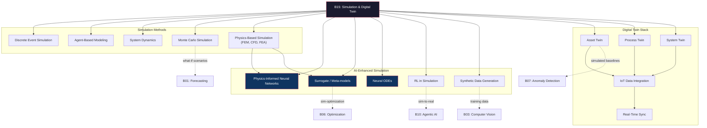
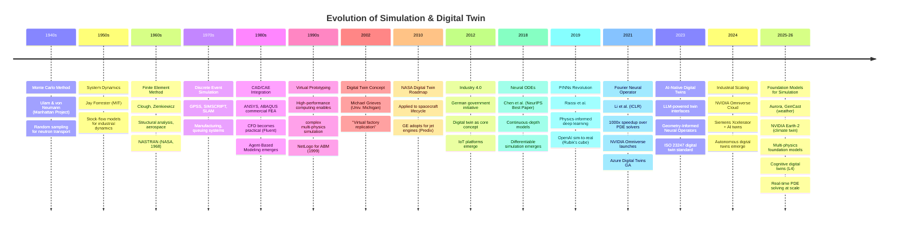

# Research Report: Simulation & Digital Twin (B15)
## By Dr. Archon (R-alpha) — Date: 2026-03-31

---

## 1. Field Taxonomy

**Parent lineage:** Artificial Intelligence > Scientific Computing > Simulation & Digital Twin

**Sub-fields:**

| Sub-field | Focus | Key Tools |
|-----------|-------|-----------|
| Discrete Event Simulation (DES) | Modeling systems as sequences of events at discrete time points | SimPy, AnyLogic, Arena |
| Agent-Based Modeling (ABM) | Emergent behavior from autonomous agent interactions | Mesa, NetLogo, GAMA |
| System Dynamics | Feedback loops and stock-flow models for macro-level behavior | Vensim, Stella |
| Monte Carlo Simulation | Stochastic sampling for uncertainty quantification | NumPy, Stan, PyMC |
| Physics-Based Simulation (FEM, CFD, FEA) | Numerical solutions to governing PDEs for physical systems | FEniCS, OpenFOAM, ANSYS |
| Digital Twin (Asset / Process / System) | Live virtual replicas synchronized with physical counterparts | Azure Digital Twins, AWS IoT TwinMaker |
| Physics-Informed Neural Networks (PINNs) | Neural networks constrained by physical laws | DeepXDE, NVIDIA Modulus |
| Surrogate Modeling / Meta-modeling | Fast approximations replacing expensive high-fidelity simulations | Gaussian Processes, Neural Networks |
| Reinforcement Learning for Simulation | Training agents in simulated environments before real deployment | Gymnasium, Isaac Sim |
| Synthetic Data Generation via Simulation | Creating labeled training data from simulation engines | Unity Perception, NVIDIA Omniverse Replicator |

**Related baselines:**
- **B06 (Optimization)** — Simulation-optimization loops where simulator serves as objective evaluator
- **B01 (Forecasting)** — What-if scenario analysis using simulation as a forecasting engine
- **B07 (Anomaly Detection)** — Simulated baselines for detecting deviations in real systems
- **B10 (Agentic AI)** — Simulated environments for training and evaluating autonomous agents

**Field Map:**



---

## 2. Mathematical Foundations

### 2.1 Ordinary Differential Equations (ODEs) for Dynamic Systems

ODEs are the backbone of any time-evolving simulation. A general initial value problem:

```
dy/dt = f(t, y),    y(t_0) = y_0
```

**Numerical integration** (Euler, Runge-Kutta):
- Forward Euler: `y_{n+1} = y_n + h * f(t_n, y_n)` where h is the time step
- RK4 (4th-order Runge-Kutta): computes four slope estimates k1..k4 and combines them:
  ```
  k1 = f(t_n, y_n)
  k2 = f(t_n + h/2, y_n + h*k1/2)
  k3 = f(t_n + h/2, y_n + h*k2/2)
  k4 = f(t_n + h, y_n + h*k3)
  y_{n+1} = y_n + (h/6)(k1 + 2*k2 + 2*k3 + k4)
  ```
- RK4 achieves O(h^4) local truncation error, making it the workhorse of physics simulation

**Relevance:** Every physics-based simulation (structural mechanics, thermal analysis, fluid dynamics) ultimately solves systems of ODEs or PDEs discretized into ODEs.

### 2.2 Partial Differential Equations (PDEs) and the Finite Element Method (FEM)

PDEs govern spatially distributed phenomena. The general elliptic PDE:

```
-div(k * grad(u)) = f    in domain Omega
u = g                     on boundary Gamma_D  (Dirichlet)
k * du/dn = h             on boundary Gamma_N  (Neumann)
```

**Weak formulation (variational form):** Multiply by test function v, integrate by parts:

```
integral_Omega (k * grad(u) . grad(v)) dOmega = integral_Omega (f * v) dOmega + integral_Gamma_N (h * v) dGamma
```

**Galerkin discretization:** Approximate u as sum of basis functions:
```
u_h = sum_j (U_j * phi_j(x))
```

This yields the linear system **K * U = F** where:
- K_ij = integral(k * grad(phi_i) . grad(phi_j)) dOmega (stiffness matrix)
- F_i = integral(f * phi_i) dOmega + integral(h * phi_i) dGamma (load vector)

**Relevance:** FEM is the standard method for structural, thermal, and electromagnetic simulation in engineering digital twins.

### 2.3 Monte Carlo Methods and Variance Reduction

**Basic Monte Carlo estimation:**

```
E[g(X)] approx (1/N) * sum_{i=1}^{N} g(X_i),    X_i ~ p(x)
```

Convergence rate: O(1/sqrt(N)) regardless of dimensionality — this is Monte Carlo's key advantage in high-dimensional problems.

**Variance reduction techniques:**
- **Importance sampling:** Sample from proposal q(x) instead of p(x):
  ```
  E_p[g(X)] = E_q[g(X) * p(X)/q(X)] = E_q[g(X) * w(X)]
  ```
  where w(X) = p(X)/q(X) is the importance weight
- **Stratified sampling:** Partition sample space into strata, sample proportionally within each
- **Antithetic variates:** Use negatively correlated pairs to reduce variance
- **Control variates:** Subtract a known-expectation variable correlated with the estimand

**Markov Chain Monte Carlo (MCMC):** Metropolis-Hastings acceptance ratio:
```
alpha = min(1, [p(x') * q(x|x')] / [p(x) * q(x'|x)])
```

**Relevance:** Monte Carlo underpins uncertainty quantification, risk analysis, and stochastic simulation across all industries.

### 2.4 Discrete Event Simulation (DES) Theory

**Formal model:** A DES system is defined by the tuple (S, E, T, delta) where:
- S = set of system states
- E = set of event types
- T = simulation clock (real-valued)
- delta: S x E -> S is the state transition function

**Event calendar / Future Event List (FEL):**
- Priority queue ordered by scheduled event time
- Main loop:
  ```
  while FEL is not empty:
      (t_next, e_next) = FEL.pop_min()
      clock = t_next
      state = delta(state, e_next)
      schedule new events as needed
  ```

**Queuing theory foundations** (M/M/c queue):
- Arrival rate lambda, service rate mu per server, c servers
- Utilization: rho = lambda / (c * mu)
- Steady-state condition: rho < 1
- Little's Law: L = lambda * W (average number in system = arrival rate x average time in system)

**Relevance:** DES is the primary method for simulating manufacturing lines, logistics, healthcare workflows, call centers, and network traffic.

### 2.5 Physics-Informed Neural Networks (PINNs)

**Core idea:** Train a neural network u_theta(x, t) to satisfy both data and physics.

**Loss function:**

```
L_total = w_data * L_data + w_physics * L_physics + w_bc * L_bc + w_ic * L_ic
```

where:
- L_data = (1/N_d) * sum ||u_theta(x_i, t_i) - u_observed_i||^2
- L_physics = (1/N_r) * sum ||F[u_theta](x_j, t_j)||^2 where F is the PDE residual
- L_bc = boundary condition residual
- L_ic = initial condition residual

**Example — heat equation:** For du/dt = alpha * d^2u/dx^2:
```
L_physics = (1/N_r) * sum ||(du_theta/dt - alpha * d^2u_theta/dx^2)||^2
```

Gradients du_theta/dt and d^2u_theta/dx^2 are computed via automatic differentiation through the neural network.

**Key advantage:** PINNs can solve inverse problems (infer unknown parameters like alpha from sparse data) and work with irregular geometries without meshing.

**Relevance:** PINNs bridge traditional physics simulation with deep learning, enabling real-time digital twin inference and solving previously intractable inverse problems.

### 2.6 Neural ODEs

**Concept (Chen et al., 2018):** Replace discrete residual layers with continuous dynamics:

```
dh/dt = f_theta(h(t), t)
h(T) = h(0) + integral_0^T f_theta(h(t), t) dt
```

**Adjoint method for backpropagation:** Instead of backpropagating through ODE solver steps (memory-intensive), solve an adjoint ODE backward in time:

```
da/dt = -a^T * (df/dh),    where a(t) = dL/dh(t)
dL/d_theta = -integral_T^0 a(t)^T * (df/d_theta) dt
```

This gives O(1) memory complexity regardless of the number of solver steps.

**Relevance:** Neural ODEs enable learning continuous-time dynamics from irregular time series — critical for digital twins of physical systems with variable sampling rates.

### 2.7 Gaussian Process (GP) Surrogate Models

A GP defines a distribution over functions:

```
f(x) ~ GP(m(x), k(x, x'))
```

**Posterior prediction** given observations (X, y):
```
mu(x*) = k(x*, X) * [K(X, X) + sigma_n^2 * I]^{-1} * y
sigma^2(x*) = k(x*, x*) - k(x*, X) * [K(X, X) + sigma_n^2 * I]^{-1} * k(X, x*)
```

**Common kernels:**
- Squared Exponential (RBF): k(x, x') = sigma_f^2 * exp(-||x - x'||^2 / (2 * l^2))
- Matern 5/2: k(r) = sigma_f^2 * (1 + sqrt(5)*r/l + 5*r^2/(3*l^2)) * exp(-sqrt(5)*r/l)

**Key property:** GP surrogates provide not just predictions but calibrated uncertainty estimates — essential for knowing when the surrogate is unreliable and the full simulation must be run.

**Relevance:** GP surrogates replace expensive FEM/CFD simulations in optimization loops, reducing thousands of simulation runs to hundreds.

---

## 3. Core Concepts

### 3.1 Digital Twin — Definition and Maturity Levels

A **digital twin** is a virtual representation of a physical entity (asset, process, or system) that is synchronized with its real-world counterpart through data flows, enabling monitoring, simulation, and optimization.

**Maturity levels (Gartner/ISO 23247):**

| Level | Name | Description |
|-------|------|-------------|
| L0 | Digital Model | Static CAD/BIM model, no data connection |
| L1 | Digital Shadow | One-way data flow: physical -> virtual (monitoring only) |
| L2 | Digital Twin | Bidirectional data flow: physical <-> virtual (closed-loop) |
| L3 | Autonomous Twin | Self-learning, self-optimizing, prescriptive actions without human intervention |
| L4 | Cognitive Twin | Reasoning, explaining, collaborating with humans and other twins |

The industry is currently transitioning from L1/L2 to L3 with AI integration (2025-2026).

### 3.2 Discrete Event Simulation (DES)

DES models a system as a sequence of discrete events occurring at specific time points. Between events, the system state remains unchanged. This makes DES highly efficient for systems where changes are episodic rather than continuous.

**Components:** entities (things that flow through), resources (things that serve), queues (waiting areas), events (state changes), and statistical accumulators.

**Strengths:** Excellent for manufacturing, logistics, healthcare patient flow, call centers, and any queuing-dominated system. Handles stochastic arrivals and service times naturally.

**Limitation:** Poor at modeling continuous phenomena (fluid flow, thermal dynamics) — use co-simulation with continuous solvers for hybrid systems.

### 3.3 Agent-Based Modeling (ABM)

ABM simulates a system from the bottom up by defining autonomous agents with individual rules, and observing the emergent macro-level behavior.

**Agent properties:** state (internal variables), rules (if-then behavior or ML policies), environment (spatial or network), and interaction protocols (messaging, proximity-based).

**Emergent phenomena captured:** traffic congestion from individual driver decisions, epidemic spread from person-to-person contact, market crashes from trader herding behavior, urban sprawl from household location choices.

**Distinction from DES:** DES focuses on process flow; ABM focuses on agent autonomy and emergence. Many modern simulations combine both.

### 3.4 Monte Carlo Simulation

Using random sampling to estimate deterministic quantities or simulate stochastic systems. Named after the Monte Carlo casino — Ulam and von Neumann developed it during the Manhattan Project (1940s).

**Applications:** Financial risk (Value at Risk), reliability engineering (failure probability), project management (schedule risk via PERT/Monte Carlo), radiation transport, Bayesian inference (MCMC).

**Key insight:** Monte Carlo convergence is independent of dimensionality — O(1/sqrt(N)) — making it the only viable approach for many high-dimensional integration problems where deterministic methods suffer the curse of dimensionality.

### 3.5 Physics-Based Simulation (FEM/CFD)

**Finite Element Method (FEM):** Discretizes a domain into elements (triangles, tetrahedra, hexahedra), approximates the solution within each element using polynomial basis functions, assembles a global system of equations.

**Computational Fluid Dynamics (CFD):** Solves the Navier-Stokes equations for fluid flow. Methods include Finite Volume (OpenFOAM), Finite Element (FEniCS), and Lattice Boltzmann (for complex geometries). Turbulence modeling (RANS, LES, DNS) adds additional complexity.

**Finite Element Analysis (FEA):** Structural variant of FEM focused on stress, strain, deformation, vibration, and fatigue analysis.

**Cost:** A single high-fidelity CFD run can take hours to days on HPC clusters — motivating surrogate models.

### 3.6 Surrogate Models

A surrogate (meta-model, emulator, response surface) is a fast approximation of an expensive simulation. The workflow:

1. **Design of Experiments (DoE):** Select input points (Latin Hypercube, Sobol sequence)
2. **Run simulations:** Execute high-fidelity model at DoE points
3. **Fit surrogate:** Train GP, neural network, polynomial chaos expansion, or radial basis function
4. **Validate:** Compare surrogate predictions against held-out simulation runs
5. **Deploy:** Use surrogate in optimization loops, sensitivity analysis, or real-time digital twins

**Active learning / adaptive sampling:** Use surrogate uncertainty to select the next simulation point to run, maximizing information gain per expensive simulation.

### 3.7 Physics-Informed Neural Networks (PINNs)

PINNs embed physical laws (PDEs) directly into the neural network training loss. Unlike traditional numerical methods that require meshing, PINNs are mesh-free and can handle:

- **Forward problems:** Solving PDEs with known parameters
- **Inverse problems:** Inferring unknown PDE parameters from sparse observations
- **Data assimilation:** Combining noisy sensor data with physics constraints

**Challenges (as of 2026):** Training instability for stiff PDEs, spectral bias (difficulty learning high-frequency components), scaling to complex 3D geometries. Mitigations include adaptive weighting, Fourier feature embeddings, and domain decomposition.

### 3.8 What-If Scenario Analysis

Simulation enables exploring counterfactual scenarios: "What if demand increases 30%?", "What if this machine fails?", "What if we add a second production line?" This is fundamentally different from forecasting (B01) which predicts the most likely future — simulation explores the space of possible futures.

**Approach:** Define scenario parameters, run simulation ensemble (often thousands of runs with Monte Carlo sampling over uncertain inputs), aggregate results into decision-relevant metrics (expected cost, worst-case delay, probability of failure).

### 3.9 Sim-to-Real Transfer

Training policies or models in simulation and deploying them in the real world. Critical challenge: the **reality gap** — differences between simulation physics and real-world physics.

**Mitigation strategies:**
- **Domain randomization:** Randomize simulation parameters (friction, lighting, noise) so the learned policy is robust to real-world variation
- **System identification:** Calibrate simulation parameters to match real-world measurements
- **Progressive transfer:** Train in simulation, fine-tune on small amounts of real data
- **Digital twin calibration:** Continuously update twin parameters using real sensor data

**Notable success:** OpenAI trained a robotic hand to solve a Rubik's cube entirely in simulation (2019), then transferred to a physical robot hand.

### 3.10 Real-Time Data Integration (IoT to Twin)

A digital twin is only as good as its data connection. The integration stack:

```
Physical Asset -> Sensors/IoT -> Edge Processing -> Data Pipeline -> Twin Platform -> Visualization/Control
                                    |                    |
                              (filtering,           (state update,
                               anomaly flag)         simulation trigger)
```

**Protocols:** MQTT, OPC-UA (industrial), AMQP, REST/WebSocket
**Latency requirements:** Process twins (seconds), asset monitoring (minutes), system twins (hours)
**Data types:** Time-series telemetry, event logs, images/video, maintenance records

### 3.11 Simulation Optimization

Coupling a simulation model with an optimization algorithm:

```
minimize f(x) = E[C(x, xi)]    subject to g(x) <= 0
```

where C(x, xi) is the simulation output given design variables x and stochastic inputs xi.

**Methods:** Bayesian optimization (GP surrogate + acquisition function), evolutionary algorithms (genetic algorithms, CMA-ES), gradient-based (if simulation is differentiable), ranking and selection (discrete alternatives).

**Key challenge:** Each function evaluation requires running the simulation, which may be expensive. Sample-efficient optimization (Bayesian optimization) is therefore preferred.

### 3.12 Synthetic Data Generation from Simulation

Using simulation engines to generate labeled training data for ML models, especially when real data is scarce, expensive, or privacy-sensitive.

**Applications:**
- **Computer Vision (B03):** Rendering synthetic images with pixel-perfect labels (segmentation masks, bounding boxes, depth maps) using NVIDIA Omniverse Replicator or Unity Perception
- **Autonomous driving:** Generating diverse driving scenarios in CARLA or NVIDIA DRIVE Sim
- **Healthcare:** Simulating patient trajectories for rare diseases
- **Manufacturing:** Generating defect images for quality inspection models

**Domain gap:** Synthetic data requires domain adaptation techniques to transfer effectively to real-world tasks.

---

## 4. Algorithms & Methods

### 4.1 SimPy / Salabim (Discrete Event Simulation in Python)

**SimPy** is a process-based DES framework. Models are written as Python generator functions using `yield` to wait for events.

```python
import simpy

def machine(env, name, repair_time, mtbf):
    """Simulate a machine that breaks down periodically."""
    while True:
        # Operate until failure
        time_to_failure = random.expovariate(1.0 / mtbf)
        yield env.timeout(time_to_failure)

        # Request repair resource
        print(f"{name} breaks down at {env.now:.1f}")
        with repairman.request() as req:
            yield req
            yield env.timeout(repair_time)
        print(f"{name} repaired at {env.now:.1f}")

env = simpy.Environment()
repairman = simpy.Resource(env, capacity=1)
for i in range(5):
    env.process(machine(env, f"Machine-{i}", repair_time=2, mtbf=50))
env.run(until=500)
```

**Salabim** extends SimPy with built-in animation, monitoring, and queue visualization — useful for stakeholder communication.

**Use when:** Modeling queuing systems, manufacturing lines, logistics, healthcare patient flow, service operations.

### 4.2 Mesa / NetLogo (Agent-Based Modeling)

**Mesa** (Python) provides a framework for ABM with a model-agent-scheduler-space architecture:

```python
from mesa import Agent, Model
from mesa.space import MultiGrid
from mesa.time import RandomActivation

class ContagionAgent(Agent):
    def __init__(self, unique_id, model, infected=False):
        super().__init__(unique_id, model)
        self.infected = infected

    def step(self):
        neighbors = self.model.grid.get_neighbors(self.pos, moore=True)
        if self.infected:
            for n in neighbors:
                if not n.infected and random.random() < 0.3:
                    n.infected = True
```

**NetLogo** (Logo-based) is widely used in social science and ecology for its accessibility and built-in visualization.

**Use when:** Emergence matters — epidemics, traffic, market dynamics, urban growth, ecology.

### 4.3 Monte Carlo Methods (Basic, MCMC, Importance Sampling)

**Basic Monte Carlo:** Sample inputs from distributions, run deterministic model, aggregate outputs.

```python
# Value at Risk (VaR) estimation
returns = np.random.normal(mu, sigma, size=100_000)
portfolio_values = initial_value * (1 + returns)
VaR_95 = np.percentile(portfolio_values, 5)  # 5th percentile = 95% VaR
```

**MCMC (Markov Chain Monte Carlo):** For sampling from complex posterior distributions. Metropolis-Hastings, Hamiltonian Monte Carlo (HMC), No-U-Turn Sampler (NUTS — used in Stan and PyMC).

**Importance Sampling:** Critical for rare event simulation (e.g., estimating P(failure) = 10^-6 without needing 10^8 samples).

### 4.4 FEniCS / OpenFOAM (FEM/CFD)

**FEniCS** provides a high-level Python interface for solving PDEs via FEM:

```python
from fenics import *

mesh = UnitSquareMesh(32, 32)
V = FunctionSpace(mesh, 'P', 1)

# Define variational problem (Poisson equation)
u = TrialFunction(V)
v = TestFunction(V)
f = Constant(-6.0)
a = dot(grad(u), grad(v)) * dx
L = f * v * dx

# Solve
u = Function(V)
solve(a == L, u, DirichletBC(V, Constant(0), "on_boundary"))
```

**OpenFOAM** (C++) is the standard open-source CFD toolbox. Solves Navier-Stokes equations using finite volume method. Applications: aerodynamics, HVAC design, combustion, multiphase flow.

### 4.5 Azure Digital Twins / AWS IoT TwinMaker

**Azure Digital Twins:** Uses DTDL (Digital Twins Definition Language) to define twin models as JSON-LD schemas. Supports twin graphs (relationships between twins), event routing, and integration with Azure IoT Hub, Time Series Insights, and Synapse Analytics.

**AWS IoT TwinMaker:** Connects IoT data, 3D models, and knowledge graphs. Integrates with AWS IoT SiteWise (industrial telemetry), S3 (3D assets), and Grafana (visualization).

**Both platforms** provide: twin modeling, data integration, query APIs, and visualization dashboards. Neither includes simulation — they are twin platforms that connect to external simulation engines.

### 4.6 NVIDIA Omniverse

A platform for building and operating 3D simulation environments based on Universal Scene Description (USD). Key components:

- **Omniverse Nucleus:** Centralized 3D asset database
- **Omniverse Replicator:** Synthetic data generation for CV training
- **Isaac Sim:** Robot simulation with physics (PhysX 5) and sensor simulation
- **DRIVE Sim:** Autonomous vehicle simulation
- **Modulus:** Physics-ML framework (PINNs, FNOs, graph neural networks)

**Differentiator:** GPU-accelerated physics (PhysX 5), photorealistic ray tracing (RTX), and real-time multi-user collaboration on simulation scenes.

### 4.7 PINNs Frameworks (DeepXDE, NVIDIA Modulus)

**DeepXDE** (Python/TensorFlow/PyTorch):

```python
import deepxde as dde

# Define PDE: du/dt = D * d2u/dx2 (diffusion equation)
def pde(x, u):
    du_t = dde.grad.jacobian(u, x, i=0, j=1)   # du/dt
    du_xx = dde.grad.hessian(u, x, i=0, j=0)    # d2u/dx2
    D = 0.01
    return du_t - D * du_xx

geom = dde.geometry.Interval(0, 1)
timedomain = dde.geometry.TimeDomain(0, 1)
geomtime = dde.geometry.GeometryXTime(geom, timedomain)

data = dde.data.TimePDE(geomtime, pde, [], num_domain=2000, num_boundary=100, num_initial=100)
net = dde.nn.FNN([2] + [64] * 4 + [1], "tanh", "Glorot normal")
model = dde.Model(data, net)
model.compile("adam", lr=1e-3)
model.train(epochs=20000)
```

**NVIDIA Modulus** extends this with Fourier Neural Operators (FNOs), graph neural networks for irregular meshes, and multi-GPU training for industrial-scale problems.

### 4.8 Neural ODEs (torchdiffeq)

```python
from torchdiffeq import odeint

class ODEFunc(nn.Module):
    def __init__(self):
        super().__init__()
        self.net = nn.Sequential(nn.Linear(2, 64), nn.Tanh(), nn.Linear(64, 2))

    def forward(self, t, y):
        return self.net(y)

func = ODEFunc()
t = torch.linspace(0, 10, 100)
y0 = torch.tensor([[1.0, 0.0]])
trajectory = odeint(func, y0, t, method='dopri5')  # adaptive RK45
```

**Use when:** Learning continuous-time dynamics from irregularly sampled time series, building physics-aware latent variable models, or constructing normalizing flows with continuous transformations.

### 4.9 Gaussian Process Emulator (GPy, BoTorch)

```python
import gpytorch
import torch

class GPSurrogate(gpytorch.models.ExactGP):
    def __init__(self, train_x, train_y, likelihood):
        super().__init__(train_x, train_y, likelihood)
        self.mean = gpytorch.means.ConstantMean()
        self.covar = gpytorch.kernels.ScaleKernel(gpytorch.kernels.MaternKernel(nu=2.5))

    def forward(self, x):
        return gpytorch.distributions.MultivariateNormal(self.mean(x), self.covar(x))
```

**BoTorch** (built on GPyTorch) provides Bayesian optimization with GP surrogates — the standard approach for simulation optimization when each simulation run is expensive.

**Workflow:** Run simulation at initial DoE points -> Fit GP -> Use acquisition function (Expected Improvement, Knowledge Gradient) to select next simulation point -> Iterate.

### 4.10 AnyLogic / Arena (Commercial DES/Multi-method)

**AnyLogic** is unique in supporting all three simulation paradigms (DES, ABM, System Dynamics) in a single model. Java-based with a graphical IDE. Widely used in supply chain, logistics, healthcare, and defense.

**Arena** (Rockwell Automation) is the industry standard for manufacturing DES with SIMAN language backend and built-in statistical analysis (Output Analyzer, OptQuest optimization).

**When to use commercial vs. open-source:** Commercial tools offer better visualization, drag-and-drop modeling, built-in optimization, and vendor support — important for operational deployment. Open-source (SimPy, Mesa) offers flexibility, ML integration, and cost advantages for research.

### 4.11 Unity / Unreal for 3D Simulation

**Unity:** ML-Agents toolkit for RL training, Perception package for synthetic data generation, simulation of warehouses, factories, and robotics environments.

**Unreal Engine:** Higher visual fidelity, AirSim plugin for drone/autonomous vehicle simulation, MetaHumans for human simulation. Increasingly used for industrial digital twins (Bentley iTwin integration).

**Key advantage:** Real-time rendering and physics at interactive frame rates, enabling human-in-the-loop simulation and VR/AR integration with digital twins.

### 4.12 RL in Simulated Environments (Gymnasium, Isaac Sim)

**Gymnasium** (successor to OpenAI Gym): Standard API for RL environments. Custom simulation environments implement `step(action) -> (obs, reward, done, info)`.

**NVIDIA Isaac Sim:** GPU-accelerated physics simulation for robotics. Can run thousands of parallel environments on a single GPU, dramatically accelerating RL training. Supports domain randomization for sim-to-real transfer.

**Workflow:** Define environment in simulation -> Train RL policy (PPO, SAC) -> Domain randomization -> Sim-to-real transfer -> Deploy on physical robot.

---

## 5. Key Papers

### 5.1 Grieves — "Digital Twin: Manufacturing Excellence through Virtual Factory Replication" (2002/2014)

**Contribution:** Coined the term "Digital Twin" and established the foundational concept: a physical product, a virtual representation, and the data/information connections between them. Originally presented at the University of Michigan in 2002, formally published in 2014.

**Impact:** Established the conceptual framework adopted by NASA, GE, Siemens, and the entire Industry 4.0 movement. The three-component model (physical, virtual, connection) remains the canonical definition.

### 5.2 Raissi, Perdikaris, Karniadakis — "Physics-Informed Neural Networks" (Journal of Computational Physics, 2019)

**Contribution:** Formalized the PINN framework — embedding PDE residuals into neural network training loss via automatic differentiation. Demonstrated on Schrodinger equation, Navier-Stokes, and other benchmark PDEs.

**Key insight:** A single neural network can simultaneously solve forward and inverse problems. The physics loss acts as a regularizer, enabling accurate solutions from sparse and noisy data.

**Impact:** Over 10,000 citations. Spawned an entire subfield: extensions to fractional PDEs, stochastic PDEs, multi-scale problems, and industrial applications.

### 5.3 Chen, Rubanova, Bettencourt, Duvenaud — "Neural Ordinary Differential Equations" (NeurIPS 2018, Best Paper)

**Contribution:** Proposed treating the continuous limit of residual networks as ODEs, using black-box ODE solvers for the forward pass and the adjoint method for backpropagation with O(1) memory.

**Key insight:** Continuous-depth models adapt computation to problem complexity (adaptive step size), provide a natural framework for irregular time series, and connect deep learning with dynamical systems theory.

**Impact:** Enabled continuous normalizing flows, latent ODE models for clinical time series, and physics-informed learning of dynamical systems.

### 5.4 Rasmussen & Williams — "Gaussian Processes for Machine Learning" (MIT Press, 2006)

**Contribution:** The definitive textbook on GP theory and practice. Covers kernel design, hyperparameter optimization (marginal likelihood), sparse approximations, and connections to neural networks.

**Relevance to simulation:** GPs are the standard surrogate model for expensive computer experiments. The GP posterior provides both predictions and calibrated uncertainty, enabling principled adaptive sampling and Bayesian optimization.

### 5.5 OpenAI — "Solving Rubik's Cube with a Robot Hand" (2019)

**Contribution:** Trained a dexterous robotic hand policy entirely in simulation using massive domain randomization (ADR — Automatic Domain Randomization), then transferred successfully to a physical Shadow Hand.

**Key insight:** With sufficient randomization of simulation parameters (friction, object size, gravity perturbations, sensor noise), policies become robust enough to cross the reality gap without any real-world training data.

**Impact:** Demonstrated that sim-to-real transfer is viable for complex manipulation tasks, accelerating robotics research.

### 5.6 Jumper et al. — "AlphaFold: Highly Accurate Protein Structure Prediction" (Nature, 2021)

**Contribution:** While primarily a prediction system, AlphaFold represents simulation-level accuracy in modeling 3D protein structures from amino acid sequences using attention-based neural networks.

**Relevance:** Demonstrated that AI can achieve simulation-quality physical modeling (protein folding energy landscapes), blurring the line between simulation and prediction. Influenced the development of neural network-based molecular dynamics surrogates.

### 5.7 Li et al. — "Fourier Neural Operator for Parametric PDEs" (ICLR 2021)

**Contribution:** Proposed the Fourier Neural Operator (FNO), which learns mappings between function spaces by operating in Fourier space. Unlike PINNs (which solve one PDE instance), FNOs learn the solution operator for a family of PDEs.

**Key advantage:** Once trained, FNOs produce solutions in milliseconds — enabling real-time digital twin inference. Demonstrated 1000x speedup over traditional PDE solvers on Navier-Stokes benchmarks.

**Impact:** NVIDIA Modulus adopted FNOs as a core architecture. Extended to 3D (GINO — Geometry-Informed Neural Operator, 2023).

### 5.8 Tao et al. — "Digital Twin in Industry: State-of-the-Art" (IEEE Transactions on Industrial Informatics, 2019)

**Contribution:** Comprehensive survey establishing a five-dimensional digital twin model: Physical Entity, Virtual Entity, Services, Data, and Connections. Reviewed applications across manufacturing, healthcare, smart cities, and aerospace.

**Impact:** Most-cited digital twin survey paper. The five-dimensional model became a widely adopted reference framework for digital twin architecture design.

### 5.9 NVIDIA — "Building Digital Twins with Omniverse and Modulus" (GTC 2024-2025)

**Contribution:** Industrial framework combining Omniverse (3D visualization, physics simulation) with Modulus (physics-ML) for building AI-enhanced digital twins. Demonstrated on Siemens gas turbines, BMW factory layout optimization, and climate modeling (FourCastNet).

**Significance:** Represents the convergence of 3D simulation, physics-AI, and GPU computing into an integrated digital twin platform — the direction the industry is heading.

### 5.10 Brunton & Kutz — "Data-Driven Science and Engineering" (2nd Edition, Cambridge, 2022)

**Contribution:** Textbook bridging dynamical systems, machine learning, and simulation. Covers Dynamic Mode Decomposition (DMD), Sparse Identification of Nonlinear Dynamics (SINDy), and neural network approaches for discovering governing equations from data.

**Relevance:** Provides the mathematical toolkit for building data-driven simulation models when first-principles physics are partially or fully unknown — a common scenario in digital twin applications.

### 5.11 Karniadakis et al. — "Physics-Informed Machine Learning" (Nature Reviews Physics, 2021)

**Contribution:** Comprehensive review placing PINNs within the broader landscape of physics-informed ML: physics-informed architectures (equivariant networks, Hamiltonian NNs), physics-informed loss functions (PINNs), and physics-informed data (synthetic data from simulation).

**Impact:** Established the taxonomy that the field continues to use, clarifying the many ways physics knowledge can be integrated into ML.

### 5.12 Recent (2025-2026): Foundation Models for Simulation

**Emerging trend:** Large pre-trained models for scientific simulation, analogous to LLMs for language:
- **Aurora** (Microsoft, 2025): Foundation model for weather/climate simulation, trained on diverse atmospheric data, achieving state-of-the-art forecasting
- **GenCast** (DeepMind, 2025): Probabilistic weather simulation using diffusion models
- **NVIDIA Earth-2** (2025): Digital twin of Earth's climate using neural operator architectures
- **Multi-physics foundation models** (2026): Pre-trained on diverse PDE families, fine-tuned for specific applications — reducing the data and compute requirements for new digital twins

---

## 6. Evolution Timeline



**Detailed narrative:**

1. **1940s — Monte Carlo (Manhattan Project):** Stanislaw Ulam, recovering from illness and playing solitaire, realized that random sampling could estimate complex probabilities. He and John von Neumann implemented this on ENIAC for neutron transport calculations. This was the birth of computational simulation.

2. **1950s-60s — System Dynamics and FEM:** Jay Forrester at MIT developed system dynamics for modeling industrial feedback loops. Simultaneously, structural engineers (Clough, Zienkiewicz) formalized the finite element method for aerospace structures. NASA's NASTRAN (1968) became the first major FEM code.

3. **1970s-80s — DES and Commercial CAE:** Discrete event simulation languages (GPSS, SIMSCRIPT) enabled modeling of manufacturing and service systems. Commercial FEA/CFD tools (ANSYS, ABAQUS, Fluent) made physics simulation accessible to practicing engineers.

4. **2002-2012 — Digital Twin Emergence:** Grieves coined the term, NASA formalized the concept for spacecraft lifecycle management, GE applied it to jet engines with the Predix platform. Industry 4.0 (Germany, 2012) placed digital twins at the center of smart manufacturing.

5. **2018-2021 — AI Meets Simulation:** Neural ODEs, PINNs, and Fourier Neural Operators revolutionized how simulations are built and solved. Instead of hand-coding physics, neural networks learn dynamics from data while respecting physical constraints. Speedups of 100-1000x became possible.

6. **2022-2026 — AI-Native Digital Twins:** The current era. Digital twins are no longer static models updated periodically — they are AI-native systems that learn, adapt, and reason. LLMs provide natural language interfaces ("What happens if we increase pressure by 10%?"). Foundation models pre-trained on diverse physics enable rapid deployment of new twins. The industry is transitioning from L2 (bidirectional) to L3 (autonomous) and L4 (cognitive) maturity.

---

## 7. Cross-Domain Connections

### B15 x B06 (Optimization) — Simulation-Optimization Loop

**Connection type:** Tight coupling. The simulation serves as the objective function evaluator in an optimization loop.

**Pattern:**
```
Optimizer proposes x -> Simulation evaluates f(x) -> Optimizer updates -> repeat
```

**Applications:** Factory layout optimization (simulate throughput for each layout), supply chain design (simulate cost and service level), aerodynamic shape optimization (CFD for each design), drug dosing optimization (simulate pharmacokinetics).

**Key methods:** Bayesian optimization with GP surrogates (sample-efficient when simulation is expensive), evolutionary algorithms (when simulation is cheap), ranking and selection (comparing discrete alternatives).

### B15 x B01 (Forecasting) — What-If Scenario Analysis

**Connection type:** Complementary. Forecasting predicts the most likely future; simulation explores the space of possible futures under different assumptions.

**Pattern:** Use forecasting models to set baseline parameters, then run simulation with perturbations to generate scenario envelopes (best case, worst case, stress test).

**Applications:** Demand planning (forecast base demand + simulate supply chain response to demand shocks), financial stress testing (forecast baseline + simulate extreme scenarios), capacity planning (forecast growth + simulate infrastructure requirements).

### B15 x B07 (Anomaly Detection) — Simulated Baselines

**Connection type:** The digital twin provides the expected behavior; anomaly detection flags deviations from it.

**Pattern:**
```
Digital Twin predicts expected state -> Compare with actual sensor data -> |actual - expected| > threshold -> Anomaly
```

**Applications:** Predictive maintenance (twin predicts normal vibration/temperature, deviation indicates developing fault), process control (twin predicts expected process parameters), structural health monitoring (FEM twin predicts normal strain distribution).

**Advantage over data-only anomaly detection:** The twin provides physics-based expectations, not just statistical baselines, enabling detection of anomalies that are statistically rare but physically meaningful.

### B15 x B10 (Agentic AI) — Simulated Environments for Agents

**Connection type:** Simulation provides the training and evaluation environment for autonomous agents.

**Pattern:** Build simulated environment -> Train RL agent -> Evaluate in simulation -> Domain randomization -> Deploy in real world.

**Applications:** Robotic manipulation (Isaac Sim), autonomous driving (CARLA, DRIVE Sim), warehouse logistics (agent-based simulation), game AI (Unity ML-Agents), factory scheduling agents.

**2025-2026 trend:** LLM-based agents evaluated in simulated environments before deployment — simulation as a safety sandbox for agentic AI.

### B15 x B03 (Computer Vision) — Synthetic Training Data

**Connection type:** Simulation generates labeled training data for CV models.

**Pattern:** 3D simulation environment -> Render images with randomized conditions -> Auto-generate labels (segmentation, depth, bounding boxes) -> Train CV model -> Fine-tune on real data.

**Tools:** NVIDIA Omniverse Replicator, Unity Perception, BlenderProc.

**Applications:** Defect detection in manufacturing (render synthetic defect images), autonomous driving (generate diverse traffic scenarios), satellite imagery (simulate terrain and lighting conditions), medical imaging (simulate pathologies).

### B15 x B13 (Tabular/Structured Data) — Surrogate Model Inputs

**Connection type:** Tabular data serves as input/output for surrogate models that replace expensive simulations.

**Pattern:** Run simulation at DoE points -> Collect input-output pairs as tabular dataset -> Train surrogate (GP, XGBoost, neural network) -> Use surrogate for fast prediction.

**Applications:** Engineering design space exploration (material properties, geometry parameters as tabular inputs), process optimization (operating parameters as features, simulation output as target), sensitivity analysis (which input variables most affect simulation output).

---

## 8. Summary and Outlook

Simulation and Digital Twin technology is undergoing a fundamental transformation driven by AI. The key shifts:

1. **From mesh-based to mesh-free:** PINNs and neural operators eliminate the need for mesh generation — historically the most time-consuming step in simulation setup.

2. **From offline to real-time:** Neural surrogates achieve 100-1000x speedups, enabling real-time digital twin inference for control and optimization.

3. **From deterministic to probabilistic:** GP surrogates, ensemble methods, and generative models provide uncertainty quantification alongside predictions.

4. **From model-first to data-first:** Data-driven simulation discovery (SINDy, Neural ODEs) enables building simulations from sensor data when first-principles physics are unavailable.

5. **From isolated to connected:** Digital twin platforms (Azure, AWS, Omniverse) integrate simulation with IoT data, enterprise systems, and AI services.

6. **From specialist to accessible:** Foundation models for simulation (pre-trained on diverse physics) will democratize digital twin creation, reducing the expertise barrier.

**2026 state of the art:** The industry is at the inflection point between L2 (bidirectional digital twins) and L3 (autonomous digital twins). AI-native twins that learn from data, reason about physics, and make autonomous decisions are emerging in manufacturing, energy, and aerospace. The next frontier — L4 cognitive twins that explain their reasoning and collaborate with human operators — is an active research area.

---

*This report was generated by Dr. Archon (R-alpha) as part of the MAESTRO Knowledge Graph, Baseline B15.*
